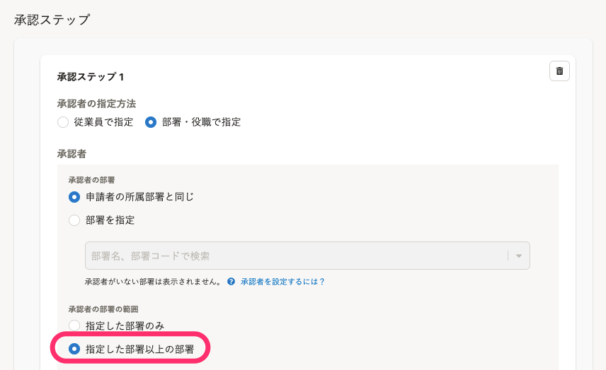

ここでは、承認者の指定方法のうちの1つ、**部署と役職で指定する** 場合の設定の詳細を説明します。

:::related
[承認者を従業員で指定する](https://knowledge.smarthr.jp/hc/ja/articles/1500002676741)
:::

承認経路の新規作成、編集方法は、[承認経路を管理する](https://knowledge.smarthr.jp/hc/ja/articles/360053832734)で説明しています。

# 1\. 承認者の指定方法で［部署・役職で指定］を選択

経路作成画面で **［+ ステップ追加］** をクリックすると、承認ステップの設定画面が表示されます。

承認者の指定方法で **［部署・役職で指定］** のラジオボタンを選択します。

 **［部署・役職で指定］** を選択した場合、設定する項目は、以下のとおりです。

| 項目名 | 説明 |
| --- | --- |
| 承認者 |   承認者の所属部署を **［承認者の部署］**  で、承認者の所属部署の範囲を **［承認者の部署の範囲］** で設定します。  承認者を役職で絞り込む場合は、 **［承認者の役職］** で役職を指定します。   |
| 必要な承認数 |   承認ステップを完了するために必要な承認数を選択します。   |
| 説明（任意） | 承認ステップの説明文を記入します。 |

# 2\. 承認者の部署を選択

承認者の部署の指定方法を下記から選択します。

- **申請者の所属部署と同じ**：申請者の所属部署を基準に、承認者の部署を指定します。
- **部署を指定**：特定の部署を承認者の部署として指定します。

いずれの指定方法でも、承認者として申請を承認するための権限が付与されているアカウントが部署に所属している必要があります。

:::related
[申請機能を管理者として利用するための権限設定](https://knowledge.smarthr.jp/hc/ja/articles/360026262453)
:::

:::tips
承認者が複数部署を兼任している場合、従業員情報に登録されている部署1〜3すべてで承認者となります。
例えば、 **［部署を指定］** で「営業本部」を選択した場合は、部署1〜3のいずれかに「営業本部」が登録されている従業員が承認者となります。
ただし、役職で絞り込む場合は、部署1のみで承認者となります。
[Q. 承認経路で承認者を役職で絞り込むときの注意点は？](https://knowledge.smarthr.jp/hc/ja/articles/4407278215833)
:::

## 申請者の所属部署を基準にするには、［申請者の所属部署と同じ］を選択

 **［申請者の所属部署と同じ］** を選択した場合、申請者の所属部署に応じて承認者が変わります。

同じ部署や、その上位部署に所属する従業員を承認者にしたいときに利用します。

:::alert
申請者が複数部署を兼任している場合、**従業員情報の部署1に登録されている所属部署の方** が承認者になります。
部署2、部署3に所属している方は承認できません。

[従業員の部署情報を登録する](https://knowledge.smarthr.jp/hc/ja/articles/360026105994)
:::
:::tips
 **［申請者の所属部署と同じ］** を選択した場合、申請の依頼・作成時の申請者の所属部署を参照して、承認者を決定します。
異動などで所属部署が変わった場合には、従業員情報の部署情報が更新されてから申請を依頼・作成してください。
:::

## 特定の部署を承認部署として指定するには、［部署を指定］を選択

 **［部署を指定］** を選択した場合、特定の部署に所属する承認権限を持つアカウントが承認者になります。

人事部や総務部など、定形の承認業務が発生する部署を承認者として指定するときに利用します。

プルダウンリストに表示される部署は、承認権限を持つアカウントがいる部署のみです。

:::related
[Q. 承認経路の設定で指定したい部署や役職が表示されない場合は？](https://knowledge.smarthr.jp/hc/ja/articles/4407135967001)
:::

# 3\. 部署の範囲 を選択

**承認者の部署** で設定した上位部署に所属する承認者も承認者に含めたい場合は、 **［指定した部署以上の部署］** を選択します。

# 4\. 承認者の役職で絞り込む場合は、［役職で絞り込む］を選択

 **［承認者の部署］** で指定した部署の中で、特定の役職の従業員だけを承認者にしたい場合は、 **［役職で絞り込む］** にチェックを入れ、役職を選択します。

例えば、申請者と同じ部署やその上位部署のマネージャーだけを承認者にしたいときに利用します。

:::related
[Q. 承認経路で承認者を役職で絞り込むときの注意点は？](https://knowledge.smarthr.jp/hc/ja/articles/4407278215833)
:::

# 5\. 必要な承認数を設定する

ステップを完了するために **必要な承認数** を設定します。

承認者を部署で指定する設定は以上です。

経路の新規作成、編集方法は、[承認経路を管理する](https://knowledge.smarthr.jp/hc/ja/articles/360053832734)でご確認ください。
