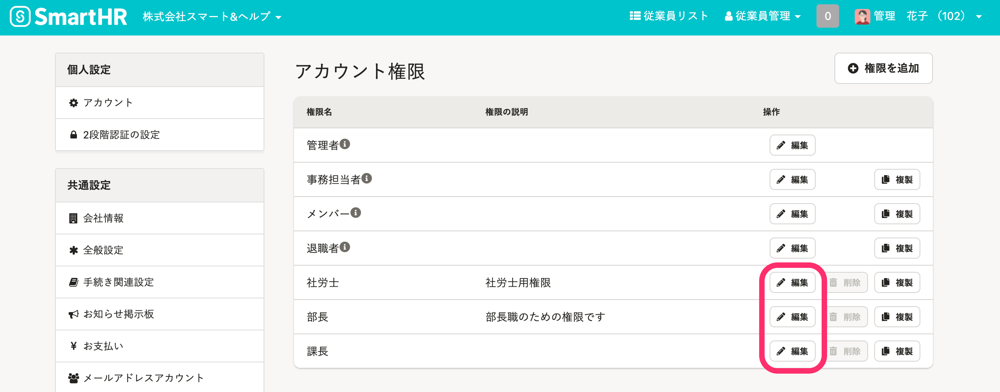
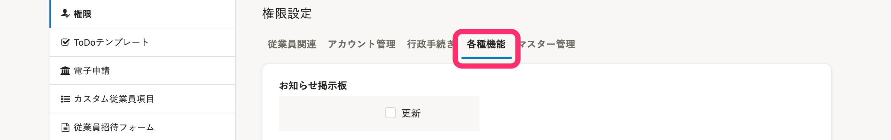
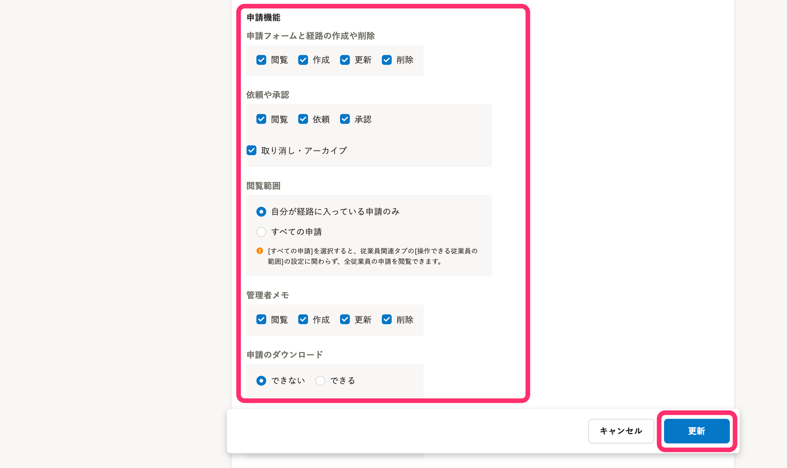
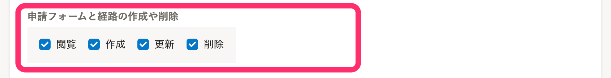
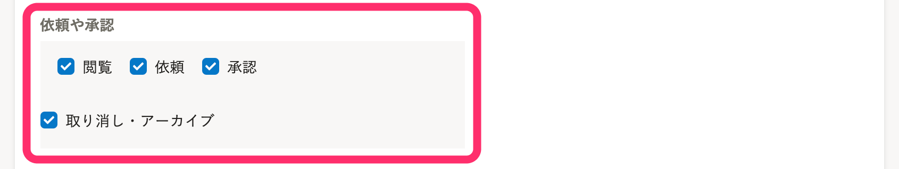
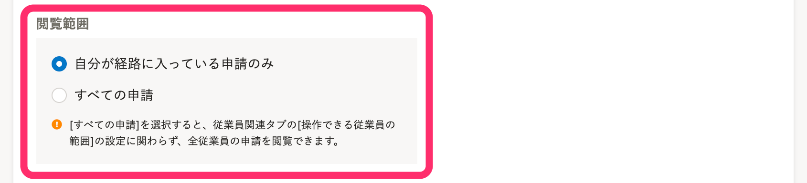
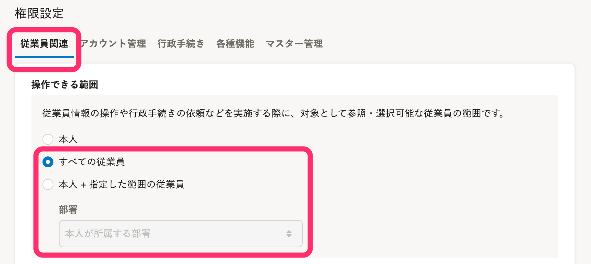
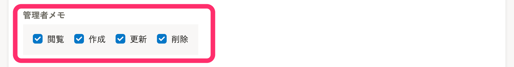
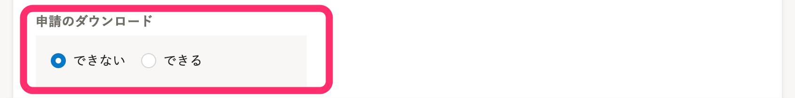

申請を管理するための権限を、以下の操作内容ごとに設定します。

- 申請フォームと経路の作成や削除
- 依頼や承認
- 管理者メモ
- 申請のダウンロード

:::tips
 **［従業員情報］** の権限設定は、申請機能には影響しません。
申請機能の **［依頼や承認］** の権限があれば、申請フォームを使って従業員情報を収集できます。
:::

# 申請機能の権限を確認・設定する

 **［共通設定］** の **［権限］** をクリックすると **［アカウント権限］** 設定画面が表示されます。

それぞれの権限の［編集］画面をクリックすると **［アカウント権限の編集］** 画面が表示されます。

 **［権限設定］** 項目で **［各種機能］** のタブをクリックします。

 **［申請機能］** の権限を設定し **［更新］** をクリックすると、設定した内容が保存されます。

:::tips
システム標準権限の「管理者」「事務担当者」「メンバー」「退職者」の設定は変更できません。
独自の権限設定をするには、カスタム権限を追加してください。
[カスタム権限を追加する](https://knowledge.smarthr.jp/hc/ja/articles/360026106594)
:::

# ［申請フォームと経路の作成や削除］の権限設定

申請フォームと経路を管理するための権限を設定します。

 **［閲覧］** を有効にすると、 **［共通設定］** \> **［申請］** 設定画面を閲覧できるようになります。

 **［作成］** を有効にすると、新たな申請フォームと経路を作成できるようになります。

 **［更新］** を有効にすると、 既存の申請フォームと経路を編集できるようになり、一覧画面で並び順を変更できるようになります。

 **［削除］** を有効にすると、既存の申請フォーム、経路を削除できるようになります。

システム標準の権限では、以下のとおり設定されています。（※ 変更不可）

|   | 閲覧 | 作成 | 更新 | 削除 |
| --- | --- | --- | --- | --- |
| 管理者 | ○ | ○ | ○ | ○ |
| 事務担当者 | ○ | ○ | ○ | ○ |
| メンバー | × | × | × | × |
| 退職者 | × | × | × | × |

:::related
[申請フォームを設定する](https://knowledge.smarthr.jp/hc/ja/articles/360026262293)
:::

# ［依頼や承認］の権限設定

申請内容の閲覧、依頼、承認、取り消し・アーカイブの権限を設定します。

 **［閲覧］** を有効にすると、閲覧可能範囲に含まれる申請が申請一覧に表示され、申請詳細を閲覧できるようになります。

 **［依頼］** を有効にすると、 **［操作できる範囲］** に含まれる従業員に対して申請を依頼できるようになります。

 **［承認］** を有効にすると、自分が承認経路に含まれている申請を承認できるようになります。

 **［取り消し・アーカイブ］** を有効にすると、自分が承認経路に含まれている申請を取り消せるようになります。また、閲覧できる完了した申請をアーカイブできるようになります。

システム標準の権限では、以下のとおり設定されています。（※ 変更不可）

|   | 閲覧 | 依頼 | 承認 | 取り消し・アーカイブ |
| --- | --- | --- | --- | --- |
| 管理者 | ○ | ○ | ○ | ○ |
| 事務担当者 | ○ | ○ | ○ | ○ |
| メンバー | × | × | × | × |
| 退職者 | × | × | × | × |

:::related
[申請機能を使って従業員に情報提供を依頼する](https://knowledge.smarthr.jp/hc/ja/articles/360026103874)
[従業員が提出した申請の承認、差し戻し、取り消し](https://knowledge.smarthr.jp/hc/ja/articles/360053919054)
:::
:::alert
 **［閲覧範囲］** の項目は、特別な理由がない限り、 **［自分が経路に入っている申請のみ］** としてください。

 **［すべての申請］** を選択すると、従業員関連の **［操作できる範囲］** の設定に関わらず、全従業員の申請が申請一覧に表示され、また申請詳細を閲覧できるようになります。
申請機能に関しては管理者権限と同等の強い権限を持つことになるので、ご注意ください。
[権限設定の［従業員関連］>［操作できる範囲］とは](https://knowledge.smarthr.jp/hc/ja/articles/360026264173)
:::

## 承認経路が［旧経路（廃止予定）］の申請を、承認・取り消しするには

権限設定の **［従業員関連］>［操作できる範囲］** が **［本人］** だと、承認経路が **［旧経路（廃止予定）］** の申請を承認・取り消しできません。

承認・取り消しをするためには、 **［権限設定］** 項目で **［従業員関連］** のタブをクリックし、 **［操作できる範囲］** として **［すべての従業員］** か **［本人 + 指定した範囲の従業員］** を選択してください。

:::related
[旧経路（廃止予定）はどんな経路ですか？](https://knowledge.smarthr.jp/hc/ja/articles/360055621113)
:::

# ［管理者メモ］の権限設定

管理者用のメモ機能の権限を設定します。

 **［閲覧］** を有効にすると、申請詳細画面で入力済みの管理者メモを閲覧できるようになります。また、 **［一覧ダウンロード］** でダウンロードしたCSVファイルに管理者メモが含まれるようになります。

 **［作成］** を有効にすると、申請詳細画面で管理者メモを作成できるようになります。

 **［更新］** を有効にすると、自分と他人が作成した管理者メモを編集できるようになります。

 **［削除］** を有効にすると、管理者メモを削除できるようになります。

システム標準の権限では、以下のとおり設定されています。（※ 変更不可）

|   | 閲覧 | 作成 | 更新 | 削除 |
| --- | --- | --- | --- | --- |
| 管理者 | ○ | ○ | ○ | ○ |
| 事務担当者 | ○ | ○ | ○ | ○ |
| メンバー | × | × | × | × |
| 退職者 | × | × | × | × |

:::related
[申請の管理者メモを活用する](https://knowledge.smarthr.jp/hc/ja/articles/360043330113)
:::

# ［申請のダウンロード］の権限設定

申請のダウンロードに対する操作権限の有無を設定できます。

 **［申請のダウンロード］** の項目で **［できる］** を選択すると、申請一覧のCSVファイル、申請ごとの提出内容のCSVファイルをダウンロードできるようになります。

システム標準の権限では、以下のとおり設定されています。（※ 変更不可）

| 管理者 | できる |
| --- | --- |
| 事務担当者 | できる |
| メンバー | できない |
| 退職者 | できない |

:::related
[申請のCSVダウンロード機能を利用する](https://knowledge.smarthr.jp/hc/ja/articles/360051114994)
:::
