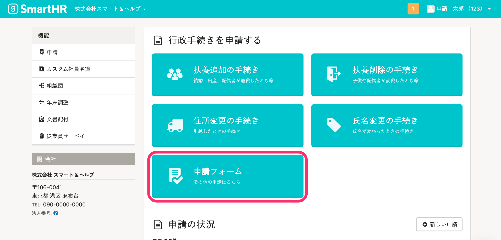

# A. 以下の条件をすべて満たすと、トップページに［申請フォーム］が表示されます。

-  **［フォーム情報］** \> **［任意のタイミングで申請］** の項目が、 **［できる］** になっている申請フォームが1つ以上ある。
- 従業員情報と紐付いたアカウントでログインしている。
-  **［健康保険タイプ］** の異なる複数の事業所が登録されていない。

:::related
[申請フォームを管理する](https://knowledge.smarthr.jp/hc/ja/articles/360026262313)
[メールアドレスアカウントと従業員の違いとは](https://knowledge.smarthr.jp/hc/ja/articles/360026107614)　
[「健康保険タイプ」を設定する](https://knowledge.smarthr.jp/hc/ja/articles/360026265453)
:::
:::tips
**トップページに［申請フォーム］を表示させたくない場合**は、上記を考慮して、申請フォームとアカウントの設定をしてください。
:::
