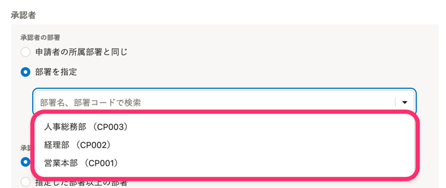

# A. 部署や役職に承認権限を持った従業員が存在するかを確認してください

部署・役職で承認者を指定するときに、承認権限を持った従業員が1人もいない部署や役職は選択肢に表示されません。

部署や役職が表示されない場合は、指定したい部署や役職に、承認権限を持ったアカウントが存在するかを確認してください。

:::related
[アカウントの権限を確認・変更する](https://knowledge.smarthr.jp/hc/ja/articles/360026106574)
:::

:::alert
 **［部署を指定］** で部署を選択し、役職で絞り込む場合は、選択した部署が「部署1」に設定されている従業員の役職のみが表示されます。
詳しくは、下記のヘルプページを参照してください。
[Q. 承認経路で承認者を役職で絞り込むときの注意点は？](https://knowledge.smarthr.jp/hc/ja/articles/4407278215833)
:::
