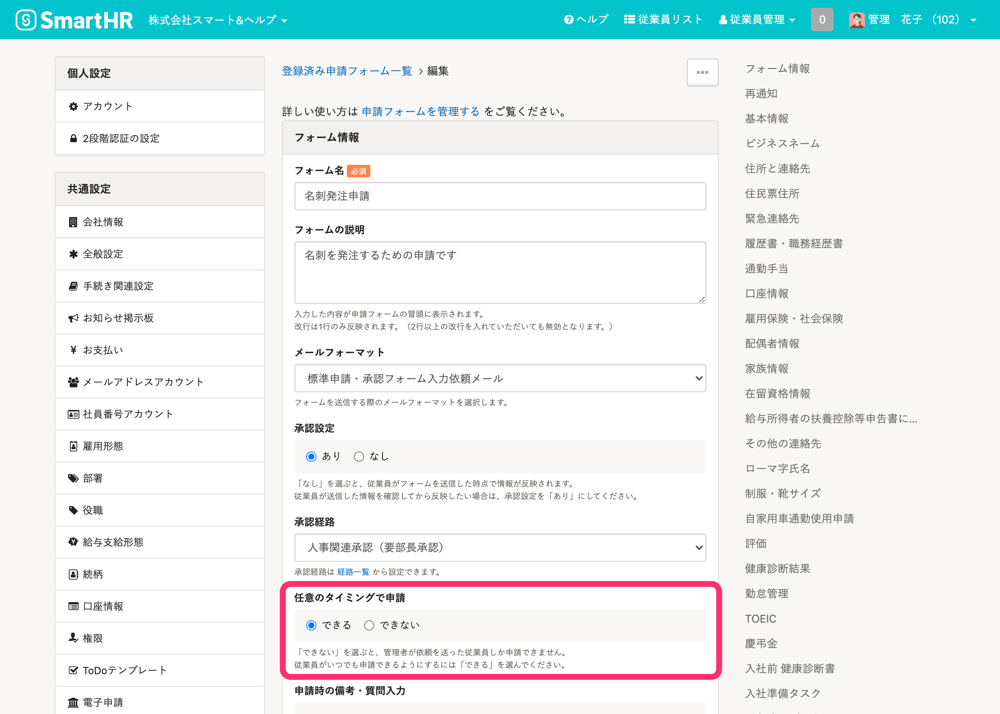
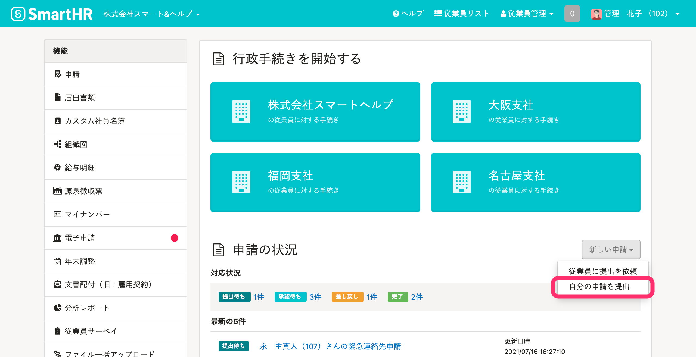
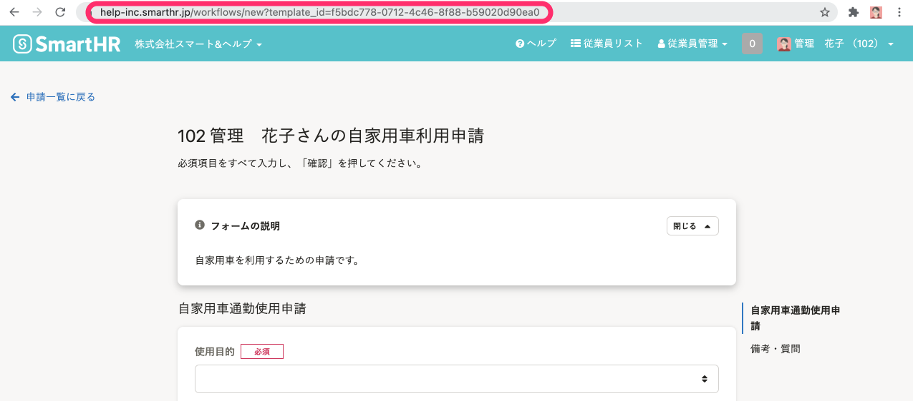

**SmartHRから従業員への通知を利用せず**に、申請フォームを使って従業員から情報収集する方法を説明します。

例えば、**社内の掲示板で申請フォームのURLを共有**し申請の提出を依頼する際などに、参考にしてください。

# URLを共有できる条件

URLを共有するために、以下の2つの条件を確認してください。

1.  従業員情報と紐付いたアカウントでログインしていること（参考：[メールアドレスアカウントと従業員の違いとは](https://knowledge.smarthr.jp/hc/ja/articles/360026107614)）
2.  共有したい申請フォームの **［フォーム情報］** \> **［任意のタイミングで申請］** が **［できる］**  になっていること
    

# 1\. 管理者が、従業員に申請フォームのURLを共有し、申請を依頼する

## 1-1.［自分の申請を提出］をクリック

トップページの **［新しい申請］** から **［自分の申請を提出］** をクリックし、申請フォーム一覧に移動します。

## 1-2. 依頼したい申請フォームを選択

依頼したい申請フォームを選択し **［次へ］** をクリックすると、申請フォームが表示されます。

## 1-3. URLをコピーし、従業員に共有する

申請フォームのURLをコピーし、社内の掲示板やメールなどで従業員に共有します。

# 2\. 従業員が、申請フォームを提出する

## 2-1. SmartHRにログイン

SmartHRにログインします。

## 2-2. 共有された申請フォームのURLにアクセス

管理者から共有されたURLにアクセスすると、申請フォームが表示されます。

従業員は、申請フォームに内容を入力し、申請を提出します。
