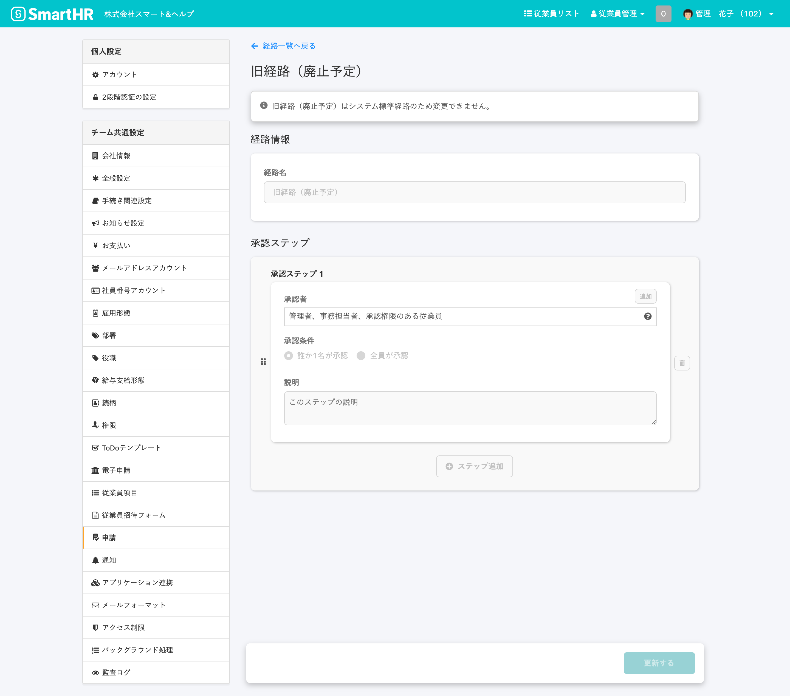

複数ステップでの承認機能の公開に伴い、従来の承認経路を  **「旧経路（廃止予定）」**  という名前で、経路一覧に追加しました。

機能公開以前に**作成済み**、かつ **承認設定が「あり」** の申請フォームには、すべて  **「旧経路（廃止予定）」**  が自動的に紐づけられています。

# 旧経路（廃止予定）とは

申請の承認者が、権限に基づいて **「管理者」**   **「事務担当者」** または  **「承認権限を付与されたカスタム権限のアカウント」**  に指定されている経路で、承認ステップは1段階のみです。

申請経路設定画面で作成する「カスタム経路」 提供前からある承認経路のことです。

新しく利用可能になった「カスタム経路」との違いは、以下の通りです。

| 経路種別 | 承認者の条件 | 承認可能な範囲 | 承認ステップ数 | 通知先 |
| --- | --- | --- | --- | --- |
| 旧経路 （廃止予定） | 管理者、事務担当者、カスタム権限 ＝申請の承認権限があるアカウント | 依頼時 or 申請時の 操作可能範囲内の従業員による申請すべて | 1 | 承認者すべて |
| カスタム経路 |   経路の承認者として指定されたアカウント   |   依頼時or 申請時に 申請に紐付けられた経路で 承認者として指定されていた申請   | 1~10 | ステップ毎の 承認者全員 |

:::related
[申請経路を管理する](https://knowledge.smarthr.jp/hc/ja/articles/360053832734)
:::

# 旧経路（廃止予定）では誰が承認者になりますか？

## 管理者権限、事務担当者権限、または、操作可能範囲内に含まれ、承認権限を付与されたカスタム権限のアカウントです。

- 管理者権限を持つアカウント
- 事務担当者権限を持つアカウント
- 権限設定の **［従業員関連］の［操作できる範囲］** で **［本人］以外**  のいずれかが設定され、かつ **［各種機能］>［** **申請機能］>** **［依頼や承認］** で **［承認］** が設定されているカスタム権限を持つアカウント

:::related
[申請機能を利用するための権限設定](https://knowledge.smarthr.jp/hc/ja/articles/360026262453)
:::

# 旧経路は編集できますか？

## できません。

# 旧経路（廃止予定）は新たに作成した申請フォームにも紐付けられますか？

## はい。できます。

新規作成した申請フォームにも、 「旧経路（廃止予定）」 を紐付けできます。

:::related
[申請フォームを管理する](https://knowledge.smarthr.jp/hc/ja/articles/360026262313)
:::

# 廃止予定の時期は決まっていますか？

## 決まっていません。時期が決まり次第、事前にお知らせいたします。

この承認経路は、今後の承認経路のアップデートにともない廃止予定です。廃止時期が確定次第、事前にお知らせを公開させていただきます
