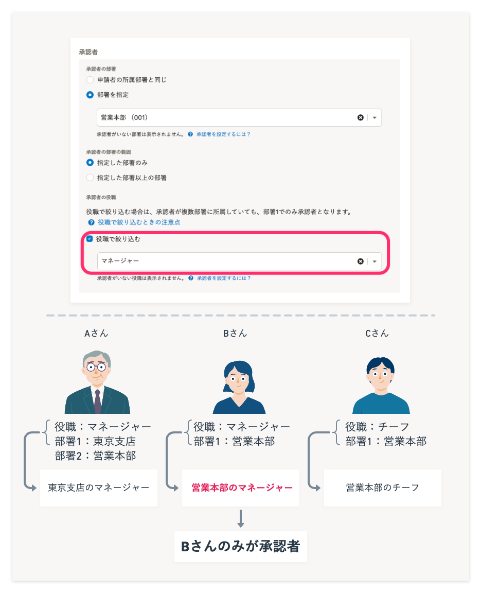
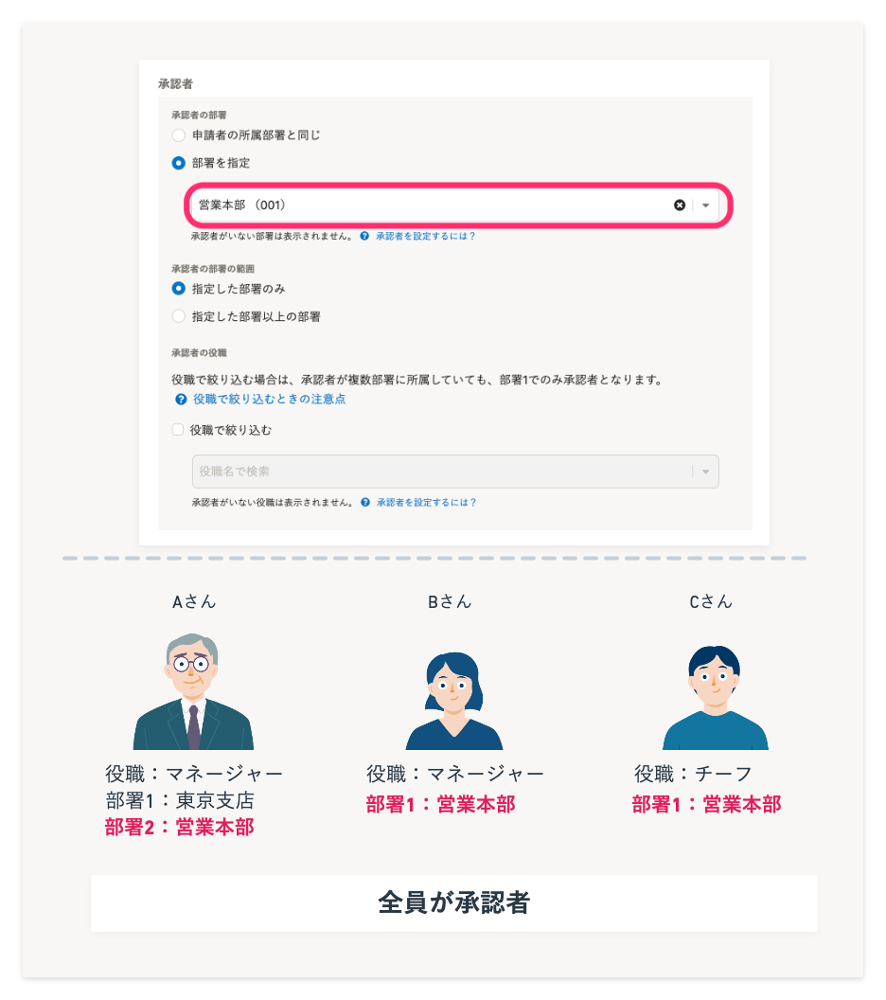

# A. 経路で指定した部署が「部署1」に設定されている役職者のみが承認者となります

承認者を役職で絞り込む場合、承認者に設定されている役職は、承認者の部署1での役職とみなされます。

そのため、経路で指定した部署が「部署1」に設定されている役職者のみが承認者となる点にご注意ください。

例えば、下記のように設定した場合は、**部署1が［営業本部］かつ役職が［マネージャー］のBさんのみ**が承認者となります。

-  **［承認者の部署］：［部署を指定］>［営業本部］** 
-  **［承認者の役職］：［部署で絞り込む］>［マネージャー］** 

なお、役職で絞り込まずに部署だけを指定した場合は、部署1〜3のいずれかに指定した部署が設定されている従業員が承認者となります。

例えば、下記のように設定した場合は、**部署1〜3のいずれかに［営業本部］が設定されている従業員**が、承認者となります。

下図の場合、Aさん、Bさん、Cさんの全員が承認者です。

-  **［承認者の部署］：［部署を指定］>［営業本部］** 
-  **［承認者の役職］：［役職で絞り込む］にチェックを入れない** 

:::related
[承認者を部署と役職で指定する](https://knowledge.smarthr.jp/hc/ja/articles/360061287294)
:::
