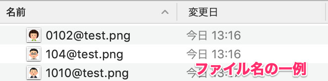

従業員情報のファイル添付項目（プロフィール画像、履歴書・職務経歴書、口座情報を確認できる書類、カスタム項目）に対して、画像ファイルを一括でアップロードできる「ファイル一括アップロード」の使い方を説明します。

すでに画像が登録済みの項目に、新しい画像をアップロードして更新もできます。

:::alert
「ファイル一括アップロード」機能をリニューアルした「ファイル一括操作」機能をリリースしました。
リニューアル後の「ファイル一括操作」機能については、[SmartHRファイル一括操作について｜SaaStainerヘルプページ](https://saastainer.zendesk.com/hc/ja/articles/5295873281817)を参照してください。
リニューアルに伴い、「ファイル一括アップロード」機能は、2022年6月30日（木）に提供を終了する予定です。
[新機能「ファイル一括操作」をリリースしました｜SmartHR](https://smarthr.jp/update/35352)
:::
:::tips
こちらの機能は **スタンダードプラン** または **プロフェッショナルプラン** を契約されている場合にご利用いただけます。
プラン変更に関しては、 [スタンダードプランについてのお問合せ](https://smarthr.jp/standardplan_contact) よりお問い合わせください。
また、ご利用にあたっては、事前にSmartHRオプション機能のインストールを完了させておく必要があります。
[SmartHRオプション機能をインストールする](https://knowledge.smarthr.jp/hc/ja/articles/360026262553)
:::

# ファイルを一括アップロードする方法

## 1\. ［機能］>［ファイル一括アップロード］をクリック

トップページ左の **［機能］** 欄にある **［**  **ファイル一括アップロード］** をクリックすると、ファイルを登録する画面が表示されます。

## 2\. アップロードするファイルを選択する

画面の中央にある **［**  **登録する項目を選択してください］** をクリックすると、ファイル項目のプルダウンリストが表示されます。

一括アップロードを行なうファイル項目を選択して **［**  **一括登録をはじめる］** をクリックすると、 **［**  **アップロード］** 画面が表示されます。

:::tips
 **［登録する項目を選択してください］** のプルダウンリストには、ファイルをアップロードする必要がある従業員項目のみが表示されます。

文字列や数値、ドロップダウンリスト、日付、テキストを使用した従業員項目は反映されません。
従業員項目の種類について詳しくは、以下のヘルプページをご覧ください。
[従業員情報項目のカスタマイズ方法](https://knowledge.smarthr.jp/hc/ja/articles/360026265513)
:::

## 3\. アップロードするファイルを準備する

アップロード画面中央に記載されているファイルの命名規則に沿って、アップロードするファイルの名前を **{社員番号} + @（半角アットマーク）+ {任意のワード}** に変更します。

例えば、社員番号が「0102」の従業員用のファイルをアップロードする場合、ファイル名は「0102@{任意のワード}」となります。

SmartHR上の社員番号と、ファイル名の社員番号が一致しているかどうかを判断し、従業員とファイルの紐付けが行なわれます。

## 4\. ファイルをアップロードする

 **［ここにドラッグ＆ドロップ または ここをクリック］** のフィールドに、用意したファイルをドラッグ＆ドロップするとアップロードされます。

またはフィールドをクリックし、ファイルを選択してアップロードを行ないます。

## 5\. アップロードの完了を確認する

アップロードすると、画面下に **［**  **アップロードされたファイル］** という項目が現れます。

ステータスが  **［**  **紐付け完了］** と表示された場合、従業員とアップロードしたファイルの紐付けが成功しています。

ステータスが **［**  **エラー］** と表示された場合、 **［**  **メッセージ］** にエラーの原因が表示されます。

 **［メッセージ］** を参考にファイルの名前を付け直すなどして、もう一度アップロードを行ないます。

## 6\. ［アップロードしたファイルを確認する］をクリック

全てのファイルが **［**  **紐付け完了］** ステータスになり、画面下部にある **［**  **アップロードしたファイルを確認する］** をクリックすると、 **［**  **確認］** ステップの画面が表示されます。

## 7\. アップロードしたファイルを確認する

アップロードしたファイルと紐付けられた従業員情報が一致していることを確認し、画面下部にある **［**  **従業員情報に登録する］** をクリックすると、SmartHRの従業員情報へ反映されます。

この操作を実行しない限り、従業員情報へ登録されません。

:::tips
- アップロードできる項目のファイルは、プロフィール画像、履歴書・職務経歴書、口座情報を確認できる書類、カスタム項目です。
- 対応しているファイル形式は、[【一覧】アップロードできるファイル形式とサイズ](https://knowledge.smarthr.jp/hc/ja/articles/360026106354) 内の 「従業員情報」で該当の項目をご確認ください。
- 従業員情報のように、過去の時点を指定してファイルをアップロードすることはできません。アップロード時点の情報として登録されます。
- お使いのネットワークでファイルアップロードを制限している場合は、fileuploader.smarthr.plusでのファイルアップロードを許可してください。
:::

# 作業の途中で画面を閉じてしまった場合は？

作業の途中で画面を閉じてしまった場合は、ファイル一括アップロードのトップページ画面下部にある  **［登録履歴］** の右端にある **［**  **登録する］** をクリックすると、登録手続きを再開できます。

# 間違ったファイルを従業員に紐付けてしまった場合は？

一度アップロードしたファイルを削除し、もう一度ファイルを追加する必要があります。

「8. アップロードしたファイルを確認する」の手順で表示される **［**  **確認］** 画面にて、削除したいファイル横にあるボックスにチェックを入れ、 **［**  **選択中のファイルを削除］** をクリックしてください。

ファイルの削除が完了したら、右上にある **［ファイルを追加する］** をクリックし、新しくファイルを登録します。

