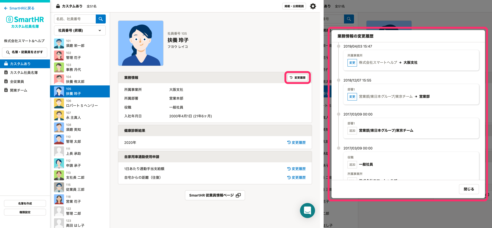
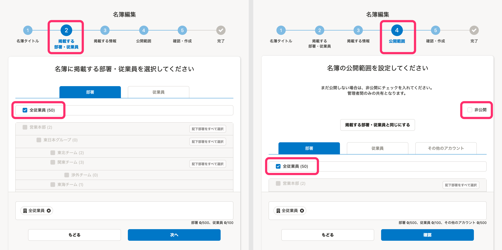

カスタム社員名簿機能をご利用いただく中でよくある質問を記載します。

# 利用したいのですが、メニューが表示されません。

**スタンダードプラン**以上のプランを契約されている場合にご利用いただけます。

プラン変更に関しては [スタンダードプランについてのお問合せ](https://smarthr.jp/standardplan_contact) よりお問い合わせください。

# 名簿は何件まで作成可能ですか？

名簿数の上限はありません。

# 名簿は作成途中で一時保存できますか？

はい、自動で一時保存されます。

# 名簿を非公開にすることはできますか？

はい、作成時に「非公開」にチェックをすると、管理者さま以外には非公開の状態で作成できます。

また、作成済みの名簿も、名簿画面右上のアイコンから、公開・非公開の切り替えができます。

# SmartHRの従業員リストとの同期はどのタイミングで行われますか？

従業員情報はリアルタイムで自動同期されます。

従業員を検索する際の「条件」は毎日26時に自動同期されます。

例：従業員がA部署からB部署に異動した場合

従業員情報には、「所属部署はB部署」と即座に表示されるようになりますが、該当社員の検索は「A部署」でしかヒットしない時間帯が発生します。

26時を過ぎて検索データの同期が終わり次第、「B部署」でのみ検索がヒットするようになります。

# SmartHR側で部署名が変更された場合、名簿はどうなりますか？

従業員情報としての部署名はリアルタイムで更新されます。

ただし、「テンプレート：部署名簿」から作成した名簿のタイトル（部署名）は更新されません。

# SmartHR側で閲覧者の所属部署を変更したらどうなりますか？

名簿の閲覧権限に反映されるまで5分ほどかかります。

例： 「A部署の従業員」が「A部署名簿」を閲覧できる設定になっている場合

SmartHR側で従業員の所属をA部署からB部署に変更すると、その従業員は5分ほど「A部署名簿」の閲覧ができる状態となります。

# 異動の履歴は確認できますか？

はい、 **［変更履歴］** をクリックすると、部署の変更履歴をタイムライン形式で確認できます。

カスタム社員名簿機能で閲覧できる変更履歴は以下のとおりです。

:::tips
- 業務情報（所属事業所、所属部署、役職、業務内容、雇用形態）
- カスタム項目
:::

# 退職者も名簿を閲覧できますか？

いいえ、下記のいずれかにあてはまるアカウントでは、カスタム社員名簿を見られません。

- 在籍状況が「退職済」
- 退職日が「昨日以前」
- 権限が「退職者」

また、名簿自体にも掲載されないようになります。

# ［名簿・従業員をさがす］で、従業員を検索できません。

管理者権限以外のアカウントでは、検索できないケースがあります。

 **［掲載範囲］** および **［公開範囲］** に **［全従業員］** が指定された名簿を**公開**していると、検索できます。

