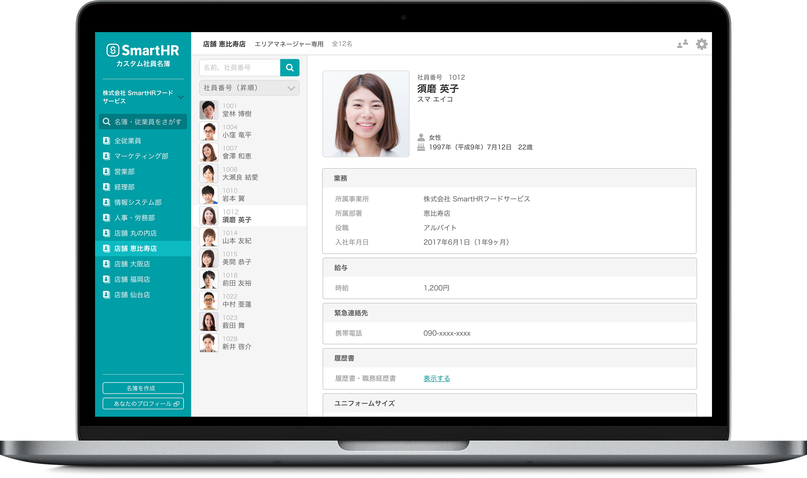

SmartHRに入力されている従業員情報をもとに、用途に応じたさまざまな名簿を作成し、指定した部署や従業員に対して公開できる機能です。

例えば、下記のようなケースにご活用いただけます。

- 社員同士が顔や名前、職種を検索・閲覧できる名簿を作成したい！
- 管理部のメンバーのみが、各社員に支給している手当や備品を確認できる名簿がほしい！

詳しい操作手順および説明は各ページをご覧ください。

- [カスタム社員名簿の作成方法](https://knowledge.smarthr.jp/hc/ja/articles/360026262353)
- [カスタム社員名簿の権限](https://knowledge.smarthr.jp/hc/ja/articles/360026262333)
- [カスタム社員名簿に関するよくある質問](https://knowledge.smarthr.jp/hc/ja/articles/360026103814)
