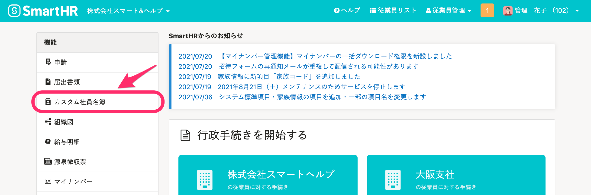
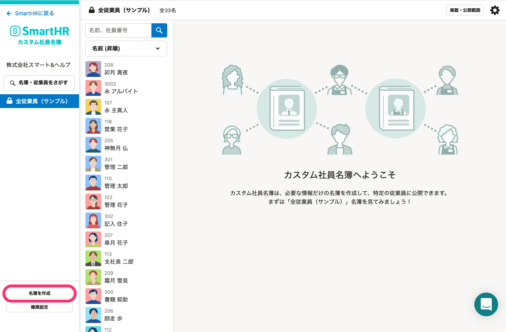
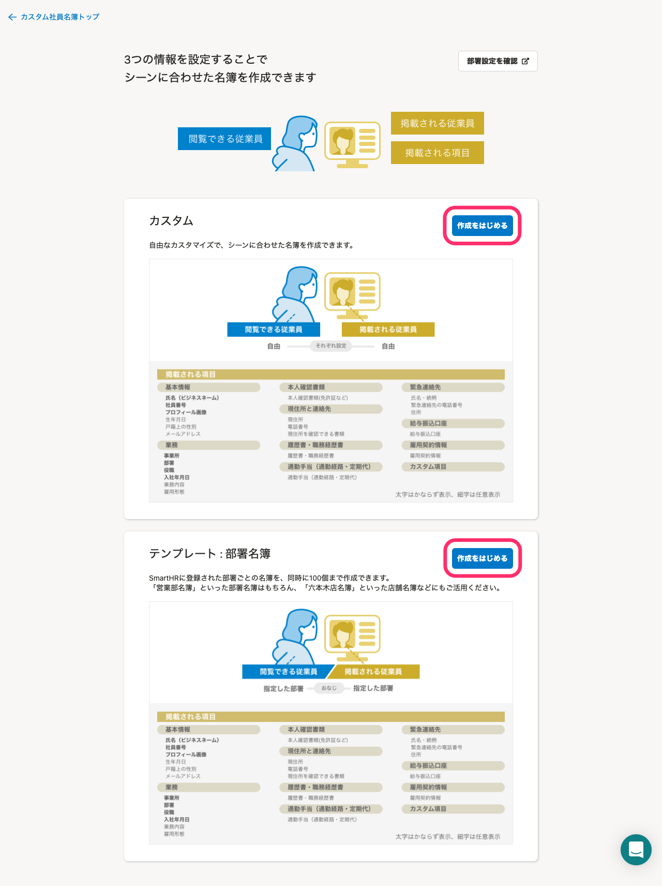
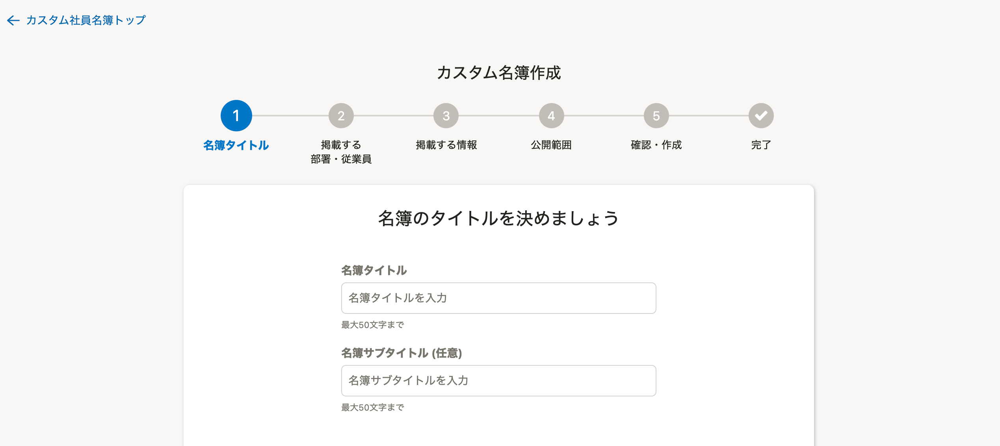
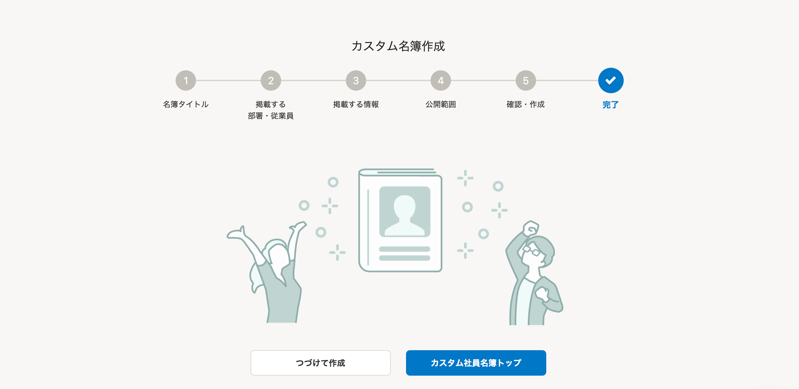

# 1.トップページの［機能］にある［カスタム社員名簿］をクリック

管理者権限でアカウントでSmartHRにログインし、トップページ左側の **［機能］** にある、 **［カスタム社員名簿］** をクリックしてください。

 **［カスタム社員名簿］** をクリックすると、別ウィンドウでカスタム社員名簿のトップページが開きます。

# 2\. 画面左下の［名簿を作成］をクリック

画面左下にある、 **［名簿の作成］** をクリックしてください。

# 3\. テンプレートタイプの右上にある［作成をはじめる］をクリック

 **［名簿の作成］** をクリックすると、テンプレートタイプを選択する画面が表示されます。

作成したいテンプレートタイプの右上にある **［作成をはじめる］** をクリックしてください。

# 4\. 従業員情報項目や公開範囲を指定する

 **［作成をはじめる］** をクリックすると、以下のような画面に切り替わります。

表示される画面に従って、表示させたい従業員情報項目や公開範囲（部署、従業員）を指定してください。

# 5\. カスタム名簿の完成を確認する

完了画面（下図）が表示されたらカスタム社員名簿の出来上がりです。

画面左の名簿一覧に表示されていることを確認しましょう。

# テンプレートタイプについて

下記のカスタムタイプと部署名簿テンプレートのいずれかから選択できます。

## ■ カスタム

掲載および公開する範囲（部署、従業員）と、掲載する項目を指定できる名簿です。

### 掲載される項目（項目ごとの選択可）

※ 太字は必ず表示されます。細字は表示する/しないを指定できます。

- 基本情報
    - **氏名（ビジネスネーム）、社員番号、プロフィール画像**、生年月日、 戸籍上の性別、メールアドレス
- 業務
    - **事業所、部署、役職、入社年月日**、業務内容、雇用形態
- 本人確認書類
    - 本人確認書類（免許証など）
- 現住所と連絡先
    - 現住所、電話番号、現住所を確認できる書類
- 履歴書・職務経歴書
    - 履歴書・職務経歴書
- 通勤手当（通勤経路・定期代）
    - 通勤手当（通勤経路・定期代）
- 緊急連絡先
    - 氏名・続柄、電話番号、住所
- 給与振込口座
    - 給与振込口座
- 雇用契約情報
    - 雇用契約情報
- カスタム項目
    - ［共通設定］>［従業員項目］で追加されたカスタム従業員情報項目

### 利用例

- 全店舗の店長のみの名簿を作成し、店長間で共有

## ■ テンプレート：部署名簿

同じ部署や店舗に所属する従業員同士が閲覧できる名簿です。
SmartHR に登録されている［部署］ごとの名簿が作成されます。
掲載する項目を指定することができ、同時に最大100部署分の名簿を作成できます。

### 掲載される項目（項目ごとの選択可）

※ 太字は必ず表示されます。細字は表示する/しないを指定できます。

- 基本情報
    - **氏名（ビジネスネーム）、社員番号、プロフィール画像**、生年月日、戸籍上の性別、メールアドレス
- 業務
    - **事業所、部署、役職、入社年月日**、業務内容、雇用形態
- 本人確認書類
    - 本人確認書類（免許証など）
-  現住所と連絡先
    - 現住所、電話番号、住所を確認できる書類
- 履歴書・職務経歴書
    - 履歴書・職務経歴書
- 通勤手当（通勤経路・定期代）
    - 通勤手当（通勤経路・定期代）
- 緊急連絡先
    - 氏名・続柄、電話番号、住所
- 給与振込口座
    - 給与振込口座
- 雇用契約情報
    - 雇用契約情報
- カスタム項目
    - ［共通設定］>［従業員項目］で追加されたオリジナルの従業員情報項目

### 利用例

- 「営業部」専用の名簿を作成し、営業部内で共有
- 「A店舗」名簿を作成し、A店舗内で共有
