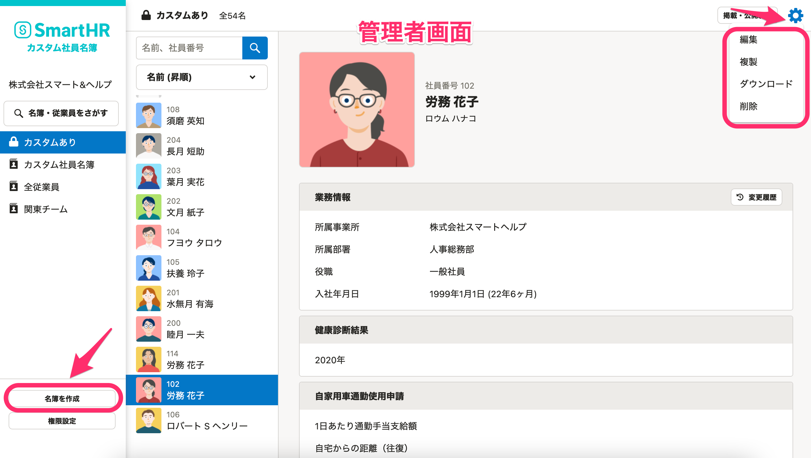
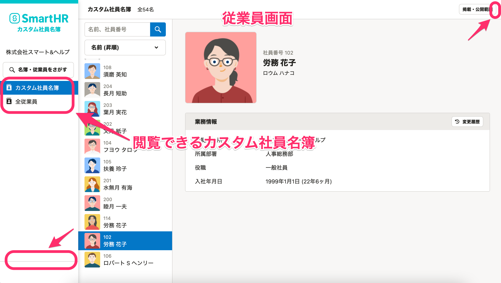
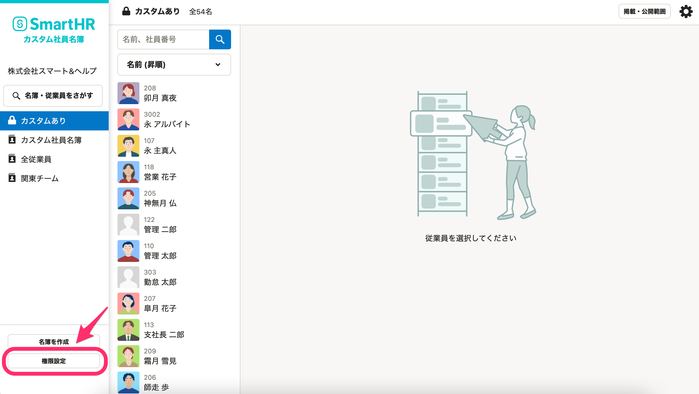
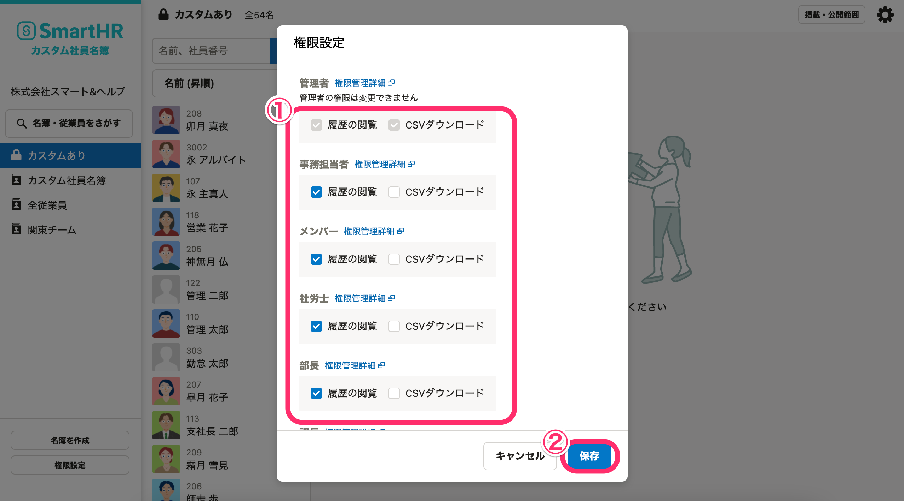

カスタム社員名簿の権限について記載します。

# 名簿の作成権限

カスタム名簿の作成・編集・削除は、**管理者のみ**操作可能です。
（2020年6月時点）

# 名簿の閲覧権限

作成された名簿の閲覧（共有範囲）は、テンプレートごとに異なり、名簿を作成する際に指定します。

| テンプレートタイプ | 公開範囲 |
| --- | --- |
| 全従業員名簿 | すべての従業員が閲覧できます |
| 部署名簿 | 指定した部署に所属するすべての従業員が閲覧できます |
| カスタム | 指定した従業員（またはユーザー）が閲覧できます |

:::alert
SmartHR本体で設定している権限とは異なりますのでご注意ください。
SmartHR本体では、従業員（メンバー）に対して閲覧権限を付与していない項目でも、カスタム社員名簿側で公開していれば、従業員は名簿から該当項目を閲覧できます。
:::
:::tips
在籍状況が「退職済」の従業員や、アカウントの権限が「退職者」になっている方は、カスタム社員名簿を閲覧できません。
また、名簿自体にも掲載されないようになります。
:::

# 履歴の閲覧とCSVダウンロードの権限

 **［履歴の閲覧］** と **［CSVダウンロード］** の機能については、カスタム社員名簿の画面左下にある **［権限設定］** から権限を付与できます。
（2020年6月時点）

:::tips
権限を設定できるのは、**管理者のみ**です。
:::

 **［権限設定］** をクリックすると、 **［権限設定］** ダイアログが表示されます。

 **［履歴の閲覧］** と **［CSVダウンロード］** の左側にあるチェックボックスにチェックを入れ、 **［保存］** をクリックすると、権限ごとにそれぞれの機能の権限を付与できます。

:::tips
ダイアログには、SmartHRの **［共有設定］** \> **［権限］** にて登録されている権限（「事務担当者」「メンバー」や、ご自身で作成したオリジナルの権限）が表示されます。
オリジナルの権限を作成する手順については、下記のページをご覧ください。
[カスタム権限を追加する](https://knowledge.smarthr.jp/hc/ja/articles/360026106594)
:::
