:::tips
組織図機能は、スタンダードプラン以上でご利用いただけます。
スタンダードプランのご利用料金については、下記からお問い合わせください。
[スタンダードプランお見積もり](https://smarthr.jp/pricing/quote_standard)
:::

SmartHR基本機能に登録された従業員情報を使用して、部署単位の組織図を作成します。

# 1\. SmartHRの機能メニューから［組織図］をクリック

SmartHR基本機能トップページの機能メニューで **［組織図］** をクリックすると、組織図機能に移動します。

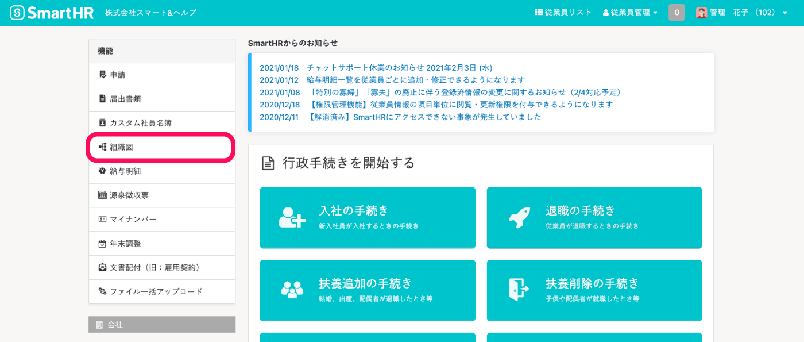

# 2.「+ 新しい組織図を作成」をクリック

組織図のトップページ（ **［組織図一覧］** ）で、 **「+ 新しい組織図を作成」** をクリックします。

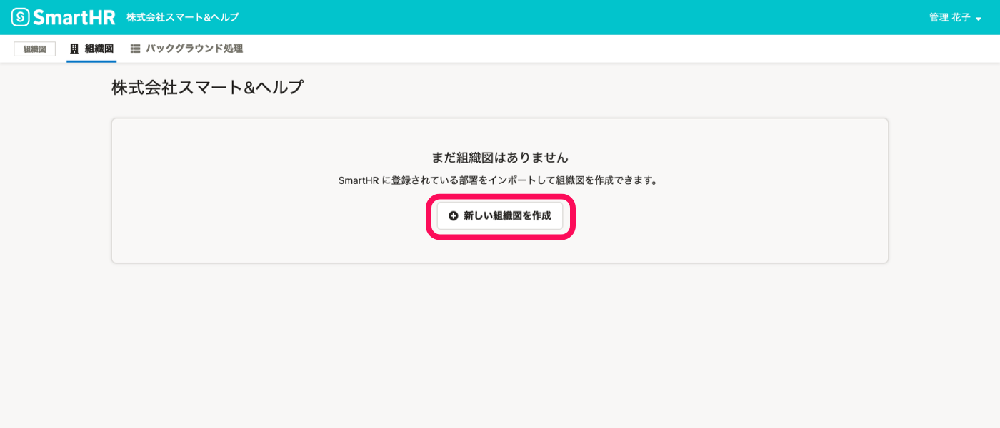

# 3\. 部署を選択して、「インポート」をクリック

組織図に含めたい部署にチェックを入れ、  **「インポート」**  をクリックします。

SmartHRの従業員情報の取り込みの **バックグラウンド処理** が始まります。

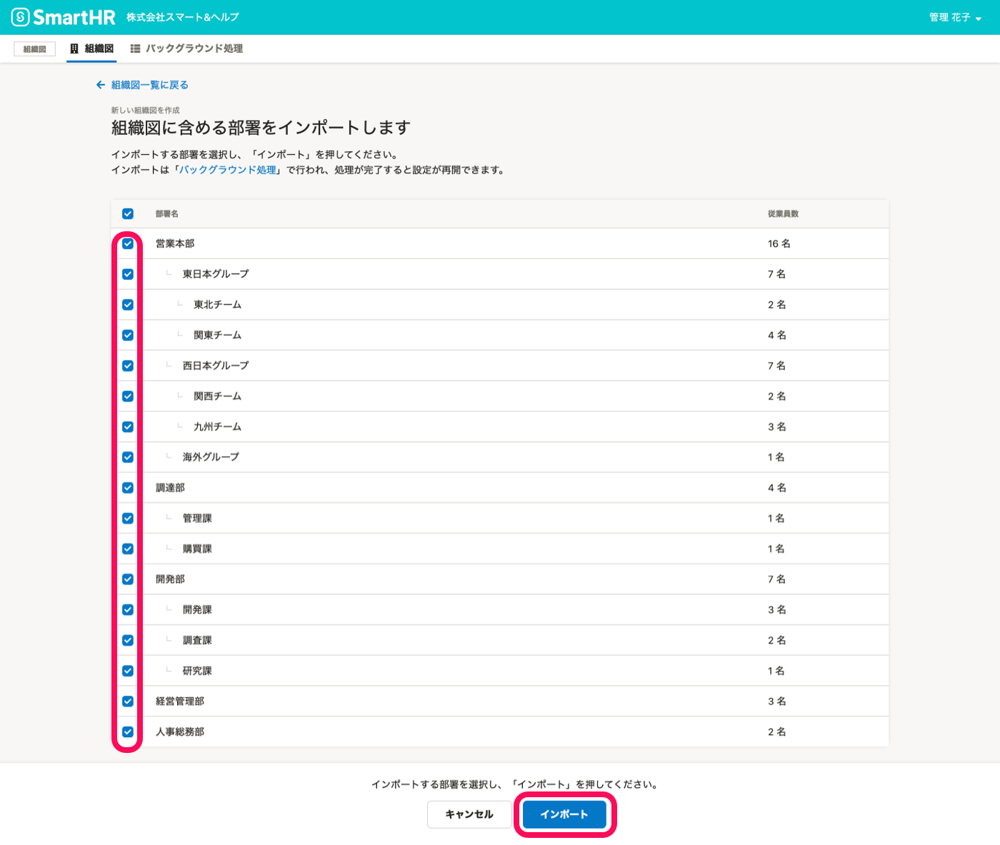

:::tips
すべての部署を選択する場合は、部署一覧の **［部署名］** の隣にあるチェックボックスにチェックを入れると、すべての部署にチェックが入ります。
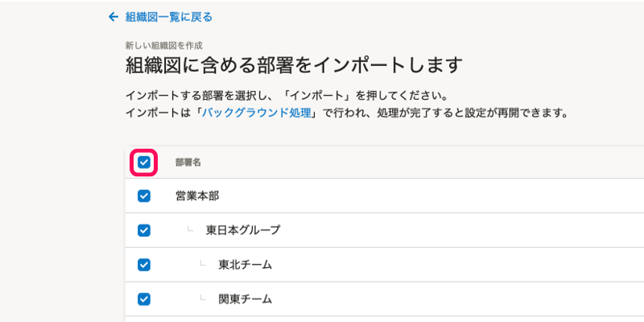
:::

# 4.「組織図の作成を再開する →」をクリック

データの取り込みが完了すると、トップページに **「組織図の作成を再開できます」** というメッセージが表示されます。

 **「組織図の作成を再開する →」** をクリックし、組織図の設定画面に移動します。

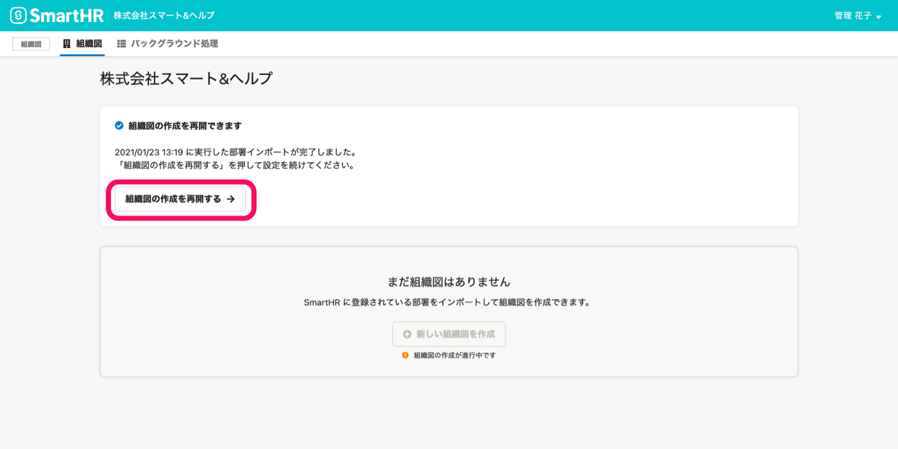

### データの取り込み状況は、バックグラウンド処理一覧画面からも確認できます。

組織図メニューの **［バックグラウンド処理］** をクリックすると、 **［バックグラウンド処理］** 一覧画面を確認できます。

ステータスが **［処理中］** から **［完了］** になったら、組織図の作成を再開できます。

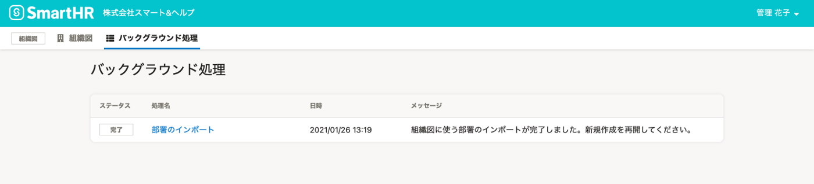

 **［バックグラウンド処理］** 一覧画面で  **「部署のインポート」** をクリックすると、バックグラウンド処理の詳細を確認できます。

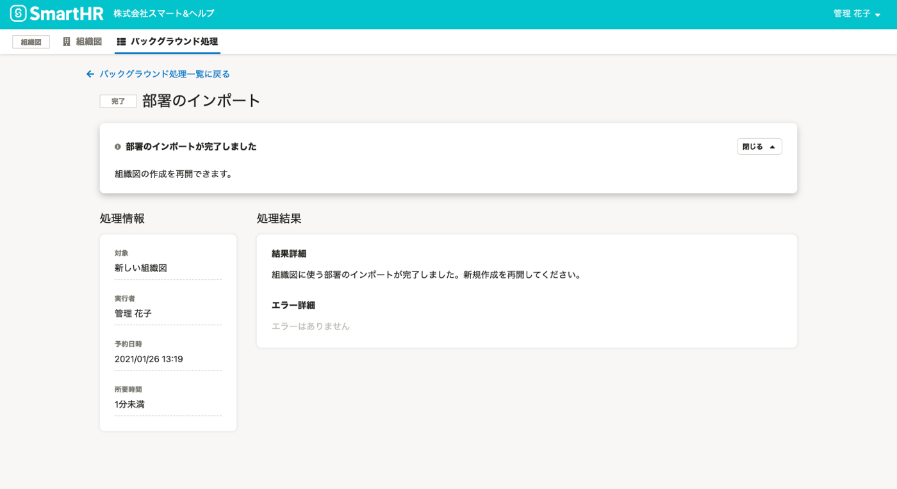

# 5\. 設定を確認

 **［代表者設定］** 、 **［部門長設定］** 、 **［管掌者設定］** 、 **［表示設定］、［共有設定］** を確認します。

これらの設定は、組織図作成後も変更可能です。

## ［代表者設定］、［部門長設定］、［管掌者設定］

代表者、部門長、管掌者を設定します（未設定でも組織図を作成できます）。

代表者には、あらかじめ会社情報の代表者が設定されています。

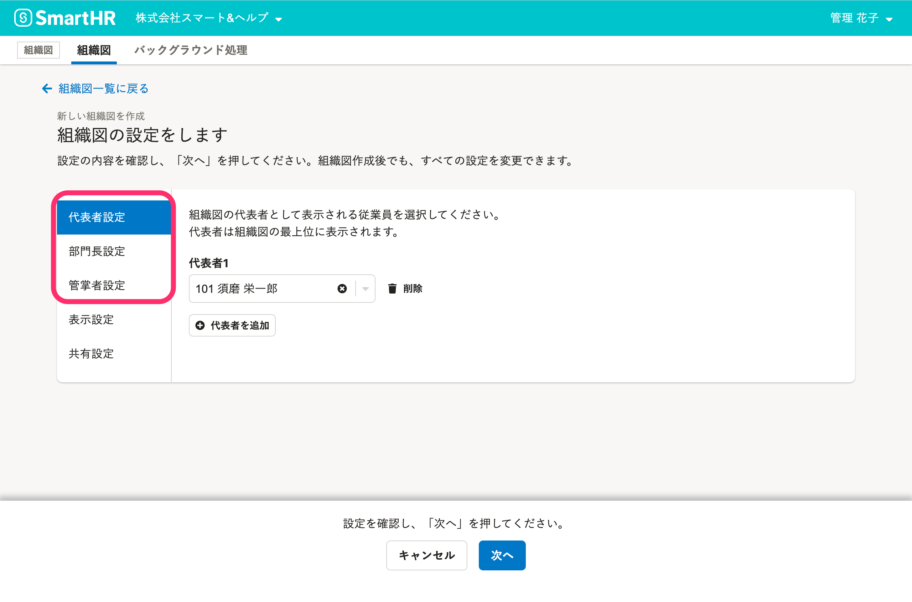

:::related
[組織図に表示する代表者、部門長、管掌者を設定する](https://knowledge.smarthr.jp/hc/ja/articles/1500002013222)
:::

## ［表示設定］

 **［従業員名］** と **［従業員カード表示項目］** を設定します。

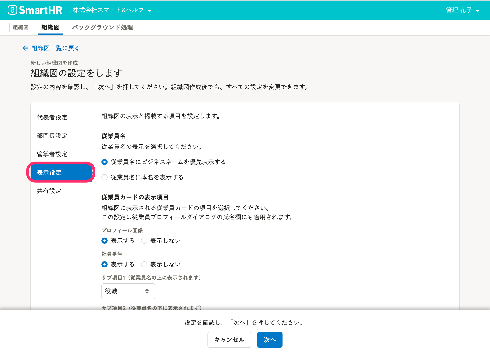

:::related
[組織図に表示する従業員情報を設定する](https://knowledge.smarthr.jp/hc/ja/articles/5466650246681)
:::

## ［共有設定］

組織図の公開範囲を設定します。

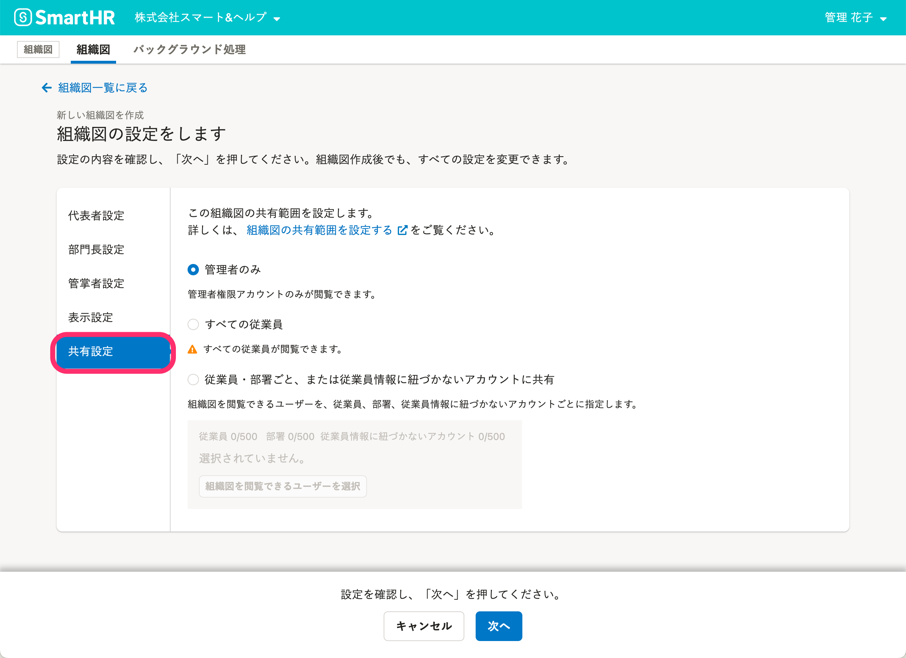

:::related
[組織図の共有範囲を設定する](https://knowledge.smarthr.jp/hc/ja/articles/4405524461849)
:::

# 5\. 「次へ」をクリックし、組織図の名前を入力

画面下の **「次へ」** をクリックすると組織図の名前を入力するフォームが表示されます。

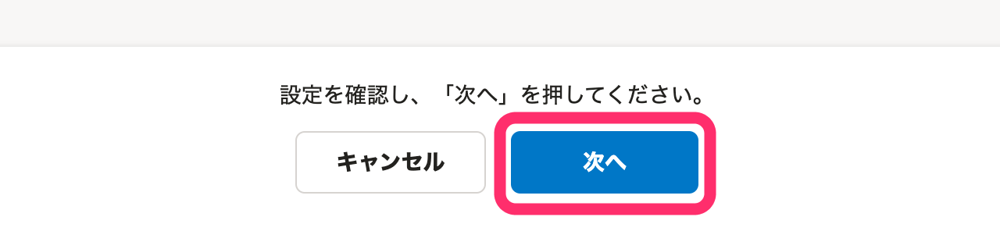

名前を入力して、 **「作成」** をクリックします。

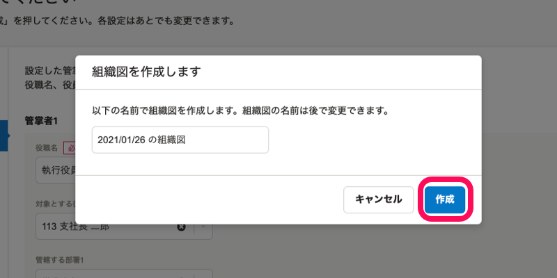

# 6\. 組織図が完成

完成した組織図が表示されます。

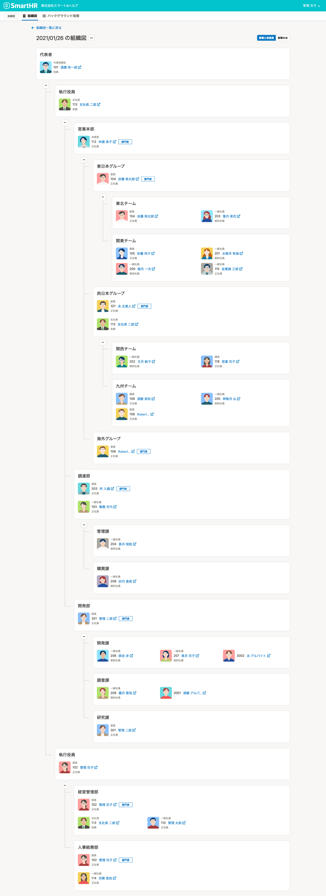

:::tips
部署内での従業員の表示順は、 **［役職ランク］** の昇順となります。
 **［役職ランク］** が同じ場合は、 **［社員番号］** の昇順で表示されます。
 **［役職ランク］** については、下記のページをご覧ください。
[［役職］のマスターデータを管理する](https://knowledge.smarthr.jp/hc/ja/articles/360053195014)
:::
