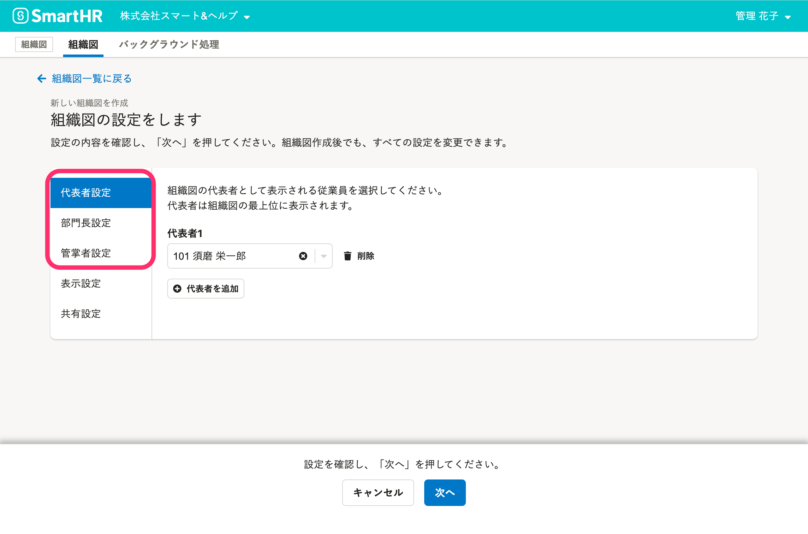
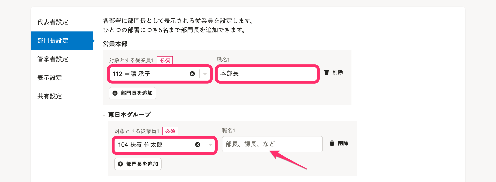
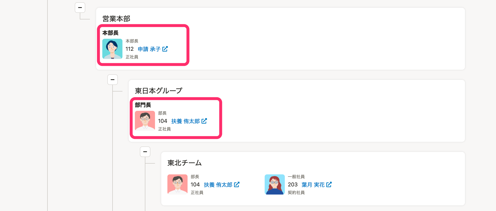
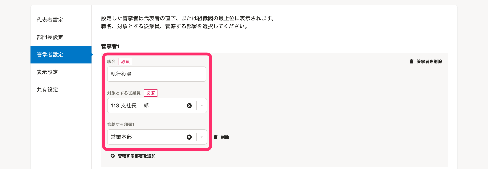
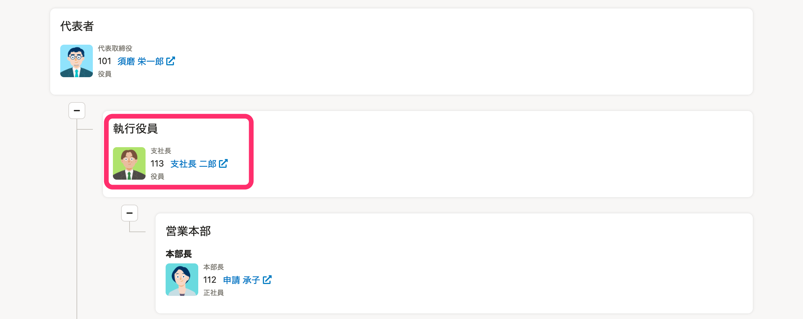

組織図名の右側にある［組織図操作  ］から、組織図作成時に設定した代表者などを変更できます。

# 1.［組織図操作  ］をクリック

組織図名の右側にある **［組織図操作  ］** をクリックし、ドロップダウンリストから **［代表者設定 ］、［部門長設定 ］、［管掌者設定 ］** のいずれかをクリックします。

# 2\. 代表者、部門長、管掌者を追加

設定画面で、  **［  代表者を追加］** 、 **［ 部門長を追加］** 、 **［ 管掌者を追加］** をクリックして、従業員を選択します。

:::tips
従業員情報にビジネスネームの登録がある場合には、ビジネスネームでも検索できます。
:::

画面左側の **［代表者設定］** 、 **［部門長設定］** 、 **［管掌者設定］** をクリックすると設定画面が切り替わります。

## 部門長の組織図での見え方

部門長として組織図に追加すると、設定時に入力した **［職名］** が組織図に表示されます。

 **［職名］** が未入力の場合は、 **［部門長］** と表示されます。

## 管掌者の組織図での見え方

管掌者は代表者の直下、または組織図の最上位に表示されます。

設定画面で、配下に管轄する部署を追加してください。

# 3\. 画面下の［保存］をクリック

画面下の **［保存］** をクリックすると、設定内容が保存されます。

