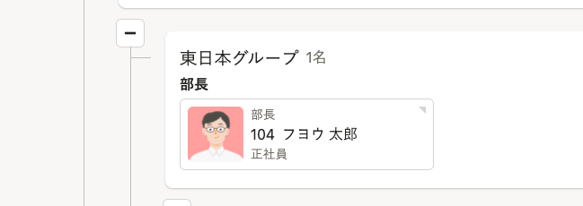
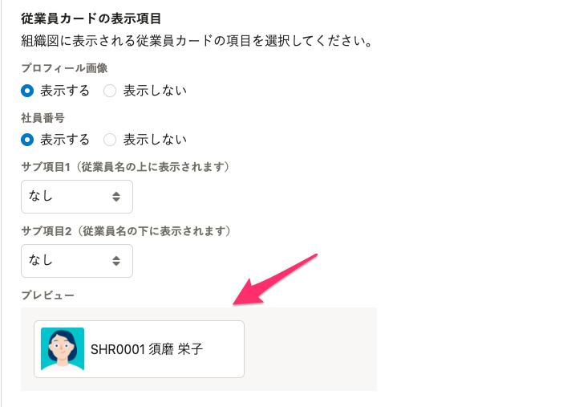
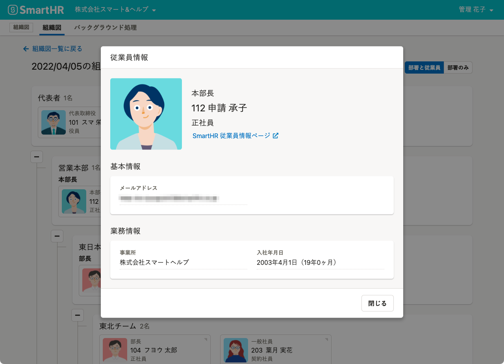

組織図名の右側にある［組織図操作  ］から、組織図に表示する従業員情報を変更できます。

# 1.［組織図操作  ］をクリック

組織図名の右側にある **［組織図操作  ］** をクリックし、ドロップダウンリストから **［表示設定 ］** をクリックします。

# 2.［従業員名］の表示を選択

組織図機能では、従業員情報にビジネスネームが登録されている場合にはビジネスネームを優先表示します。

組織図に表示する従業員氏名を本名に変更したい場合は、 **［従業員名に本名を表示する］** を選択してください。

# 3.［従業員カードの表示項目］を選択

組織図上に表示される従業員情報を**従業員カード**と呼びます。

 **［従業員カードの表示項目］** を選択すると、組織図上に表示される従業員の情報を変更できます。

 **［プロフィール画像］** の表示／非表示、 **［社員番号］** の表示／非表示を選択します。

従業員カードの**サブ項目**には、 **［役職］** 、 **［雇用形態］** 、 **［なし］** のいずれかを選択できます。

従業員名の上に表示される **［サブ項目1］** 、従業員名の下に表示される **［サブ項目2］** をそれぞれドロップダウンリストから選択します。

 **［従業員カードの表示項目］** を選択すると、プレビューに反映されます。

# 4.［組織図に掲載する項目］を選択

組織図上で従業員カードをクリックすると、従業員情報画面が表示されます。

 **［組織図に掲載する項目］** を選択すると、組織図上で閲覧できる従業員情報を変更できます。

表示したい項目にチェックを入れます。

:::alert
 **［組織図に掲載する項目］** として選択した従業員項目は、SmartHR基本機能のアカウント権限ごとに設定されている閲覧権限に関係なく、組織図を閲覧できるすべてのユーザーにも組織図上で表示されます。
設定には、十分にご注意ください。
:::

## 組織図に掲載できる従業員項目一覧

- 基本情報
    - 氏名
    - ビジネスネーム
    - 生年月日
    - 戸籍上の性別
    - メールアドレス
    - 社員番号
- 業務情報
    - 事業所
    - 部署
    - 役職
    - 業務内容
    - 雇用形態
    - 入社年月日
- 本人確認書類
- 現住所と連絡先
    - 現住所
    - 電話番号
    - 現住所を確認できる書類
- 履歴書・職務経歴書
- 通勤手当（通勤経路・定期代）
- 緊急連絡先
    - 氏名・続柄
    - 住所
    - 緊急連絡先の電話番号
- 口座情報
- 雇用契約情報

# 5\. 画面下の［保存］をクリック

画面下の **［保存］** をクリックすると、設定内容が保存されます。
