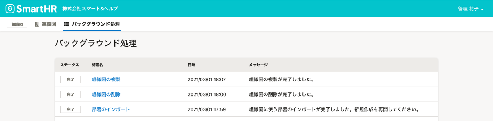
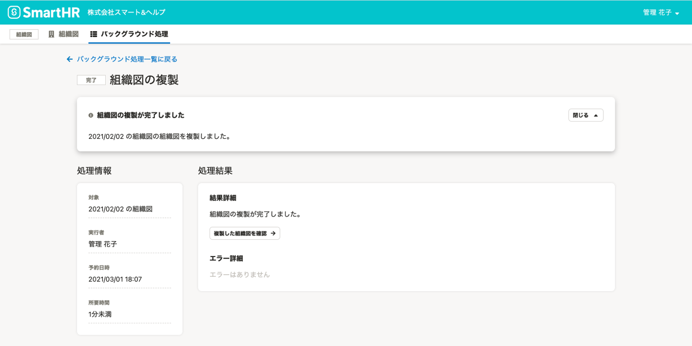

# 1.［組織図操作  ］から、［複製］をクリック

組織図名の右側にある **［組織図操作  ］** をクリックし、ドロップダウンリストから **［複製］** をクリックします。

# 2\. ［複製］をクリック

確認画面で **［複製］** をクリックすると、組織図の複製処理が予約され、トップページに移動します。

:::alert
組織図の複製を実行している間は、**組織図の新規作成はできません**。

:::

### 複製の完了状況は、バックグラウンド処理一覧画面からも確認できます。

組織図メニューの **［バックグラウンド処理］** をクリックすると、 **［バックグラウンド処理］** 一覧画面を確認できます。

複製が完了すると、ステータスが **［処理中］** から **［完了］** になります。

 **［バックグラウンド処理］** 一覧画面で **［組織図の複製］** をクリックすると、バックグラウンド処理の詳細を確認できます。

# 3\. 必要に応じて、組織図の名前を変更する

複製された組織図の名前は、「 **（コピー）元の名前**  」として作成されます。

必要に応じて、組織図詳細画面から名前の変更をしてください。
