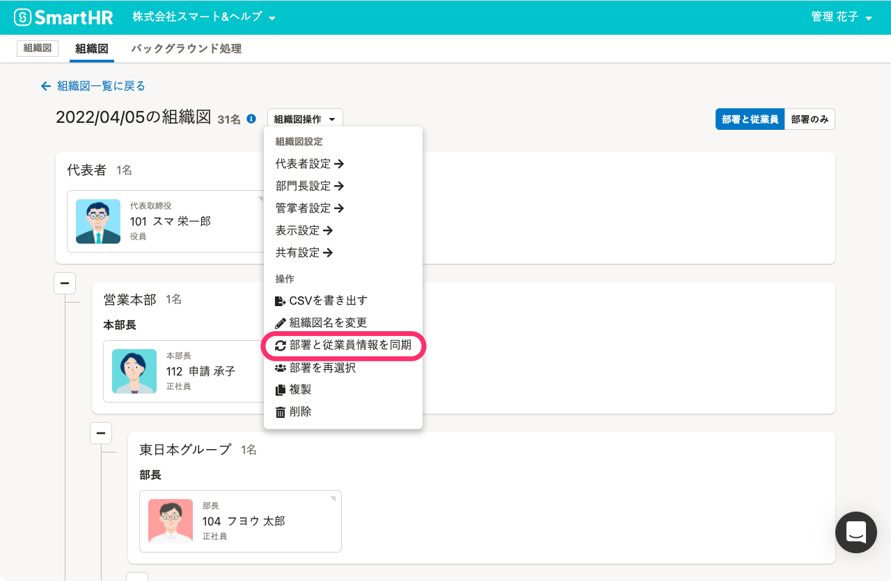
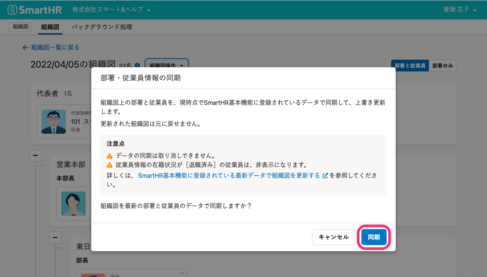
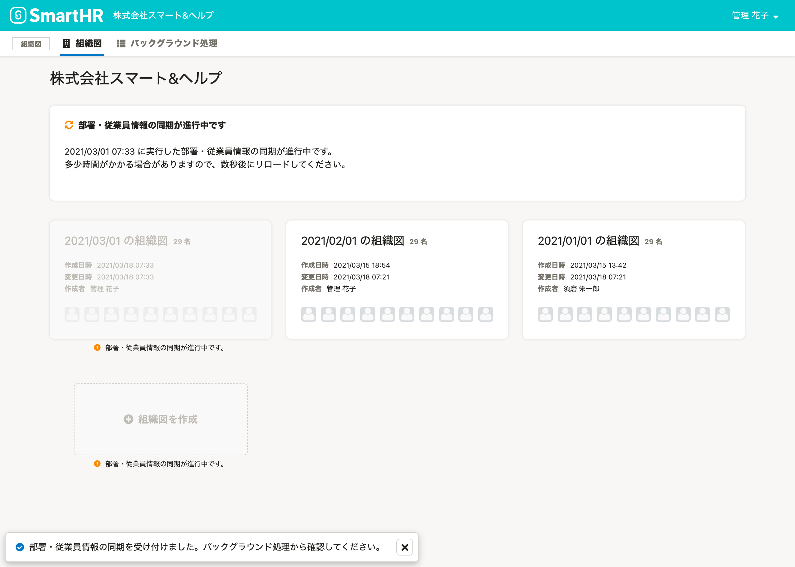
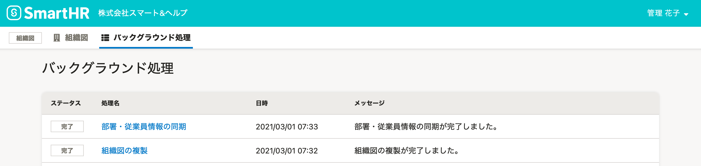
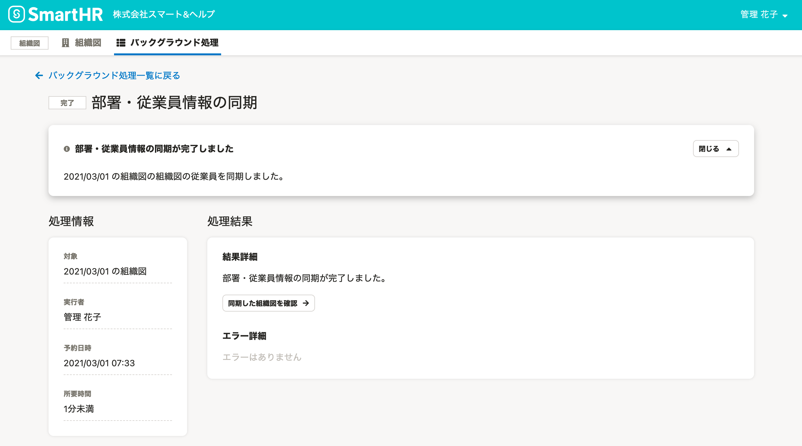
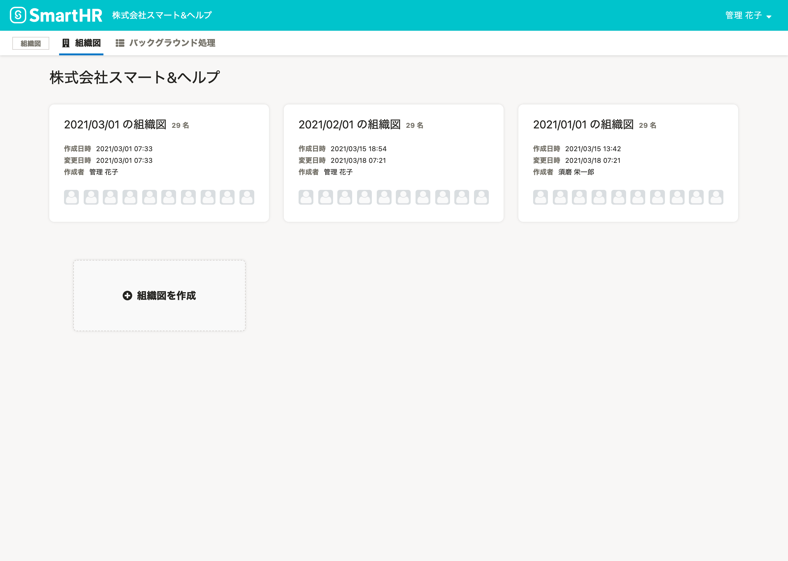

作成済みの組織図に、最新のデータを反映する手順を説明します。

# 1\. ［組織図操作  ］から、［部署と従業員情報を同期］をクリック

組織図名の右側にある **［組織図操作  ］** をクリックし、ドロップダウンリストから **［部署と従業員情報を同期］** をクリックします。

# 2\. メッセージを確認し、［同期］をクリック

 **［部署・従業員情報の同期］** のダイアログで **［同期］** をクリックすると、その時点でのSmartHR基本機能の部署と従業員情報のデータで同期を開始します。

:::alert
### データを同期すると、組織図の内容が上書き保存されます
SmartHR基本機能のデータを同期すると、以下の変更が適用されます。
- SmartHRの[部署マスター](https://knowledge.smarthr.jp/hc/ja/articles/360036111074)から削除した部署は、組織図から削除されます。
- 従業員情報の在籍状況が［退職済み］の従業員は、非表示になります。
- 従業員情報を削除した従業員は、組織図から削除されます。
履歴として過去の組織図を保存しておきたい場合は、組織図を複製して、複製した組織図で部署・従業員情報を同期させてください。複製の操作は、[組織図を複製する](https://knowledge.smarthr.jp/hc/ja/articles/900004721986)を参照してください。
:::

組織図一覧画面に戻り、画面の上部と左下にメッセージが表示されます。

### 同期の進行状況は、バックグラウンド処理一覧画面からも確認できます。

組織図メニューの **［バックグラウンド処理］** をクリックすると、 ** **［バックグラウンド処理］** ** 一覧画面に移動します。

同期が完了すると、ステータスが **［処理中］** から **［完了］** に変わります。

完了後に **［部署・従業員情報の同期］** をクリックすると、バックグラウンド処理の詳細を確認できます。

# 3\. 少し時間をおいて、ブラウザをリロード

少し時間おいてからブラウザをリロードすると、同期が完了しています。

