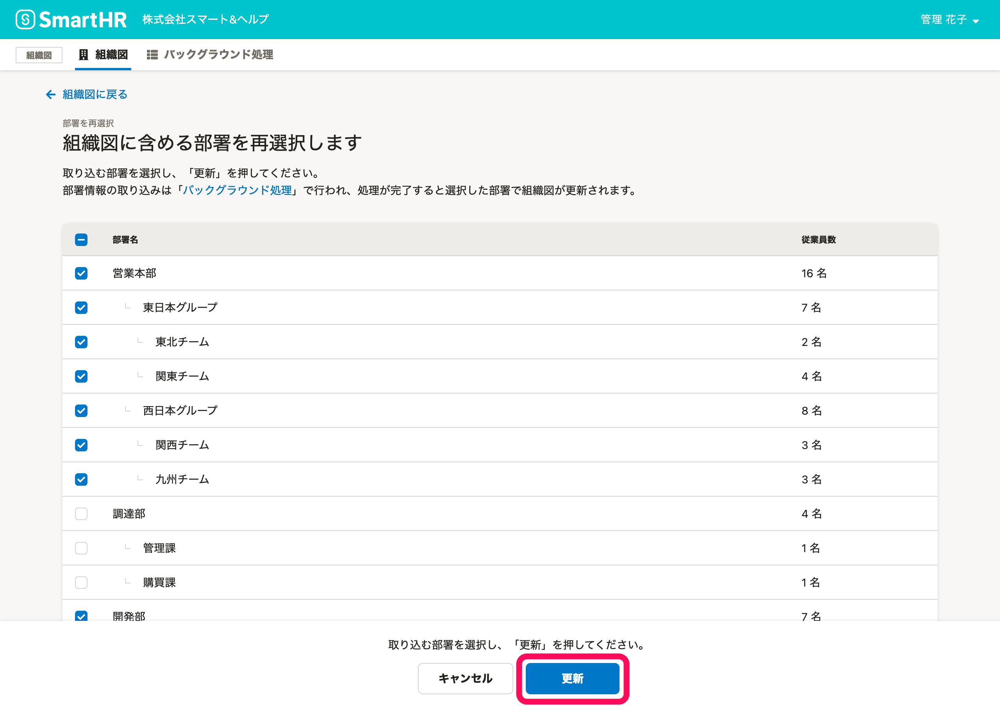
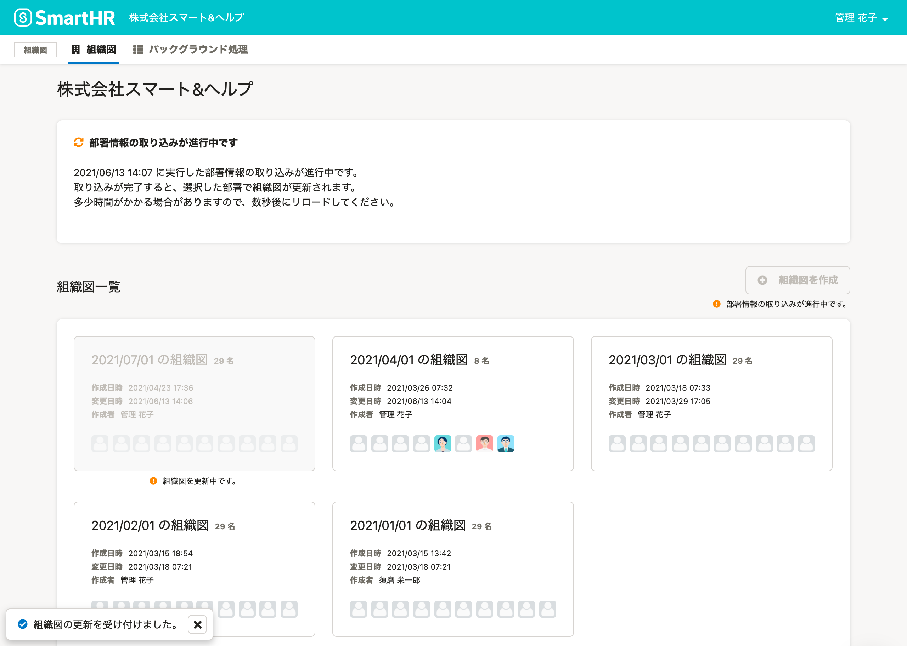
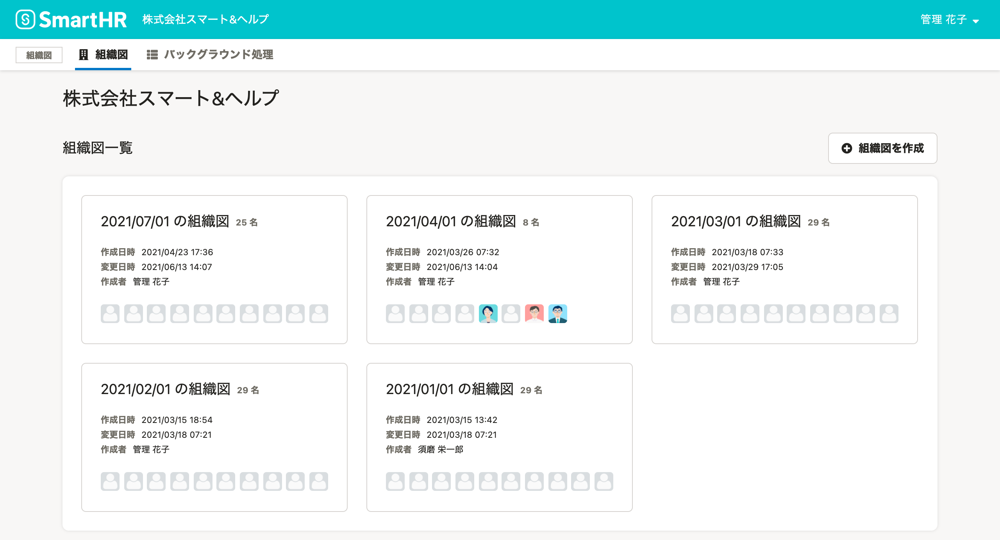

作成済みの組織図から、表示する部署を再選択して組織図を再作成できます。

# 1.［組織図操作  ］から、［部署を再選択］をクリック

組織図名の右側にある **［組織図操作 ］** をクリックし、ドロップダウンリストから **［部署を再選択］** をクリックします。

# 2\. 部署を選択し、［更新］をクリック

組織図で表示したい部署を選び直して **［更新］** をクリックすると、組織図の再作成が開始されます。

:::alert
### ［部署の再選択］をすると、操作日時点での従業員情報で組織図を再作成します
［部署の再選択］は、既存の組織図を「更新」を押した時点での従業員情報を使って、組織図を再作成する操作です。
- 操作時点で、従業員情報の在籍状況が［退職済み］の従業員は、非表示になります。
- 操作時点で、従業員情報から削除済みの従業員は、組織図から削除されます。
履歴として過去の組織図を保存しておきたい場合は、組織図を複製して、複製した組織図から部署の再選択をしてください。複製の操作は、[組織図を複製する](https://knowledge.smarthr.jp/hc/ja/articles/900004721986)を参照してください。
:::

組織図一覧画面に戻り、画面の上部と左下にメッセージが表示されます。

:::tips
取り込みの進行状況は、 **［バックグラウンド処理］** の一覧画面からも確認できます。
組織図メニューの **［バックグラウンド処理］** をクリックすると、一覧画面に移動します。
:::

# 3\. 少し時間をおいて、ブラウザをリロード

少し時間おいてからブラウザをリロードすると、再選択した部署が組織図に反映されています。

