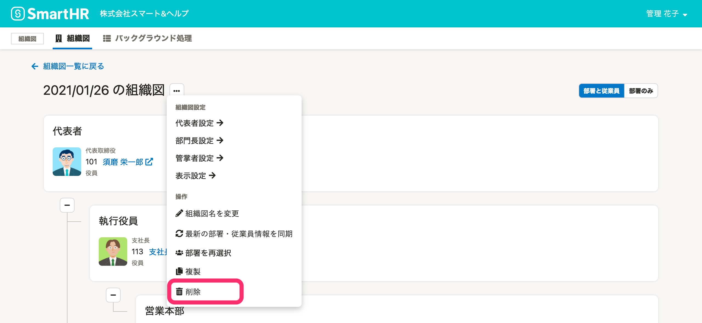
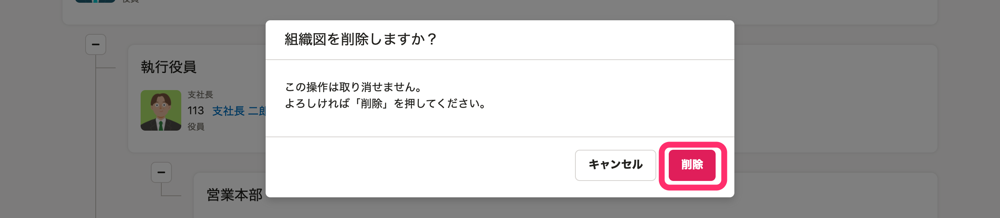
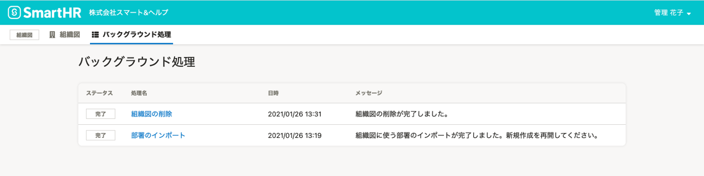
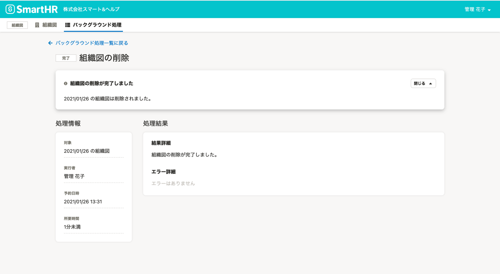

# 1\. 組織図の［…］から、［削除］をクリック

組織図詳細画面の **［…］メニュー** から、 **［削除］** をクリックします。

# 2\. メッセージを確認し、 **［削除］** をクリック

 **「この組織図を削除しますか？」** というメッセージを確認し、［ **削除］** をクリックすると、組織図の削除処理が予約され、トップページに移動します。

### 削除の完了状況は、バックグラウンド処理一覧画面から確認できます。

組織図メニューの **［バックグラウンド処理］** をクリックすると、 **［バックグラウンド処理］** 一覧画面を確認できます。

削除が完了すると、ステータスが **［処理中］** から **［完了］** になります。

 **［バックグラウンド処理］** 一覧画面で［ **組織図の削除］** をクリックすると、バックグラウンド処理の詳細を確認できます。

