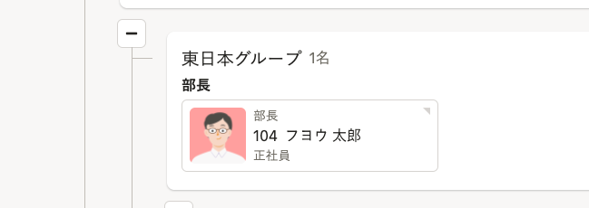

# 1.［組織図一覧］で閲覧したい組織図をクリック

 **［組織図一覧］** で閲覧したい組織図をクリックすると、部署名と従業員カードを表示した状態の組織図画面が表示されます。

:::tips
### 従業員カードには、初期値ではビジネスネーム、役職、雇用形態を表示します
表示設定の初期値では、従業員情報にビジネスネーム氏名が登録されている場合は、ビジネスネームを優先表示します。
また、役職、雇用形態を表示します。

従業員カードの表示を変更したい場合は、［組織図操作 ］の［表示設定 ］で設定します。
詳しくは、 [組織図に表示する従業員情報を設定する](https://knowledge.smarthr.jp/hc/ja/articles/5466650246681)を確認してください。
:::

# 2\. 従業員カードをクリックして、従業員情報を表示

組織図上で従業員カードをクリックすると、従業員情報画面が表示されます。

従業員情報画面に表示する従業員項目は、［組織図操作 ］の［表示設定 ］で設定します。

:::related
[組織図に表示する従業員情報を設定する](https://knowledge.smarthr.jp/hc/ja/articles/5466650246681)
:::

# ［−］をクリックして、配下の部署を非表示にする

部署の左下にある **［−］** をクリックすると、配下の部署が非表示になり **［＋］** が表示されます。

## ［＋］をクリックして、配下の部署を表示

配下の部署が非表示になっている時は、 **［＋］** が表示されます。

 **［＋］** をクリックすると、非表示になっていた部署が表示されます。

# 部署のみの組織図を閲覧する

組織図の右上、 **\[部署のみ\]** をクリックすると、部署のみの表示に切り替わります。
