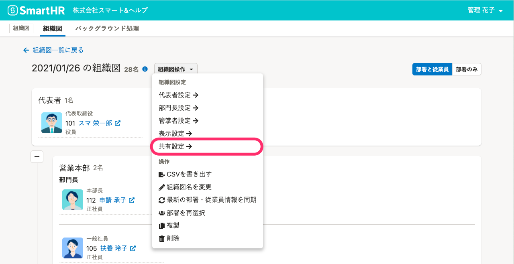
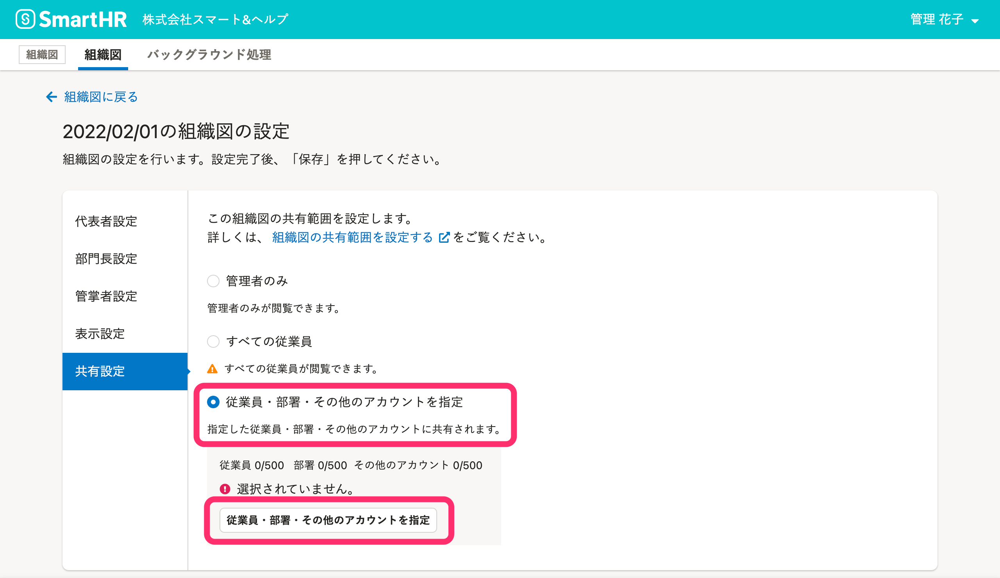
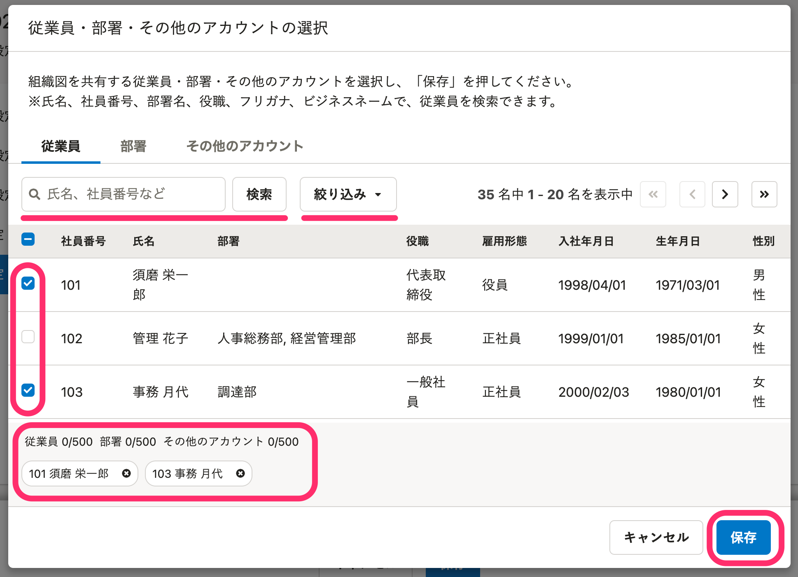
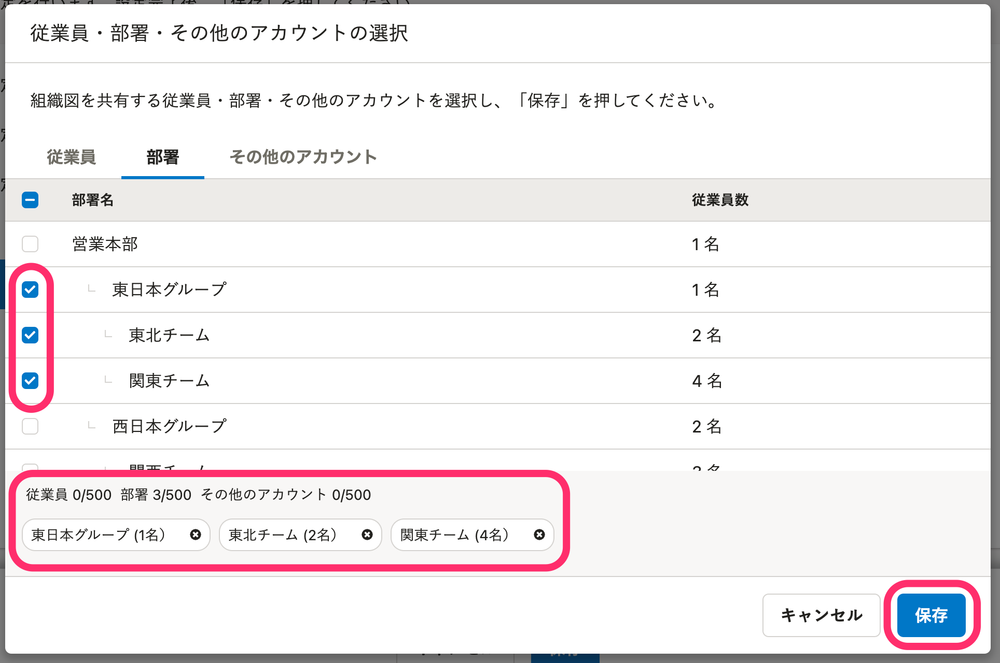
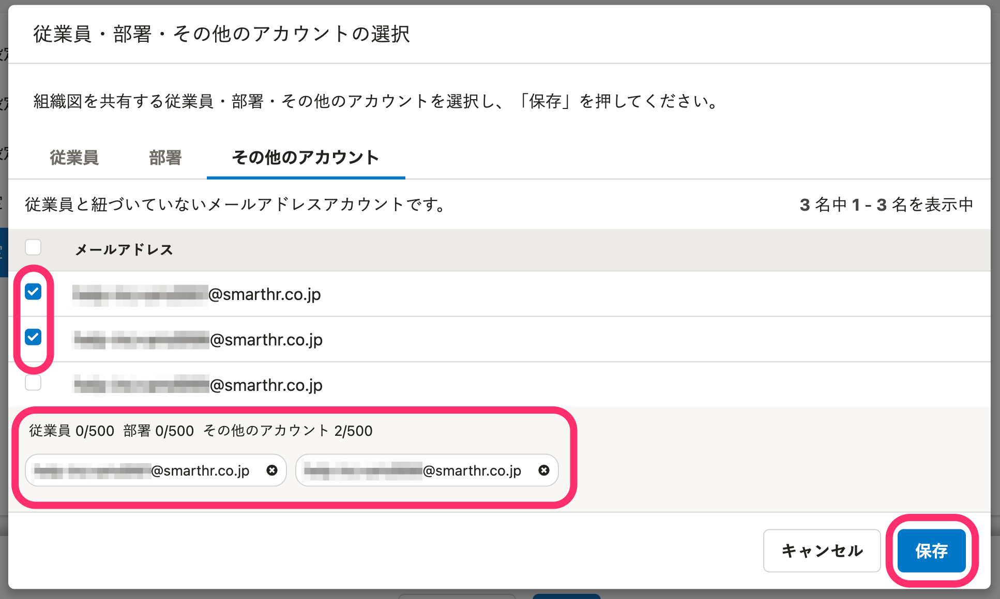

組織図の共有設定を使うと、管理者以外も組織図を閲覧できるようになります。

 **［組織図の設定］** 画面で、共有範囲を変更する手順を説明します。

# 組織図の共有設定とは？

 **［組織図の設定］** 画面の **［共有設定］** では、作成した組織図を閲覧できる従業員やアカウントを指定できます。

組織図の名前の右にある **［組織図操作   ］** をクリックして、ドロップダウンリストから **［共有設定  ］** をクリックすると、共有範囲の設定画面が表示されます。

# 設定できる組織図の共有範囲の指定方法

共有範囲の指定方法は、以下の5通りあります。

1.  管理者のみ
2.  すべての従業員
3.  共有する従業員を指定する
4.  共有する部署を指定する
5.  共有するアカウントを指定する

:::tips
## 1つの組織図に対して、複数の指定方法を組み合わせられます
共有範囲の指定は、1つの組織図に対して複数の方法を組み合わせて設定できます。
指定方法を組み合わせて、さまざまな条件で組織図を共有できます。
### 指定した部署の従業員と、該当部署に所属していない管理職にも共有したい場合
ある部署の従業員とその部署に所属していない管理職に共有する場合は、部署指定と従業員指定を使ってください。
:::

# 管理者のみに組織図を共有する

## ［管理者のみ］を選択し、［保存］をクリック

 **［共有設定］** 画面で、 **［管理者のみ］** を選択し、 **［保存］** をクリックします。

# すべての従業員に組織図を共有する

## ［すべての従業員］を選択し、［保存］をクリック

 **［共有設定］** 画面で、 **［すべての従業員］** を選択し、 **［保存］** をクリックします。

:::alert
以下の従業員は **［すべての従業員］** には含まれないため、**組織図を閲覧できません**。
- 在籍状況が「**退職済み**」の従業員
- **退職者権限のアカウント**に紐づけられている従業員
:::

# 従業員を指定して組織図を共有する

組織図を共有する範囲を従業員ごとに選択して、最大500人までに共有できます。

500人を超える従業員に組織図を共有したい場合は、部署を指定して共有してください。

## 1\. ［従業員・部署・その他のアカウントを指定］を選択し、［従業員・部署・その他のアカウントを指定］をクリック

 **［共有設定］** 画面で、 **［従業員・部署・その他のアカウントを指定］** を選択し、 **［従業員・部署・その他のアカウントを指定］** ボタンをクリックすると **［従業員・部署・その他のアカウント**  **の選択］** 画面が表示されます。

## 2\. 従業員を氏名、役職、雇用形態などから検索し、チェックを入れる

 **［従業員・部署・その他のアカウントの選択］** 画面で、 **［従業員］** タブを選択します。

組織図を共有したい従業員にチェックを入れ、 **［保存］** をクリックして、 **［従業員・部署・その他のアカウント**  **の選択］** 画面を閉じます。

 **［検索］** ：氏名、社員番号、部署名、役職、フリガナ、ビジネスネームで、従業員を検索できます。

 **［絞り込み］** ：入社年月日、生年月日、性別、雇用形態で、従業員を絞り込めます。

:::alert
以下の従業員は共有範囲に含められていても、実際には**組織図を閲覧できません**。
- 在籍状況が「退職済み」に変更された従業員
- 紐づけられているアカウントの権限が「 **退職者」** に変更された従業員
:::

## 3\. ［保存］をクリックして共有設定を反映する

 **［組織図の設定］** 画面下の **［保存］** をクリックすると、組織図画面に切り替わります。

# 部署を指定して組織図を共有する

組織図を共有する範囲を部署ごとに選択して、最大500の部署に、組織図を共有できます。

## 1\. ［従業員・部署・その他のアカウントを指定］を選択し、［従業員・部署・その他のアカウントを指定］をクリック

 **［共有設定］** 画面で、 **［従業員・部署・その他のアカウントを指定］** を選択し、 **［従業員・部署・その他のアカウントを指定］** ボタンをクリックすると **［従業員・部署・その他のアカウント**  **の選択］** 画面が表示されます。

## 2\. 部署にチェックを入れる

 **［従業員・部署・その他のアカウントの選択］** 画面で、 **［部署］** タブを選択します。

組織図を共有したい部署にチェックを入れ、 **［保存］** をクリックして、 **［従業員・部署・その他のアカウント**  **の選択］** 画面を閉じます。

## 3\. ［保存］をクリックして共有設定を反映する

 **［組織図の設定］** 画面下の **［保存］** をクリックすると、組織図画面に切り替わります。

# 従業員情報に紐づけられていないアカウントを指定して組織図を共有する

組織図を共有する範囲を従業員情報に紐づいていないアカウントを選択して、最大500人までに共有できます。

## 1\. ［従業員・部署・その他のアカウントを指定］を選択し、［従業員・部署・その他のアカウントを指定］をクリック

 **［共有設定］** 画面で、 **［従業員・部署・その他のアカウントを指定］** を選択し、 **［従業員・部署・その他のアカウントを指定］** ボタンをクリックすると **［従業員・部署・その他のアカウント**  **の選択］** 画面が表示されます。

## 2\. 部署にチェックを入れる

 **［従業員・部署・その他のアカウントの選択］** 画面で、 **［その他のアカウント］** タブを選択します。

組織図を共有したいメールアドレスアカウントにチェックを入れ、 **［保存］** をクリックして、 **［従業員・部署・その他のアカウント**  **の選択］** 画面を閉じます。

## 3\. ［保存］をクリックして共有設定を反映する

 **［組織図の設定］** 画面下の **［保存］** をクリックすると、組織図画面に切り替わります。
