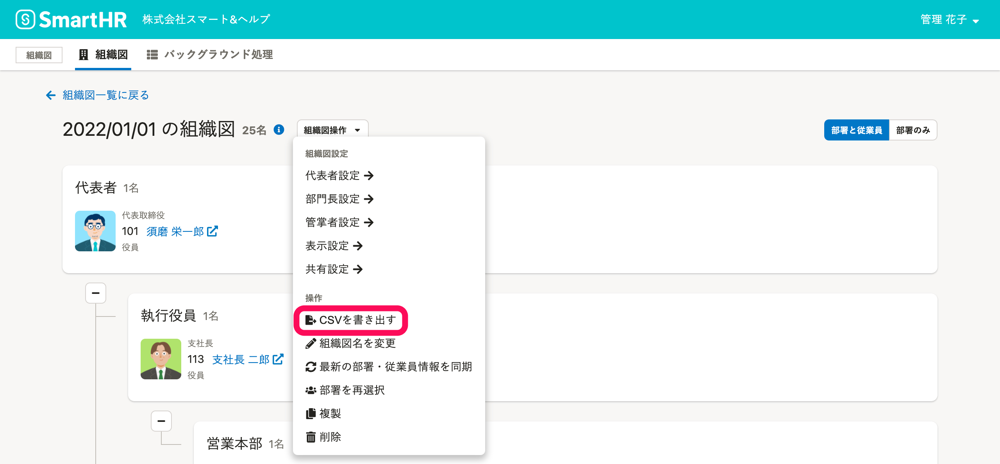
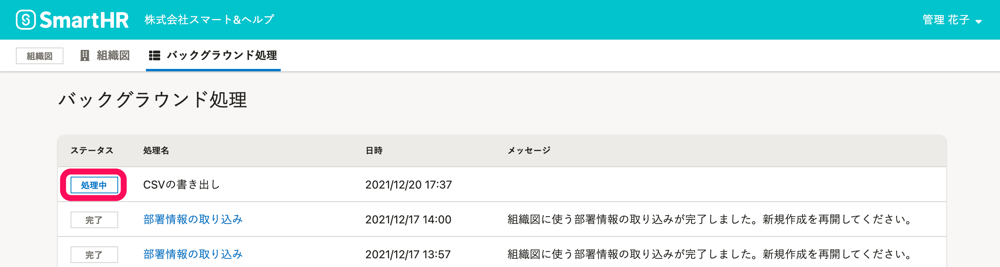
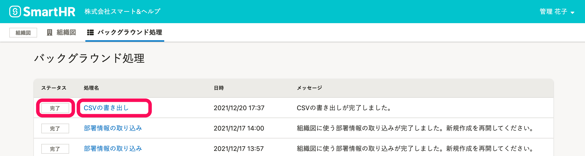
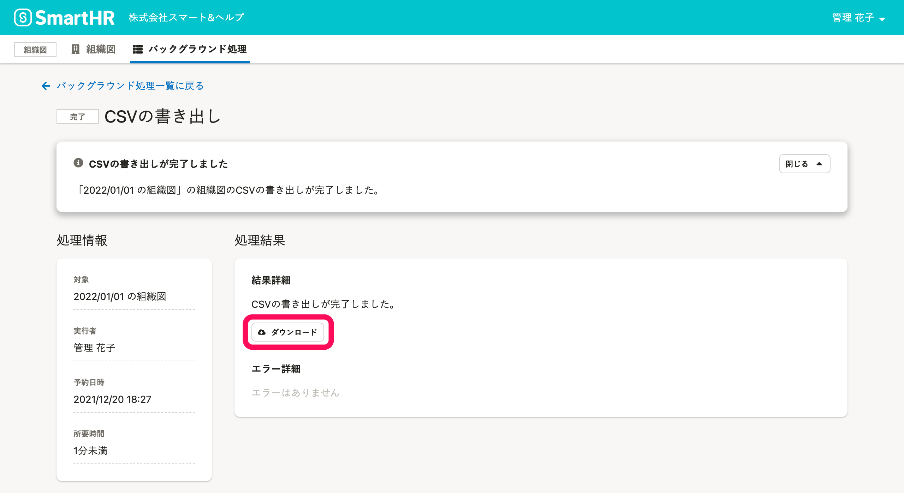

# 1.［CSVを書き出す］をクリック

組織図名の右側にある **［組織図操作  ］** をクリックし、ドロップダウンリストから **［CSVを書き出す］** をクリックします。

# 2\. 確認画面で［書き出し］をクリック

確認画面で **［書き出し］** をクリックすると、組織図の書き出し処理が始まります。

# 3.［バックグラウンド処理］をクリック

確認画面で **［バックグラウンド処理］** をクリックして、バックグラウンド処理一覧画面に移動します。

:::tips
バックグラウンド処理一覧画面には、組織図メニューの **［バックグラウンド処理］** からも移動できます。

:::

# 4.［CSVの書き出し］をクリックして［ダウンロード］をクリック

バックグラウンド処理一覧画面で **［ステータス］** が **［処理中］** の場合、しばらく時間をおいて画面を再読み込みしてください。

CSVファイルの作成に時間がかかる場合があります。

 **［ステータス］** が **［完了］** になっていることを確認し、 **［CSVの書き出し］** をクリックします。

バックグラウンド処理詳細画面で **［処理結果］** の **［ダウンロード］** をクリックして、CSV形式の組織図をダウンロードします。

