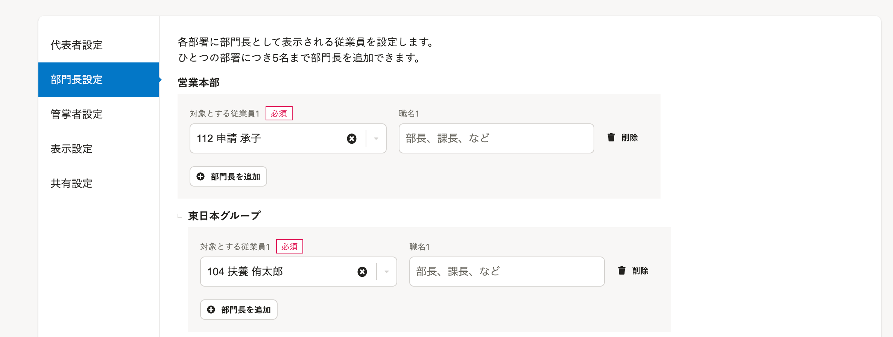
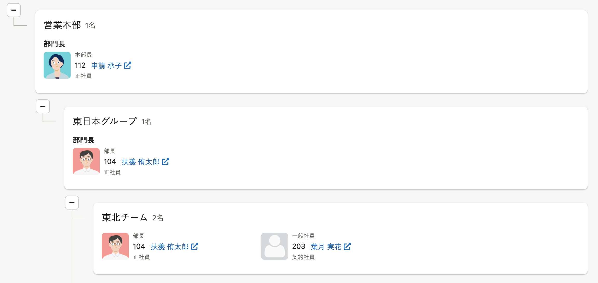
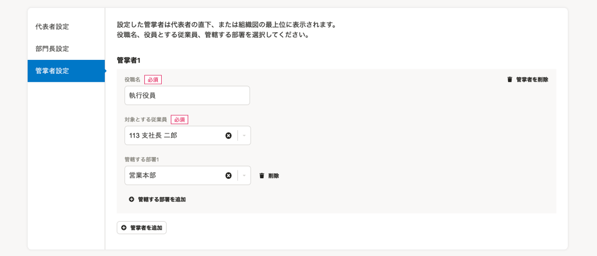
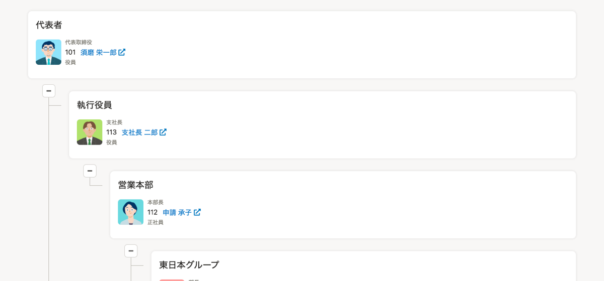
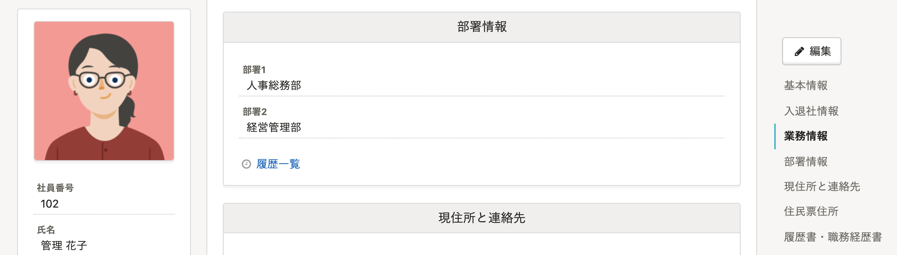
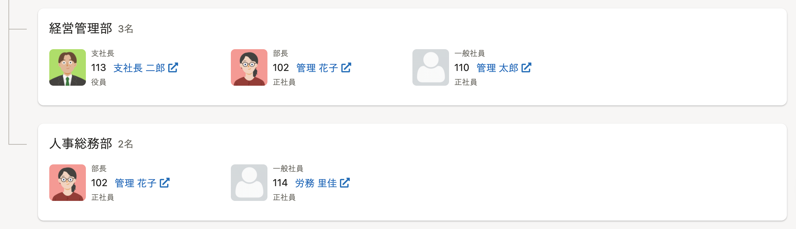

# Q. 部門長とは？

## A. 部門の責任者、マネージャーのことです。

部長や課長など、各部門の責任者。

部門長として設定すると、組織図上で氏名の横に **［部門長］** と表示されます。

### 部門長設定と組織図での見え方

# Q. 管掌者とは？

## A. 部門を管掌する役職のことです。

チーフオフィサーなど、部門の最高責任者。企業によっては執行役員とも表記されます。

管掌者は代表者の直下、または組織図の最上位に表示され、配下に管轄する部署を表示します。

### 管掌者設定と組織図での見え方

:::related
[組織図の設定を変更する](https://knowledge.smarthr.jp/hc/ja/articles/1500002013222)
:::

# Q. 兼務はどのように扱われますか？

## A. 部署情報に登録されているすべての部署に表示されます。

部署１、部署２、部署３、 従業員情報に登録済みのすべての部署に表示されます。

#### 部署1、部署2に情報が登録されている場合

従業員情報画面

組織図画面

# Q. 組織図で表示される氏名をビジネスネームに変更できますか？

## A. 変更できます。

2021年3月16日（火）の機能改善により、従業員名の表示を本名からビジネスネームに変更できるようになりました。

操作方法は、[組織図の設定を変更する](https://knowledge.smarthr.jp/hc/ja/articles/1500002013222#toc--2)をご覧ください。

# Q. 入社前（入社年月日が未来の日付）の従業員は、組織図に表示されますか？

## A. 表示されません。

2021年12月16日（木）の機能改善により、入社前（入社年月日が未来の日付）の従業員は、組織図に表示されなくなりました。
