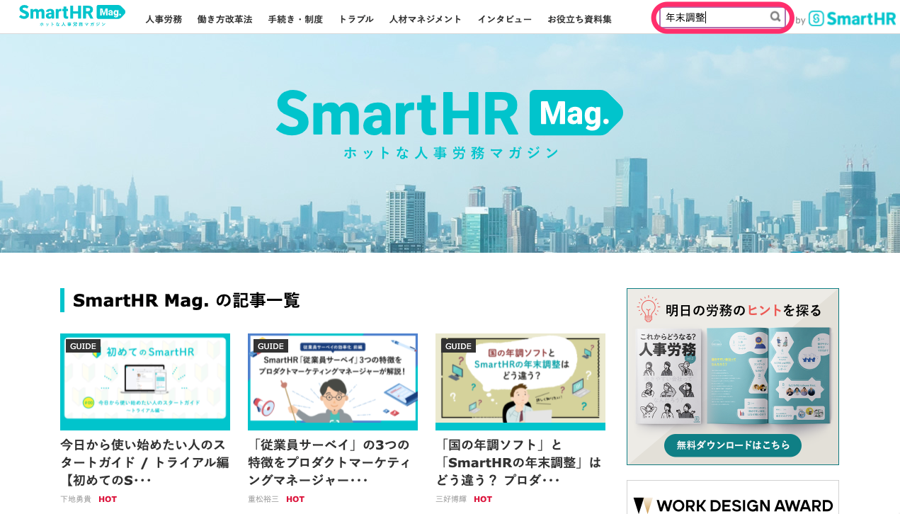
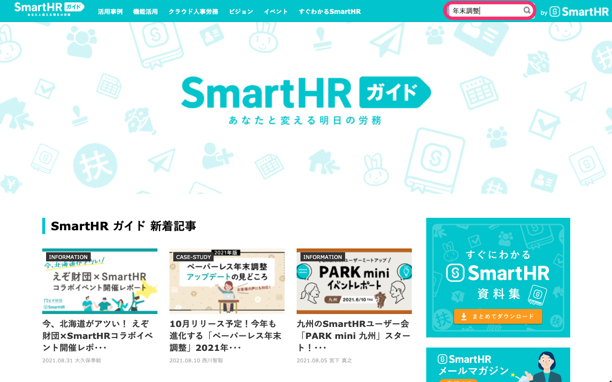
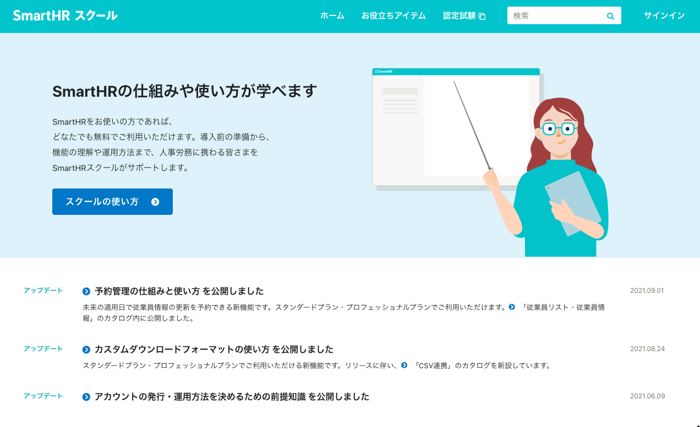

:::alert
当ページで案内しているSmartHRの年末調整機能の内容は、2021年（令和3年）版のものです。
2022年（令和4年）版の年末調整機能の公開時期は秋頃を予定しています。
なお、画面や文言、一部機能は変更になる可能性があります。
公開時期が決まり次第、[アップデート情報](https://smarthr.jp/update)でお知らせします。
:::

年末調整機能に関する管理者向け・従業員向けのすべてのヘルプページのリンクと、年末調整の理解を深めるお役立ちコンテンツを紹介します。

操作につまずいたとき、年末調整機能をより活用する方法が知りたいときに、辞書がわりにお使いください。

年末調整機能の利用にあたり、準備から実施まで、主な工程は下記のとおりです。

1.  [年末調整に必要な従業員情報を整備する](https://knowledge.smarthr.jp/hc/ja/articles/360035370473)
2.  [年末調整の対象となる従業員を確認する](https://knowledge.smarthr.jp/hc/ja/articles/360035370493)
3.  [アンケート画面のヒントを追加・編集する](https://knowledge.smarthr.jp/hc/ja/articles/360034870854)
4.  [年末調整を依頼する](https://knowledge.smarthr.jp/hc/ja/articles/360035370313)
5.  [従業員から提出された年末調整を確認する](https://knowledge.smarthr.jp/hc/ja/articles/360034870254)

ヘルプページは「準備・設定」「依頼グループの編集」など、年末調整の工程ごと（ヘルプセンターのセクションごと）に並んでいます。

# 管理者向けヘルプページ目次

## はじめに

SmartHRの年末調整機能の利用にあたっての流れなどを案内するページを用意しています。

| **ページタイトル** | **概要** |
| --- | --- |
| [年末調整機能のはじめかた（目次）](https://knowledge.smarthr.jp/hc/ja/articles/360035370013) | 当ページ |
| [年末調整とは](https://knowledge.smarthr.jp/hc/ja/articles/360051927554) | 年末調整の概要をはじめ、令和3年の改正内容、SmartHRの年末調整機能を使って効率化できるポイントを紹介 |
| [年末調整機能2021年版のカイゼン内容](https://knowledge.smarthr.jp/hc/ja/articles/360035369993) | 2021年版の新機能および、2020年版からカイゼンした機能 |
| [年末調整の「紙」の申告書類を不要とする](https://knowledge.smarthr.jp/hc/ja/articles/360034870894) |   年末調整に必要な書類を電子データで申告する方法と申告書の種類  **2021年4月1日にこの申請書は廃止され、年末調整の申告書を電子化するための事前手続きが不要となりました。**   |
| [「給与所得者の基礎控除申告書 兼 給与所得者の配偶者控除等申告書 兼 所得金額調整控除申告書」への合計所得金額の表示仕様](https://knowledge.smarthr.jp/hc/ja/articles/360056738313) | 合計所得金額の見積額の表示仕様とその背景、仕様の対象外となるケース |

## 所得金額調整控除にまつわる注意点

所得金額調整控除の申請にあたってのSmartHRご利用上の注意点を案内しています。

| **ページタイトル** | **概要** |
| --- | --- |
| [SmartHRで作成した所得金額調整控除申告書の「他の所得者が控除を受ける扶養親族」について注意点と対処法](https://knowledge.smarthr.jp/hc/ja/articles/360055283073) | 所得金額調整控除申告書に記載する「他の所得者が控除を受ける扶養親族」について、SmartHRの仕様上、従業員による記入や押印が必要になる場合の注意点と対処法 |

## 住宅ローン控除にまつわる注意点

居住面積の記載がない住宅ローン控除申告書をお持ちの従業員さまに案内していただきたい内容と、CSVファイル出力時の注意点を案内しています。

| **ページタイトル** | **概要** |
| --- | --- |
| [住宅ローン控除申告書の作成対象外となる条件](https://knowledge.smarthr.jp/hc/ja/articles/900005544386) | SmartHRの年末調整機能で、住宅ローン控除申告書の作成対象外となる条件 |
| [2021年版 住宅ローン控除申告書の「年間所得の見積額」欄の表示仕様の変更](https://knowledge.smarthr.jp/hc/ja/articles/360056391814) | 2021年版での「年間所得の見積額」欄の表示仕様について |

## 画面の使い方

年末調整機能の各画面の概要や使い方を案内するページを用意しています。

| **ページタイトル** | **概要** |
| --- | --- |
| [年末調整機能の使い方](https://knowledge.smarthr.jp/hc/ja/articles/4405495774489) | 年末調整機能の使い方と、各使い方ページへの目次 |
| [年末調整ダッシュボード画面の使い方](https://knowledge.smarthr.jp/hc/ja/articles/4405483913497) | 年末調整ダッシュボード画面の概要 |
| [対象従業員設定画面の使い方](https://knowledge.smarthr.jp/hc/ja/articles/4405495781785) | 対象従業員設定画面の概要 |
| [依頼一覧画面の使い方](https://knowledge.smarthr.jp/hc/ja/articles/4405866743705) | 依頼一覧画面の概要 |
| [書類一覧画面の使い方](https://knowledge.smarthr.jp/hc/ja/articles/4405873195801) | 書類一覧画面の概要 |
| [前職情報一覧画面の使い方](https://knowledge.smarthr.jp/hc/ja/articles/4405866758297) | 前職情報一覧画面の概要 |
| [依頼詳細画面の使い方](https://knowledge.smarthr.jp/hc/ja/articles/4405483927449) | 依頼詳細画面の概要 |
| [収集情報画面の使い方](https://knowledge.smarthr.jp/hc/ja/articles/4405483932825) | 収集情報画面の概要 |
| [バックグラウンド処理画面の使い方](https://knowledge.smarthr.jp/hc/ja/articles/4405483938073) | バックグラウンド処理画面の概要 |

## 準備・設定

SmartHRの年末調整機能を利用するにあたり、従業員情報の整備、アンケート画面のヒント編集など、事前準備・設定をするためのページを用意しています。

| **ページタイトル** | **概要** |
| --- | --- |
| [年末調整のテストを行なうには？](https://knowledge.smarthr.jp/hc/ja/articles/360037788913) | 年末調整の大まかな流れを確認するための、テストの作成方法 |
| [アンケート画面のヒントを追加・編集する](https://knowledge.smarthr.jp/hc/ja/articles/360034870854) | 従業員に表示される「年末調整のアンケート画面」のヒント欄の追加・編集方法 |
| [年末調整に必要な従業員情報を整備する](https://knowledge.smarthr.jp/hc/ja/articles/360035370473) | 年末調整の依頼をするために、従業員情報が揃っているか、SmartHRにログインができるかを確認する方法 |
| [差分リストを活用するための事前準備](https://knowledge.smarthr.jp/hc/ja/articles/4405706899353) |   差分リストを活用するための事前準備   |
| [年末調整の権限を設定する](https://knowledge.smarthr.jp/hc/ja/articles/360034870874) |   年末調整の権限の設定方法   |
| [年末調整の書類に反映される事業所情報を確認する](https://knowledge.smarthr.jp/hc/ja/articles/360035342214) |   会社情報・事業所情報の確認方法と、依頼グループ作成後に会社情報・事業所情報を変更した場合の同期方法   |
| [年末調整の通知設定をする](https://knowledge.smarthr.jp/hc/ja/articles/360053201294) |   年末調整に進捗があった場合の通知を設定する方法   |
| [年末調整の再通知と締切を設定する](https://knowledge.smarthr.jp/hc/ja/articles/360037373434) | 依頼グループごとに設定できる、未提出の従業員への再通知設定や提出締切日の設定方法 |
| [年末調整の書類に印字する住所の設定をする](https://knowledge.smarthr.jp/hc/ja/articles/360053201314) |   年末調整機能で作成する申告書に、いつ時点の住所を印字するかを設定する方法   |
| [従業員の年末調整画面に管理者からのお知らせを設定する](https://knowledge.smarthr.jp/hc/ja/articles/360053347974) |   依頼グループごとに設定できる、従業員の年末調整画面に表示する「管理者からのお知らせ」の設定方法   |
| [年末調整機能で昨年分の保険や住宅借入金控除の申告情報を表示する](https://knowledge.smarthr.jp/hc/ja/articles/360035370453) |   前年にSmartHRの年末調整で申請した保険などの情報や住宅借入金控除の申告を表示する条件や、今年から初めてSmartHRを利用する場合の、前年の保険料のCSVファイルをインポートする方法   |
| [団体保険のデータをインポートする](https://knowledge.smarthr.jp/hc/ja/articles/360036159813) |   LINC形式のDATファイルや、損保標準フォーマットのDATファイル、SmartHR形式のCSVファイルを使った団体保険情報の一括インポート方法   |
| [団体保険ファイルのインポートの可否を確認する](https://knowledge.smarthr.jp/hc/ja/articles/360035370353) | 契約している保険会社のDATファイルがインポートに対応しているかの検証方法 |
| [企業型確定拠出年金のデータをインポートする](https://knowledge.smarthr.jp/hc/ja/articles/900004613586) | 企業型確定拠出年金のデータをインポートする方法 |
| [【一覧】年末調整機能で届く通知（メール）の内容](https://knowledge.smarthr.jp/hc/ja/articles/360039321893) |   従業員宛てと管理者宛てに送られる通知の内容と、内容を変更する場合の操作方法   |

## 依頼グループの編集

年末調整を従業員に依頼するために必要な、依頼グループの作成や従業員情報の削除方法等のページを用意しています。

| **ページタイトル** | **概要** |
| --- | --- |
| [年末調整の対象となる従業員を確認する](https://knowledge.smarthr.jp/hc/ja/articles/360035370493) | 年末調整の対象となる従業員を確認する方法 |
| [依頼グループを作成し、従業員を振り分ける](https://knowledge.smarthr.jp/hc/ja/articles/4405215155993) | 依頼グループの作成と、従業員の振り分け方法 |
| [年末調整の依頼グループの設定と変更方法](https://knowledge.smarthr.jp/hc/ja/articles/360038197674) | 年末調整の依頼グループの設定と変更方法 |
| [年末調整の依頼グループを一括で設定する](https://knowledge.smarthr.jp/hc/ja/articles/4403662363161) | 年末調整の依頼グループを一括で設定する方法 |
| [年末調整の依頼グループに従業員を一括で追加する](https://knowledge.smarthr.jp/hc/ja/articles/360056088674) | 年末調整の依頼グループ作成後、CSVファイルを使って依頼グループに従業員を追加する方法 |
| [年末調整の依頼一覧から従業員を削除する](https://knowledge.smarthr.jp/hc/ja/articles/360035370413) | 依頼一覧から従業員を削除する方法 |
| [年末調整の依頼グループを削除する](https://knowledge.smarthr.jp/hc/ja/articles/360037003793) | 年末調整の依頼グループを削除する方法 |
| [従業員の依頼グループを変更する](https://knowledge.smarthr.jp/hc/ja/articles/4405495792665) | 従業員の依頼グループを変更する方法 |
| [年末調整の依頼グループに関するよくある質問](https://knowledge.smarthr.jp/hc/ja/articles/360056509734) | チャットサポートに寄せられる、依頼グループに関する「よくある質問」と回答集 |

## 入力依頼と進捗管理

年末調整を従業員に依頼する方法や、アンケートの回答が揃うまでのステータス管理、操作履歴の確認方法等についてページを用意しています。

| **ページタイトル** | **概要** |
| --- | --- |
| [年末調整を依頼する](https://knowledge.smarthr.jp/hc/ja/articles/360035370313) |   年末調整の依頼方法   |
| [年末調整の依頼を「未依頼」に戻す](https://knowledge.smarthr.jp/hc/ja/articles/360034870774) |   提出依頼を取りやめたり、再度従業員に作成を依頼する場合の、年末調整の依頼を「未依頼」のステータスに戻す方法   |
|   [「対象外候補」ステータスとは](https://knowledge.smarthr.jp/hc/ja/articles/4409251601561)   | 「対象外候補」ステータスの説明 |
|   [「対象外候補」ステータスが表示された従業員への対応](https://knowledge.smarthr.jp/hc/ja/articles/360034870754)   | 「対象外候補」ステータスが表示された従業員への対応方法 |
| [収集情報を直接編集する](https://knowledge.smarthr.jp/hc/ja/articles/360035657114) |   管理者が収集情報を直接編集する方法   |
| [個別の従業員に年末調整依頼の再通知をする](https://knowledge.smarthr.jp/hc/ja/articles/360035370273) | 年末調整依頼の再通知をする方法 |
| [従業員を年末調整の「対象外」にする](https://knowledge.smarthr.jp/hc/ja/articles/360039790773) | 従業員を年末調整の「対象外」にする方法 |
| [年末調整のステータスを「確定」した際の従業員への通知設定](https://knowledge.smarthr.jp/hc/ja/articles/360035370373) |   年末調整のステータスを「確定」にした際、従業員へ通知する方法   |
| [年末調整の操作履歴を確認する](https://knowledge.smarthr.jp/hc/ja/articles/360037875833) |   年末調整を依頼した従業員ごとの操作履歴を確認する方法   |
| [年末調整のアンケート回答履歴を確認する](https://knowledge.smarthr.jp/hc/ja/articles/360053297094) | 年末調整のアンケート回答履歴の確認方法 |
| [【一覧】年末調整のステータス](https://knowledge.smarthr.jp/hc/ja/articles/360034870834)  |   年末調整の依頼一覧・書類一覧・前職一覧画面に表示されるステータスを説明   |
| [従業員から提出予定のある原本を確認する](https://knowledge.smarthr.jp/hc/ja/articles/360054094953) |   従業員の「提出が必要な原本一覧」CSVファイルをダウンロードする方法と、CSVファイルの項目名とその内容を説明   |
| [書類作成更新日時リストをダウンロードする](https://knowledge.smarthr.jp/hc/ja/articles/360054928774)  |   年末調整の「書類作成更新日時リスト」CSVファイルをダウンロードする方法と、CSVファイルの項目名とその内容を説明   |
| [特定の依頼グループの依頼状況一覧をダウンロードする](https://knowledge.smarthr.jp/hc/ja/articles/360034870814) | 依頼一覧画面に表示されるステータスや作成書類などの情報を、CSVファイルでダウンロードする方法 |
| [情報一括ダウンロードの使い方](https://knowledge.smarthr.jp/hc/ja/articles/4405396080025) |   すベての依頼グループを対象にした、データの一括ダウンロード方法   |
| [依頼一覧から書類または前職情報の状態で依頼を絞り込む](https://knowledge.smarthr.jp/hc/ja/articles/4405432019481) | 依頼一覧から書類または前職情報の状態で依頼を絞り込む方法 |
| [依頼状況と確認状況を一括で変更する](https://knowledge.smarthr.jp/hc/ja/articles/900006685963) | 依頼状況と確認状況を一括で変更する方法 |

## 提出内容の確認

年末調整の内容を確認する方法や、書類や家族情報のダウンロード方法等についてページを用意しています。

| **ページタイトル** | **概要** |
| --- | --- |
| [従業員から提出された年末調整を確認する](https://knowledge.smarthr.jp/hc/ja/articles/360034870254) |   従業員から年末調整が提出されたあとから確認を終えるまでの工程を説明   |
| [従業員から提出された年末調整の書類をまとめて確認する](https://knowledge.smarthr.jp/hc/ja/articles/360055393313) |   選択した書類を同じ画面上で連続して確認できる機能の使い方を説明   |
| [差分リストを使って「給与所得者の扶養控除等 （異動）申告書」の内容を確認する](https://knowledge.smarthr.jp/hc/ja/articles/4405540222873) |   差分リストを使用して「給与所得者の扶養控除等 （異動）申告書」を確認する方法   |
| [アンケート回答に応じて年末調整書類が作成される条件](https://knowledge.smarthr.jp/hc/ja/articles/4405093044249)  |   アンケートの回答後に書類が作成されていない場合に、従業員がどのように回答していると書類が作成される条件を説明   |
| [書類のダブルチェック機能を使う](https://knowledge.smarthr.jp/hc/ja/articles/360054031913) |   年末調整の書類チェックを2名体制で進める方法   |
| [年末調整を確認する際に管理者メモを使う](https://knowledge.smarthr.jp/hc/ja/articles/360036159354) |   年末調整の依頼一覧で、従業員への依頼ごとに管理者メモを残す方法   |
| [提出された書類を従業員に差し戻す](https://knowledge.smarthr.jp/hc/ja/articles/360053238834) |   修正が必要な書類だけを従業員に差し戻す方法   |
| [従業員に年末調整の修正依頼を出す](https://knowledge.smarthr.jp/hc/ja/articles/360057982273)  |   年末調整のアンケートに生命保険情報や住宅ローンの情報の入力がなく、「給与所得者の保険料控除等申告書」や「給与所得者の（特定増改築等）住宅借入金等特別控除申告書」が作成されなかった場合に修正を依頼する方法   |
| [所得金額調整控除額（年金等）と特定支出控除の適用がある場合の注意点](https://knowledge.smarthr.jp/hc/ja/articles/360055839553) |   所得金額調整控除額（年金等）と特定支出控除の適用があり、確定申告を前提とする2つのケースに対する注意点  ※該当する従業員がいる場合には、従業員自身で確定申告をするよう案内が必要です   |
| [特定の依頼グループの年末調整書類をダウンロードする](https://knowledge.smarthr.jp/hc/ja/articles/360038374633) | 年末調整機能で作成した各種書類を、依頼グループごとにPDFで一括ダウンロードする方法 |
| [年末調整で入力された家族情報をダウンロードする](https://knowledge.smarthr.jp/hc/ja/articles/360034870714) |   年末調整のアンケートで追加もしくは変更された税扶養の家族情報をSmartHRに取り込むためのCSVファイルをダウンロードする方法   |
| [差し戻し・修正依頼時の注意点](https://knowledge.smarthr.jp/hc/ja/articles/4404346639001) |   年末調整機能で従業員に差し戻し・修正依頼をする際の注意点を案内   |

## 事後処理

年末調整の確認完了後、他サービスと連携する場合や、作成した書類の削除方法等についてページを用意しています。

| **ページタイトル** | **概要** |
| --- | --- |
| [差分リストをダウンロードする](https://knowledge.smarthr.jp/hc/ja/articles/4405171704985) |   差分リストのダウンロード方法   |
| [年末調整の差分リストとは？](https://knowledge.smarthr.jp/hc/ja/articles/360035370213) |   年末調整で入力された内容と、従業員情報に登録されている内容に差異がある場合の内容を確認する方法   |
| [Q. 差分リストを使って行政手続きの対象者を抽出できますか？](https://knowledge.smarthr.jp/hc/ja/articles/4405483960345) |   差分リストを使用して行政手続きの対象者を抽出する方法   |
| [特定の依頼グループの収集情報をダウンロードする](https://knowledge.smarthr.jp/hc/ja/articles/360055844513) |   年末調整のアンケートで収集した情報のCSVファイルをダウンロードする方法   |
| [「生命保険等証明書原本の台紙」の使用方法](https://knowledge.smarthr.jp/hc/ja/articles/4404550207769) |   「生命保険等証明書原本の台紙」の使用方法   |
| [年末調整のデータを給与奉行形式でダウンロードする](https://knowledge.smarthr.jp/hc/ja/articles/360035370233) |   SmartHRの年末調整機能で収集した情報を、給与奉行iシリーズのデータ受入形式に対応した項目名（コード）でダウンロードする方法   |
| [年末調整の業務終了後に、SmartHRに従業員情報と家族情報を反映する方法と給与計算ソフトとの連携方法](https://knowledge.smarthr.jp/hc/ja/articles/4405495798937) |   年末調整の業務終了後、収集したデータをSmartHRに反映する方法と給与計算ソフトとの連携方法   |
| [年末調整の結果を、家族情報一括更新用CSVでSmartHRに取り込む際の注意事項](https://knowledge.smarthr.jp/hc/ja/articles/360039794053) |   家族情報一括更新用CSVファイルをSmartHRにインポートする際の注意事項   |
| [マネーフォワード クラウド年末調整に年末調整結果を取り込む際の注意事項](https://knowledge.smarthr.jp/hc/ja/articles/4409171668633) |   マネーフォワード クラウド年末調整に年末調整結果を取り込む際の注意事項   |
| [年末調整で作成された書類を削除する](https://knowledge.smarthr.jp/hc/ja/articles/360040698513) |   年末調整で作成された書類を削除する方法   |

## よくある質問

チャットサポートへのお問い合わせが多かった内容について、Q&A形式のページを用意しています。

| **ページタイトル** | **概要** |
| --- | --- |
| [年末調整のマイナンバーに関するよくある質問](https://knowledge.smarthr.jp/hc/ja/articles/4406963819033) |   年末調整のマイナンバーに関するよくある質問   |
| [差分リストに関するよくある質問](https://knowledge.smarthr.jp/hc/ja/articles/4408904860953) |   差分リストに関するよくある質問   |
| [年末調整機能で「よくあるエラー」のトラブルシューティング](https://knowledge.smarthr.jp/hc/ja/articles/4405484014617)  |   エラーメッセージが表示された場合の対応方法   |
|   [Q. 令和2年分から始まった「年末調整手続の電子化に向けた取組」にSmartHRは対応していますか？](https://knowledge.smarthr.jp/hc/ja/articles/360053382593)   |   令和2年分から始まった「年末調整手続の電子化に向けた取組」との連携について   |
|   [Q. 従業員に「来年の給与所得者の扶養控除等（異動）申告書」を作成してもらうには？](https://knowledge.smarthr.jp/hc/ja/articles/360053489734)   |   今年の収入が2,000万円を超える従業員や、12月入社（翌年給与支給）の従業員に「来年の給与所得者の扶養控除等（異動）申告書」を作成してもらう方法   |
| [Q. 従業員を削除したのに、従業員情報を同期したら再度従業員が追加されてしまった場合は？](https://knowledge.smarthr.jp/hc/ja/articles/360053916713) | 年末調整の対象としたくない従業員を依頼一覧に表示させない方法 |
| [Q. 受付終了日後、従業員に年末調整のアンケートに回答してもらいたい場合は？](https://knowledge.smarthr.jp/hc/ja/articles/360037871974) | 受付終了日を過ぎたあと、従業員に年末調整のアンケートに回答してもらいたい場合の対応方法 |
| [Q. 他の従業員の年末調整画面や、自社とは違う企業の年末調整画面が表示された場合の対処法は？](https://knowledge.smarthr.jp/hc/ja/articles/360035370393) | 従業員から「他の従業員の年末調整画面、または、自社とは違う企業の年末調整画面が表示された」と問い合わせがあった場合の対処法 |
| [Q. 年末調整の依頼グループ作成後に、事業所情報や従業員情報を変更した場合は自動で反映されますか？](https://knowledge.smarthr.jp/hc/ja/articles/360035370173) | 依頼グループを作成した後に、事業所情報や従業員情報を変更した場合の、最新の情報を反映させる方法 |
| [Q. 年末調整の対象従業員を間違って「対象外」にしてしまった場合は？](https://knowledge.smarthr.jp/hc/ja/articles/360058085913) |   対象外を取り消す（表示を消す）方法   |
| [【一覧】年末調整の際に原本の提出が必要なもの](https://knowledge.smarthr.jp/hc/ja/articles/360037153914) |   年末調整のアンケートで該当する回答があった場合、原本の提出が必要なものの一覧   |
| [Q. 年末調整の書類に配偶者が表示されない場合は？](https://knowledge.smarthr.jp/hc/ja/articles/360034870674) |   扶養控除等申告書や配偶者控除等申告書に配偶者の情報が表示される条件   |
| [Q. 年末調整の書類に配偶者以外の扶養家族が表示される条件は？](https://knowledge.smarthr.jp/hc/ja/articles/360034870654) |   扶養控除等申告書に配偶者以外の扶養家族が表示される条件   |
| [Q. 年末調整の書類に寡婦/ひとり親が表示されない場合は？](https://knowledge.smarthr.jp/hc/ja/articles/360039191593) |   扶養控除等申告書に寡婦/ひとり親の情報が表示される条件   |
| [Q. 今年死亡の配偶者の配偶者控除と、寡婦・ひとり親控除の双方適用はできる？](https://knowledge.smarthr.jp/hc/ja/articles/360039263674) |   年末調整で「配偶者控除」と「寡婦控除またはひとり親控除」の双方を適用する方法   |
| [Q. マイナンバー情報を同期して「〜が存在しませんでした」というエラーがでたら？](https://knowledge.smarthr.jp/hc/ja/articles/360037548814) |   年末調整機能でマイナンバー情報を同期した際、「〜が存在しませんでした」とエラーが表示される場合の理由と対応方法   |
| [Q. 前職の源泉徴収票を入手できない場合は？](https://knowledge.smarthr.jp/hc/ja/articles/360035657974) |   年末調整の書類を作らずに、「来年の給与所得者の扶養控除等（異動）申告書」を作成してもらうためのアンケート回答手順   |
| [Q. 年末調整の対象となる人・ならない人とは？](https://knowledge.smarthr.jp/hc/ja/articles/360026106894) |   年末調整の対象となる人・ならない人   |
| [Q. マイナンバーを年末調整の書類に印字できますか？](https://knowledge.smarthr.jp/hc/ja/articles/360037874034) |   マイナンバーの印字設定   |
| [Q. 勤労学生として申告できる学校は？](https://knowledge.smarthr.jp/hc/ja/articles/360026105014) | 給与所得者の扶養控除等（異動）申告書において、勤労学生として申告できる学校 |
| [Q. 依頼グループの並び替えはできますか？](https://knowledge.smarthr.jp/hc/ja/articles/360055630894) | 依頼グループの並び替え方法と表示順にまつわる仕様案内 |
| [Q. 従業員へ年末調整の連絡事項を伝えるのに便利な機能はありますか？](https://knowledge.smarthr.jp/hc/ja/articles/360057803473) | 従業員への連絡に使える3つの機能と、利用例の紹介 |
| [Q. 年末調整の修正依頼と差し戻しの違いは？](https://knowledge.smarthr.jp/hc/ja/articles/4404343461785) | 年末調整の修正依頼と差し戻しの違いを説明 |
| [Q. 年末調整をやり直す（再年調する）には？](https://knowledge.smarthr.jp/hc/ja/articles/1500000131961) | 年末調整をやり直す（再年調する）方法 |
| [【一覧】年末調整に関するよくある質問](https://knowledge.smarthr.jp/hc/ja/articles/360035370153) | チャットサポートに寄せられる「よくある質問」と回答集 |
| [Q. 画面のボタンが押せなくなる、真っ白になる場合は？](https://knowledge.smarthr.jp/hc/ja/articles/360026263013) | スマートフォンでの閲覧時に、画面のボタンが押せなくなる、真っ白になる場合の対処として、リロード（再読込）方法を案内 |
| [年末調整原本書類回収BOXの組み立て方](https://knowledge.smarthr.jp/hc/ja/articles/360038009934) | SmartHRの「年末調整原本書類回収BOX」の組み立て方 |
| [Q. 借入先の金融機関が3つ以上ある場合、どのように対応したらいいですか？](https://knowledge.smarthr.jp/hc/ja/articles/4405483983769) |   住宅ローンの借入先の金融機関が3つ以上ある場合の対応方法   |
| [Q. 従業員による確定申告が必要なケースは？また、対象となった従業員へのSmartHRでの対応は？](https://knowledge.smarthr.jp/hc/ja/articles/4405483994137) |   従業員による確定申告が必要なケースと、SmartHRでの対応方法   |

## CSV凡例

年末調整に関連する様々な情報は、CSVファイルのダウンロードができます。

各種CSVファイルの用途と、ダウンロードしたファイルの項目に関するページを用意しています。

| **ページタイトル** | **概要** |
| --- | --- |
| [【一覧】各CSVファイル項目と年末調整書類の対照表](https://knowledge.smarthr.jp/hc/ja/articles/4408014538393)  |   年末調整機能でダウンロードできるCSVファイルの各項目と、年末調整書類の記載位置の紐付きを説明   |
| [【一覧】年末調整機機能でダウンロードできるCSVファイルと使用例](https://knowledge.smarthr.jp/hc/ja/articles/4405369856281) | 年末調整機機能でダウンロードできるCSVファイルと主な使用例を紹介 |
| [【一覧】今年の本人情報差分リストCSV凡例](https://knowledge.smarthr.jp/hc/ja/articles/4405362292121) | 「今年の本人情報差分リスト」のCSVファイルについて記載の項目名とその内容 |
| [【一覧】今年の扶養親族差分リストCSV凡例](https://knowledge.smarthr.jp/hc/ja/articles/4405362296089) | 「今年の扶養親族差分リスト」のCSVファイルについて記載の項目名とその内容 |
| [【一覧】今年と来年の本人情報差分リストCSV凡例](https://knowledge.smarthr.jp/hc/ja/articles/4408029105817/) | 「今年と来年の本人情報差分リスト」のCSVファイルについて記載の項目名とその内容 |
| [【一覧】今年と来年の扶養親族情報差分リストCSV凡例](https://knowledge.smarthr.jp/hc/ja/articles/4408021570841/) | 「今年と来年の扶養親族差分リスト」のCSVファイルについて記載の項目名とその内容 |
| [【一覧】従業員情報CSV凡例](https://knowledge.smarthr.jp/hc/ja/articles/360055845153)  | 収集情報のうち、「従業員情報」のCSVファイルについて記載の項目名とその内容 |
| [【一覧】前職情報CSV凡例](https://knowledge.smarthr.jp/hc/ja/articles/360035657454) | 収集情報のうち、「前職情報」のCSVファイルについて記載の項目名とその内容 |
| [【一覧】配偶者情報CSV凡例](https://knowledge.smarthr.jp/hc/ja/articles/360055932213) | 収集情報のうち、「配偶者情報」のCSVファイルについて記載の項目名とその内容 |
| [【一覧】扶養家族情報CSV凡例](https://knowledge.smarthr.jp/hc/ja/articles/360054141614) | 収集情報のうち、「扶養家族情報」のCSVファイルについて記載の項目名とその内容 |
| [【一覧】保険料控除情報CSV凡例](https://knowledge.smarthr.jp/hc/ja/articles/360054586574) | 収集情報のうち、「保険料控除情報」のCSVファイルについて記載の項目名とその内容 |
| [【一覧】住宅借入金控除情報CSV凡例](https://knowledge.smarthr.jp/hc/ja/articles/360056627593) | 収集情報のうち、「住宅借入金控除情報」のCSVファイルについて記載の項目名とその内容 |
| [【一覧】すべての申告情報CSV凡例](https://knowledge.smarthr.jp/hc/ja/articles/360056629453) | すべての収集情報から、給与計算にかかわる項目を抜粋している「すべての申告情報」のCSVファイルについて、記載の項目名とその内容 |
| [【一覧】依頼状況一覧CSV凡例](https://knowledge.smarthr.jp/hc/ja/articles/360036159274) | 年末調整の依頼一覧画面に表示されるステータスや原本の状況などが記載された「依頼状況一覧CSV」の項目名とその内容 |
| [【一覧】書類作成更新日時リストCSV凡例](https://knowledge.smarthr.jp/hc/ja/articles/4405791434393) | 依頼グループの書類作成更新日時をまとめた「書類作成更新日時リスト」のCSVファイルについて、記載の項目名とその内容 |
| [【一覧】年末調整の家族情報一括更新用CSV凡例](https://knowledge.smarthr.jp/hc/ja/articles/360056730693)  |   年末調整で収集した家族情報について、SmartHRに登録している家族情報の一括更新に使える「家族情報一括更新用CSV」の項目名とその内容   |
| [【一覧】原本一覧CSV凡例](https://knowledge.smarthr.jp/hc/ja/articles/4405798339865) |   従業員が提出する原本をまとめた「原本一覧」のCSVファイルについて、記載の項目名とその内容   |
| [【一覧】昨年の保険料データCSV凡例](https://knowledge.smarthr.jp/hc/ja/articles/360035370113) | 昨年の保険料データをインポートする際に必要なCSVファイルについて、記載する項目名とその内容 |
| [【一覧】団体保険料データCSV凡例](https://knowledge.smarthr.jp/hc/ja/articles/360035370093) | 団体生保のデータを一括インポートする際に利用する「SmartHR形式のCSVファイル」について、記載する項目名とその内容 |
| [【一覧】企業型確定拠出年金データCSV凡例](https://knowledge.smarthr.jp/hc/ja/articles/360061217434) | 企業型確定拠出年金データをインポートする際に必要なCSVファイルについて、記載する項目名とその内容 |

# 従業員向けヘルプページ目次

従業員が年末調整のアンケートを回答するにあたっての操作等についてページを用意しています。

## 概要

| **ページタイトル** | **概要** |
| --- | --- |
| [従業員が年末調整依頼を受けてから書類提出までの流れ（PCの場合）](https://knowledge.smarthr.jp/hc/ja/articles/360037014354) | PCでの従業員が年末調整の依頼を受けてから、アンケートに答え、管理者へ書類提出を連絡するまでの流れ |
| [従業員が年末調整依頼を受けてから書類提出までの流れ（スマートフォンの場合）](https://knowledge.smarthr.jp/hc/ja/articles/4405556671641) | スマートフォンでの従業員が年末調整の依頼を受けてから、アンケートに答え、管理者へ書類提出を連絡するまでの流れ |
| [あなたの年末調整画面の使い方](https://knowledge.smarthr.jp/hc/ja/articles/4405811371801) | 従業員年末調整ダッシュボードの使い方 |
| [控除の申請内容が従業員の年末調整書類へ表示される条件](https://knowledge.smarthr.jp/hc/ja/articles/360035370033) | 従業員の年末調整書類に、控除の申請内容が表示される条件 |
| [年末調整の用語集](https://knowledge.smarthr.jp/hc/ja/articles/360052694653) | 年末調整に関する用語集 |

## 使い方

| **ページタイトル** | **概要** |
| --- | --- |
| [源泉徴収票を見て前職の情報を入力する](https://knowledge.smarthr.jp/hc/ja/articles/360034870614) | 源泉徴収票の情報を入力する方法 |
| [年末調整機能で生命保険・介護医療保険・個人年金保険の情報を入力する](https://knowledge.smarthr.jp/hc/ja/articles/360034870574) | 生命保険・介護医療保険・個人年金保険の情報を入力する方法 |
| [年末調整のアンケートで重複して表示されている家族情報を削除する](https://knowledge.smarthr.jp/hc/ja/articles/360034870734) | 年末調整のアンケート回答中に、重複して表示される家族情報を削除する方法 |

## よくある質問

チャットサポートへのお問い合わせが多かった内容について、Q&A形式のページを用意しています。

| **ページタイトル** | **概要** |
| --- | --- |
| [Q.年末調整の入力後、必要書類を印刷する方法は？](https://knowledge.smarthr.jp/hc/ja/articles/360037997153) |   年末調整を入力した後、PCで必要書類を印刷する   |
| [Q. 提出した年末調整が差し戻された場合は？](https://knowledge.smarthr.jp/hc/ja/articles/360035370073)  |   差し戻された年末調整の修正〜再提出の手順   |
| [Q. 配偶者控除が適用されていない場合、アンケートはどう修正したらいいですか？](https://knowledge.smarthr.jp/hc/ja/articles/4404573121433) |   配偶者控除が適用されていない場合のアンケート修正方法   |
| [Q. 寡婦・ひとり親控除が適用されていない場合、アンケートはどう修正したらいいですか？](https://knowledge.smarthr.jp/hc/ja/articles/4404565167513) |   寡婦・ひとり親控除が適用されていない場合のアンケート修正方法   |
| [Q. 収入の内訳には何を入力すればいいですか？](https://knowledge.smarthr.jp/hc/ja/articles/4404551726745) |   「事業所得」「雑所得（年金所得を含む）」「配当所得」などの欄に何を入力したらよいかを説明   |
| [Q. 年末調整のアンケートを中断・再開するには？](https://knowledge.smarthr.jp/hc/ja/articles/4404551179417) |   年末調整のアンケート中断・再開方法   |
| [アンケート番号の確認方法](https://knowledge.smarthr.jp/hc/ja/articles/4405495827865) |   年末調整のアンケート番号確認方法   |
| [Q. スマホで年末調整の書類を保存する方法は？](https://knowledge.smarthr.jp/hc/ja/articles/360037880754)  |   スマートフォンに年末調整の書類をPDF形式で保存する方法   |
| [Q. 住宅ローン控除証明書の「ホ欄」が空欄だった場合は？](https://knowledge.smarthr.jp/hc/ja/articles/360038684454)  |   年末調整のための住宅借入金等特別控除証明書（住宅ローン控除申告書）の「土地等に係る事項」の「ホ欄」が空欄になっている場合の対応方法   |
| [Q. 保険料控除証明書や住宅ローン控除証明書、年末残高等証明書は電子データで提出できますか？](https://knowledge.smarthr.jp/hc/ja/articles/360053185534) | 証明書が電子データで提供されている場合の対応方法 |

# お役立ちコンテンツ

人事労務の担当者、SmartHRの管理者に向けて、SmartHRでは各種コンテンツを用意しています。

「今年度の年末調整のポイントを手短に押さえたい」場合はSmartHR Mag.の各種記事を、「SmartHRの年末調整機能の理解を深めたい」場合にはSmartHR ガイド、SmartHR スクールをご活用ください。

各種コンテンツの概要は以下のヘルプページをご覧ください。

:::related
[人事労務の担当者さま向けお役立ちコンテンツ](https://knowledge.smarthr.jp/hc/ja/articles/360058914693)
:::
:::tips
### SmartHR Mag.の年末調整情報
トップページの右上にある検索フォームに「年末調整」と入力し、虫眼鏡マークをクリックすると関連記事の検索ができます。
[SmartHR Mag.](https://mag.smarthr.jp/)

### SmartHR ガイドの年末調整情報
トップページの右上にある検索フォームに「年末調整」と入力し、虫眼鏡マークをクリックすると関連記事の検索ができます。
[SmartHR ガイド](https://mag.smarthr.jp/guide/)

### SmartHR スクール　年末調整
トップページをスクロールして、 **［年末調整］** と書かれたメニューをクリックすると年末調整のコースを受講できます。
[SmartHR スクール](https://school.smarthr.jp/)

:::
