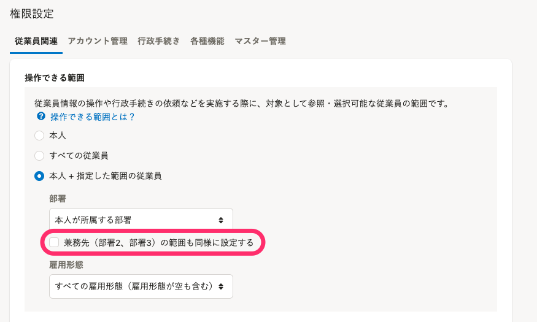

:::alert
当ページで案内しているSmartHRの年末調整機能の内容は、2021年（令和3年）版のものです。
2022年（令和4年）版の年末調整機能の公開時期は秋頃を予定しています。
なお、画面や文言、一部機能は変更になる可能性があります。
公開時期が決まり次第、[アップデート情報](https://smarthr.jp/update)でお知らせします。
:::

当ページでは、年末調整の業務フローに合わせて、年末調整機能2021年版の主なカイゼン内容を紹介します。

2021年版では、差分リストのリニューアルや、住宅ローン控除申告書の新様式および電子保管への対応、従業員情報の一括ダウンロード、CSVファイルを使用した依頼ステータスの更新など、労務担当者の負担が軽減されるよう、機能の見直しを行ないました。

# 準備・設定時の機能に関するカイゼン

## SmartHRに登録されている「家族コード」「寡婦・ひとり親の理由」が年末調整機能にも取り込み可能になりました

2021年版では、SmartHRに登録されている「家族コード」と「寡婦・ひとり親の理由」を、年末調整機能に取り込めるようになりました。

また、年末調整の結果をCSVで出力する際、家族ごとに紐づいた家族コードを出力できます。

これにより、年末調整終了後に家族情報が変わった場合でも、SmartHRと他社システムの連携がより便利になります。

詳しくは、下記のお知らせやヘルプページをご覧ください。

:::related
[家族情報に新項目「家族コード」を追加しました](https://smarthr.jp/update/25751)
[「特別の寡婦」「寡夫」の廃止に伴い、従業員情報を確認・変更する](https://knowledge.smarthr.jp/hc/ja/articles/1500001400982)
:::

## 企業型確定拠出年金のデータインポート機能を追加

企業型確定拠出年金が給与天引きでない場合、 「給与所得者の保険料控除申告書」の小規模企業共済等掛金控除への記載が必要です。

2021年版では、年末調整の依頼前に、担当者が企業型確定拠出年金のデータインポートをできる機能を追加しました。

詳しくは下記のヘルプページをご覧ください。

:::related
[企業型確定拠出年金のデータをインポートする](https://knowledge.smarthr.jp/hc/ja/articles/900004613586)
:::

## 団体保険の必須項目の見直し

団体保険データは、「支払い開始日」「保険等の種類」「保険金等の受取人」がインポート用のデータに入力されていないケースがあります。

2021年版では、団体保険データのインポートにあたり、下記の項目が入力されていなくてもインポートできるように仕様を見直しました。

- 保険等の種類
- 保険金等の受取人
- 支払い開始日（個人年金保険のみ）

団体保険データについて、詳しくは下記のヘルプページをご覧ください。

:::related
[団体保険のデータをインポートする](https://knowledge.smarthr.jp/hc/ja/articles/360036159813)
[団体保険ファイルのインポートの可否を確認する](https://knowledge.smarthr.jp/hc/ja/articles/360035370353)
:::

## より柔軟な権限の設定

SmartHRの権限設定の仕様変更に対応して、年末調整機能も権限設定をカイゼンしました。

年末調整機能の権限設定は、SmartHRの権限名と、権限に紐づく **［操作可能範囲］** を同期します。

2021年版では、操作できる範囲に **［雇用形態］** の設定も反映されるようになりました。

:::alert
SmartHRの権限設定 **［兼務先（部署2、部署3）の範囲も同様に設定する］** は、年末調整機能には反映されませんのでご注意ください。

:::

詳しくは下記のヘルプページやお知らせをご覧ください。

:::related
[年末調整の権限を設定する](https://knowledge.smarthr.jp/hc/ja/articles/360034870874)
[【再掲】【権限管理機能】操作できる従業員の範囲を詳細に設定できるようになりました](https://smarthr.jp/update/25870)
:::

# 入力依頼と進捗管理時の機能に関するカイゼン

## 依頼状況の一括更新機能の追加

2020年版までは、従業員への年末調整の依頼は **［依頼一覧］** から **［まとめて依頼を送信］** をクリックする操作が必要でした。

2021年版では、CSVファイルを使って依頼状況を一括で更新できる機能を追加しました。

CSVファイルに社員番号と依頼状況を指定した番号を入力してアップロードすると、ステータスを一括更新できます。

詳しくは下記のヘルプページをご覧ください。

:::related
[依頼状況と確認状況を一括で変更する](https://knowledge.smarthr.jp/hc/ja/articles/900006685963)
:::

## 依頼ステータスに関わらず、依頼グループの移動ができるようになりました

 **［回答期限切れ］** ステータスの依頼への対応や、差し戻しする依頼だけ抽出して管理できるようにするため、2021年版では従業員の依頼グループの移動について下記の変更を行ないました。

- 依頼ステータスに関わらず、依頼グループの移動ができるようになりました。
-  **［回答期限切れ］** の依頼も、依頼グループの移動ができるようになりました。
    ※この場合、移動先の依頼グループの締め切りに応じて、再度、従業員による入力が可能です。

詳しくは下記のヘルプページをご覧ください。

:::related
[受付終了日後、従業員に年末調整のアンケートに回答してもらいたい場合は？](https://knowledge.smarthr.jp/hc/ja/articles/360037871974)
:::

## 書類ステータスでの絞り込み機能を追加

2021年版では、 **［依頼一覧］** の **［絞り込み］** 機能に、書類や前職情報の作成状況で依頼を絞り込める機能を追加しました。

詳しくは下記のヘルプページをご覧ください。

:::related
[従業員から提出された年末調整を確認する](https://knowledge.smarthr.jp/hc/ja/articles/360034870254)
:::

## 書類・前職情報確認状況の一括更新

2021年版では、書類・前職情報の確認状況を、CSVファイルを使用して一括で更新できるようになりました。

詳しくは下記のヘルプページをご覧ください。

:::related
[依頼一覧から書類または前職情報の状態で依頼を絞り込む](https://knowledge.smarthr.jp/hc/ja/articles/4405432019481)
:::

# 提出内容の確認時の機能に関するカイゼン

## 依頼前と回収後の差分データをリニューアル

2021年版では、「年末調整依頼前に年末調整機能に取り込んだデータ」と「年末調整回収情報の差分」を比較した差分リストについて、確認にかかる時間と負担を減らすよう、項目レイアウトと内容を見直しました。

以下2つの差分リストでは、扶養控除等申告書に紐づく本人情報・配偶者情報・扶養家族情報の変更有無と、変更前後の情報をわかりやすく表示しています。

- 今年の本人情報差分リスト
- 今年の扶養親族差分リスト

また、以下2つの差分リストでは、今年と来年の情報（本人情報、配偶者・扶養家族情報）の差分をわかりやすく表示しています。

- 今年と来年の本人情報差分リスト
- 今年と来年の扶養親族情報差分リスト

差分リストを使うことで、扶養控除等申告書の確認時間を大幅に削減できます。

詳しくは下記のヘルプページをご覧ください。

:::related
[年末調整の差分リストとは？](https://knowledge.smarthr.jp/hc/ja/articles/360035370213)
[差分リストをダウンロードする](https://knowledge.smarthr.jp/hc/ja/articles/4405483953945)
[差分リストを使って「給与所得者の扶養控除等 （異動）申告書」の内容を確認する](https://knowledge.smarthr.jp/hc/ja/articles/4405540222873)
[差分リストを使って行政手続きの対象者を抽出できますか？](https://knowledge.smarthr.jp/hc/ja/articles/4405483960345)
:::

## データの一括ダウンロード

2020年版では、依頼グループごとに依頼状況や収集した情報のCSVファイルをダウンロードできる仕様でした。

2021年版では、依頼グループをまたいだすべての依頼グループのCSVファイルを結合した状態でダウンロードできるようになりました。

各依頼グループの依頼ステータスを保持した状態のCSVデータをダウンロードすることで、依頼グループを横断した内容の確認が可能です。

詳しくは下記のヘルプページをご覧ください。

:::related
[依頼一覧画面の使い方](https://knowledge.smarthr.jp/hc/ja/articles/4405866743705)
[すべての依頼グループの依頼状況一覧をダウンロードする](https://knowledge.smarthr.jp/hc/ja/articles/4405396080025)
[収集情報をダウンロードする](https://knowledge.smarthr.jp/hc/ja/articles/360055844513)
[【一覧】年末調整機機能でダウンロードできるCSVファイルと使用例](https://knowledge.smarthr.jp/hc/ja/articles/4405369856281)
:::

## 保険料控除CSVの縦並びデータの出力

2020年版までは、保険料控除のCSVデータは横並びで出力していました。

保険料控除の申告内容は項目数が多く、横並びのデータでは扱いづらい部分があります。

2021年版では、保険契約の項目を縦並びで出力できるようになりました。

縦並びデータの提供により、より簡単に内容を確認できます。

詳しくは下記のヘルプページをご覧ください。

:::related
[【一覧】保険料控除情報CSV凡例](https://knowledge.smarthr.jp/hc/ja/articles/360054586574)
:::

## その他

### 給与所得者の保険料控除申告書の書類プレビューの表示順カイゼン

2021年版では、「給与所得者の保険料控除申告書」の書類プレビューの原本画像の順序を、下記の順番で固定して表示するように変更しました。

一般の生保保険 > 介護医療保険 > 個人年金 > 地震保険 > 国民年金・社会保険 > 小規模企業共済

### 台湾の国名表示を変更

2021年版では、書類上の台湾の国名表示を **［Taiwan, Province of China］** から **［Taiwan］** に変更しました。

### 生命保険等証明書原本の台紙一括ダウンロード機能の追加

2021年版では、依頼グループごとに、 **［生命保険等証明書原本の台紙］** を一括してダウンロードができるようになりました。

詳しくは下記のヘルプページをご覧ください。

:::related
[「生命保険等証明書原本の台紙」の使用方法](https://knowledge.smarthr.jp/hc/ja/articles/4404550207769)
:::

# 年末調整のアンケートに関するカイゼン

## 住宅借入金等特別控除申告書の新様式に対応

令和2年（2020年）から、年末調整の住宅ローン控除の対象となった場合、従来の「住宅借入金等特別控除申告書」とは異なるレイアウトの新しい申告書（「給与所得者の（特定増改築等）住宅借入金等特別控除申告書 兼（特定増改築等）住宅借入金等特別控除計算明細書」※）が登場しました。

※ここでは「給与所得者の（特定増改築等）住宅借入金等特別控除申告書 兼（特定増改築等）住宅借入金等特別控除計算明細書」を「新様式」とします。

2021年版では、新様式に該当する場合も、問題なく計算結果を出力できるようにアップデートしました。

:::tips
令和3年（2021年）の法改正で、住宅ローン控除申告書の提出方法が変更になり、住宅ローン控除申告書への押印の廃止と、住宅ローン控除申告書の電子化が可能になりました。
今年から、SmartHRで住宅ローン控除情報を申告いただいた場合、住宅借入金等特別控除申告書への手書きでの転記の必要がなくなりました。
詳しくはSmartHR Mag.の下記ページをご覧ください。
[2021年の年末調整はどう変わる？「令和3年度 税制改正」の3つの変更ポイント](https://mag.smarthr.jp/procedure/detail/nencho_zeiseikaisei_2021/)
:::

## 配偶者情報の入力画面の見直し

2020年版では、配偶者情報の入力画面が複数にわたっていました。

2021年版では、配偶者情報の入力画面を1画面に集約し、よりアンケートが回答しやすい形に見直しました。

## その他

### 質問文、説明文の大幅な見直し、補足情報をまとめたダイアログの追加

アンケートを回答する従業員に、よりわかりやすく、正確な情報の回答が得られるように、質問や説明の文章を大幅に見直しました。

また、ダイアログで設問の意図や補足情報が表示されるようになりました。

### 数値入力フォームが全角入力に対応

数値入力フォームが、全角で入力できるようになりました。

### ［小規模企業共済等の額］の回答欄を追加

前職の源泉徴収票項目に **［小規模企業共済等の額］** を追加しました。

# 年末調整機能をより使いこなしていただくためのカイゼン

年末調整機能をより使いこなしていただくために、2021年版ではヘルプページへのリンクを各所に追加しました。

年末調整機能は多くの機能を備えているため、基本操作の確認や操作に困った場合にご活用ください。

