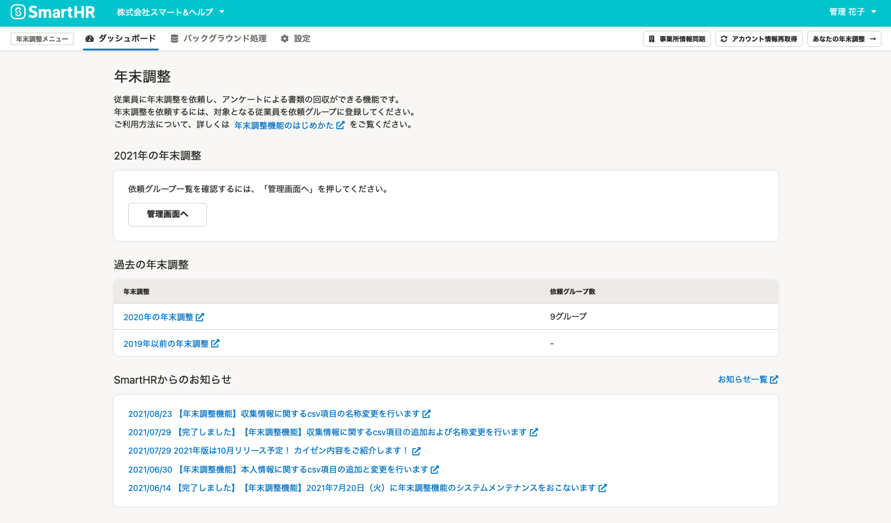
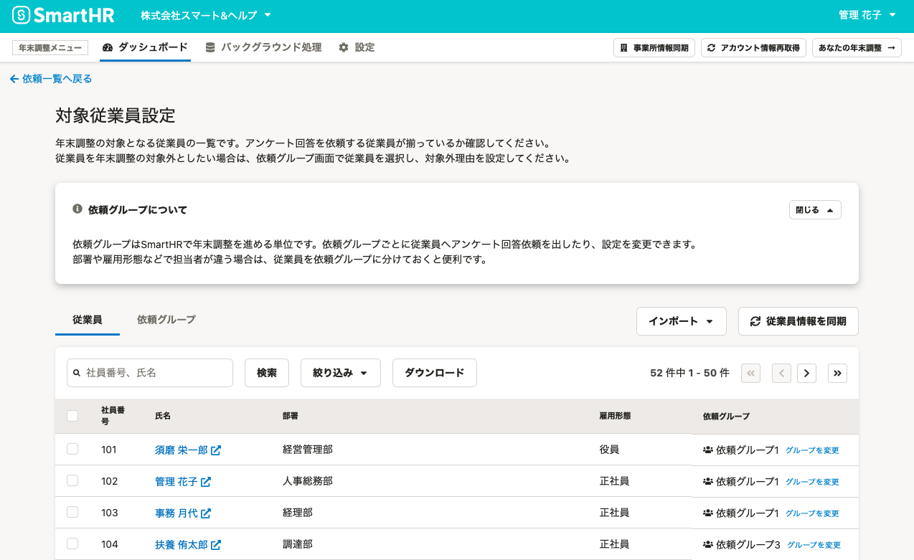
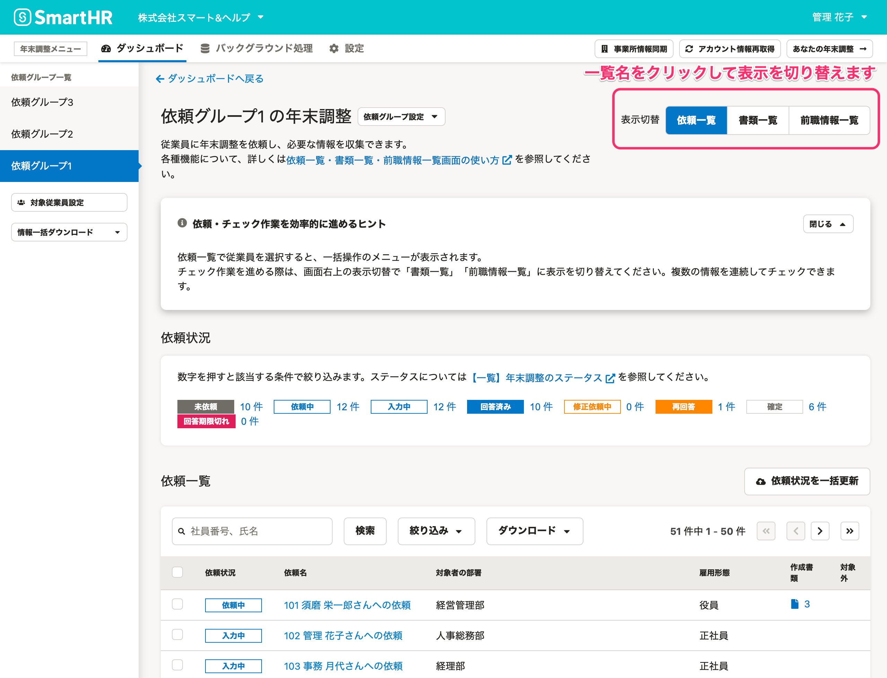
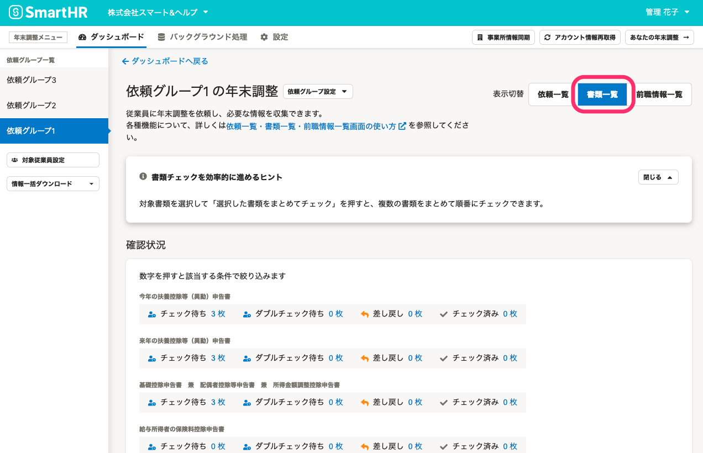
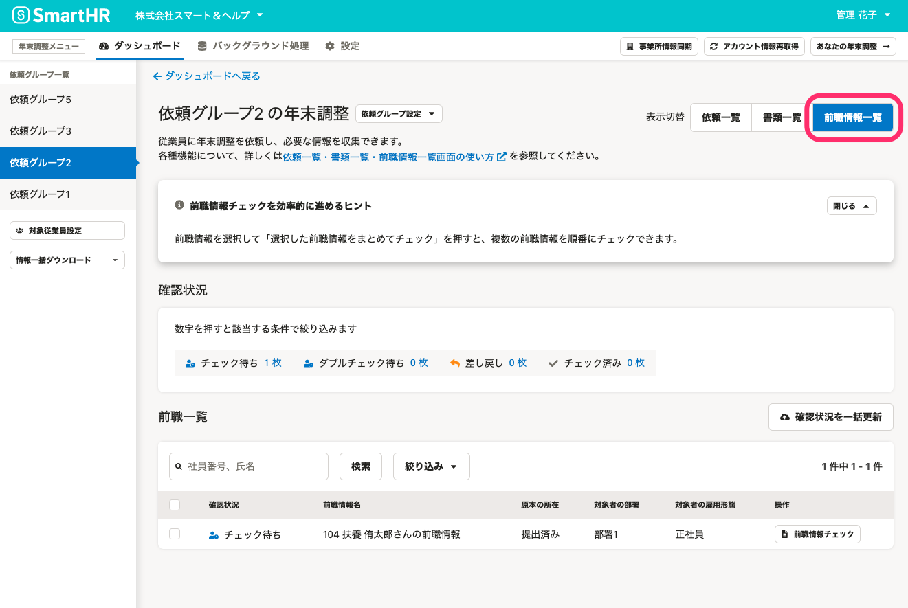
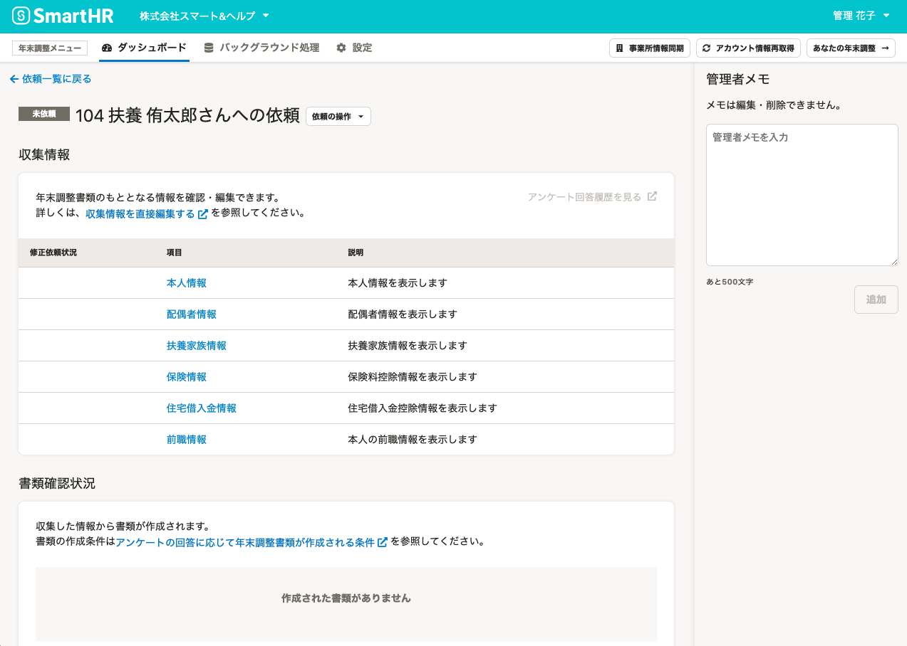
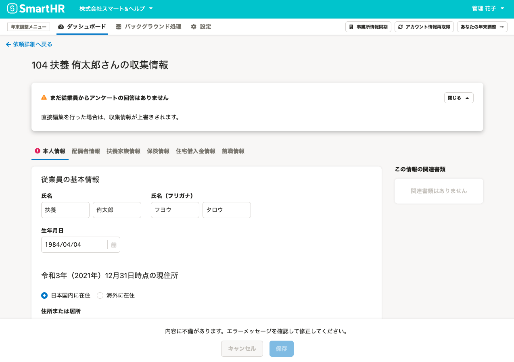
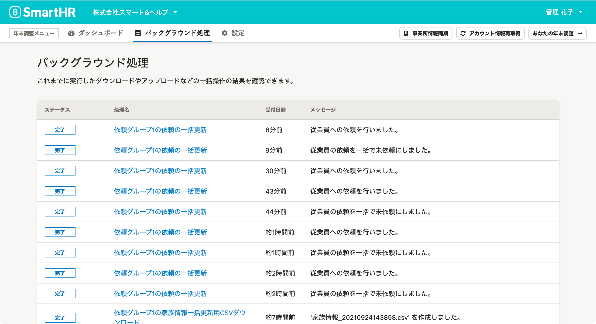

:::alert
当ページで案内しているSmartHRの年末調整機能の内容は、2021年（令和3年）版のものです。
2022年（令和4年）版の年末調整機能の公開時期は秋頃を予定しています。
なお、画面や文言、一部機能は変更になる可能性があります。
公開時期が決まり次第、[アップデート情報](https://smarthr.jp/update)でお知らせします。
:::

SmartHRの年末調整機能では、年末調整業務を円滑に実施するために多用な機能を備えています。

当ページでは、年末調整機能の各画面の概要を紹介します。

詳しくは各ヘルプページをご覧ください。

# 年末調整ダッシュボード画面

年末調整機能にアクセスすると、最初に表示される画面です。

年末調整機能全般の設定や、過去も含めた年末調整の依頼一覧画面への移動、SmartHRからのお知らせなどを表示しています。

詳しくは下記のヘルプページをご覧ください。

:::related
[年末調整ダッシュボード画面の使い方](https://knowledge.smarthr.jp/hc/ja/articles/4405483913497)
:::

# 対象従業員設定画面

対象従業員設定画面は、主に年末調整の準備・設定時に活用します。

年末調整の対象となる従業員を一覧で表示し、アンケート回答を依頼する従業員が揃っているか確認できます。

また、年末調整の対象外としたい従業員の削除や、依頼グループの設定・編集も可能です。

部署や依頼のタイミングごとに依頼グループを分けて運用したい場合には、依頼グループ設定を活用してください。

詳細は下記のヘルプページをご覧ください。

:::related
[対象従業員設定画面の使い方](https://knowledge.smarthr.jp/hc/ja/articles/4405495781785)
:::

# 依頼一覧・書類一覧・前職情報一覧画面（依頼一覧画面）

依頼一覧・書類一覧・前職情報一覧画面（依頼一覧画面）は、従業員への年末調整の依頼から進捗の把握・管理、確定までを一覧で表示する画面です。

表示形式を **［依頼一覧］［書類一覧］［前職情報一覧］** 画面の3つに切り替えられ、管理者の年末調整業務をサポートします。

各画面の切り替えは、依頼一覧画面の右上の **［表示切替］** をクリックしてください。

## 依頼一覧

依頼一覧画面は、各従業員への依頼状況を一覧で表示した画面です。

「どの従業員に依頼をしたのか」「年末調整のアンケートを入力中の従業員は誰か」など、従業員の状況をステータスで管理・把握できます。

詳しくは下記のヘルプページをご覧ください。

:::related
[依頼一覧画面の使い方](https://knowledge.smarthr.jp/hc/ja/articles/4405866743705)
:::

## 書類一覧

書類一覧画面は、従業員から収集した情報をもとに作成された書類の、確認・差し戻しの状況を一覧で管理・把握できます。

「扶養控除等（異動）申告書」や「基礎控除申告書　兼　配偶者控除等申告書　兼　所得金額調整控除申告書」など、書類と従業員を紐づけて、チェックできます。

詳しくは下記のヘルプページをご覧ください。

:::related
[書類一覧画面の使い方](https://knowledge.smarthr.jp/hc/ja/articles/4405873195801)
:::

## 前職情報一覧

前職情報一覧画面では、今年入社した従業員の前職情報や源泉徴収票の原本提出状況などを確認できます。

また、従業員の手元に源泉徴収票がある場合、年末調整のアンケートで源泉徴収票の内容を入力してもらうと、管理者が内容を確認できます。

詳しくは下記のヘルプページをご覧ください。

:::related
[前職情報一覧画面の使い方](https://knowledge.smarthr.jp/hc/ja/articles/4405866758297)
:::

# 依頼詳細画面

依頼詳細画面は、年末調整に関する従業員ごとの情報を確認できる画面です。

収集情報をもとに作成された扶養控除等（異動）申告書などの書類チェックも可能です。

また、管理者間のやりとりに使える「管理者メモ」を残せます。

詳しくは下記のヘルプページをご覧ください。

:::related
[依頼詳細画面の使い方](https://knowledge.smarthr.jp/hc/ja/articles/4405483927449)
:::

# 収集情報画面

依頼詳細画面で **［収集情報］** の項目をクリックすると、収集情報画面に移動します。

この画面では、年末調整で使用する書類のもととなる情報の確認・編集ができます。

詳しくは下記のヘルプページをご覧ください。

:::related
[収集情報画面の使い方](https://knowledge.smarthr.jp/hc/ja/articles/4405483932825)
:::

# バックグラウンド処理画面

SmartHRの年末調整機能では、年末調整を依頼する際や、収集した情報をCSVファイルでダウンロードする際に、バックグランド処理が行なわれます。

 **［バックグラウンド処理］** 画面は、処理の内容とステータスを一覧で確認できます。

また、 **［処理名］** をクリックすると詳細画面に移動し、作成したデータのダウンロードや、エラーの詳細などが確認できます。

詳しくは下記のヘルプページをご覧ください。

:::related
[バックグラウンド処理画面の使い方](https://knowledge.smarthr.jp/hc/ja/articles/4405483938073)
:::
