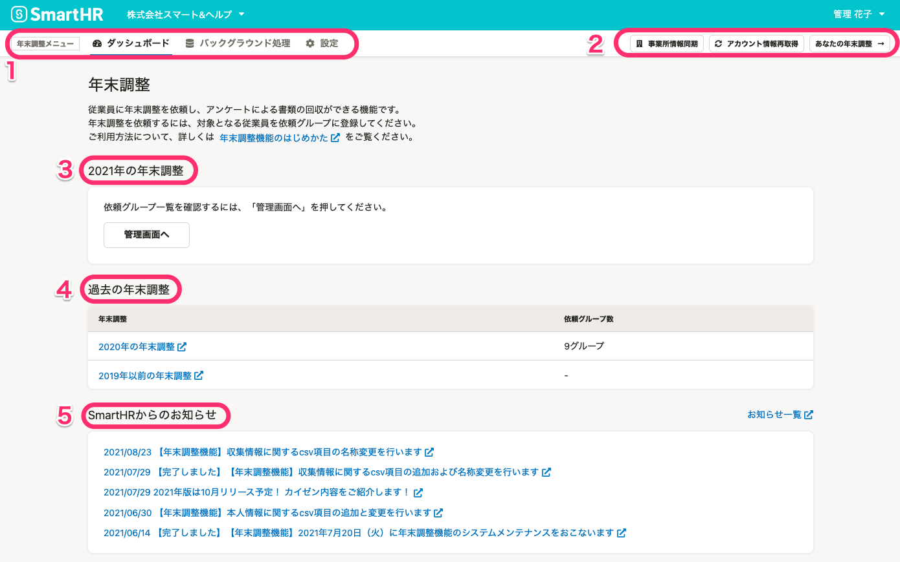
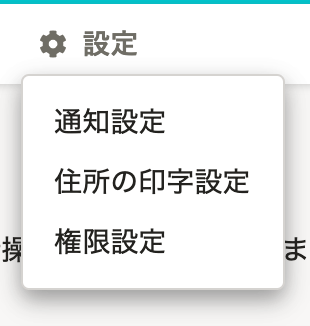
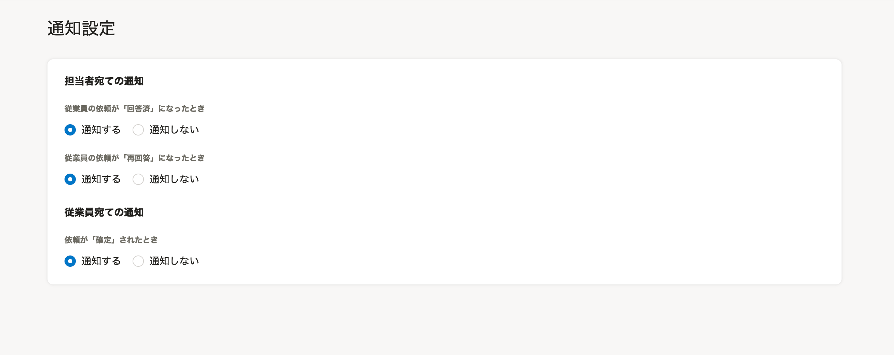
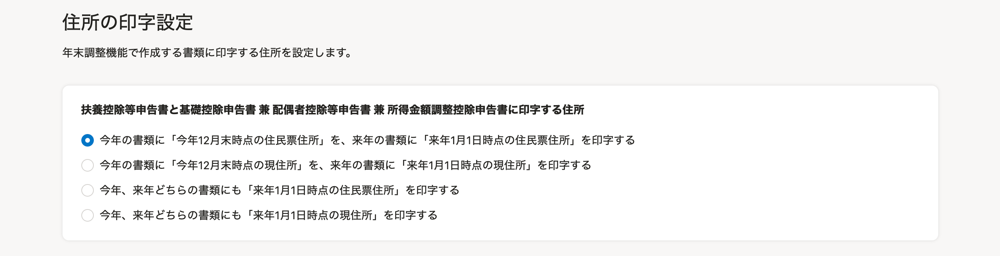
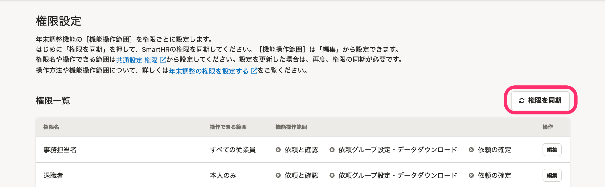
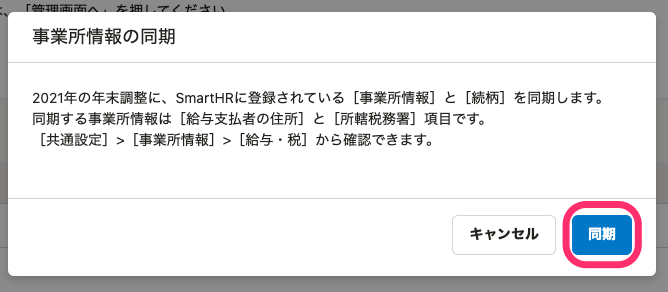
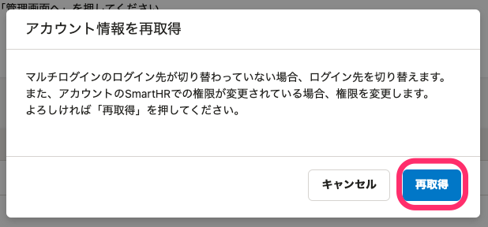
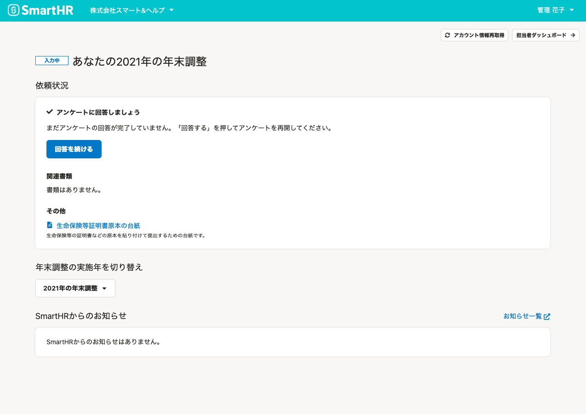
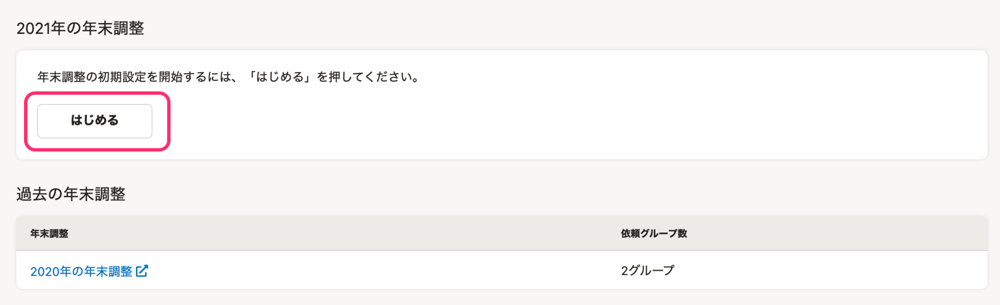

:::alert
当ページで案内しているSmartHRの年末調整機能の内容は、2021年（令和3年）版のものです。
2022年（令和4年）版の年末調整機能の公開時期は秋頃を予定しています。
なお、画面や文言、一部機能は変更になる可能性があります。
公開時期が決まり次第、[アップデート情報](https://smarthr.jp/update)でお知らせします。
:::

年末調整ダッシュボード画面の使い方を説明します。

# 年末調整ダッシュボードとは

年末調整機能を開くと最初に表示される画面です。

年末調整機能全般の設定や、過去も含めた年末調整の依頼一覧画面への移動、SmartHRからのお知らせなどを表示しています。

次に、ページ内の要素を下記の5つに分けて、年末調整ダッシュボード画面の概要を説明します。

1.  年末調整メニュー
2.  事業所情報同期、アカウント情報再取得、あなたの年末調整
3.  2021年の年末調整
4.  過去の年末調整
5.  SmartHRからのお知らせ

# 1\. 年末調整メニュー

 **［年末調整メニュー］** では、年末調整機能全般に関するメニューを表示しています。

## ダッシュボード

年末調整機能のトップページ画面を表示します。

## バックグラウンド処理

依頼グループの一括更新や従業員の収集情報のダウンロードを行なった際に、処理状況の確認や作成したCSVファイルのダウンロードができます。

詳しくは以下のヘルプページをご覧ください。

:::related
[バックグラウンド処理画面の使い方](https://knowledge.smarthr.jp/hc/ja/articles/4405483938073)
:::

## 設定

 **［設定］** をクリックすると、年末調整機能全般に関わる設定メニューが表示されます。

設定メニューの各項目をクリックすると、設定画面が表示されます。

### 通知設定

担当者宛て、従業員宛ての通知の有無を設定できます。

### 住所の印字設定

年末調整機能で作成する書類に印字する住所を設定できます。

### 権限設定

年末調整機能の **［機能操作範囲］** を権限ごとに設定できます。

 **［権限を同期］** をクリックすると、SmartHRに登録されている最新の権限を年末調整機能に同期します。

詳しくは以下のヘルプページをご覧ください。

:::related
[年末調整の通知設定をする](https://knowledge.smarthr.jp/hc/ja/articles/360053201294)
[年末調整の書類に印字する住所の設定をする](https://knowledge.smarthr.jp/hc/ja/articles/360053201314)
[年末調整の権限を設定する](https://knowledge.smarthr.jp/hc/ja/articles/360034870874)
:::

# 2\. 事業所情報同期、アカウント情報再取得、あなたの年末調整

## 事業所情報同期

 **［事業所情報同期］** をクリックすると **［事業所情報の同期］** 画面が表示され、2021年の年末調整に、SmartHRに登録されている **［事業所情報］** と **［続柄］** を同期します。

詳しくは以下のヘルプページをご覧ください。

:::related
[年末調整の書類に反映される事業所情報を確認する](https://knowledge.smarthr.jp/hc/ja/articles/360035342214)
[年末調整作成後に事業所情報や従業員情報を変更した場合は？](https://knowledge.smarthr.jp/hc/ja/articles/360035370173)
:::

## アカウント情報再取得

 **［アカウント情報再取得］** をクリックすると、 **［アカウント情報を再取得］** 画面が表示され、マルチログインのログイン先が切り替わっていない場合、ログイン先を切り替えます。

また、アカウントのSmartHRでの権限が変更されている場合、権限を変更します。

:::related
[Q. 他の従業員の年末調整画面や、自社とは違う企業の年末調整画面が表示された場合の対処法は？](https://knowledge.smarthr.jp/hc/ja/articles/360035370393)
[マルチログインアカウントとは](https://knowledge.smarthr.jp/hc/ja/articles/360026262853)
[年末調整の権限を設定する](https://knowledge.smarthr.jp/hc/ja/articles/360034870874)
:::

## あなたの年末調整

現在ログインしているアカウントの、2021年の年末調整画面に移動します。

従業員に年末調整を依頼する管理者や事務担当者自身の年末調整時に使用してください。

# 3\. 2021年の年末調整

 **［2021年の年末調整］** の **［管理画面へ］** をクリックすると、従業員への年末調整の依頼や、依頼状況を確認できる依頼一覧画面に移動します。

なお、年末調整設定の開始状況によってボタンの表示は変わり、2021年の年末調整を開始する際には、 **［はじめる］** が表示されています。

詳しくは以下のヘルプページをご覧ください。

:::related
[依頼一覧・書類一覧・前職情報一覧画面の使い方](https://knowledge.smarthr.jp/hc/ja/articles/4405128387865)
:::

# 4\. 過去の年末調整に切り替え

 **［過去の年末調整］** では、SmartHRで実施した過去の年末調整に切り替えます。

 **［2020年の年末調整］［2019年以前の年末調整］** をクリックすると、過去の依頼一覧画面に移動します。

# 5\. SmartHRからのお知らせ

 **［SmartHRからのお知らせ］** では、年末調整機能に関わるSmartHRからのお知らせを表示しています。
