:::alert
当ページで案内しているSmartHRの年末調整機能の内容は、2021年（令和3年）版のものです。
2022年（令和4年）版の年末調整機能の公開時期は秋頃を予定しています。
なお、画面や文言、一部機能は変更になる可能性があります。
公開時期が決まり次第、[アップデート情報](https://smarthr.jp/update)でお知らせします。
:::

年末調整機能の対象従業員設定画面の使い方を説明します。

:::tips
対象従業員設定画面を表示するには、依頼一覧画面左側にある **［対象従業員設定］** をクリックしてください。
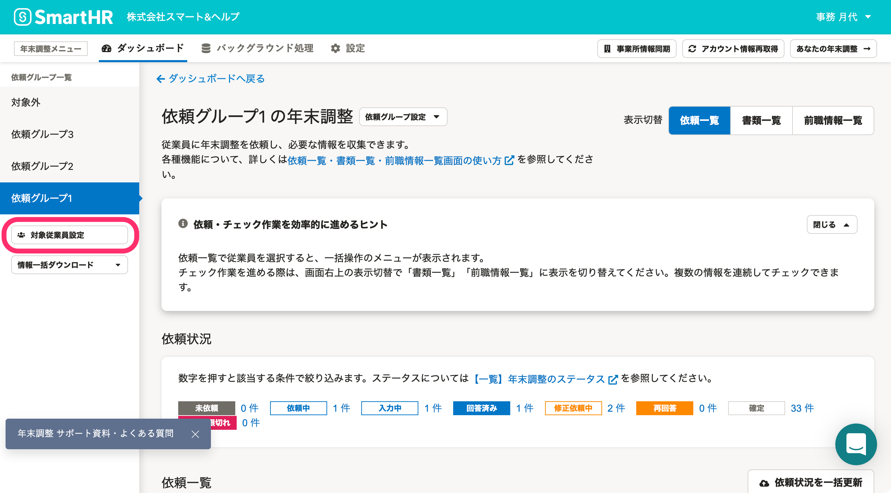
:::

# 対象従業員設定とは

 **［対象従業員設定］** 画面は、主に年末調整の準備・設定時に活用します。

年末調整の対象となる従業員を一覧で表示し、アンケート回答を依頼する従業員が揃っているか確認できます。

また、年末調整の対象外としたい従業員の削除や、依頼グループの設定・編集も可能です。

部署や依頼のタイミングごとに依頼グループを分けて運用したい場合には、依頼グループ設定を活用してください。

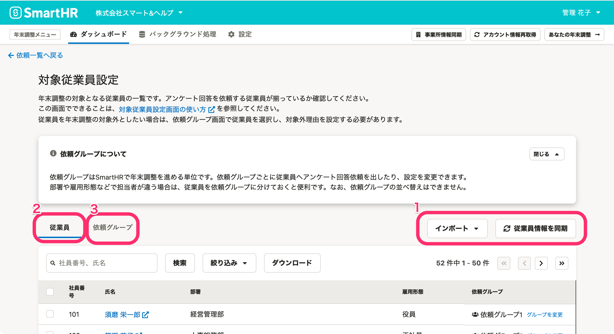

次に、ページ内の要素を下記の3つに分けて、対象従業員設定画面の各機能の概要を説明します。

1.  インポート、従業員情報を同期
2.  従業員の設定
3.  依頼グループの設定

# 1\. インポート、従業員情報を同期

各種保険データのインポートや、SmartHRに登録されている従業員情報を年末調整機能に同期します。

## インポート

 **［インポート▼］** をクリックすると、依頼グループのインポートや、昨年の保険料・団体保険料・企業型確定拠出年金のインポートや削除といったメニューが表示されます。

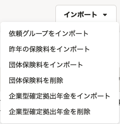

詳しくは以下のヘルプページをご覧ください。

:::related
[年末調整の依頼グループを一括で設定する](https://knowledge.smarthr.jp/hc/ja/articles/4403662363161)
[年末調整機能で昨年分の保険等の情報を表示する](https://knowledge.smarthr.jp/hc/ja/articles/360035370453)
[団体保険のデータをインポートする](https://knowledge.smarthr.jp/hc/ja/articles/360036159813)
[企業型確定拠出年金のデータをインポートする](https://knowledge.smarthr.jp/hc/ja/articles/900004613586)
:::

## 従業員情報を同期

 **［従業員情報を同期］** をクリックすると確認画面が表示され、SmartHRに登録されている従業員情報を年末調整機能に同期します。

SmartHRへ従業員を新しく追加した場合や、従業員の部署情報を追加・更新した場合には、必ず従業員情報の同期をしてください。

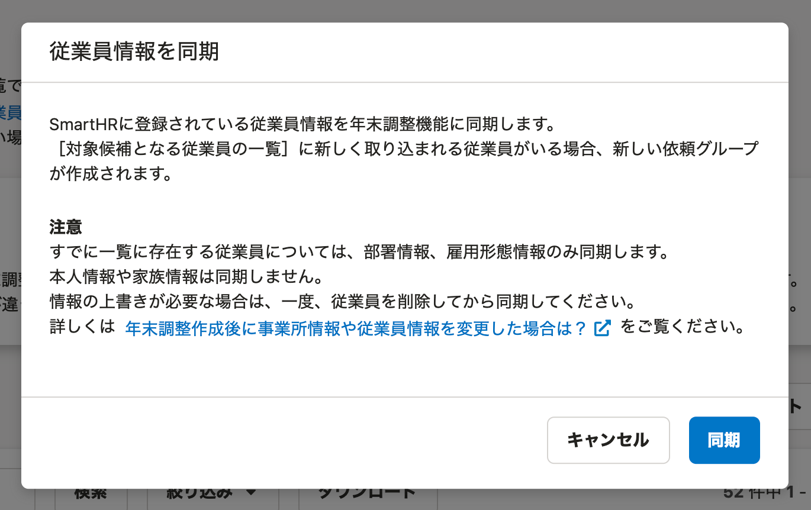

# 2\. 従業員の設定

年末調整の対象となる従業員を一覧で表示し、アンケート回答を依頼する従業員が揃っているか確認できます。

## 従業員の設定

 **［従業員］** タブでは、従業員情報（社員番号、氏名、部署、雇用形態、依頼グループ）を一覧で確認できます。

 **［従業員名］** をクリックすると、SmartHRの従業員情報に移動します。

 **［グループを変更］** をクリックすると、依頼グループの変更画面が表示され、従業員の依頼グループ変更・設定ができます。

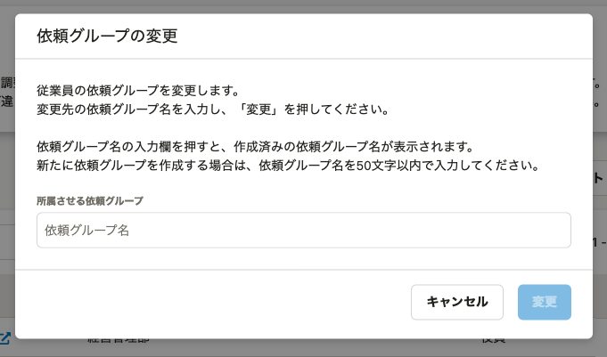

詳しくは以下のヘルプページをご覧ください。

:::related
[年末調整の対象となる従業員を確認する](https://knowledge.smarthr.jp/hc/ja/articles/360035370493)
[年末調整の依頼一覧から従業員を削除する](https://knowledge.smarthr.jp/hc/ja/articles/360035370413)
:::

## 従業員の検索、絞り込み、ダウンロード

従業員の検索、絞り込み機能を活用して、該当の従業員を抽出できます。

### 従業員の検索

 **［検索フォーム］** に社員番号、氏名を入力すると、該当する従業員を検索します。

### 絞り込み

 **［絞り込み▼］** をクリックすると、絞り込み条件を設定する画面が表示されます。

 **［部署］［雇用形態］［依頼グループ］［絞り込みの対象］** を指定し、 **［適用］** をクリックすると条件に該当する従業員を絞り込みます。

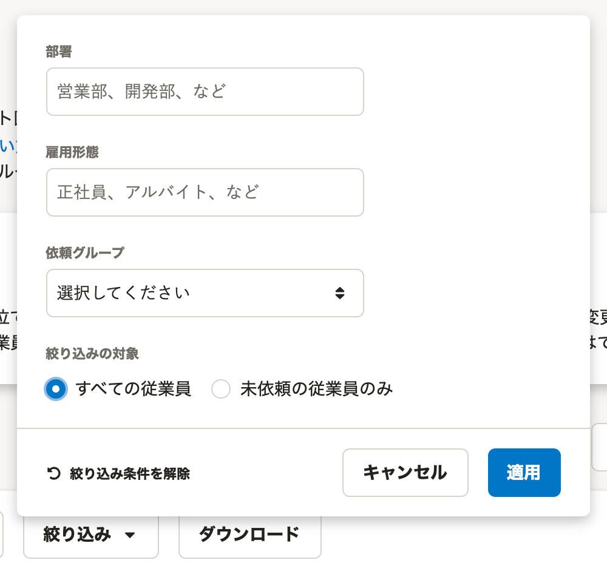

### ダウンロード

 **［ダウンロード］** をクリックすると、 **［従業員一覧のダウンロード］** 画面が表示されます。

年末調整の対象となる従業員と依頼グループの一覧をダウンロードできます。

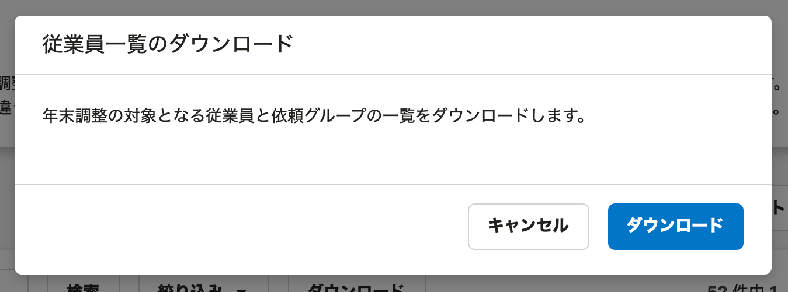

## 従業員の削除

 **［社員番号］** 横のチェックボックスにチェックを入れると、項目名の下に **［選択した従業員を削除］** ボタンが表示されます。

年末調整の依頼をしていない従業員を、年末調整の対象候補から削除できます。

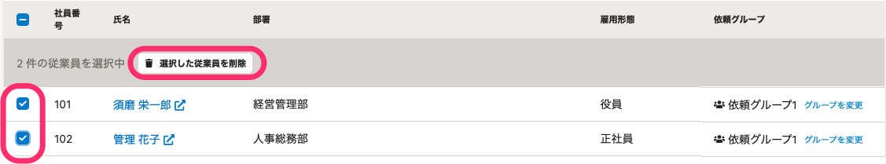

詳しくは以下のヘルプページをご覧ください。

:::related
[年末調整の依頼一覧から従業員を削除する](https://knowledge.smarthr.jp/hc/ja/articles/360035370413)
:::

# 3\. 依頼グループの設定

 **［従業員］** タブの横にある **［依頼グループ］** タブでは、依頼グループの追加や削除、依頼グループ名の編集、依頼グループ内の従業員の確認ができます。

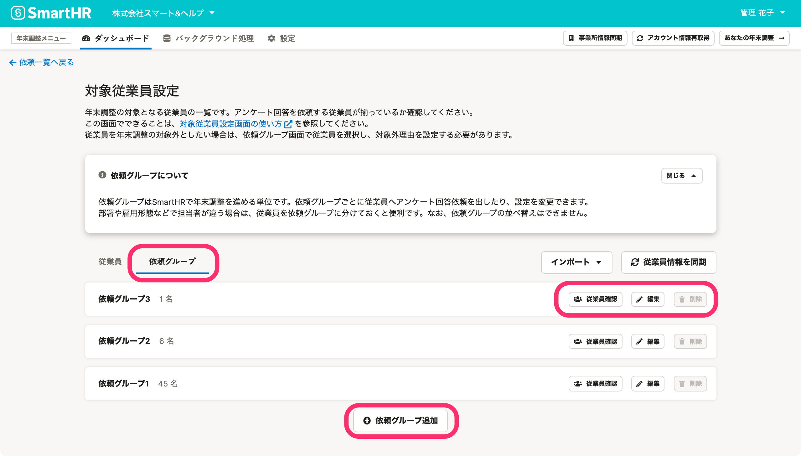

## 従業員確認

 **［従業員確認］** をクリックすると、依頼グループ内の従業員を一覧で表示します。

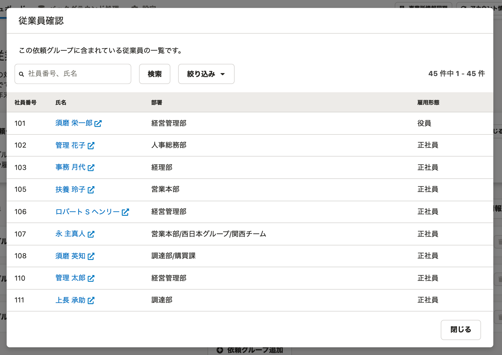

## 編集

 **［編集］** をクリックすると、依頼グループ名の編集画面が表示されます。

任意の依頼グループ名に変更できます。

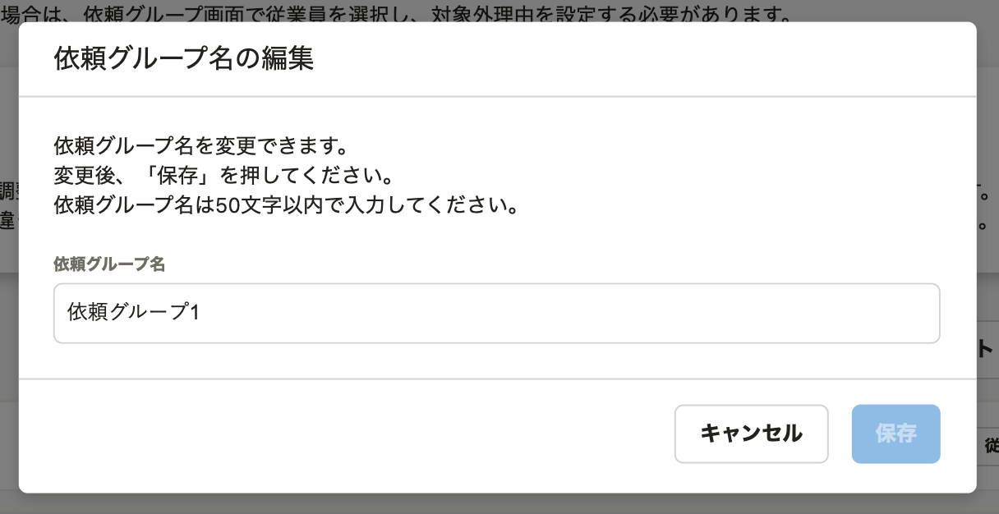

## 削除

 **［削除］** をクリックすると、 **［依頼グループを削除しますか？］** 画面が表示されます。

 **［削除］** をクリックすると、依頼グループを削除します。

なお、依頼グループに従業員がいると削除できないため、事前に従業員を別の依頼グループに移動するなどしてください。

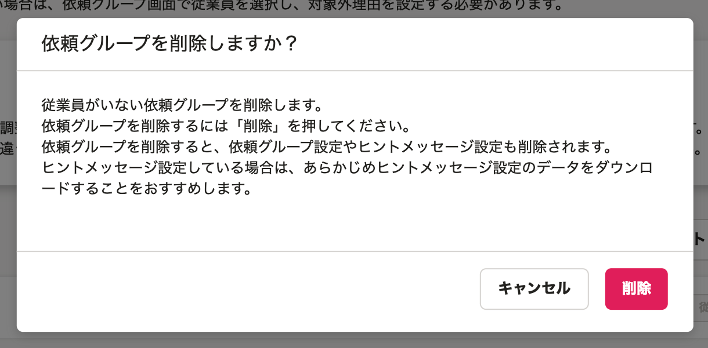

## 依頼グループの追加

画面下部の **［＋依頼グループ追加］** をクリックすると、 **［依頼グループの追加］** 画面が表示されます。

任意の依頼グループ名を設定し、 **［追加］** をクリックすると、一覧に追加した依頼グループが表示されます。

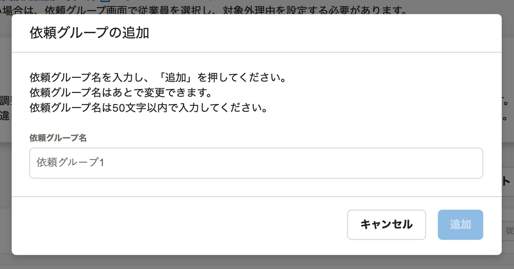

依頼グループの各機能について、詳しくは以下のページをご覧ください。

:::related
[依頼グループを作成し、従業員を振り分ける](https://knowledge.smarthr.jp/hc/ja/articles/4405215155993)
[年末調整の依頼グループの設定と変更方法](https://knowledge.smarthr.jp/hc/ja/articles/360038197674)
[年末調整の依頼グループを一括で設定する](https://knowledge.smarthr.jp/hc/ja/articles/4403662363161)
[年末調整の依頼グループに従業員を一括で追加する](https://knowledge.smarthr.jp/hc/ja/articles/360056088674)
[年末調整の依頼グループを削除する](https://knowledge.smarthr.jp/hc/ja/articles/360037003793)
[依頼ステータスが未依頼以外でも、従業員の依頼グループを変更する](https://knowledge.smarthr.jp/hc/ja/articles/4405495792665)
[年末調整の依頼グループに関するよくある質問](https://knowledge.smarthr.jp/hc/ja/articles/360056509734)
:::
