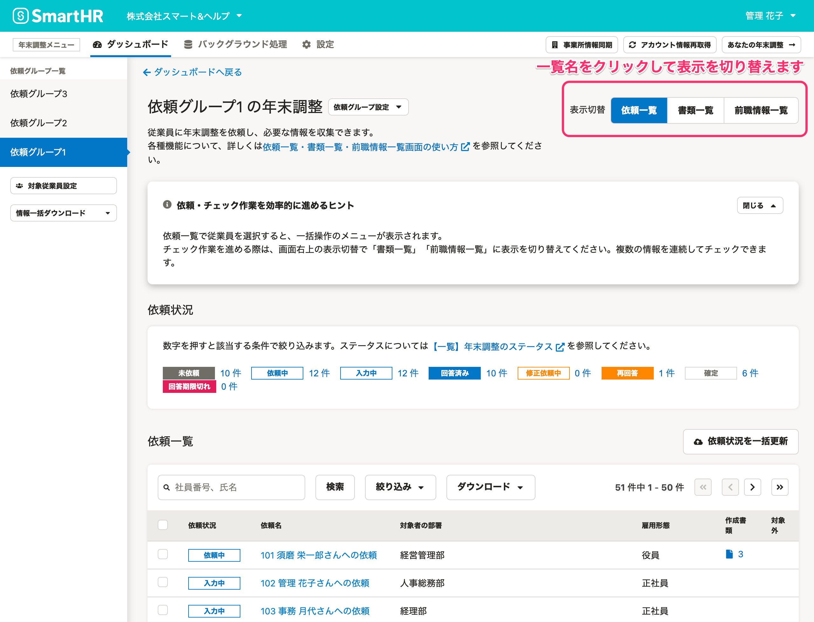
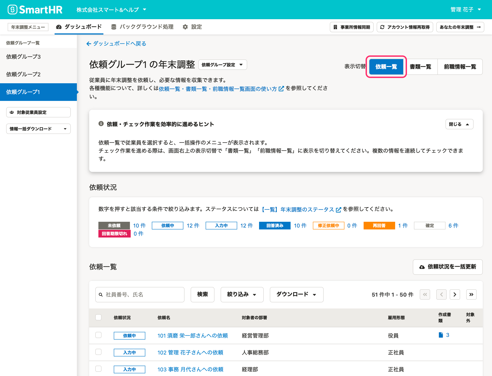
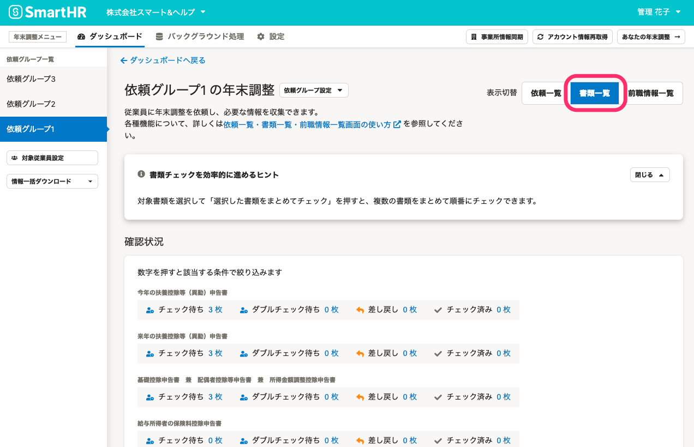
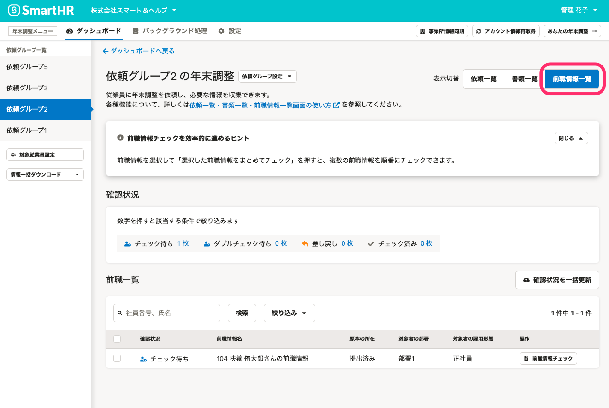

:::alert
当ページで案内しているSmartHRの年末調整機能の内容は、2021年（令和3年）版のものです。
2022年（令和4年）版の年末調整機能の公開時期は秋頃を予定しています。
なお、画面や文言、一部機能は変更になる可能性があります。
公開時期が決まり次第、[アップデート情報](https://smarthr.jp/update)でお知らせします。
:::

年末調整機能の **［依頼一覧］［書類一覧］［前職情報一覧］画面** （依頼一覧画面）の概要を紹介します。

詳しくは各ヘルプページをご確認ください。

# 依頼一覧・書類一覧・前職情報一覧画面（依頼一覧画面）とは

依頼一覧・書類一覧・前職情報一覧画面（依頼一覧画面）は、従業員への年末調整の依頼から進捗の把握・管理、確定までを一覧で表示する画面です。

表示形式を **［依頼一覧］［書類一覧］［前職情報一覧］** 画面の3つに切り替えられ、管理者の年末調整業務をサポートします。

各画面の切り替えは、依頼一覧画面の右上の **［表示切替］** をクリックしてください。

# 依頼一覧画面

依頼一覧画面は、各従業員への依頼状況を一覧で表示した画面です。

「どの従業員に依頼をしたのか」「年末調整のアンケートを入力中の従業員は誰か」など、従業員の状況をステータスで管理・把握できます。

詳しくは下記のヘルプページをご確認ください。

:::related
[依頼一覧画面の使い方](https://knowledge.smarthr.jp/hc/ja/articles/4405866743705)
:::

# 書類一覧画面

書類一覧画面は、従業員から収集した情報をもとに作成された書類の、確認・差し戻しの状況を一覧で管理・把握できます。

「扶養控除等（異動）申告書」や「基礎控除申告書　兼　配偶者控除等申告書　兼　所得金額調整控除申告書」など、書類と従業員を紐付けてチェックできます。

詳しくは下記のヘルプページをご確認ください。

:::related
[書類一覧画面の使い方](https://knowledge.smarthr.jp/hc/ja/articles/4405873195801)
:::

# 前職情報一覧画面

前職情報一覧画面では、今年入社した従業員の前職情報や源泉徴収票の原本提出状況などを把握できます。

また、従業員の手元に源泉徴収票がある場合、年末調整のアンケートで源泉徴収票の内容を入力してもらうと、管理者が内容を確認できます。

詳しくは下記のヘルプページをご確認ください。

:::related
[前職情報一覧画面の使い方](https://knowledge.smarthr.jp/hc/ja/articles/4405866758297)
:::
