:::alert
当ページで案内しているSmartHRの年末調整機能の内容は、2021年（令和3年）版のものです。
2022年（令和4年）版の年末調整機能の公開時期は秋頃を予定しています。
なお、画面や文言、一部機能は変更になる可能性があります。
公開時期が決まり次第、[アップデート情報](https://smarthr.jp/update)でお知らせします。
:::

年末調整機能の **［依頼一覧］画面** の使い方を説明します。

 **［依頼一覧］** 画面は、各従業員への依頼状況を一覧で表示した画面です。

「どの従業員に依頼をしたのか」「年末調整のアンケートを入力中の従業員は誰か」など、従業員の状況をステータスで管理・把握できます。

# 依頼一覧画面（依頼一覧・書類一覧・前職情報一覧）とは

依頼一覧画面（依頼一覧・書類一覧・前職情報一覧）画面は、従業員への年末調整の依頼から進捗の把握・管理、確定までを一覧で表示する画面です。

 **［表示切替］** を使用して、 **［依頼一覧］［書類一覧］［前職情報一覧］** 画面を切り替えられ、管理者の年末調整業務をサポートします。

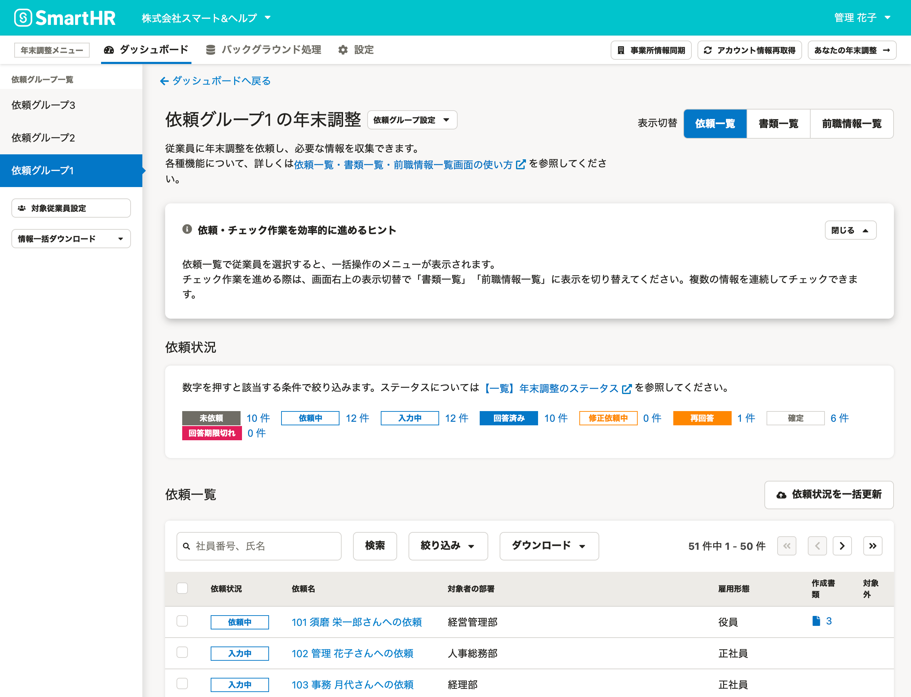

次に、依頼一覧画面（依頼一覧・書類一覧・前職情報一覧）の共通の仕様と、 **［依頼一覧］** の各機能の概要を説明をします。

# 依頼一覧画面（依頼一覧・書類一覧・前職情報一覧）の共通の仕様

表示を切り替えても各画面で共通して表示される項目・機能について説明します。

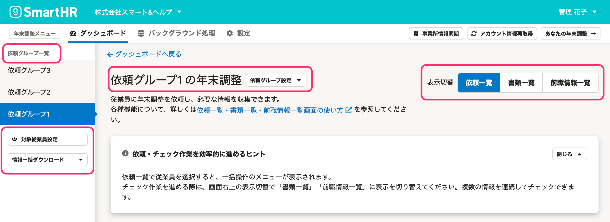

## 依頼グループ一覧

依頼グループ一覧には、 **［対象従業員設定］** で作成した依頼グループが一覧で表示されます。

操作したい依頼グループをクリックすると、その依頼グループの画面に切り替わります。

## 依頼グループ名、依頼グループ設定

### 依頼グループ名

 **［｛依頼グループ名｝の年末調整］** と表示しています。

### 依頼グループ設定

依頼グループ名の横にある **［依頼グループ設定▼］** をクリックすると、表示している依頼グループにかかわる設定メニューが表示されます。

項目をクリックすると、それぞれの設定画面が表示されます。

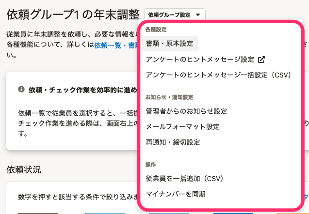

#### 書類・原本設定

 **［書類・原本設定］** では、 **［従業員への書類印刷依頼］［書類へのマイナンバー印字］［証明書の画像添付］［保険料控除申告書の作成設定］［原本の提出方法］** を設定できます。

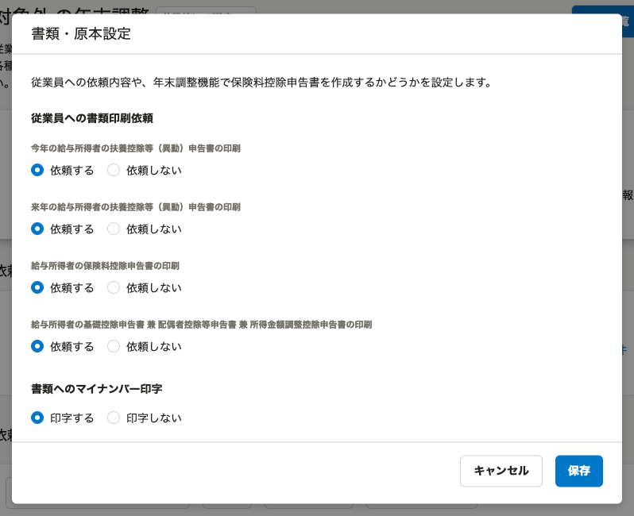

#### アンケートのヒントメッセージ設定、アンケートのヒントメッセージ一括設定（CSV）

 **［アンケートのヒントメッセージ設定］［アンケートのヒントメッセージ一括設定（CSV）］** では、従業員が回答する年末調整のアンケートに、独自のヒントメッセージを設定できます。

アンケートごとに個別で設定する方法とCSVファイルを使用して一括で登録する方法があります。

####  **アンケートのヒントメッセージ設定（個別設定）** 

 **［アンケートのヒントメッセージ設定］** をクリックすると、ヒントメッセージ設定画面に移動します。

画面下部の **［この設問のヒントを設定する］** をクリックして、ヒントを入力してください。

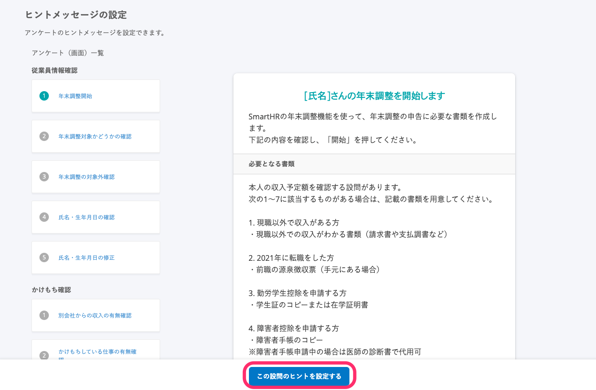

####  **アンケートのヒントメッセージ一括設定（CSV）** 

 **［アンケートのヒントメッセージ一括設定（CSV）］** をクリックすると、 **［ヒントメッセージのインポート］** 画面が表示されます。

画面の案内に従ってCSVファイルの編集・アップロードをしてください。

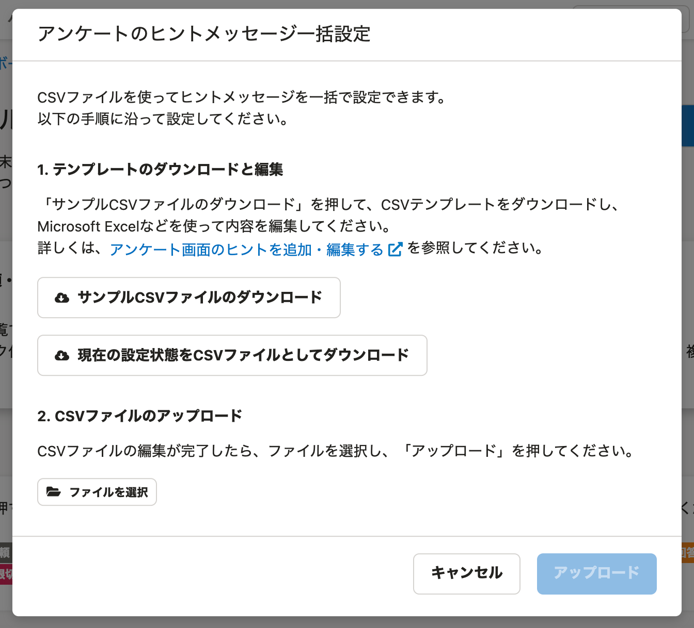

詳しくは以下のヘルプページをご覧ください。

:::related
[アンケート画面のヒントを編集する](https://knowledge.smarthr.jp/hc/ja/articles/360034870854)
:::

#### 管理者からのお知らせ設定

 **［管理者からのお知らせ設定］** では、従業員ダッシュボードに常時表示するお知らせを設定できます。

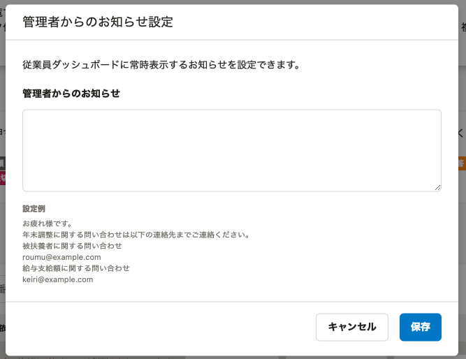

詳しくは以下のヘルプページをご覧ください。

:::related
[従業員の年末調整画面に管理者からのお知らせを設定する](https://knowledge.smarthr.jp/hc/ja/articles/360053347974)
:::

#### メールフォーマット設定

 **［メールフォーマット設定］** では、依頼時や確定時などの従業員へのメールフォーマットを設定できます。

上部のタブを切り替えて、 **［依頼通知］［確定通知］［依頼再通知］［未提出通知］** の内容を編集できます。

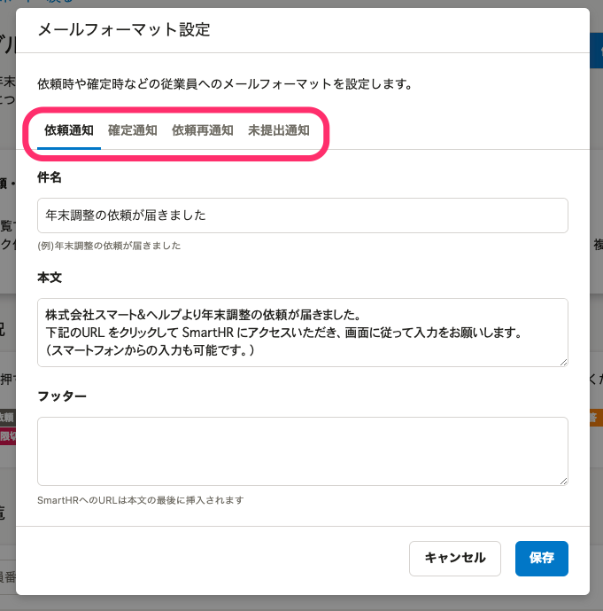

詳しくは以下のヘルプページをご覧ください。

:::related
[年末調整の通知設定をする](https://knowledge.smarthr.jp/hc/ja/articles/360053201294)
:::

#### 再通知・締切設定

 **［再通知・締切設定］** をクリックすると、従業員への依頼再通知とアンケート回答締切日を設定する画面が表示されます。

任意の日付を設定してください。

 **［再通知］** タブでは、再通知基準日、再通知開始日、再通知送信間隔を設定できます。

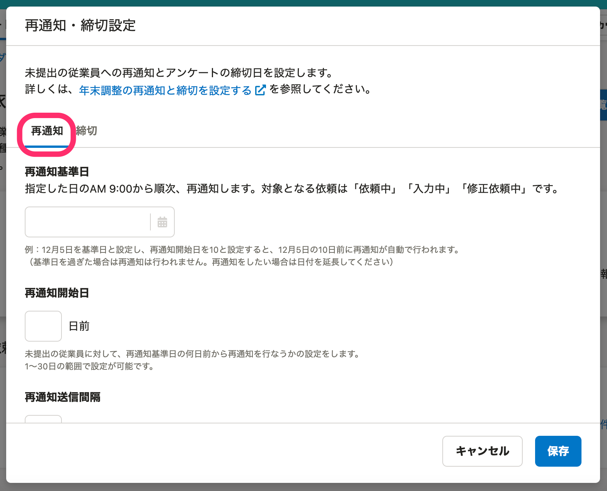

 **［締切］** タブでは、受付終了日、受付終了後表示メッセージを設定できます。

#### 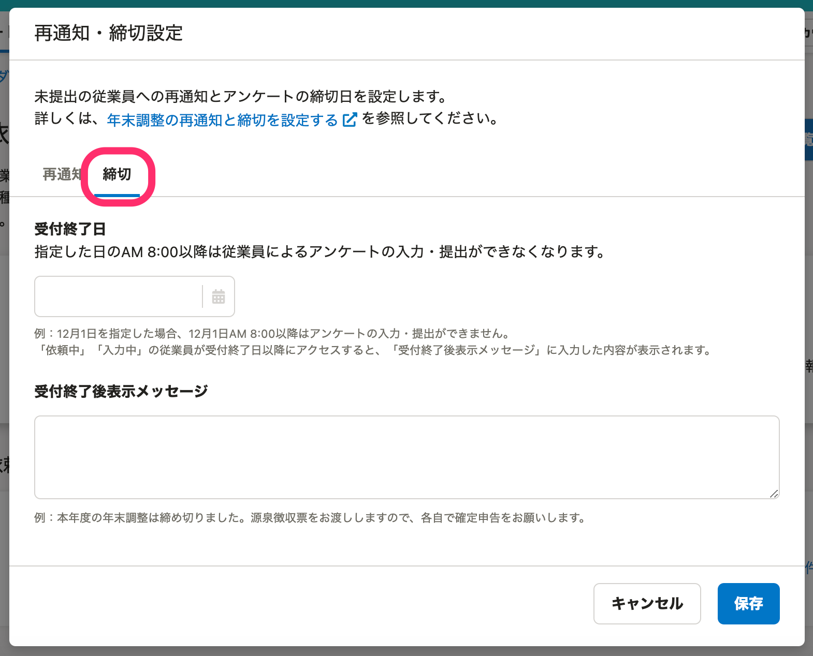

詳しくは以下のヘルプページをご覧ください。

:::related
[年末調整の再通知と締切を設定する](https://knowledge.smarthr.jp/hc/ja/articles/360037373434)
:::

#### 従業員を一括追加（CSV）

 **［従業員を一括追加（CSV）］** をクリックすると、 **［従業員の追加］** 画面が表示されます。

CSVファイルを使用して、依頼グループに従業員を一括で追加できます。

画面の案内に従ってCSVファイルの編集・アップロードをしてください。

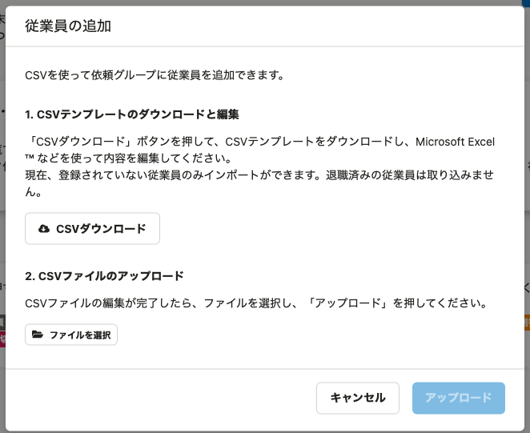

#### マイナンバーを同期

 **［マイナンバーを同期］** をクリックすると、SmartHRに登録されている従業員のマイナンバーを同期してよいか確認する画面が表示されます。

 **［同期］** をクリックすると、年末調整機能の従業員データにマイナンバー情報が同期されます。

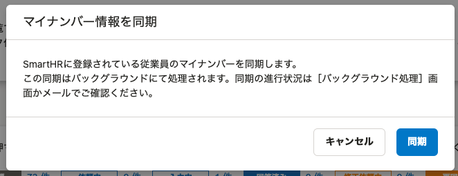

マイナンバーの同期について、関連するヘルプページは以下をご覧ください。

:::related
[マイナンバーを申告書に反映させる方法とマイナンバー関連のよくある質問](https://knowledge.smarthr.jp/hc/ja/articles/360037874034)
[マイナンバー情報を同期して「〜が存在しませんでした」というエラーがでたら？](https://knowledge.smarthr.jp/hc/ja/articles/360037548814)
:::

## 表示切替

従業員への依頼状況を、 **［依頼一覧］［書類一覧］［前職情報一覧］** の表示に切り替えます。

切り替え後の表示については、「依頼一覧画面の使い方」以降を参照してください。

## 対象従業員設定

 **［対象従業員設定］** をクリックすると、年末調整の対象となる従業員の一覧画面に移動します。

詳しくは以下のヘルプページをご覧ください。

:::related
[対象従業員設定画面の使い方](https://knowledge.smarthr.jp/hc/ja/articles/4405495781785)
:::

## 情報一括ダウンロード

 **［情報一括ダウンロード］** をクリックすると、すベての依頼グループを対象にした各データのダウンロードメニューが表示されます。

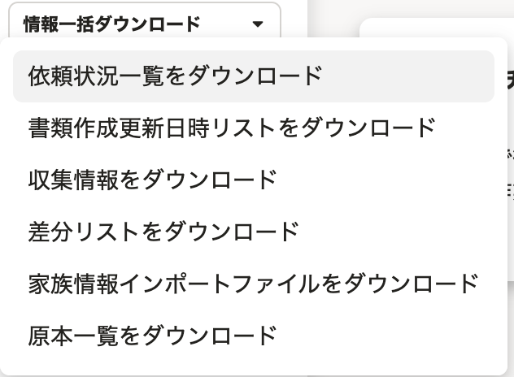

### 依頼状況一覧をダウンロード

 **［依頼状況一覧をダウンロード］** をクリックすると確認画面が表示され、すべての依頼グループの依頼状況一覧を一括ダウンロードできます。

### 書類作成更新日時リストのダウンロード

 **［書類作成更新日時リストのダウンロード］** をクリックすると確認画面が表示され、すべての書類作成更新日時リストを一括ダウンロードできます。

### 収集情報をダウンロード

 **［収集情報をダウンロード］** をクリックすると確認画面が表示され、すべての依頼グループの収集情報を一括ダウンロードできます。

対象の収集情報に応じて、ダウンロード形式やダウンロード対象項目、対象年度、項目の並びなど細かい設定が可能です。

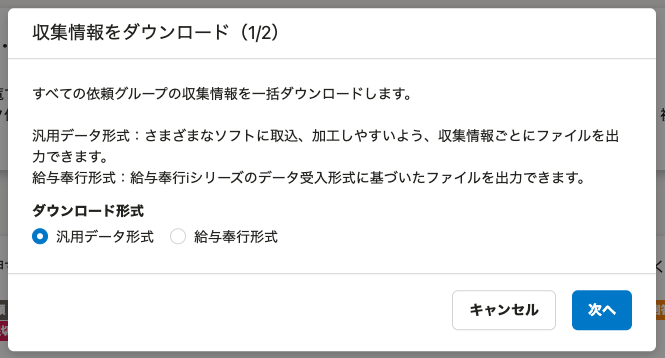

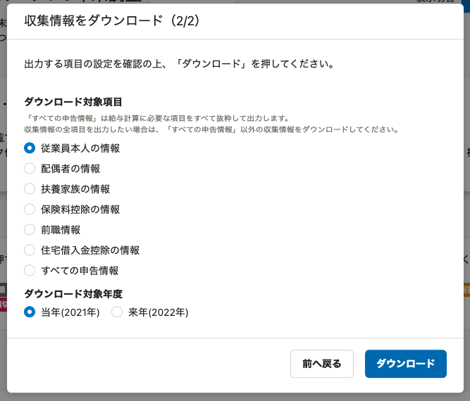

### 差分リストのダウンロード

 **［差分リストのダウンロード］** をクリックすると確認画面が表示され、すべての依頼グループの差分リストを一括ダウンロードできます。

### 家族情報インポートファイルのダウンロード

 **［家族情報インポートファイルのダウンロード］** をクリックすると確認画面が表示され、すべての依頼グループの家族情報インポートファイルを一括ダウンロードできます。

### 原本一覧のダウンロード

 **［原本一覧のダウンロード］** をクリックすると確認画面が表示され、すべての依頼グループの原本一覧を一括ダウンロードできます。

それぞれの機能について、詳しくは以下のヘルプページをご覧ください。

:::related
[収集情報をダウンロードする](https://knowledge.smarthr.jp/hc/ja/articles/360055844513)
[年末調整の差分リストとは？](https://knowledge.smarthr.jp/hc/ja/articles/360035370213)
[年末調整のデータを給与奉行形式でダウンロードする](https://knowledge.smarthr.jp/hc/ja/articles/360035370233)
[【一覧】年末調整機機能でダウンロードできるCSVファイルと使用例](https://knowledge.smarthr.jp/hc/ja/articles/4405369856281)
:::

# 依頼一覧画面の使い方

 **［表示切替］** が **［依頼一覧］** の場合の各機能を説明します。

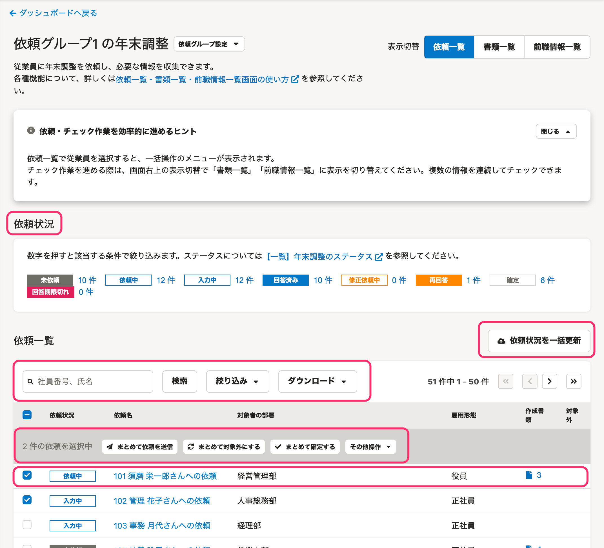

## 依頼状況

 **［依頼状況］** では、ステータスごとの件数を表示しています。進捗の状況を把握できます。

詳しくは以下のヘルプページをご覧ください。

:::related
[【一覧】年末調整のステータス](https://knowledge.smarthr.jp/hc/ja/articles/360034870834)
:::

## 依頼状況を一括更新

 **［依頼状況を一括更新］** をクリックすると、 **［依頼状況の一括更新（CSVファイルの取り込み）］** 画面が表示されます。

CSVファイルを編集して、依頼を一括で更新できます。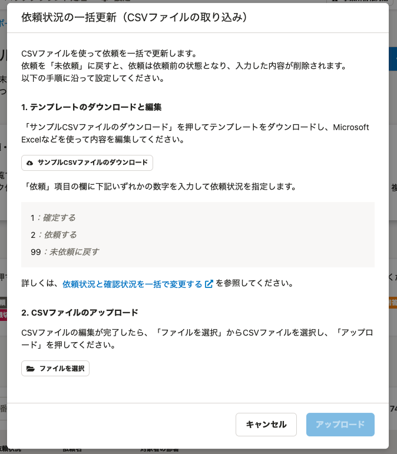

## 依頼一覧

### 従業員の検索、絞り込み、ダウンロード

画面中央の従業員検索機能を活用して、該当の従業員を容易に検索できます。

#### 従業員の検索

検索フォームに社員番号、氏名を入力すると、該当する社員を検索できます。

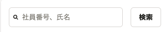

#### 絞り込み

 **［絞り込み▼］** をクリックすると、絞り込み条件を設定する画面が表示されます。

 **［依頼状況］［対象者の部署］［対象者の雇用形態］［作成書類］［対象外］［書類の作成状況］［前職情報の作成状況］** を指定して絞り込めます。

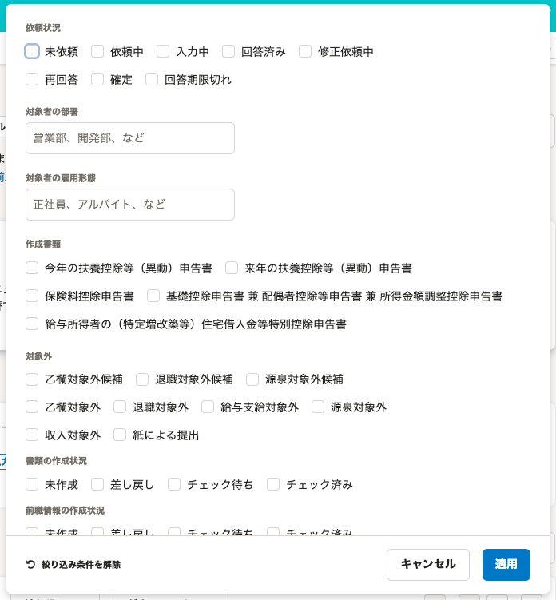

詳しくは以下のヘルプページをご覧ください。

:::related
[依頼一覧から書類または前職情報の状態で依頼を絞り込む](https://knowledge.smarthr.jp/hc/ja/articles/4405432019481)
:::

#### ダウンロード

 **［ダウンロード▼］** をクリックすると、依頼一覧に関わるデータのダウンロードメニューが表示されます。

任意の項目をダウンロードし、状況の確認が可能です。

:::alert
依頼一覧で絞り込み条件を設定していても、絞り込んだ状態の一覧はダウンロードできません。
ダウンロード後にファイルを編集してください。
:::

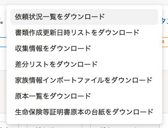

**依頼状況一覧をダウンロード**

 **［依頼状況一覧をダウンロード］** をクリックすると確認画面が表示され、依頼グループの依頼状況一覧をダウンロードできます。

**書類作成更新日時リストをダウンロード**

 **［書類作成更新日時リストをダウンロード］** をクリックすると確認画面が表示され、依頼グループの書類作成更新日時リストをダウンロードできます。

**収集情報をダウンロード**

 **［収集情報をダウンロード］** をクリックすると確認画面が表示され、依頼グループの収集情報をダウンロードできます。

対象の収集情報に応じて、ダウンロード形式やダウンロード対象項目、対象年度、項目の並びなど細かい設定が可能です。

**差分リストをダウンロード**

 **［差分リストをダウンロード］** をクリックすると確認画面が表示され、依頼グループの差分リストをダウンロードできます。
差分リストでは、年末調整の対象として従業員情報をはじめて同期した時点と、差分リストのダウンロード時点を比較し、従業員情報・家族情報に差異があるかを確認できます。

**家族情報インポートファイルをダウンロード**

 **［家族情報インポートファイルをダウンロード］** をクリックすると確認画面が表示され、依頼グループの家族情報インポートファイルをダウンロードできます。

**原本一覧をダウンロード**

 **［原本一覧をダウンロード］** をクリックすると確認画面が表示され、依頼グループの原本一覧をダウンロードできます。

**生命保険等証明書原本の台紙のダウンロード**

 **［生命保険等証明書原本の台紙のダウンロード］** をクリックすると確認画面が表示され、締め切られた依頼グループに含まれる、従業員の社員番号や氏名を記載した「生命保険料等証明書原本の台紙」をダウンロードできます。

それぞれの機能について、詳しくは以下のヘルプページをご覧ください。

:::related
[収集情報をダウンロードする](https://knowledge.smarthr.jp/hc/ja/articles/360055844513)
[年末調整の差分リストとは？](https://knowledge.smarthr.jp/hc/ja/articles/360035370213)
[年末調整のデータを給与奉行形式でダウンロードする](https://knowledge.smarthr.jp/hc/ja/articles/360035370233)
[「生命保険等証明書原本の台紙」の使用方法](https://knowledge.smarthr.jp/hc/ja/articles/4404550207769)
[【一覧】年末調整機機能でダウンロードできるCSVファイルと使用例](https://knowledge.smarthr.jp/hc/ja/articles/4405369856281)
:::

### ［依頼一覧］内の従業員一覧

 **［依頼一覧］** 内の従業員一覧では、 **［依頼状況］［依頼名］［対象者の部署］［雇用形態］［作成書類］［対象外］** を一覧で表示しています。

 **［依頼名］** をクリックすると、従業員の依頼詳細画面に移動します。

### 従業員への年末調整の依頼や確定

依頼の操作を行なう場合は、対象の従業員にチェックを入れると、項目名の下に **［まとめて依頼を送信］［まとめて対象外にする］［まとめて確定する］［その他操作▼］** が表示されます。

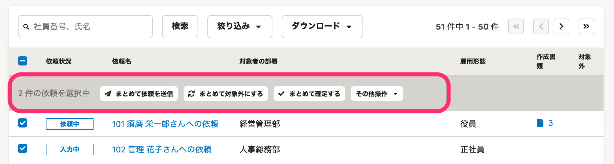

#### **まとめて依頼を送信**

 **［まとめて依頼を送信］** をクリックすると、「未依頼」の依頼に対して、依頼を送信できます。

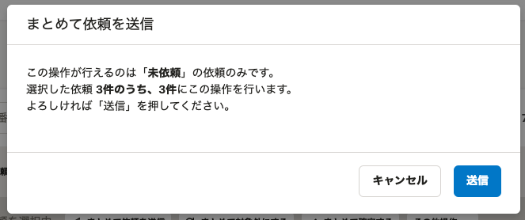

#### **まとめて対象外にする**

 **［まとめて対象外にする］** をクリックすると、 **［対象外理由］** の選択画面が表示されます。

理由を選択して **［実行］** をクリックすると、 **「未依頼」** の依頼を年末調整の対象外にできます。

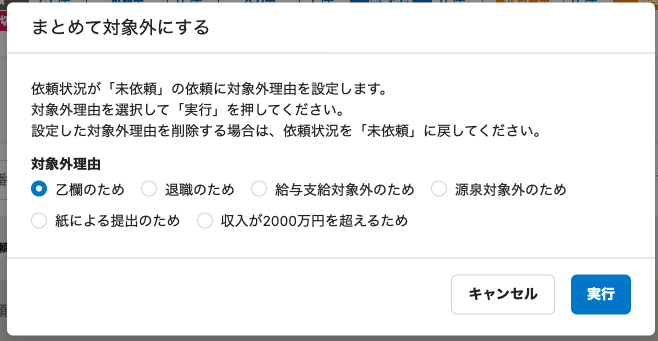

 **［対象外］** になると、依頼一覧に対象外理由が表示されます。

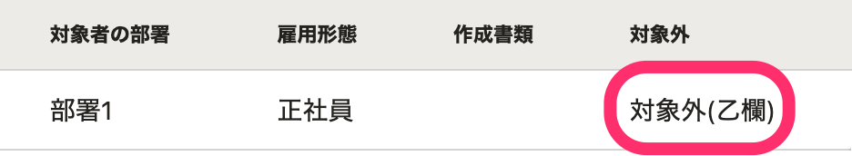

#### **まとめて確定する**

 **［まとめて確定する］** をクリックすると、 **「未依頼」「回答済み」「再回答」** の依頼を **［確定］** にできます。

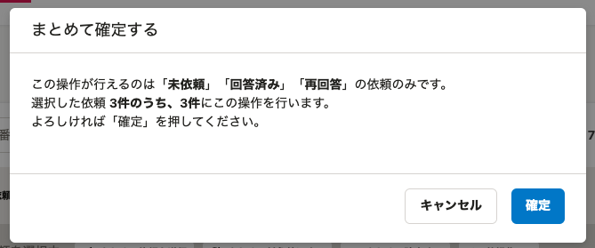

#### **その他操作**

 **［その他操作▼］** をクリックすると、再通知や未依頼に戻す操作ができます。

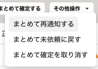

それぞれの機能について、詳しくは以下のヘルプページをご覧ください。

:::related
[年末調整を依頼する](https://knowledge.smarthr.jp/hc/ja/articles/360035370313)
[年末調整の依頼を「未依頼」に戻す](https://knowledge.smarthr.jp/hc/ja/articles/360034870774)
[「対象外候補」の従業員に再度年末調整の依頼をする](https://knowledge.smarthr.jp/hc/ja/articles/360034870754)
[依頼状況と確認状況を一括で変更する](https://knowledge.smarthr.jp/hc/ja/articles/900006685963)
:::
