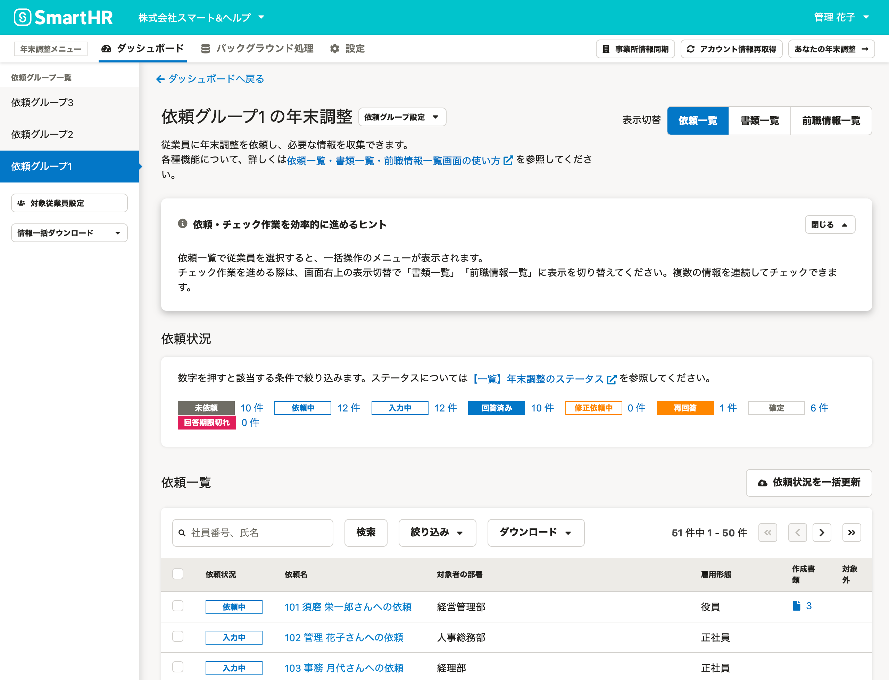
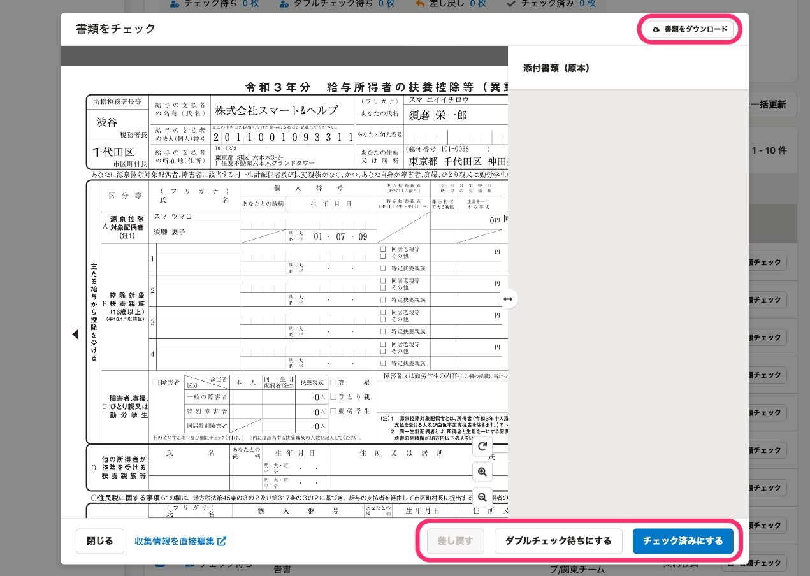
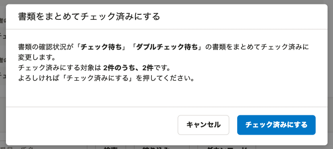

:::alert
当ページで案内しているSmartHRの年末調整機能の内容は、2021年（令和3年）版のものです。
2022年（令和4年）版の年末調整機能の公開時期は秋頃を予定しています。
なお、画面や文言、一部機能は変更になる可能性があります。
公開時期が決まり次第、[アップデート情報](https://smarthr.jp/update)でお知らせします。
:::

年末調整機能の **［書類一覧］画面** の使い方を説明します。

 **［書類一覧］** 画面は、依頼一覧画面の表示を切り替えることで閲覧できる画面です。

従業員から収集した情報をもとに作成された書類の、確認・差し戻しの状況を一覧で管理・把握できます。

# 依頼一覧・書類一覧・前職情報一覧画面（依頼一覧画面）とは

 **［依頼一覧］［書類一覧］［前職情報一覧］** 画面（依頼一覧画面）は、従業員への年末調整の依頼から進捗の把握・管理、確定までを一覧で表示する画面です。

 **［表示切替］** を使用して、 **［依頼一覧］［書類一覧］［前職情報一覧］** 画面を切り替えられ、管理者の年末調整業務をサポートします。

次に、依頼一覧・書類一覧・前職情報一覧画面（依頼一覧画面）の共通の仕様と、 **［書類一覧］** の各機能の概要を説明します。

# 依頼一覧・書類一覧・前職情報一覧画面（依頼一覧画面）の共通の仕様

依頼一覧画面の共通の仕様について、詳しくは下記のヘルプページ内「依頼一覧画面（依頼一覧・書類一覧・前職情報一覧）の共通の仕様」をご覧ください。

:::related
[依頼一覧画面の使い方](https://knowledge.smarthr.jp/hc/ja/articles/4405866743705)
:::

# 書類一覧画面の使い方

 **［表示切替］** が **［書類一覧］** 場合の各機能を説明します。

## 確認状況

 **［確認状況］** では、年末調整のアンケートをもとに作成された書類の確認状況を一覧で表示しています。

数字をクリックすると、画面下部の **［書類一覧］** に該当する社員を一覧で表示します。

下記の書類とステータスで絞り込めます。

### 作成書類

- 今年の扶養控除等（異動）申告書
- 来年の扶養控除等（異動）申告書
- 基礎控除申告書 兼 配偶者控除等申告書 兼 所得金額調整控除申告書
- 保険料控除申告書
- 給与所得者の（特定増改築等）住宅借入金等特別控除申告書

### 確認状況

- チェック待ち
- ダブルチェック待ち
- チェック済み
- 差し戻し

書類のステータスの詳細は、下記のヘルプページをご覧ください。

:::related
[【一覧】年末調整のステータス](https://knowledge.smarthr.jp/hc/ja/articles/360034870834)
:::

## 確認状況を一括更新

 **［確認状況を一括更新］** をクリックすると、 **［書類・前職情報確認状況の一括更新（CSVファイルの取り込み）］** 画面が表示されます。

CSVファイルを使って書類・前職情報の確認状況を一括で更新できます。

:::related
[依頼状況と確認状況を一括で変更する](https://knowledge.smarthr.jp/hc/ja/articles/900006685963)
:::

## 書類一覧

### 従業員の検索、絞り込み、ダウンロード

画面中央の従業員検索機能を活用して、該当の従業員を容易に検索できます。

#### 検索フォーム

 **［検索フォーム］** に社員番号、氏名を入力すると、該当する社員を検索できます。

#### 絞り込み

 **［絞り込み▼］** をクリックすると、絞り込み条件を設定する画面が表示されます。

 **［確認状況］［作成書類］［対象者の部署］［対象者の雇用形態］** を指定して書類を絞り込めます。

:::tips
団体保険しか申告しない保険料控除等申告書を絞り込むには、 **［保険料控除申告書］** にチェックを入れ、 **［団体保険のみの保険料控除申告書］** を選択して **［適用］** をクリックしてください。
:::

#### ダウンロード

 **［ダウンロード］** をクリックすると、書類PDFを一括でダウンロードできます。

なお、書類一覧で絞り込み条件を設定していても、絞り込んだ状態の一覧はダウンロードできません。

ダウンロード後にファイルを編集してください。

### ［書類一覧］内の従業員一覧

 **［書類一覧］** 内の従業員一覧では、 **［確認状況］［書類名］［対象者の部署］［対象者の雇用形態］［操作］** を一覧で表示しています。

### 書類チェック

 **［書類チェック］** をクリックすると、 **［書類をチェック］** 画面が表示されます。

書類の確認はプレビュー画面上でできるほか、 **［書類をダウンロード］** から書類のPDFファイルをダウンロードして確認する方法もあります。

確認後は、 **［チェック済みにする］［ダブルチェック待ちにする］［差し戻す］** のいずれかをクリックして書類のステータスを変更してください。

### 書類の一括操作

 **［書類一覧］** 画面で対象の従業員にチェックを入れると、項目名の下に **［選択した書類をまとめてチェック］［選択した書類をチェック済みにする］** が表示されます。

#### **選択した書類をまとめてチェック**

 **［選択した書類をまとめてチェック］** をクリックすると、 **［書類をチェック］** 画面が表示されます。

プレビュー画面に表示されている **［<］［>］** をクリックすると従業員を切り替えられ、複数の従業員の書類をまとめてチェックできます。

#### **選択した書類をチェック済みにする**

 **［選択した書類をチェック済みにする］** をクリックすると、 **［書類をまとめてチェック済みにする］** 画面が表示されます。

 **［チェック済みにする］** をクリックすると、書類の確認状況が **［チェック待ち］［ダブルチェック待ち］** の書類を、まとめてチェック済みに変更します。

:::related
[従業員から提出された年末調整を確認する](https://knowledge.smarthr.jp/hc/ja/articles/360034870254)
[従業員から提出された年末調整の書類をまとめて確認する](https://knowledge.smarthr.jp/hc/ja/articles/360055393313)
[書類のダブルチェック機能を使う](https://knowledge.smarthr.jp/hc/ja/articles/360054031913)
[提出された書類を従業員に差し戻す](https://knowledge.smarthr.jp/hc/ja/articles/360053238834)
:::
