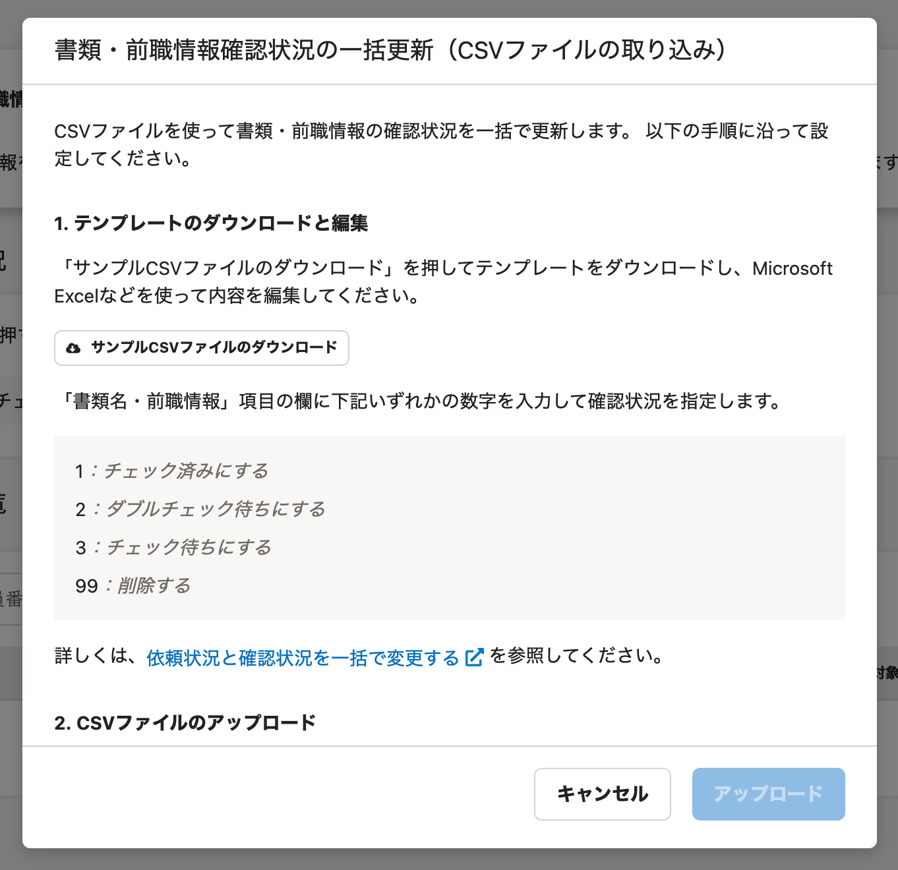

:::alert
当ページで案内しているSmartHRの年末調整機能の内容は、2021年（令和3年）版のものです。
2022年（令和4年）版の年末調整機能の公開時期は秋頃を予定しています。
なお、画面や文言、一部機能は変更になる可能性があります。
公開時期が決まり次第、[アップデート情報](https://smarthr.jp/update)でお知らせします。
:::

年末調整機能の **［前職情報一覧］** 画面の使い方を説明します。

 **［前職情報一覧］** 画面は、依頼一覧画面の表示を切り替えることで閲覧できる画面です。

今年入社した従業員の前職情報や源泉徴収票の原本提出状況などを把握できます。

また、従業員の手元に源泉徴収票がある場合、年末調整のアンケートで源泉徴収票の内容を入力してもらうと、管理者が内容を確認できます。

# 依頼一覧・書類一覧・前職情報一覧画面（依頼一覧画面）とは

 **［依頼一覧］［書類一覧］［前職情報一覧］** 画面（依頼一覧画面）は、従業員への年末調整の依頼から進捗の把握・管理、確定までを一覧で表示する画面です。

 **［表示切替］** を使用して、 **［依頼一覧］［書類一覧］［前職情報一覧］** 画面を切り替えられ、管理者の年末調整業務をサポートします。

次に、依頼一覧・書類一覧・前職情報一覧画面（依頼一覧画面）の共通の仕様と、 **［前職情報一覧］** の各機能の概要を説明します。

# 依頼一覧・書類一覧・前職情報一覧画面（依頼一覧画面）の共通の仕様

依頼一覧画面の共通の仕様について、詳しくは下記のヘルプページ内「依頼一覧画面（依頼一覧・書類一覧・前職情報一覧）の共通の仕様」をご覧ください。

:::related
[依頼一覧画面の使い方](https://knowledge.smarthr.jp/hc/ja/articles/4405866743705)
:::

# 前職情報一覧画面の使い方

 **［表示切替］** が **［前職情報一覧］** の場合の各機能を説明します。

## 確認状況

 **［確認状況］** では、従業員の前職情報について、担当者による書類確認状況を一覧で表示しています。

数字をクリックすると、画面下部の **［前職一覧］** に該当する社員を一覧で表示します。

下記のステータスで絞り込めます。

- チェック待ち
- ダブルチェック待ち
- チェック済み
- 差し戻し

書類のステータスについて、詳しくは下記のヘルプページをご覧ください。

:::related
[【一覧】年末調整のステータス](https://knowledge.smarthr.jp/hc/ja/articles/360034870834)
:::

## 確認状況を一括更新

 **［確認状況を一括更新］** をクリックすると、 **［書類・前職情報確認状況の一括更新（CSVファイルの取り込み）］** 画面が表示されます。

CSVファイルを使って書類・前職情報の確認状況を一括で更新できます。

:::related
[依頼状況と確認状況を一括で変更する](https://knowledge.smarthr.jp/hc/ja/articles/900006685963)
:::

## 前職一覧

### 従業員の検索、絞り込み

画面中央の従業員検索機能を活用して、該当の従業員を検索できます。

#### 検索フォーム

 **［検索フォーム］** に社員番号、氏名を入力すると、該当する社員を検索できます。

#### 絞り込み

 **［絞り込み▼］** をクリックすると、絞り込み条件を設定する画面が表示されます。

 **［確認状況］［部署］［雇用形態］** を指定して絞り込めます。

### ［前職一覧］内の従業員一覧

 **［前職一覧］** 内の従業員一覧では、 **［確認状況］［前職情報名］［原本の所在］［対象者の部署］［対象者の雇用形態］［操作］** を一覧で表示しています。

### 前職情報チェック

 **［前職情報チェック］** をクリックすると、 **［前職情報をチェック］** 画面が表示されます。

すでに源泉徴収票を提出済みの場合は、 **［源泉徴収票の所在］** には **［提出済み］** と表示されます。

従業員が源泉徴収票の内容をアンケートで入力した場合は、入力内容が表示されます。

確認後は、 **［チェック済みにする］［ダブルチェック待ちにする］［差し戻す］** をクリックして書類のステータスを進行してください。

### 前職情報の一括操作

 **［前職情報一覧］** 画面で対象の従業員にチェックを入れると、項目名の下に **［選択した前職情報をまとめてチェック］［選択した前職情報をチェック済にする］** が表示されます。

#### 選択した前職情報をまとめてチェック

 **［選択した前職情報をまとめてチェック］** をクリックすると、 **［前職情報をチェック］** 画面が表示されます。

プレビュー画面に表示されている **［<］［>］** をクリックすると従業員を切り替えられ、複数の従業員の前職情報をチェックできます。

#### 選択した前職情報をチェック済みにする

 **［選択した前職情報をチェック済みにする］** をクリックすると、 **［前職情報をまとめてチェック済みにする］** 画面が表示されます。

 **［チェック済みにする］** をクリックすると、確認状況が **［チェック待ち］［ダブルチェック待ち］** の前職情報をまとめてチェック済みにできます。

:::related
[提出された書類を従業員に差し戻す](https://knowledge.smarthr.jp/hc/ja/articles/360053238834)
[源泉徴収票を見て前職の情報を入力する](https://knowledge.smarthr.jp/hc/ja/articles/360034870614)
[前職の源泉徴収票を入手できない場合は？](https://knowledge.smarthr.jp/hc/ja/articles/360035657974)
:::
