:::alert
当ページで案内しているSmartHRの年末調整機能の内容は、2021年（令和3年）版のものです。
2022年（令和4年）版の年末調整機能の公開時期は秋頃を予定しています。
なお、画面や文言、一部機能は変更になる可能性があります。
公開時期が決まり次第、[アップデート情報](https://smarthr.jp/update)でお知らせします。
:::

年末調整機能の依頼詳細画面の使い方を説明します。

# 依頼詳細画面とは

依頼詳細画面は、年末調整に関する従業員ごとの情報を確認できる画面です。

収集情報をもとに作成された扶養控除等（異動）申告書などの書類チェックも可能です。

また、依頼にあたって管理者のメモを残せます。

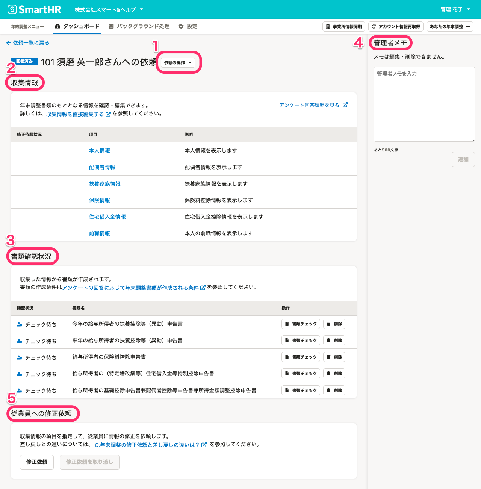

次に、ページ内の要素を下記の5つに分けて、依頼詳細画面の各機能の概要を説明します。

1.  依頼の操作
2.  収集情報の確認・編集
3.  書類確認状況
4.  管理者メモ
5.  従業員への修正依頼

# 1\. 依頼の操作

 **［依頼の操作▼］** をクリックすると、 **［操作履歴］**  **［生命保険等証明書原本の台紙ダウンロード］** のメニューが表示されます。

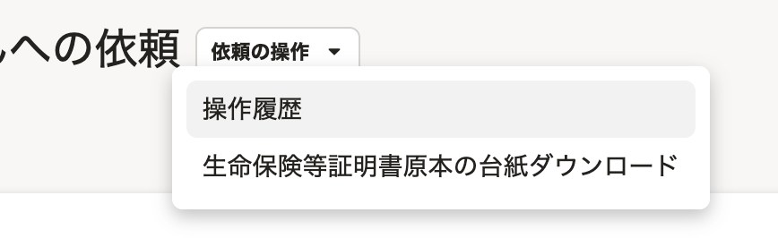

## 操作履歴

 **［操作履歴］** をクリックすると、年末調整を依頼した従業員ごとに、いつ・誰が・どのような操作をしたかを確認できます。

チームでの情報共有にご活用ください。

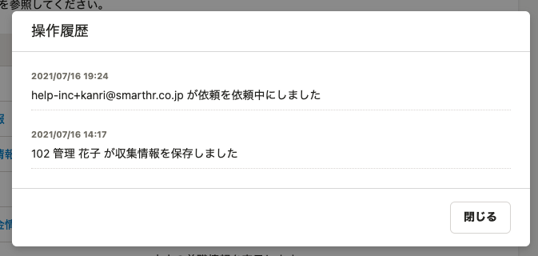

詳しくは以下のヘルプページをご覧ください。

:::related
[年末調整の操作履歴を確認する](https://knowledge.smarthr.jp/hc/ja/articles/360037875833)
:::

## 生命保険等証明書原本の台紙ダウンロード

 **［生命保険等証明書原本の台紙ダウンロード］** をクリックすると、事業所名や従業員名が記載された **［生命保険等証明書原本の台紙］** のダウンロード画面に移動します。

PDFファイルのダウンロードと印刷が可能です。従業員の原本提出用にご活用ください。

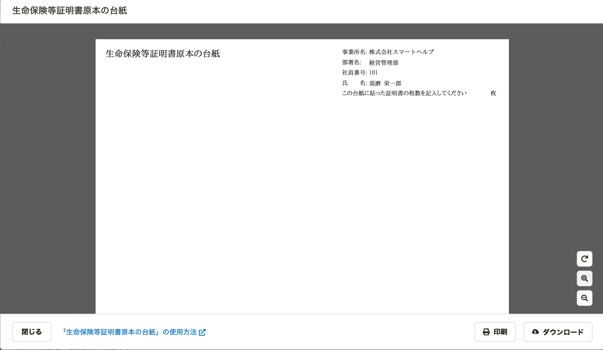

詳しくは以下のヘルプページをご覧ください。

:::related
[「生命保険等証明書原本の台紙」の使用方法](https://knowledge.smarthr.jp/hc/ja/articles/4404550207769)
:::

# 2\. 収集情報の確認・編集

 **［収集情報］** では、従業員のアンケート回答履歴をもとに集約された **［本人情報］** や **［配偶者情報］** などの従業員情報を確認・編集できます。

確認したい収集情報の **［項目］** をクリックすると、収集情報画面に移動して詳細を確認できます。

従業員がアンケートでどのように回答したのかを確認したい場合は、 **［アンケート回答履歴を見る］** をクリックすると、新しいウィンドウでアンケート回答画面が表示されます。

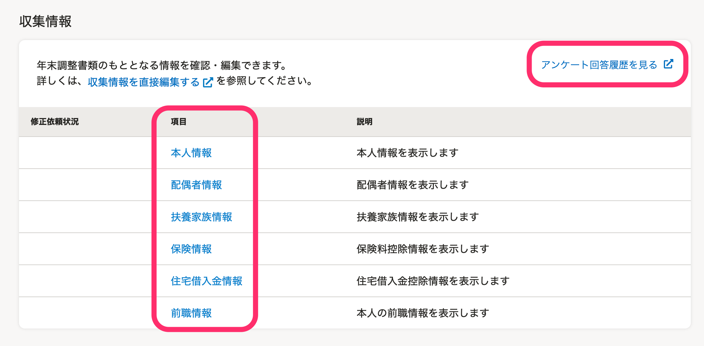

詳しくは以下のヘルプページをご覧ください。

:::related
[収集情報画面の使い方](https://knowledge.smarthr.jp/hc/ja/articles/4405483932825)
[年末調整のアンケート回答履歴を確認する](https://knowledge.smarthr.jp/hc/ja/articles/360053297094)
[収集情報を直接編集し、従業員に代わって書類を作成する](https://knowledge.smarthr.jp/hc/ja/articles/360035657114)
:::

# 3\. 書類確認状況

 **［書類確認状況］** では、収集情報から作成された書類の一覧と管理者によるチェック状況を表示しています。

 **［書類チェック］** と **［削除］** を使用して、任意の従業員の書類を確認・操作できます。

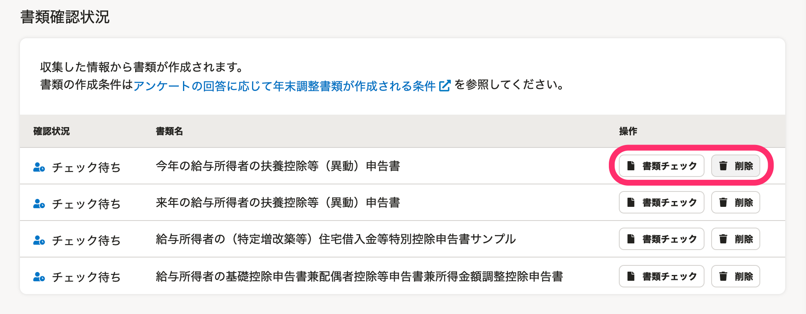

## 書類チェック

 **［書類チェック］** をクリックすると、作成された書類のプレビュー画面が表示されます。

作成書類に対して、 **［チェック済みにする］［ダブルチェック待ちにする］［差し戻す］［書類をダウンロード］** の操作が可能です。

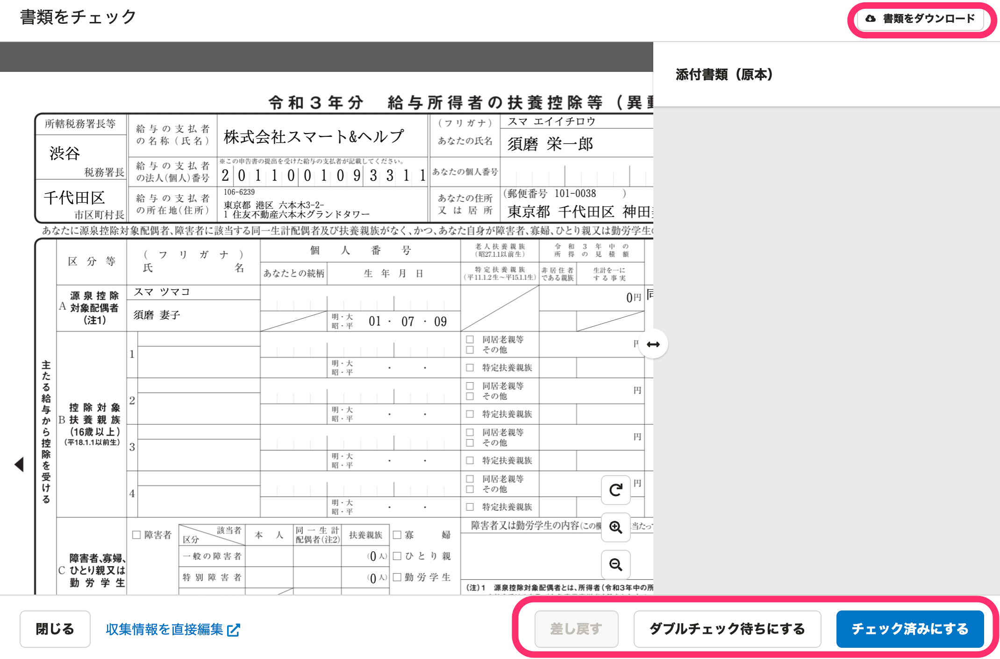

## 削除

 **［削除］** をクリックすると、 **［パスワードの確認］** 画面が表示されます。

ログインパスワードを入力して、 **［確認する］** をクリックしてください。

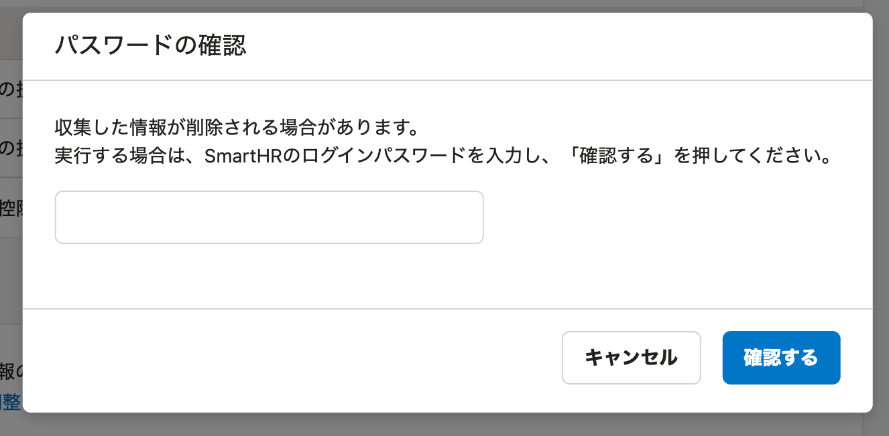

書類を削除してよいか確認画面が表示されるので、 **［削除する］** をクリックしてください。

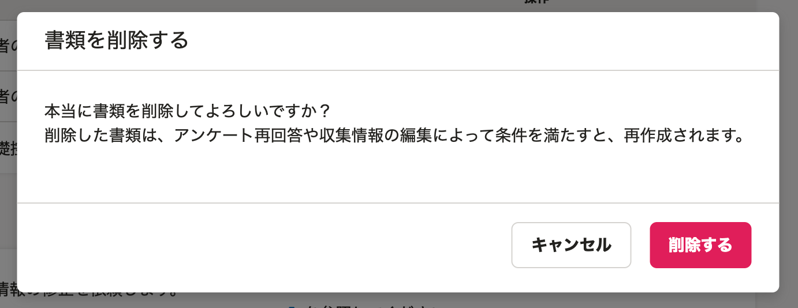

詳しくは以下のヘルプページをご覧ください。

:::related
[従業員から提出された年末調整を確認する](https://knowledge.smarthr.jp/hc/ja/articles/360034870254)
[書類のダブルチェック機能を使う](https://knowledge.smarthr.jp/hc/ja/articles/360054031913)
[提出された書類を従業員に差し戻す](https://knowledge.smarthr.jp/hc/ja/articles/360053238834)
[年末調整で作成された書類を削除する](https://knowledge.smarthr.jp/hc/ja/articles/360040698513)
[依頼一覧・書類一覧・前職情報一覧画面の使い方](https://knowledge.smarthr.jp/hc/ja/articles/4405128387865)
:::

# 4\. 管理者メモ

従業員への依頼ごとに管理者メモを残せます。

複数名の担当者間の情報共有や、備忘録などにご活用ください。

なお、管理者メモは編集・削除ができませんのでご注意ください。

詳しくは以下のヘルプページをご覧ください。

:::related
[年末調整を確認する際に管理者メモを使う](https://knowledge.smarthr.jp/hc/ja/articles/360036159354)
:::

# 5\. 従業員への修正依頼

従業員がアンケートに回答すると、依頼詳細画面の最下部に **［従業員への修正依頼］** が表示されます。

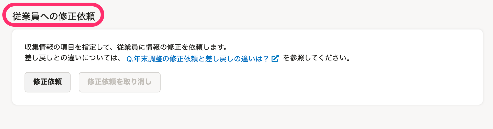

 **［修正依頼］** をクリックすると、 **［従業員への修正依頼］** 画面が表示されます。

修正項目にチェックを入れ、修正してほしい内容をコメントして **［修正依頼］** をクリックすると、従業員に修正依頼が通知されます。

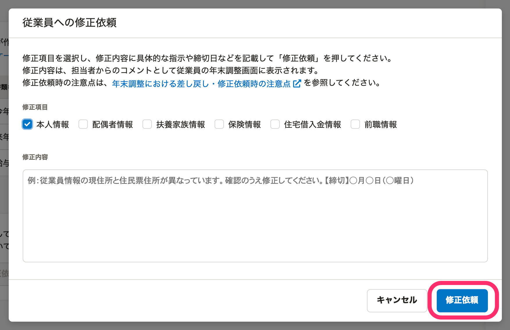

入力したコメントは、担当者からのコメントとして従業員の年末調整画面に表示されます。

なお、修正依頼を取り消したい場合は、 **［修正依頼を取り消し］** をクリックしてください。

詳しくは以下のヘルプページをご覧ください。

:::related
[従業員に年末調整の修正依頼を出す](https://knowledge.smarthr.jp/hc/ja/articles/360057982273)
[年末調整における差し戻し・修正依頼時の注意点](https://knowledge.smarthr.jp/hc/ja/articles/4404346639001)
:::
