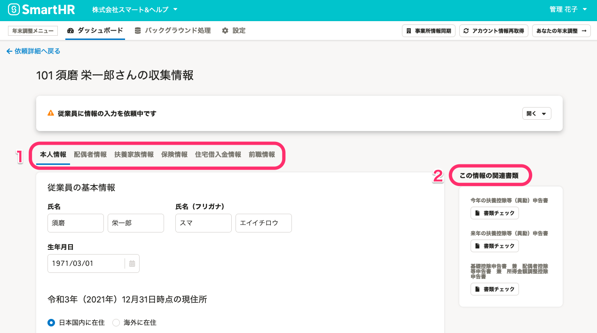
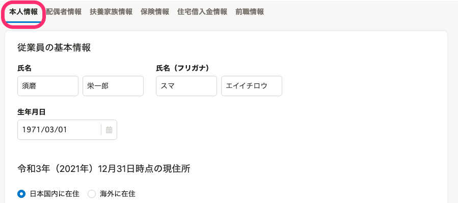
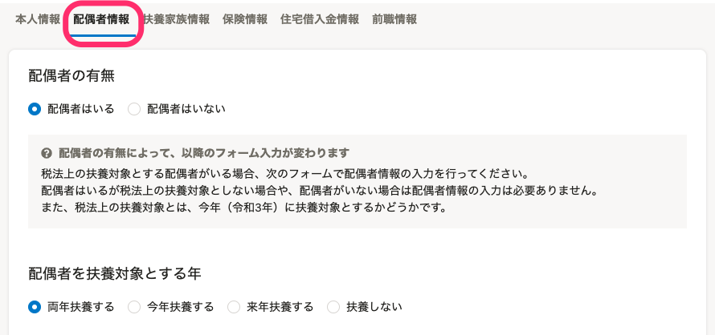
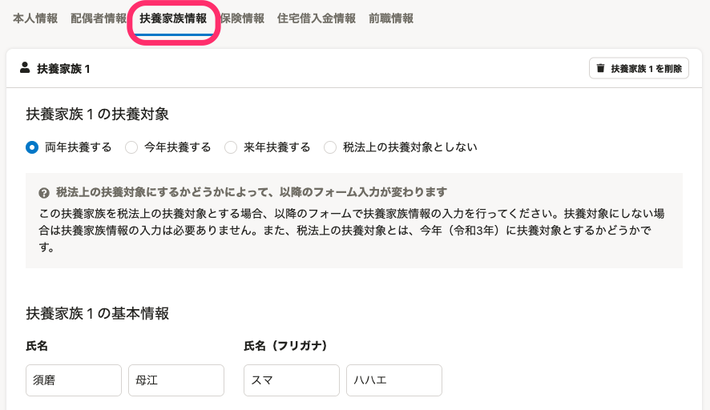
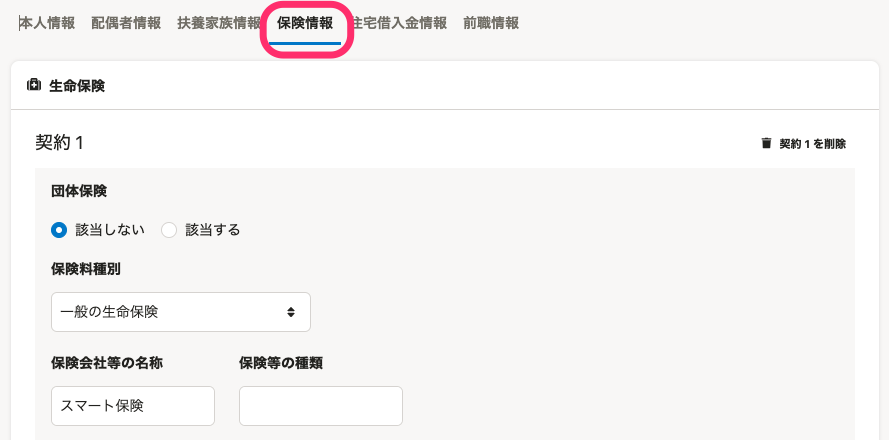
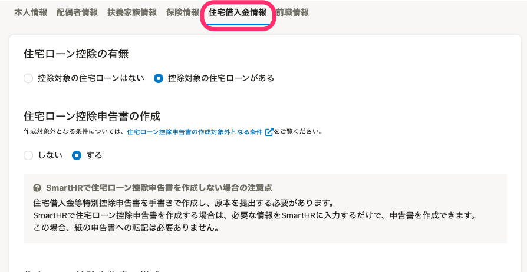
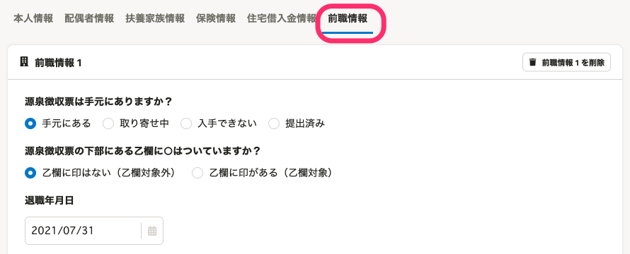
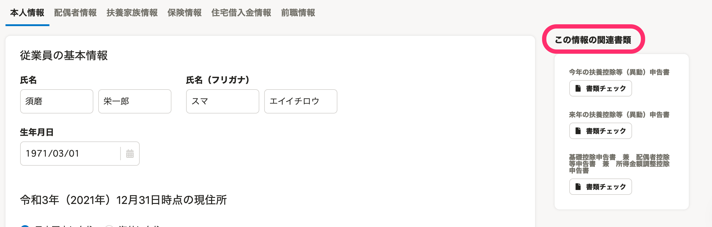
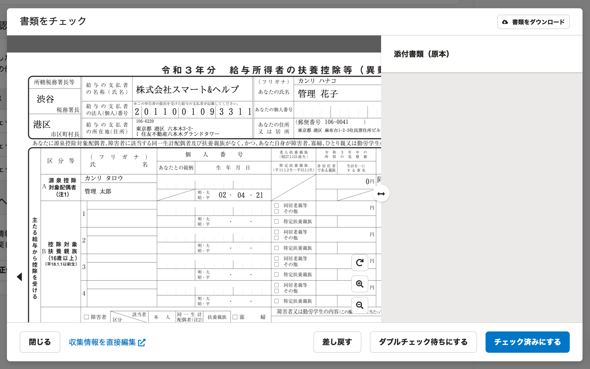

:::alert
当ページで案内しているSmartHRの年末調整機能の内容は、2021年（令和3年）版のものです。
2022年（令和4年）版の年末調整機能の公開時期は秋頃を予定しています。
なお、画面や文言、一部機能は変更になる可能性があります。
公開時期が決まり次第、[アップデート情報](https://smarthr.jp/update)でお知らせします。
:::

年末調整機能の収集情報画面の使い方を説明します。

# 収集情報画面とは

依頼詳細画面で **［収集情報］** の項目をクリックすると、収集情報画面に移動します。

この画面では、年末調整で使用する書類のもととなる情報を、確認・編集できます。

次に、「収集情報の確認・編集」「この情報の関連書類」の2つに分けて、収集情報画面の各項目の概要を説明をします。

# 1\. 収集情報の確認・編集

タブで表示を切り替えて、 **［本人情報］［配偶者情報］［扶養家族情報］［保険情報］［住宅借入金情報］［前職情報］** を確認・編集できます。

なお、管理者は直接収集情報を編集できますが、ステータスが **［依頼中］** の場合は編集できません。

## 本人情報

 **［本人情報］** タブでは、従業員の基本情報（氏名・生年月日）、住所、所得見積、勤労学生情報、障害者情報、事実婚の有無、寡婦・ひとり親についての情報を確認できます。

## 配偶者情報

 **［配偶者情報］** タブでは、配偶者の有無、配偶者を扶養対象とする年、配偶者の基本情報（氏名・生年月日）、配偶者の住所、障害者情報、配偶者の所得見積りについての情報を確認できます。

## 扶養家族情報

 **［扶養家族情報］** タブでは、税法上の扶養家族にするかどうかの確認、扶養家族の基本情報（氏名や生年月日、性別、税法上の扶養になった日など）、扶養家族の住所、障害者区分、所得見積りについての情報を確認できます。

## 保険情報

 **［保険情報］** タブでは、生命保険、地震保険、社会保険、小規模企業共済に関する契約内容について確認できます。

## 住宅借入金情報

 **［住宅借入金情報］** タブでは、控除対象の住宅ローンの有無、住宅ローン控除申告書の作成の可否、申告書の様式、住宅ローンの情報（居住開始年月日、家屋や土地等の総床面積又は総面積、家屋や土地等の取得対価の額、控除区分など）、借入金融機関、合計年末残高についての情報を確認できます。

:::tips
**SmartHRで住宅ローン控除申告書を作成しない場合の注意点**
住宅借入金等特別控除申告書を手書きで作成し、原本を提出する必要があります。
SmartHRで住宅ローン控除申告書を作成する場合は、必要な情報をSmartHRに入力するだけで、申告書を作成できます。
この場合、紙の申告書への転記は必要ありません。
:::

## 前職情報

 **［前職情報］** タブでは、源泉徴収票が手元にあるかどうか、乙欄の対象か、退職年月日、支払者の氏名または名称、支払金額などの情報を確認できます。

収集情報の編集方法、ダウンロードについては、以下のヘルプページをご覧ください。

:::related
[収集情報を直接編集する](https://knowledge.smarthr.jp/hc/ja/articles/360035657114)
[収集情報をダウンロードする](https://knowledge.smarthr.jp/hc/ja/articles/360055844513)
:::

# 2\. この情報の関連書類

従業員がアンケートに回答すると、 **［この情報の関連書類］** に作成された書類が表示されます。

 **［書類チェック］** をクリックすると、該当の従業員に関する「今年の扶養控除等（異動）申告書」や「基礎控除申告書　兼　配偶者控除等申告書　兼　所得金額調整控除申告書」などのプレビュー画面が表示され、書類を確認できます。

詳しくは以下のヘルプページをご覧ください。

:::related
[従業員から提出された年末調整を確認する](https://knowledge.smarthr.jp/hc/ja/articles/360034870254)
[書類のダブルチェック機能を使う](https://knowledge.smarthr.jp/hc/ja/articles/360054031913)
[提出された書類を従業員に差し戻す](https://knowledge.smarthr.jp/hc/ja/articles/360053238834)
:::
