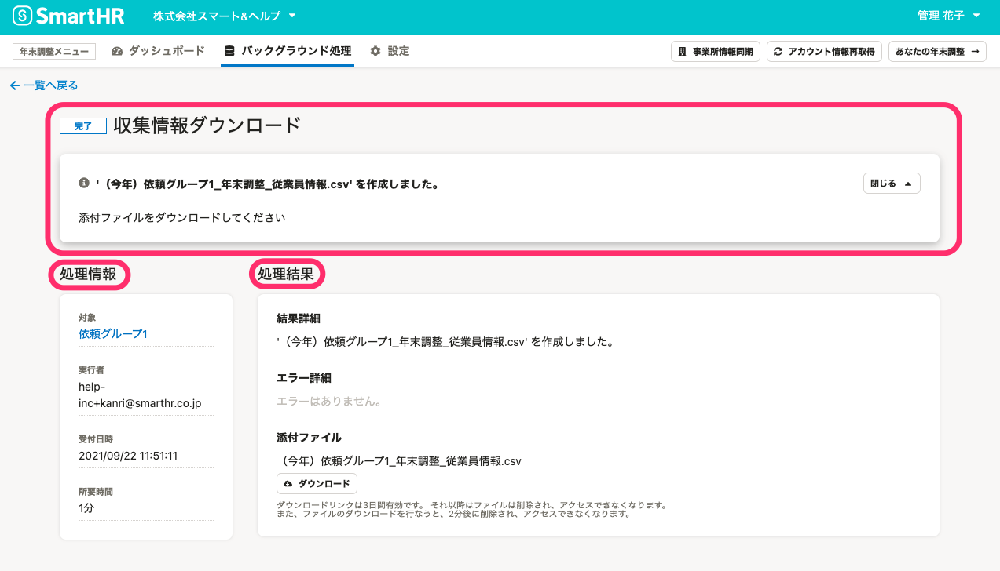

:::alert
当ページで案内しているSmartHRの年末調整機能の内容は、2021年（令和3年）版のものです。
2022年（令和4年）版の年末調整機能の公開時期は秋頃を予定しています。
なお、画面や文言、一部機能は変更になる可能性があります。
公開時期が決まり次第、[アップデート情報](https://smarthr.jp/update)でお知らせします。
:::

年末調整機能のバックグラウンド処理画面の使い方を説明します。

# バックグラウンド処理画面とは

年末調整メニューの **［バックグラウンド処理］** をクリックすると、バックグラウンド処理結果を一覧で表示した画面に移動します。

この画面では、これまでに実行したダウンロードやアップロードなどの一括操作の結果を確認できます。

# バックグラウンド処理が行なわれるケース

年末調整機能で下記の操作を行なった場合に、バックグラウンド処理が実行されます。

| **対象画面** | **操作内容** | **詳細・備考** |
| --- | --- | --- |
| 年末調整メニュー | 事業所情報の同期 | SmartHRに登録されている［事業所情報］と［続柄］を同期した場合 |
| ［設定］>［権限設定］>［権限を同期］ | SmartHRに登録されている最新の権限を年末調整機能に同期した場合 |
| 対象従業員設定画面 |   ［インポート▼］メニューから該当項目を実行   |   下記のいずれかを選択し、年末調整機能にデータのインポート・削除を行なった場合  - 依頼グループをインポート - 昨年の保険料をインポート - 団体保険料をインポート・削除 - 企業型確定拠出年金をインポート・削除   |
| 従業員情報を同期 |   SmartHRに登録されている従業員情報を年末調整機能に同期した場合   |
| 従業員タブの［ダウンロード］ | 年末調整の対象となる従業員と依頼グループの一覧をダウンロードした場合 |
| すべての従業員にチェックを入れ、［選択した従業員を削除］を選択 | すべての従業員を一括削除した場合 |
|   依頼一覧画面・書類一覧画面・前職情報一覧画面共通   |   ［依頼グループ設定▼］メニューから該当項目を実行   |   下記のいずれかを選択し、依頼グループに関わる設定を行なった場合  - アンケートのヒントメッセージ一括設定（CSV） - 従業員を一括追加（CSV） - マイナンバーを同期   |
| ［情報一括ダウンロード▼］から該当項目を実行 |   下記のいずれかを選択し、すべての依頼グループを対象にした、データのダウンロードをした場合  - 依頼状況一覧をダウンロード - 書類作成更新日時リストをダウンロード - 収集情報をダウンロード - 差分リストのダウンロード - 家族情報インポートファイルをダウンロード - 原本一覧をダウンロード   |
| 依頼一覧画面 | 依頼状況を一括更新 | 依頼状況の一括更新（CSVファイルの取り込み）を行なった場合 |
| 依頼一覧の［ダウンロード］から該当項目を実行 |   下記のいずれかを選択し、特定の依頼グループを対象に、データのダウンロードをした場合  - 依頼状況一覧をダウンロード - 書類作成更新日時リストをダウンロード - 収集情報をダウンロード - 差分リストをダウンロード - 家族情報インポートファイルをダウンロード - 原本一覧をダウンロード - 生命保険等証明書原本の台紙をダウンロード   |
| 依頼の操作 |   下記のいずれかの操作を行なった場合  - まとめて依頼を送信 - まとめて対象外にする - まとめて確定する - その他操作（まとめて再通知する、まとめて未依頼に戻す、まとめて確定を取り消す）   |
| 書類一覧画面 | 確認状況を一括更新 | 書類・前職情報確認状況の一括更新（CSVファイルの取り込み）を行なった場合 |
| 書類一覧の［ダウンロード］から対象を選択 |   下記のいずれかの書類をダウンロードをした場合  - 今年の扶養控除等（異動）申告書 - 来年の扶養控除等（異動）申告書 - 基礎控除申告書 兼 配偶者控除等申告書 兼 所得金額調整控除申告書 - 給与所得者の保険料控除申告書 - 給与所得者の（特定増改築等）住宅借入金等特別控除申告書   |
| 前職情報一覧画面 | 確認状況を一括更新 | 書類・前職情報確認状況の一括更新（CSVファイルの取り込み）を行なった場合 |

バックグラウンド処理をともなう操作を行なった場合、「｛処理名｝を受け付けました。処理の結果は［バックグラウンド処理］で確認してください」というメッセージが表示されます。

# バックグラウンド処理画面の見方

バックグラウンド処理画面の各項目の概要を説明をします。

## バックグラウンド処理の結果一覧画面

年末調整メニューから **［バックグラウンド処理］** をクリックすると、一括操作の結果を一覧で表示した画面が表示されます。

この結果一覧は、 **［ステータス］［処理名］［受付日時］［メッセージ］** で構成され、受付日時の新しいものから降順で表示されます。

### ステータス

バックグラウンド処理の進行状況と結果に応じて、ステータス表示が切り替わります。

各ステータスの内容は下記のとおりです。

| **ステータス表示** | **内容** |
| --- | --- |
| 実行中 | バックグラウンド処理が実行中の場合に表示します |
| 完了 | バックグラウンド処理が完了した場合に表示します |
| 完了（エラーあり） | バックグラウンド処理は完了したが、一部の項目でエラーが発生した場合に表示します |
| エラー | バックグラウンド処理が実行できなかった場合に表示します |

### 処理名

バックグラウンド処理の実行内容を、「｛依頼グループ名｝処理内容」で表示します。

### 受付日時

バックグラウンド処理を実行した日時を表示します。

バックグラウンド処理をともなう操作を行なったのが当日中であれば、「約5分前」「約1時間前」「約14時間前」など24時間表記で処理を行なった時間を表示します。

前日以前であれば「3日前」など日数を表示します。

### メッセージ

処理結果の要点を表示します。

処理の結果エラーがあった場合は、エラー理由も表示されます。

## バックグラウンド処理の詳細画面

 **［バックグラウンド処理］** の結果一覧画面で、 **［処理名］** 欄の項目名をクリックすると、処理結果の詳細画面に移動します。

詳細画面では、処理結果の詳細や、作成したCSVファイルのダウンロード、エラー理由が確認できます。

この詳細画面は、 **［ステータス・処理名・メッセージ］［処理情報］［処理結果］** で構成されています。

### ステータス・処理名・メッセージ

詳細画面の上部には、バックグラウンド処理の内容と結果、ステータスを表示します。

### 処理情報

 **［処理情報］** 欄では、 **［対象］［実行者］［受付日時］［所要時間］** を確認できます。

どの依頼グループを対象に、誰が（どのメールアドレスアカウントが）、いつ操作を実行したのか、処理時間がどれだけかかったのかを確認できます。

なお、 **［権限を同期］［従業員情報を同期］** など年末調整機能全体にかかわる設定や、すべての依頼グループを対象とする **［情報一括ダウンロード］** を行なった場合、 **［対象］** の項目は表示されません。

### 処理結果

 **［処理結果］** では、 **［結果詳細］［エラー詳細］［添付ファイル］** を確認できます。

 **［結果詳細］** では、実行した処理の内容とその結果を表示します。

 **［エラー詳細］** では、バックグラウンド処理でなにかしらのエラーが発生した場合に、その理由を表示します。

エラーがない場合は、「エラーはありません。」と表示されます。

 **［添付ファイル］** には、処理内容・処理結果に応じて、主に２つのファイルが添付されます。

- 収集情報や差分リストなど、年末調整の確認作業で使用するデータをまとめたZIPファイルやCSVファイル
- エラーが発生した場合に、エラー理由の詳細をまとめたCSVファイル

 **［ダウンロード］** をクリックして、作成されたCSVファイルの内容を確認してください。

:::alert
#### 添付ファイルにはダウンロード期限があります。また、複数のユーザーによるダウンロードはできません
添付ファイルのダウンロード期限は、3日間です。それ以降はファイルは削除され、アクセスできなくなります。
また、ファイルのダウンロードを行なうと、ファイルは2分後に削除され、アクセスできなくなります。
社内に「依頼グループ設定・データダウンロード」の機能操作範囲の権限を持つ担当者が複数いる場合、どなたかがファイルをダウンロードすると、別の担当者はアクセスできなくなります。
:::
:::tips
#### 再度CSVファイルをダウンロードしたい場合の対応方法
ダウンロード期限を過ぎた場合や、再度CSVファイルのエラー内容を確認したい場合は、前回と同じ操作を行ない、バックグラウンド処理で再度エラーを表示させる必要があります。
例えば、「団体生保データ取り込み結果CSVファイル」を再度ダウンロードしたい場合は、インポート時と同じファイルを使用して、再度、団体保険料のインポートを行なってください。
 **［バックグラウンド処理］** で同じエラーが表示されるので、詳細画面の **［添付ファイル］** から「団体生保データ取り込み結果.csv」をダウンロードして、取り込み結果を再確認してください。
:::

下記のヘルプページもあわせてご覧ください。

:::related
[年末調整機能で「よくあるエラー」のトラブルシューティング](https://knowledge.smarthr.jp/hc/ja/articles/4405484014617)
:::
