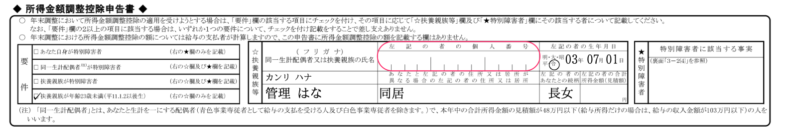
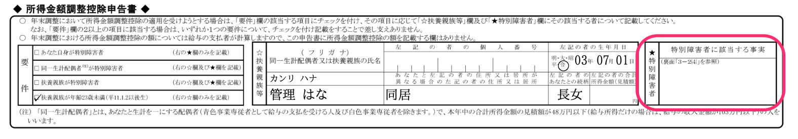
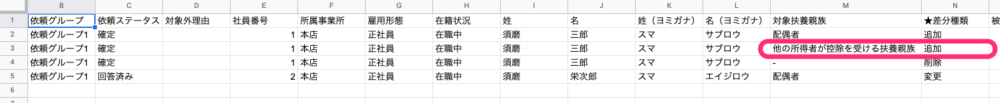
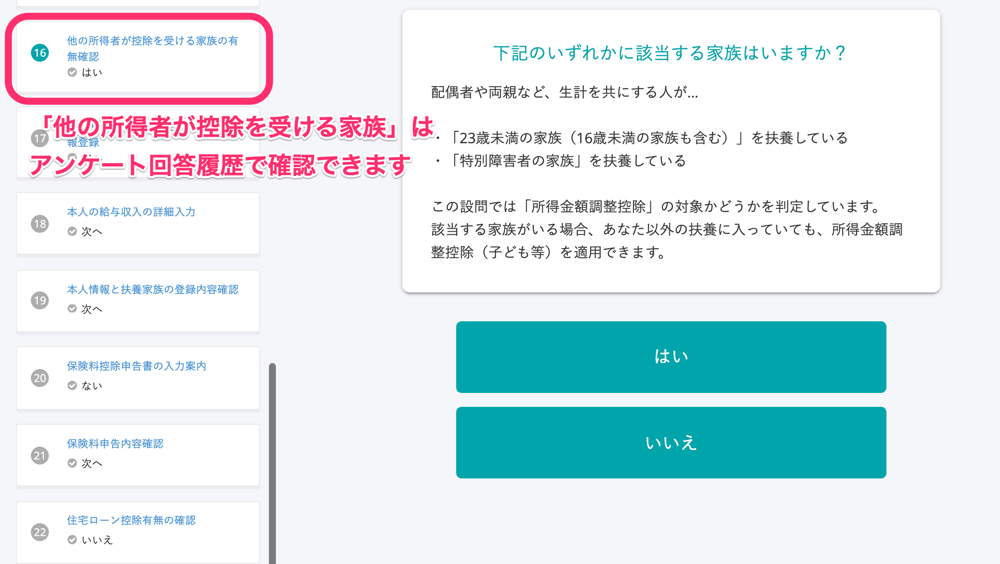
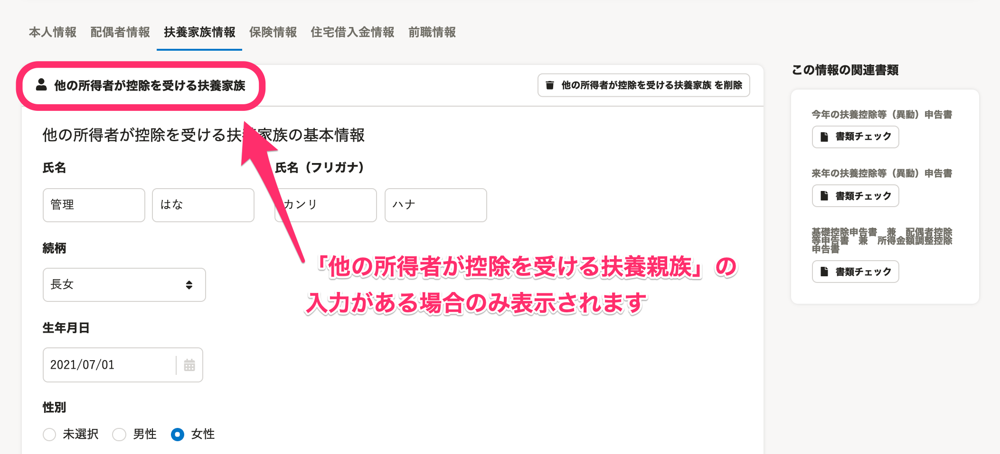
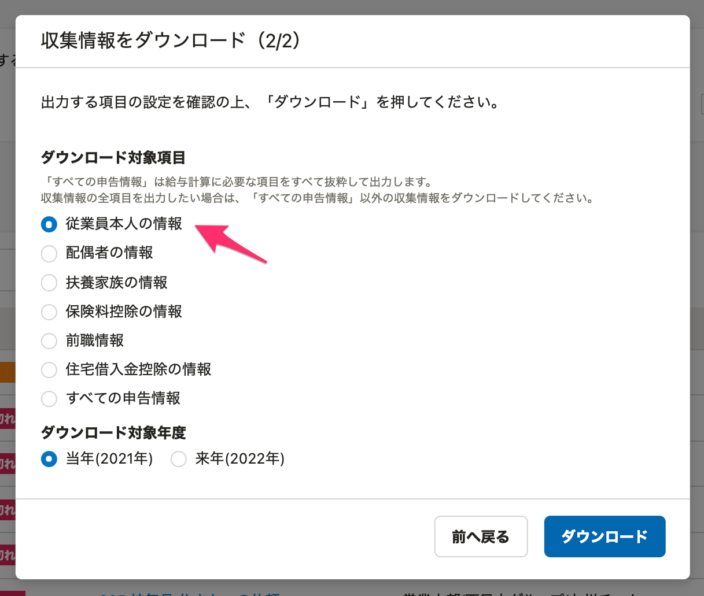

:::alert
当ページで案内しているSmartHRの年末調整機能の内容は、2021年（令和3年）版のものです。
2022年（令和4年）版の年末調整機能の公開時期は秋頃を予定しています。
なお、画面や文言、一部機能は変更になる可能性があります。
公開時期が決まり次第、[アップデート情報](https://smarthr.jp/update)でお知らせします。
:::

所得金額調整控除申告書に記載する「他の所得者が控除を受ける扶養親族」について、SmartHRの仕様上、従業員による記入が必要になる場合があります。

2つの注意点と対処法をご覧のうえ、ご対応をお願いします。

:::tips
注意点は、**夫婦どちらも年収850万円を超えるなど、1世帯に年収850万円を超える人が複数いるケース** を対象としています。
当てはまらない場合は、年末調整に影響しませんのでご安心ください。
:::

# 1\. マイナンバーを収集・印字できません

SmartHRでは扶養親族のマイナンバーの収集・管理ができますが、年末調整機能でのみ収集できる「他の所得者が控除を受ける扶養親族」はマイナンバーの収集・管理ができません。

年末調整機能で作成した所得金額調整控除申告書には「他の所得者が控除を受ける扶養親族」のマイナンバーが印字されないため、お手数ですが下記の方法で対処をお願いします。

## 対処法

SmartHRで作成した所得金額調整控除申告書を印刷し、従業員に「他の所得者が控除を受ける扶養親族」のマイナンバーの追記を依頼してください。

:::tips
令和2年度までは源泉所得税関係書類に押印が必要でしたが、令和3年度の税制改正で押印義務が見直され、押印は不要となりました。
詳しくは、下記の資料と国税庁のホームページで最新の書類をご確認ください。
[源泉所得税の改正のあらまし　令和3年4月｜国税庁](https://www.nta.go.jp/publication/pamph/gensen/0021004-072.pdf)
[税務署窓口における押印の取扱いについて｜国税庁](https://www.nta.go.jp/information/other/data/r02/oin/index.htm)
[源泉所得税関係｜国税庁](https://www.nta.go.jp/taxes/tetsuzuki/shinsei/annai/gensen/mokuji.htm)
:::

# 2.特別障害者に該当する事実を印字できません

年末調整機能で作成した所得金額調整控除申告書に、「他の所得者が控除を受ける扶養親族」の特別障害者に該当する事実（下記）を印字できません。

:::tips
 **「特別障害者に該当する事実」欄の記載内容** 
- 障害の状態、または、交付を受けている手帳などの種類と交付年月日
- 障害の程度（障害の等級）等
:::

お手数ですが下記の方法で対処をお願いします。

## 対処法

SmartHRで作成した所得金額調整控除申告書を印刷し、従業員に「特別障害者に該当する事実」の追記を依頼してください。

# 「他の所得者が控除を受ける扶養親族」の判別方法

上記1と2に対処していただく場合、所得金額調整控除申告書の情報だけでは、印字された扶養親族が「控除対象（年少扶養）親族」と「他の所得者が控除を受ける扶養親族」のどちらに該当するのか判別ができません。

お手数ですが下記の方法で親族の情報を確認してください。

## 対処法

下記いずれかの方法で、「他の所得者が控除を受ける扶養親族」の有無を確認してください。

### A：今年の扶養親族差分リストCSVを確認する

今年の扶養親族差分リストCSVの、対象扶養親族欄に「他の所得者が控除を受ける扶養親族」の表示があり、「★差分種類」に「追加」と表示されている対象者を確認してください。

「他の所得者が控除を受ける扶養親族」はSmartHRからは同期されないため、必ず差分として表示されます。

### B：アンケートの回答履歴を確認する

アンケートの回答履歴で「他の所得者が控除を受ける家族の有無確認」という設問と、その回答を確認します。

:::related
[年末調整のアンケート回答履歴を確認する](https://knowledge.smarthr.jp/hc/ja/articles/360053297094)
:::

### C：収集情報を確認する

年末調整のアンケートで「他の所得者が控除を受ける扶養親族」の入力がある場合、収集情報の **［扶養家族情報］** タブに **［他の所得者が控除を受ける扶養家族］** が表示されます。

収集情報を確認する手順は、下記ヘルプページの手順1と2をご覧ください。

:::related
[収集情報を直接編集する](https://knowledge.smarthr.jp/hc/ja/articles/360035657114)
:::

### D：収集情報のCSVファイルをダウンロードして確認する

依頼一覧にある **［情報一括ダウンロード▼］>［収集情報をダウンロード］** をクリックすると、収集情報のCSVファイルをダウンロードできます。

:::tips
ダウンロードの対象項目は **［従業員本人の情報］** を選択します。

収集情報のダウンロード手順は、下記のヘルプページをご覧ください。
[特定の依頼グループの収集情報をダウンロードする](https://knowledge.smarthr.jp/hc/ja/articles/360055844513)
:::
