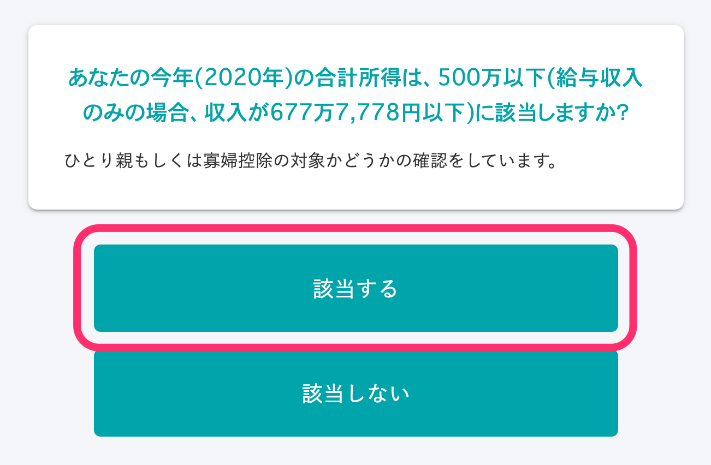
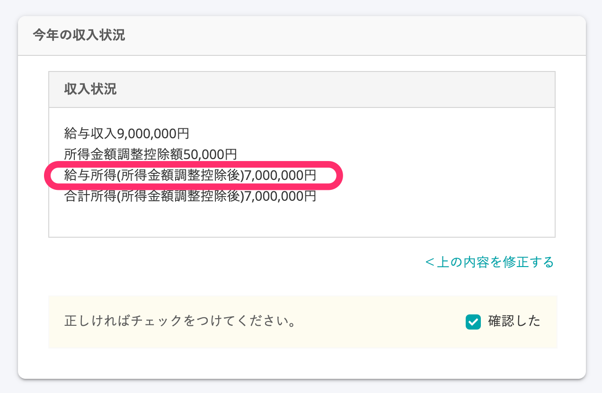

For the **estimated total earnings amount for this year** listed in the「Application for Basic Exemption of Employment Income Earner and Application for Exemption for Spouse of Employment Income Earner and Application for Exemption of Amount of Income Adjustment（給与所得者の基礎控除申告書 兼 給与所得者の配偶者控除等申告書 兼 所得金額調整控除申告書）」hereafter, Application for Basic Exemption and Exemption for Spouse and Exemption of Amount of Income Adjustment), if you are not eligible for earnings amount adjustment deductions, the specifications are set to list a flat income amount based on your choices during the survey.

his page explains the specifications for displaying the estimated total earnings amount, its background, and cases that are not included in the specifications.

In addition, it is possible to apply the correct amount in the documents instead of a flat amount.

Please refer to 「How to enter the actual amount"」for the detailed procedure.

:::tips
The year-end adjustment feature was reviewed in advance by a specialized external tax accountant before its release.
The same specifications have been used from 2018 and we have not received any feedback from the tax office indicating any problems with the created documents.
:::

# Specifications

If you are not eligible for earnings amount adjustment deductions, a flat amount is listed based on your choices during the survey for the determining category in Category I of the「Application for Basic Exemption and Exemption for Spouse and Exemption of Amount of Income Adjustment.」

The field that shows the「calculation for your estimated total earnings amount this year」is only an「estimated amount.」

The estimated amount is regarded as the amount for the determining category used to calculate the spouse deductions amount, and a flat amount is shown by the SmartHR year-end adjustment feature.

# Specifications background

## Preliminary notes

When declaring spouse exemption, employees must calculate the「earnings amount」from their income amount.

The spouse exemption amount (or special exemption for spouses amount) is determined by the category value calculated from the employee's earnings amount and their spouse's earnings amount.

A complex calculation is used to calculate the earnings amount from the income amount (in other words, the amount of payment before deducting income tax, social insurance premiums, etc.).

## Issues

The earnings amount can be automatically calculated on SmartHR by entering the income amount (annual income). However, **entering the annual income, which is used to perform the calculation**, creates some issues.

Annual income includes things such as overtime payments, incentives, and bonuses.

Although all you have to do is fill out the deductions application with the estimated amount, people often do not know the accurate estimated amount for this year when answering the year-end adjustment survey.

During surveys conducted by SmartHR in the past, many people responded that **they did not know their annual income (estimated amount) when it was time for the year-end adjustment.**

Since the spouse exemption amount (or special exemption for spouses amount) cannot be determined unless you declare the earnings amount calculated from your annual income, we have decided to enter a flat amount on SmartHR for the employee’s annual income amount.

# Specific examples

## If you chose「A」for the question confirming your anticipated amount of annual income for this year

Even if your original income amount is 8.5 million yen or less, the income amount listed in the「calculation for your estimated total earnings amount this year」shows a flat amount of 8.5 million yen (an earnings amount of 6.55 million yen).

If you chose "B," the income amount shown is 10.95 million yen. If you chose "C," the income amount shown is 11.45 million yen. If you chose "D," the income amount shown is 11.95 million yen.

If you chose “E,” you are not eligible for spouse exemption (special exemption for spouses).

## If you do not have a spouse and your total earnings this year is 5 million yen or less

If your survey answers match those below, the income amount listed in the 「calculation for your estimated total earnings amount this year」will show a flat amount of 6,777,778 yen (an earnings amount of 5 million yen).

■ Checking your anticipated amount of annual income for this year：「A」

■ Checking your marital status: "No"

■ Checking your past marital status：Any of the options

■Checking if you are in a common-law marriage：「No」

■ Checking whether your total earnings for this year are 5 million yen or less：「Applicable」

:::tips
For the question checking whether your total earnings this year are 5 million yen or less, just selecting「Applicable」does not determine single parent deductions or widow deductions.
Subsequent questions will check for information about dependents. Whether information about dependents is registered or not will determine single parent deductions or widow deductions.
Please refer to the following help page for details on the conditions to display widow or single parent information in the year-end adjustment document.
[What are the conditions to display widow or single parent information in the year-end adjustment document?](https://knowledge.smarthr.jp/hc/ja/articles/360039191593)
:::

# Cases that are not included in the specifications

When the following apply, a flat amount will not be used for the estimated total earnings amount.

## When you are eligible for earnings amount adjustment deductions

When you are eligible for earnings amount adjustment deductions, the amount calculated by subtracting the earnings amount adjustment deductions from your employment earnings must be listed.

Therefore, the amount obtained using the following formula is listed in the application form, not a flat amount.

- **Employment earnings (after earnings amount adjustment deductions) = Income amount - Employment earnings deductible amount - Earnings amount adjustment deductible amount**

The earnings amount adjustment deductible amount is calculated using the following formula.

- **Earnings amount adjustment deductible amount = (Income amount - 8.5 million yen) x 10%
    **※If the income amount exceeds 10 million yen, a flat amount of 10 million yen is used in the calculation.

:::alert
There are two types of earnings amount adjustment deductions: (for children, etc.) and (pension, etc.). However, only "earnings amount adjustment deductions (for children, etc.)" can be used to receive deductions during year-end adjustment.
If (pension, etc.) is applicable, please refer to the following help page and provide guidance to ensure that the employees file a final tax return themselves.
:::
:::related
[When the employee must file a final tax return](https://knowledge.smarthr.jp/hc/ja/articles/360055839553)
:::

### Example: If you put 9 million yen for the income amount on the survey

■「Income amount」entry screen on the survey

■ Display of 「Income status for this year」on the screen to confirm information entered on the survey

The employment earnings amount (after earnings amount adjustment deductions) is calculated using the following formula.

- Employment income of 9 million yen - Employment earnings deductions of 1.95 million yen = (a) Employment earnings of 7.05 million yen
- (Employment income of 9 million yen - 8.5 million yen) x 0.1 = (b) Earnings amount adjustment deductible amount of 50,000 yen
- (a) Employment earnings amount of 7.05 million yen - (b) Earnings amount adjustment deductible amount of 50,000 yen = Employment earnings (after earnings amount adjustment deductions) of 7 million yen

■ Display of the created「Application for Basic Exemption and Exemption for Spouse and Exemption of Amount of Income Adjustment」

# How to enter the actual amount

## 1\. Click「No (I have earnings besides employment earnings)」for the question shown below

When you click "No (I have earnings besides employment earnings)," the field "Please enter your income breakdown" will be displayed.

## 2\. Enter your income breakdown

You can enter the actual amounts for「Business earnings」「Miscellaneous earnings」「Dividend earnings」「Real estate earnings」「Resignation earnings」and 「Other earnings」in addition to your employment income.

:::tips
If you want the employee to enter the actual amount in the "calculation for your estimated total earnings amount this year" field, it is recommended that you set a message like \[Always select "No"\] in the hint section of the survey.
You can also help guide employees through the process by using the feature that sends notices from the administrator and by including information in the email related to the year-end adjustment.
:::
:::related
[Editing survey screen hints](https://knowledge.smarthr.jp/hc/ja/articles/360034870854)
[Setting notices from the administrator on the year-end adjustment screen for employees](https://knowledge.smarthr.jp/hc/ja/articles/360053347974)
[Requesting year-end adjustment](https://knowledge.smarthr.jp/hc/ja/articles/360035370313)（Listed in "Prepare: Editing email formats"）
:::
