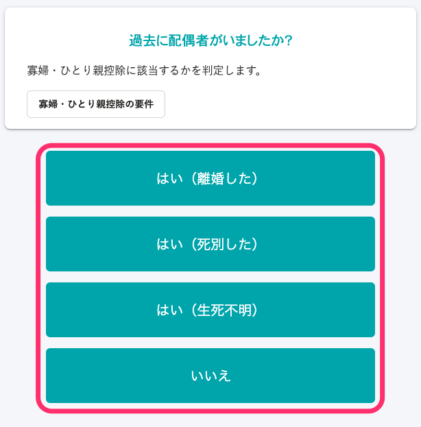

:::alert
当ページで案内しているSmartHRの年末調整機能の内容は、2021年（令和3年）版のものです。
2022年（令和4年）版の年末調整機能の公開時期は秋頃を予定しています。
なお、画面や文言、一部機能は変更になる可能性があります。
公開時期が決まり次第、[アップデート情報](https://smarthr.jp/update)でお知らせします。
:::

「給与所得者の基礎控除申告書 兼 給与所得者の配偶者控除等申告書 兼 所得金額調整控除申告書」（以下、基礎控除申告書 兼 配偶者控除等申告書 兼 所得金額調整控除申告書）に記載する **本年中の合計所得金額の見積額** について、所得金額調整控除の対象ではない場合、アンケートの選択肢に応じて一律の収入金額を記載する仕様です。

当ページでは、合計所得金額の見積額の表示仕様とその背景、仕様の対象外となるケースを説明します。

なお、一律の金額ではなく、正しい金額を書類に反映することも可能です。

詳しい手順は「実際の金額を入力する方法」をご覧ください。

:::tips
合計所得金額の表示仕様については、専門家である外部税理士のレビューを実施し、問題ないことを確認しています。
また、2018年から同じ仕様で運用していますが、作成した書類に対する税務署からの指摘はありません。
:::

# 仕様

所得金額調整控除の対象ではない場合、「基礎控除申告書 兼 配偶者控除等申告書 兼 所得金額調整控除申告書」の区分Ⅰの判定区分には、アンケートの回答に応じて一律の収入金額を記載します。

「あなたの本年中の合計所得金額の見積額の計算」欄は、あくまでも「見積額」を記載するものです。

見積額は配偶者控除額の算出における区分判定のための金額ととらえ、SmartHRの年末調整機能では一律の金額を表示しています。

# 仕様の背景

## 前提

配偶者控除を申告する場合、従業員は給与収入額から「所得額」を算出する必要があります。

配偶者控除の額（または特別控除の額）は、従業員の所得額と配偶者の所得額から計算された区分値によって決まる仕組みです。

所得額は、給与収入額（所得税、社会保険料などを控除する前の、いわゆる支給額）から複雑な計算をして算出します。

## 課題

所得額の計算であれば、給与収入額（年収）を入力してSmartHRで自動計算できますが、**計算元となる年収の入力が難しい**課題があります。

年収には、残業手当やインセンティブ、賞与などが含まれます。

申告書へは見積額を記入すればよいとはいえ、年末調整のアンケートに回答する時点では、今年の正確な見積額を把握できない場合がほとんどです。

過去、SmartHRが実施した調査でも、多くの人が「 **年末調整時期の時点では自分の年収（見積額）がわからない」** と回答しました。

年収から算出された所得額を申告しなければ配偶者控除の額（または特別控除の額）を決められないため、SmartHRの年末調整機能では従業員本人の年収額は、一律の金額を入力することとしています。

# 具体例

## 今年の年収予定額を確認する設問で「A」を選択した場合

本来の収入金額が850万円以下の場合でも、「本年中の合計所得金額の見積額の計算」に記載する収入金額は一律で850万円（所得金額は655万円）を表示します。

収入金額は、「B」を選択した場合は1,095万円、「C」を選択した場合は1,145万円、「D」を選択した場合は1,195万円を表示します。

「E」を選択した場合は、配偶者控除（配偶者特別控除）の対象外です。

## 配偶者はいない・今年の本人の合計所得が500万円以下に該当する場合

アンケートで以下のとおり回答した場合、「本年中の合計所得金額の見積額の計算」に記載する収入金額は一律で677万7,778円（所得金額は500万円）を表示します。

■今年の給与収入確認：「A」を選択

■配偶者の有無確認：「いいえ」を選択

■過去に配偶者がいたかどうかの確認：いずれかを選択

■事実婚確認：「いいえ」を選択

■今年本人収入確認（寡婦条件確認）：「はい」を選択

:::tips
今年の本人の合計所得は500万円以下かを確認する設問で「はい」を選択しただけでは、寡婦・ひとり親控除の判定はされません。
以降の設問で扶養家族情報の有無を確認しており、そこで扶養家族情報を登録したかどうかにより、寡婦控除もしくはひとり親控除の判定をします。
年末調整の書類に寡婦/ひとり親が表示される条件について、詳しくは以下のヘルプページをご覧ください。
[Q. 年末調整の書類に寡婦・ひとり親が表示されない場合は？](https://knowledge.smarthr.jp/hc/ja/articles/360039191593)
:::

# 仕様の対象外となるケース

下記に該当する場合は、合計所得金額の見積額が一律金額になりません。

## 所得金額調整控除の対象となる場合

所得金額調整控除の対象となる場合、給与所得には所得金額調整控除を差し引いた額を記載しなければいけません。

そのため、一律の金額ではなく、以下の計算式で求めた金額を記載します。

- **給与所得（所得金額調整控除後）= 給与収入額 - 給与所得控除額 - 所得金額調整控除額**

所得金額調整控除額は以下の計算式で求めます。

- **所得金額調整控除額 =（給与収入額 - 850万円） × 10%
    **※給与収入額が1,000万円を超える場合は一律1,000万円で計算します。

:::alert
所得金額調整控除には「（子ども等）」と「（年金等）」の2種類がありますが、このうち、年末調整で控除を受けられるのは、「所得金額調整控除（子ども等）」のみです。
（年金等）に該当する場合は、以下のヘルプページを参考に、従業員自身で確定申告をするよう案内をお願いします。
:::
:::related
[所得金額調整控除額（年金等）と特定支出控除の適用がある場合の注意点](https://knowledge.smarthr.jp/hc/ja/articles/360055839553)
:::

### 例：アンケートで給与収入額を「900万円」と回答した場合

■アンケートの「給与収入額」入力画面

 **［所得控除額］** と **［所得見積額（所得金額調整控除前）］** は自動で入力されます。

■アンケートの入力内容確認画面での「今年の収入状況」の表示

給与所得額(所得金額調整控除後)は、以下の計算式で求めています。

- 給与収入900万円 - 給与所得控除195万円 = (a)給与所得705万円
- （給与収入900万円 - 850万円）× 0.1 = (b)所得金額調整控除額5万円
- (a)給与所得額705万円 - (b)所得金額調整控除額5万円 = 給与所得(所得金額調整控除後)700万円

■作成した「基礎控除申告書 兼 配偶者控除等申告書 兼 所得金額調整控除申告書」の表示

# 実際の金額を入力する方法

## 1\. 下図設問で「はい」をクリック

「はい」をクリックすると、「収入の内訳を入力してください」という設問が表示されます。

## 2\. 収入の内訳を入力

給与収入のほか、「事業所得」「雑所得」「配当所得」「不動産所得」「退職所得」「その他所得」について、実際の金額を入力できます。

:::tips
「あなたの本年中の合計所得金額の見積額の計算」欄に実際の金額を入力させたい場合は、アンケートのヒントに【必ず「はい」を選択してください】といったメッセージを設定することをおすすめします。
他に、管理者からのお知らせ機能や、年末調整依頼時のメールフォーマットに記載して案内する方法もあります。
:::
:::related
[アンケート画面のヒントを追加・編集する](https://knowledge.smarthr.jp/hc/ja/articles/360034870854)
[従業員の年末調整画面に管理者からのお知らせを設定する](https://knowledge.smarthr.jp/hc/ja/articles/360053347974)
[年末調整を依頼する](https://knowledge.smarthr.jp/hc/ja/articles/360035370313)（「準備：メールフォーマットを編集する」に記載）
:::
