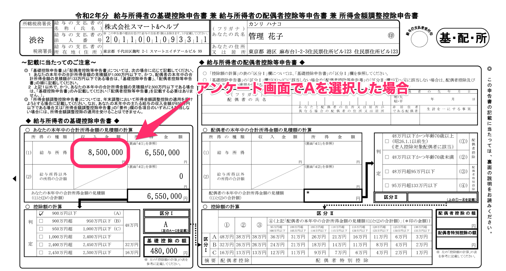
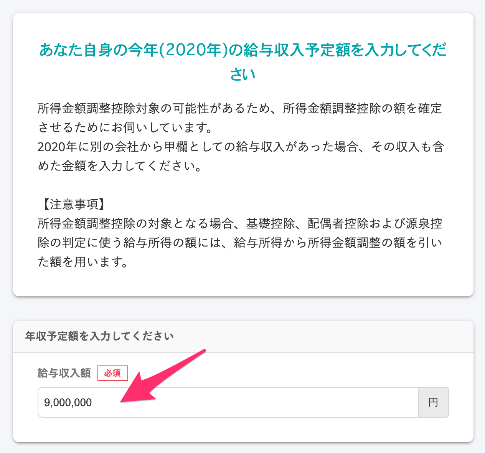
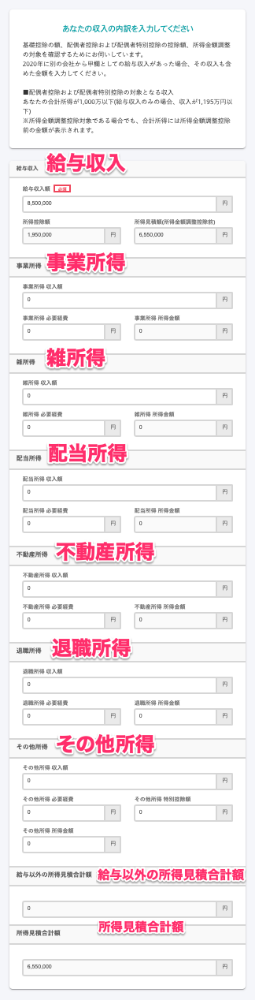

「급여소득자의 기초공제신고서 겸 급여소득자의 배우자공제등 신고서 겸 소득금액조정공제 신고서（給与所得者の基礎控除申告書 兼 給与所得者の配偶者控除等申告書 兼 所得金額調整控除申告書）」（이하, 기초공제신고서 겸 배우자공제등 신고서 겸 소득금액조정공제 신고서）에 기재하는 **올해의 합계소득금액의 예상금액**에 대하여 소득금액 조정공제의 대상이 아닌 경우에는 앙케이트의 선택지에 따라 일률적인 수입금액을 표시하는 사양입니다.

당 페이지에서는 합계소득금액의 예상금액의 표시사양과 그 배경, 사양의 대상외로 되는 케이스를 설명합니다.

또한 일률적인 금액이 아니라 정확한 금액을 서류에 반영시키는 것도 가능합니다.

자세한 순서는「실제 금액을 입력하는 방법」을 확인해 주세요.

:::tips
연말정산기능의 릴리스에 대해서는 사전에 전문가이신 외부 세무사(税理士) 선생님의 감수를 실시하고 있습니다.
또한, 2018년부터 같은 사양으로 운용하고 있습니다만, 작성된 서류에 대하여 세무소(税務署)에서의 지적은 없었습니다.
:::

# 사양

소득금액조정공제의 대상이 아닌 경우, 「기초공제신고서 겸 배우자공제등 신고서 겸 소득금액조정 신고서」의 구분Ⅰ의 판정구분에는 앙케이트의 선택지에 따라 일률적인 금액이 기재됩니다.

「당신의 올해 합계소득금액의 견적금액(あなたの本年中の合計所得金額の見積額の計算)」의 란은 어디까지나 「예상금액」을 기재하는 곳입니다.

예상금액은 배우자공제금액의 산출에 대한 구분판정을 위한 금액으로, SmartHR의 연말정산기능에서는 일률적인 금액을 표시합니다.

# 사양의 배경

## 전제

배우자공제를 신고하는 경우, 직원은 급여수입란에서 「소득금액(所得額)」을 산출할 필요가 있습니다.

배우자공제의 금액（또는 특별공제의 금액）은 직원의 소득금액과 배우자의 소득금액에서 계산된 구분수치에 의해 결정되는 사양합니다.

소득금액은 급여수입금액（소득세, 사회보험료등을 공제하기전의 흔히 얘기하는 지급금액）에서 복잡한 계산으로 산출됩니다.

## 과제

소득금액의 계산이라면 금여소득금액（연수입）을 입력하여 SmartHR에서 자동계산하는 것이 가능하지만, **계산원（計算元）이 되는 연수입의 입력이 어렵다** 는 과제가 있습니다.

연수입에는 잔업수당이나 인센티브, 상여금 등이 포함됩니다.

신고성에는 견적금액을 입력하면 된다고는 하지만, 연말정산의 앙케이트에 답변한 시점에서는 올해의 정확한 견적금액을 파악할수 없는 경우가 대부분 입니다.

과거, SmartHR이 실시한 조사에서는 많은 분들이「**연말정산시기의 시점에서는 자신의 연수입(견적금액)을 모르겠다**」 고 답해주셨습니다.

연수입에서 산출된 소득금액을 신고하지않으면 배우자공제의 금액（또는 특별공제의 금액）을 결정할수 없기때문에 SmartHR에서는 직원본인의 연수입금액은 일률적인 금액이 입력되도록 하였습니다.

# 구체적인 예

## 올해의 연수입예상금액을 확인하는 설문에서「A」를 선택한 경우

본래의 수입금액이 850만엔이하의 경우에도 「올해의 합계소득금액의 예상금액 계산(本年中の合計所得金額の見積額の計算)」에 기재되어있는 수입금액은 일률적으로 850만엔（소득금액은 655만엔）으로 표시됩니다.

수입금액은 B를 선택하였을 경우에는 1,095만엔, C를 선택한 경우에는 1,145만엔, D를 선택한 경우에는 1,195만엔을 표시합니다.

E를 선택한 경우에는 배우자공제（배우자특별공제）의 대상외 입니다.

## 배우자가 없다・올해의 본인의 합계소득은 500만엔이하에 해당하는 경우

앙케이트에 아래의 내용대로 답변 하였을 경우, 「올해의 합계소득금액의 견적금액의 계산」에 기재하는 수입금액은 일률적으로 677만7,778엔（소득금액은 500만엔）을 표시합니다.

■ 올해의 연수입예정금액의 확인：「A」을 선택

■배우자의 유무확인：「없다いない」를 선택

■ 과거의 배우자의 유무확인：어느 하나를 선택

■ 사실혼의 유무확인：「없다」를 선택

■ 올해의 본인의 합계소득은 500만엔 이하인지를 확인：「해당한다」를 선택

:::tips
올해의 본인의 합계소득은 500만엔이하인지를 확인하는 설문에서 「해당한다」를 선택하는 것만으로는 편부모공제(ひとり親控除) 또는 과부공제(寡婦控除)의 판정은 되지 않습니다.
이후의 설문에서 부양가족정보의 유무를 확인하여 해당 부양가족을 등록하는지 어떤지에 따라, 편부모공제 또는 과부공제의 판정이 이루어 집니다.
연말정산의 서류에 과부/편부모가 표시되는 조건에 대하여 자세한 내용은 아래의 헬프페이지를 참고해주세요.
[연말정산의 서류에 과부/편부모가 표시되는 조건은?](https://knowledge.smarthr.jp/hc/ja/articles/360039191593)
:::

# 사양의 대상외로 되는 케이스

아래에 해당하는 경우에는 합계소득금액의 견적금액이 일률적인 금액으로 되지 않습니다.

## 소득금액조정공제의 대상이 되는 경우

소득금액조정공제의 대상이 되는 경우, 급여소득에는 소득금액조정공제를 뺀 금액을 기재하지 않으면 안됩니다.

그렇기 때문에 일률적인 금액이 아닌 아래의 계산식으로 나온 금액을 기재합니다.

- **급여소득（소득금액조정공제 후）= 급여수입금액 - 급여소득공제금액 - 소득금액조정공제금액**

소득금액조정공제금액은 아래의 계산식으로 구합니다.

- **소득금액조정공제금액 =（급여수입금액 - 850만엔） × 10%
    **※급여수입금액이 1,000만엔을 넘는 경우에는 일률적으로 1,000만엔으로 계산합니다.

:::alert
소득금액조정공제에는 「（아이들 등）」과「（연금 등）」의 2종류가 있습니다만, 그중 연말정산에서 공제를 받을수 있는 것은 「소득금액조정공제（아이들 등）」뿐입니다.
（연금 등）에 해당하는 경우에는 아래의 헬프페이지를 참고하여 직원 본인께서 확정신고를 할수 있도록 안내 부탁드립니다.
:::
:::related
[직원본인에 의한 확정신고가 필요한 경우](https://knowledge.smarthr.jp/hc/ja/articles/360055839553)
:::

### 예：앙케이트에 급여소득을 「900만엔」이라고 답변한 경우

■ 앙케이트의 「급여수입금액」입력화면

■ 앙케이트의 입력내용확인 화면에서의 「올해의 수입상황」의 표시

급여소득금액(소득금액조정공제 후)는 아래의 계산식으로 구하고 있습니다.

- 급여수입 900만엔 - 급여소득공제 195만엔 = (a)급여소득 705만엔
- （급여수입 900만엔 - 850만엔）× 0.1 = (b)소득금액조정공제금액 5만엔
- (a)급여소득금액 705만엔 - (b)소득금액조정공제금액 5만엔 = 급여소득(소득금액조정공제 후)700만엔

■ 작성한 「기초공제신고서 겸 배우자공제등 신고서 겸 소득금액조정공제 신고서(基礎控除申告書 兼 配偶者控除等申告書 兼 所得金額調整控除申告書)」의 표시

# 실제의 금액을 입력하는 방법実際

## 1.  아래 이미지의 설문에서 「아니오, 급여구입이외의 수입이 있습니다」를 클릭

「아니오, 급여수입이외의 수입이 있습니다」를 클릭하면 「당신의 수입 내역을 입력해주세요」라는 설문이 표시 됩니다.

## 2\. 수입의 내역을 입력

급여수입 외의「사업소득」「잡소득」「배당소득」「부동산소득」「퇴직소득」「기타 소득」에 대해서 실제 금액을 입력할수 있습니다.

:::tips
「당신의 올해 합계소득금액의 견적금액의 계산」란에 실제 금액을 입력하는 경우에는 앙케이트의 힌트에 【반드시 「아니오」를 선택해 주세요】라는 멧세지를 설정하는 것을 추천드립니다.
기타 관리자로부터의 안내기능이나 연말조정의뢰시의 메일포멧에 기재하여 안내하는 방법도 있습니다.
:::
:::related
[앙케이트 화면의 힌트를 편집한다](https://knowledge.smarthr.jp/hc/ja/articles/360034870854)
[직원의 연말정산화면에 관리자로부터의 안내를 설정한다](https://knowledge.smarthr.jp/hc/ja/articles/360053347974)
[연말정산을 의뢰한다](https://knowledge.smarthr.jp/hc/ja/articles/360035370313)（「준비：메일 포맷을 편집한다」에 기재）
:::
