Trường hợp bạn không thuộc đối tượng được giảm trừ điều chỉnh thu nhập chịu thuế, thì **tổng thu nhập chịu thuế ước tính trong năm nay** được ghi trên「Tờ khai giảm trừ cơ bản của người có thu nhập chịu thuế từ lương, kiêm Tờ khai giảm trừ cho vợ/chồng của người có thu nhập chịu thuế từ lương, kiêm Tờ khai giảm trừ điều chỉnh thu nhập chịu thuế（給与所得者の基礎控除申告書 兼 給与所得者の配偶者控除等申告書 兼 所得金額調整控除申告書）」(sau đây gọi là Tờ khai giảm trừ cơ bản kiêm Tờ khai giảm trừ cho vợ/chồng kiêm Tờ khai giảm trừ điều chỉnh thu nhập chịu thuế), sẽ được hiển thị một số tiền thu nhập đồng đều tương ứng với lựa chọn đã chọn trong khảo sát.

Tại trang này, chúng tôi sẽ giải thích quy cách hiển thị của tổng thu nhập chịu thuế ước tính, bối cảnh và những trường hợp không thuộc đối tượng của quy cách này.

Ngoài ra, cũng có thể phản ánh số tiền chính xác trong hồ sơ thay vì một số tiền đồng đều.

Vui lòng xem trình tự chi tiết tại 「Cách thức nhập số tiền thực tế」.

:::tips
Trước khi ra mắt chức năng điều chỉnh thuế cuối năm, quy cách này đã được rà soát trước bởi chuyên gia kế toán thuế bên thứ ba.
Hơn nữa, quy cách này vẫn được sử dụng từ năm 2018 và không có sai sót bị chỉ ra bởi cục thuế về các giấy tờ được soạn thảo.
:::

# Quy cách

Nếu bạn không thuộc đối tượng giảm trừ điều chỉnh thu nhập chịu thuế thì trong phần phân loại xác định của Phân loạiⅠcủa「Tờ khai giảm trừ cơ bản kiêm Tờ khai giảm trừ cho vợ/chồng kiêm Tờ khai giảm trừ điều chỉnh thu nhập chịu thuế”」sẽ được hiển thị một số tiền đồng đều tương ứng với lựa chọn đã chọn trong khảo sát.

Cột「Tính toán tổng thu nhập chịu thuế ước tính trong năm nay của bạn」 chỉ là cột ghi 「số tiền ước tính”」.

Số tiền ước tính được xem là số tiền để xác định phân loại trong việc tính toán số tiền giảm trừ cho vợ/chồng, và sẽ được hiển thị số tiền đồng đều trong chức năng điều chỉnh thuế cuối năm của SmartHR.

# Bối cảnh của quy cách

## Tiền đề

Trường hợp kê khai giảm trừ cho vợ/chồng, nhân viên cần phải tính ra「số tiền thu nhập chịu thuế」từ số tiền thu nhập từ lương.

Số tiền giảm trừ cho vợ/chồng (hoặc số tiền giảm trừ đặc biệt) được xác định căn cứ theo giá trị phân loại được tính toán từ số tiền thu nhập chịu thuế của nhân viên và số tiền thu nhập chịu thuế của vợ/chồng.

Số tiền thu nhập chịu thuế được tính toán bằng các phép tính phức tạp từ số tiền thu nhập từ lương (nói một cách khác là khoản tiền chi trả trước khi khấu trừ thuế thu nhập cá nhân, phí bảo hiểm xã hội, v.v...).

## Vấn đề phát sinh

SmartHR có thể tự động tính toán số tiền thu nhập chịu thuế sau khi bạn nhập số tiền thu nhập từ lương (thu nhập năm), tuy nhiên vấn đề phát sinh ở đây là **khó khăn trong việc nhập thu nhập năm để làm cơ sở tính toán**.

Thu nhập năm bao gồm cả trợ cấp làm thêm giờ, phụ cấp khích lệ, tiền thưởng, v.v...

Mặc dù chỉ cần điền số tiền ước tính vào tờ khai, nhưng tại thời điểm trả lời bản khảo sát điều chỉnh thuế cuối năm đa số các trường hợp mọi người không thể nắm rõ chính xác số tiền ước tính cho năm nay.

Trước đây, cũng trong khảo sát do SmartHR đã thực hiện cũng có nhiều người trả lời rằng **“Tôi không biết thu nhập cả năm (số tiền ước tính) của mình tại thời điểm điều chỉnh thuế cuối năm”**.

Nếu không kê khai số tiền thu nhập chịu thuế được tính toán từ thu nhập năm thì sẽ không thể xác định số tiền giảm trừ cho vợ/chồng (hoặc số tiền giảm trừ đặc biệt), vì vậy, trong SmartHR thu nhập năm của nhân viên sẽ nhập một số tiền đồng đều.

# Ví dụ cụ thể

## Trường hợp chọn “A” trong câu hỏi xác nhận thu nhập năm ước tính của năm nay.

Dù trong trường hợp số tiền thu nhập thực tế là từ 8.500.000 Yên trở xuống, nhưng số tiền thu nhập ghi trong phần “Tính toán tổng thu nhập chịu thuế ước tính trong năm nay” đều sẽ hiển thị 8.500.000 Yên (số tiền thu nhập chịu thuế là 6.550.000 Yên).

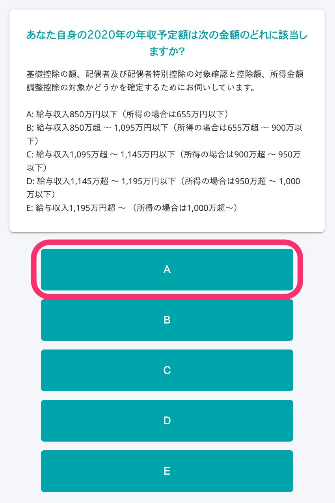

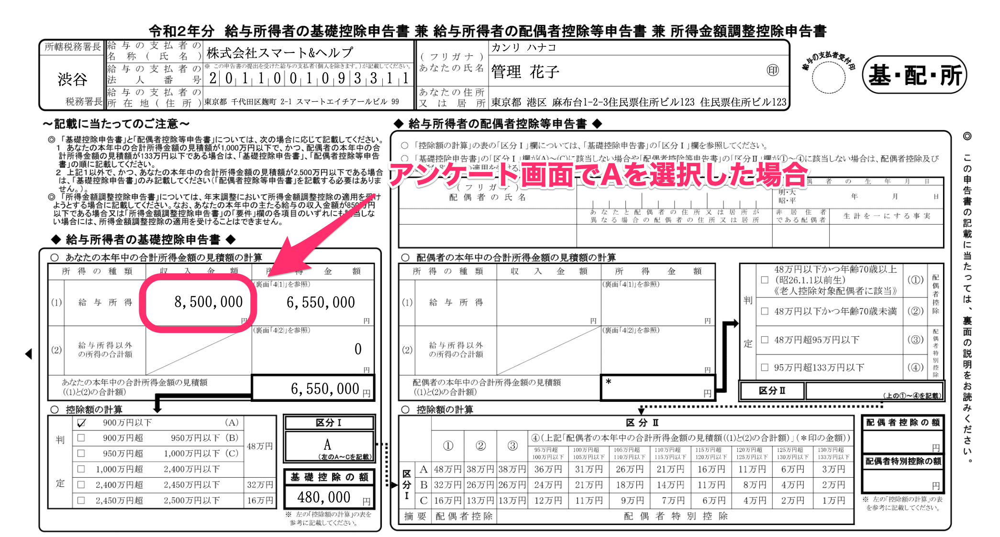

Số tiền thu nhập nếu chọn B sẽ hiển thị là 10.950.000 Yên, nếu chọn C sẽ hiển thị là 11.450.000 Yên, nếu chọn D sẽ hiển thị là 11.950.000 Yên.

Nếu chọn E thì không thuộc đối tượng được giảm trừ cho vợ/chồng (giảm trừ đặc biệt cho vợ/chồng).

## Trường hợp không có vợ/chồng hoặc tổng thu nhập chịu thuế của bản thân trong năm nay là từ 5.000.000 Yên trở xuống.

Nếu trả lời như sau trong khảo sát thì số tiền thu nhập ghi trong phần “Tính toán tổng thu nhập chịu thuế ước tính trong năm nay” sẽ hiển thị số tiền đồng đều là 6.777.778 Yên (số tiền thu nhập chịu thuế là 5.000.000 Yên).

■Xác nhận thu nhập năm ước tính của năm nay: Chọn “A”

■Xác nhận có vợ/chồng hay không: Chọn “Không”

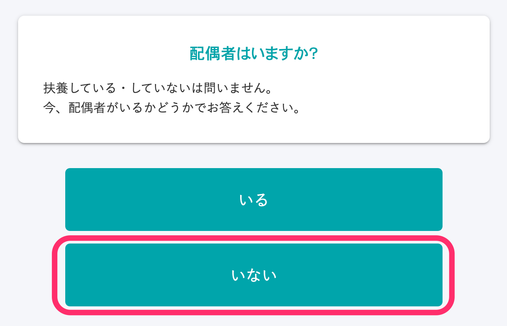

■Xác nhận trước đây từng có vợ/chồng hay không: Chọn một trong số những lựa chọn

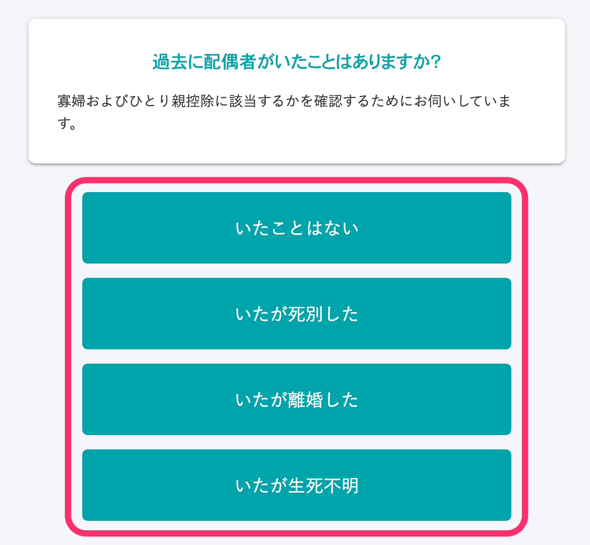

■Xác nhận có vợ hoặc chồng đã đăng ký kết hôn hay không: Chọn “Không”

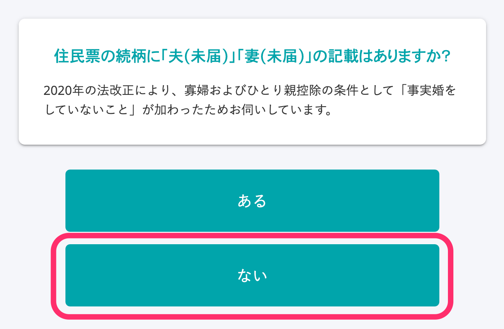

■Xác nhận tổng thu nhập chịu thuế của bản thân trong năm nay có phải từ 5.000.000 Yên trở xuống: Chọn “Tương ứng”

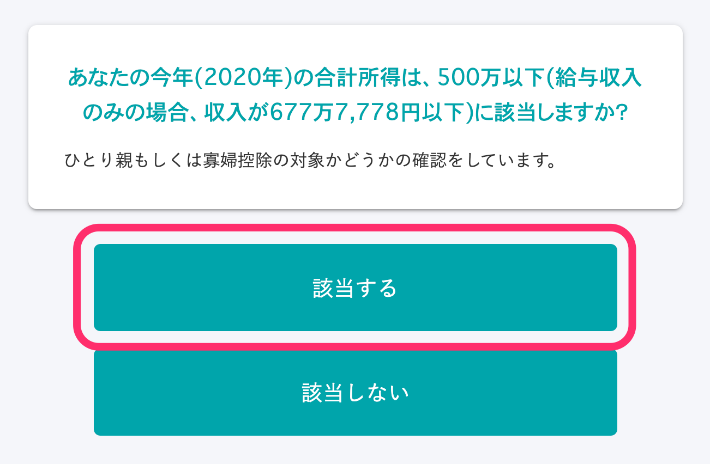

:::tips
Nếu chỉ chọn “Tương ứng” ở câu hỏi xác nhận tổng thu nhập chịu thuế của bản thân trong năm nay có phải từ 5.000.000 Yên trở xuống thì sẽ không xác định được bạn có được giảm trừ cho bố/mẹ đơn thân hay giảm trừ cho góa phụ.
Ở các câu hỏi tiếp theo sẽ xác nhận xem có thông tin về người thân phụ thuộc hay không, từ đó sẽ xác định xem bạn có được giảm trừ cho bố/mẹ đơn thân hay giảm trừ cho góa phụ tùy thuộc vào việc bạn đã đăng ký thông tin người thân phụ thuộc hay chưa.
Vui lòng xem chi tiết tại trang trợ giúp bên dưới về các điều kiện để hiển thị thông tin góa phụ hoặc bố/mẹ đơn thân trong hồ sơ điều chỉnh thuế cuối năm.
[Điều kiện để hiển thị thông tin góa phụ hoặc bố/mẹ đơn thân trong hồ sơ điều chỉnh thuế cuối năm?](https://knowledge.smarthr.jp/hc/ja/articles/360039191593)
:::

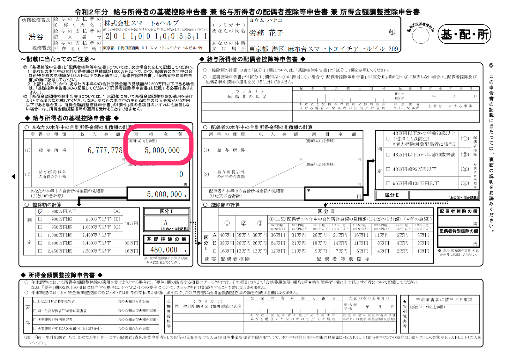

# quy cách này

Đối với các trường hợp tương ứng dưới đây, số tiền ước tính của tổng thu nhập chịu thuế sẽ không phải là một số tiền đồng đều.

## Trường hợp là đối tượng giảm trừ điều chỉnh thu nhập chịu thuế

Trong trường hợp là đối tượng giảm trừ điều chỉnh thu nhập chịu thuế, ở thu nhập chịu thuế từ lương bạn phải ghi số tiền sau khi đã trừ đi khoản giảm trừ điều chỉnh thu nhập chịu thuế.

Vì vậy, không phải ghi một số tiền đồng đều, mà phải ghi số tiền được tính toán theo công thức dưới đây.

- **Thu nhập chịu thuế từ lương (sau khi giảm trừ điều chỉnh thu nhập chịu thuế) = Số tiền thu nhập từ lương – Số tiền khấu trừ thu nhập chịu thuế từ lương – Số tiền giảm trừ điều chỉnh thu nhập chịu thuế**

Số tiền giảm trừ điều chỉnh thu nhập chịu thuế được tính theo công thức dưới đây.

- **Số tiền giảm trừ điều chỉnh thu nhập chịu thuế = (Số tiền thu nhập từ lương – 8.500.000 Yên) × 10%**

:::alert
Giảm trừ điều chỉnh thu nhập chịu thuế gồm 2 loại là “(con cái, v.v...)” và “(lương hưu, v.v...)”, nhưng khoản giảm trừ có thể nhận được bằng điều chỉnh thuế cuối năm chỉ duy nhất áp dụng với “giảm trừ điều chỉnh thu nhập chịu thuế (con cái, v.v...)”.
Trường hợp tương ứng với (lương hưu, v.v...), vui lòng tham khảo trang trợ giúp dưới đây và hướng dẫn nhân viên tự thực hiện kê khai thuế.
:::
:::related
[Trường hợp nhân viên phải tự thực hiện kê khai thuế](https://knowledge.smarthr.jp/hc/ja/articles/360055839553)
:::

### Ví dụ: Trường hợp trong khảo sát đã trả lời số tiền thu nhập từ lương là “9.000.000 Yên”

■Màn hình nhập “Số tiền thu nhập từ lương” của khảo sát

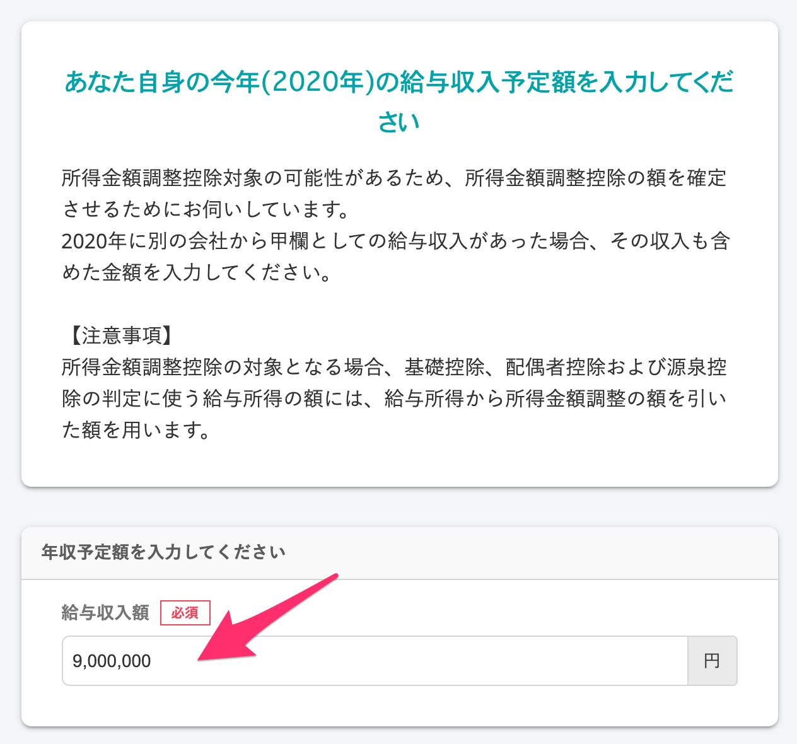

■Hiển thị “Tình trạng thu nhập năm nay” trên màn hình xác nhận nội dung đã nhập trong khảo sát

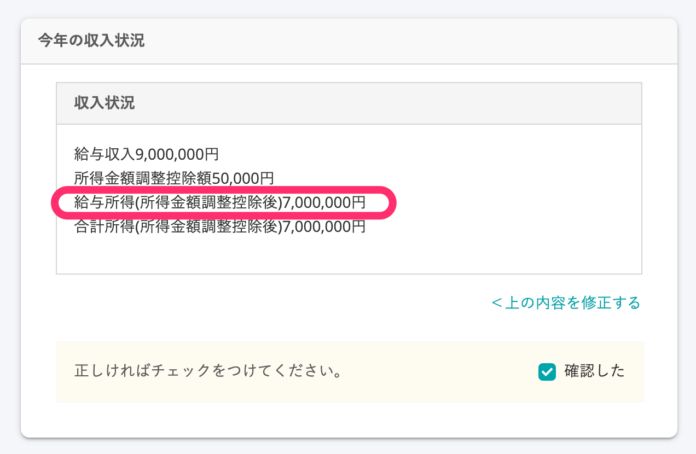

Số tiền thu nhập chịu thuế từ lương (sau khi giảm trừ điều chỉnh thu nhập chịu thuế) được tính theo công thức dưới đây.

- Thu nhập từ lương 9.000.000 Yên – Giảm trừ thu nhập chịu thuế từ lương 1.950.000 Yên = (a) Thu nhập chịu thuế từ lương 7.050.000 Yên
- (Thu nhập từ lương 9.000.000 Yên – 8.500.000 Yên) x 0.1 = (b) Số tiền giảm trừ điều chỉnh thu nhập chịu thuế 50.000 Yên
- (a) Số tiền thu nhập chịu thuế từ lương 7.050.000 Yên - (b) Số tiền giảm trừ điều chỉnh thu nhập chịu thuế 50.000 Yên = Thu nhập chịu thuế từ lương (sau khi giảm trừ điều chỉnh thu nhập chịu thuế) 7.000.000 Yên

■Hiển thị của 「Tờ khai giảm trừ cơ bản kiêm Tờ khai giảm trừ cho vợ/chồng kiêm Tờ khai giảm trừ điều chỉnh thu nhập chịu thuế」đã lập

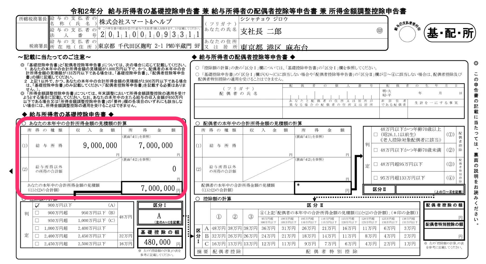

# Phương pháp nhập số tiền thực tế

## 1\. Nhấn vào “Không, tôi có thu nhập khác ngoài thu nhập từ lương” trong câu hỏi ở hình dưới

Khi nhấn vào “Không, tôi có thu nhập khác ngoài thu nhập từ lương”, thì câu hỏi “Hãy nhập chi tiết thu nhập của bạn” sẽ được hiển thị.

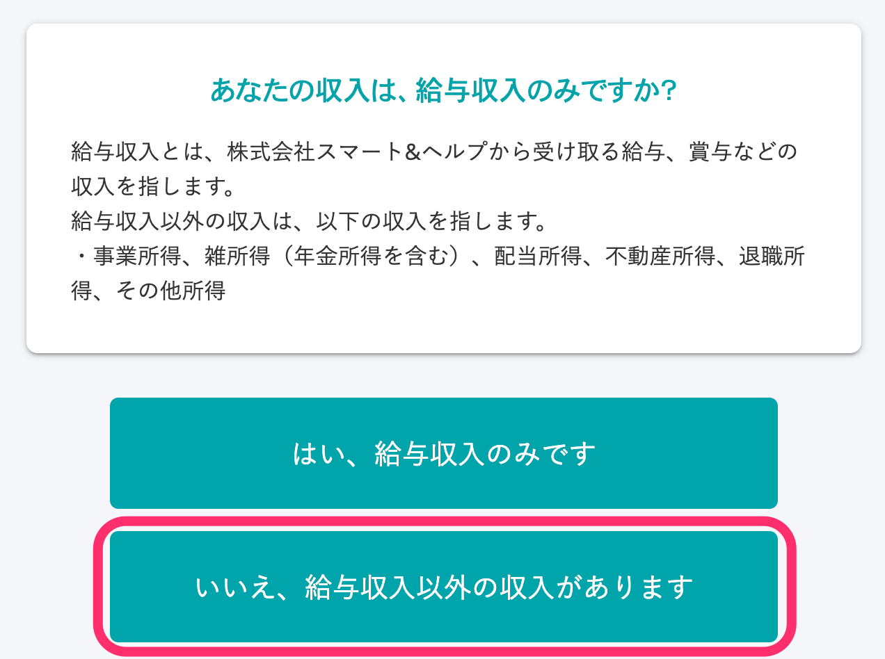

## 2\. Nhập chi tiết thu nhập

Ngoài thu nhập từ lương, bạn có thể nhập số tiền thực tế của “thu nhập từ hoạt động kinh doanh”, “các khoản thu nhập riêng lẻ khác”, “thu nhập từ cổ tức”, “thu nhập từ bất động sản”, “trợ cấp thôi việc” và “thu nhập khác”.

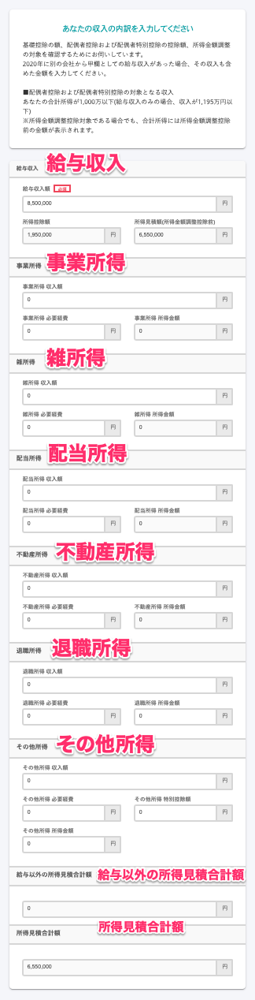

:::tips
Trường hợp muốn nhập số tiền thực tế vào mục “Tính toán tổng thu nhập chịu thuế ước trong năm nay”, chúng tôi khuyến khích bạn thiết lập tin nhắn có nội dung là \[Hãy chắc chắn chọn “Không”\] trong phần gợi ý của khảo sát.
Ngoài ra còn có chức năng thông báo từ quản trị viên và phương pháp hướng dẫn bằng cách viết vào định dạng e-mail khi yêu cầu điều chỉnh thuế cuối năm.
:::
:::related
[Chỉnh sửa nội dung gợi ý hiển thị trên màn hình khảo sát](https://knowledge.smarthr.jp/hc/ja/articles/360034870854)
[Thiết lập thông báo từ quản trị viên trên màn hình điều chỉnh thuế cuối năm của nhân viên](https://knowledge.smarthr.jp/hc/ja/articles/360053347974)
[Yêu cầu điều chỉnh thuế cuối năm](https://knowledge.smarthr.jp/hc/ja/articles/360035370313)（Được ghi trong “Chuẩn bị: Chỉnh sửa định dạng Email”）
:::
