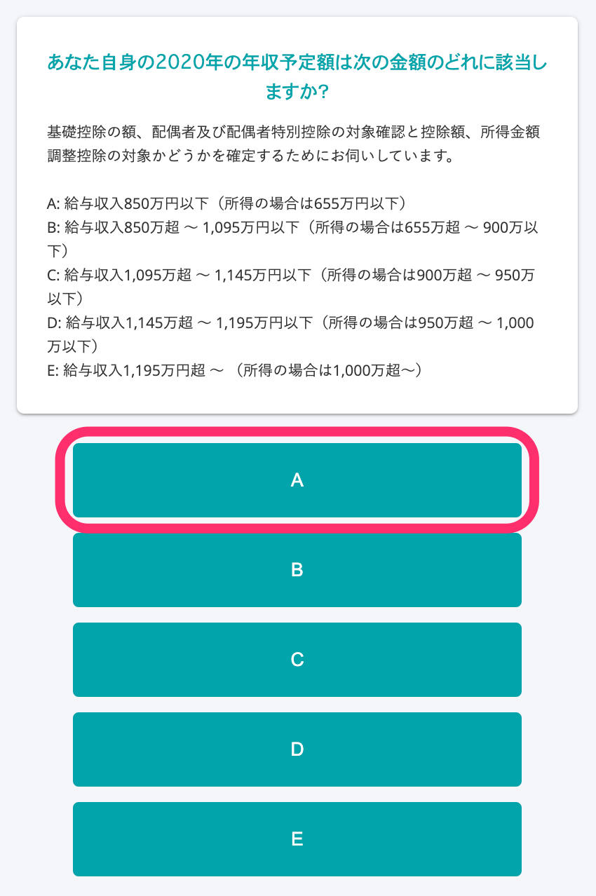
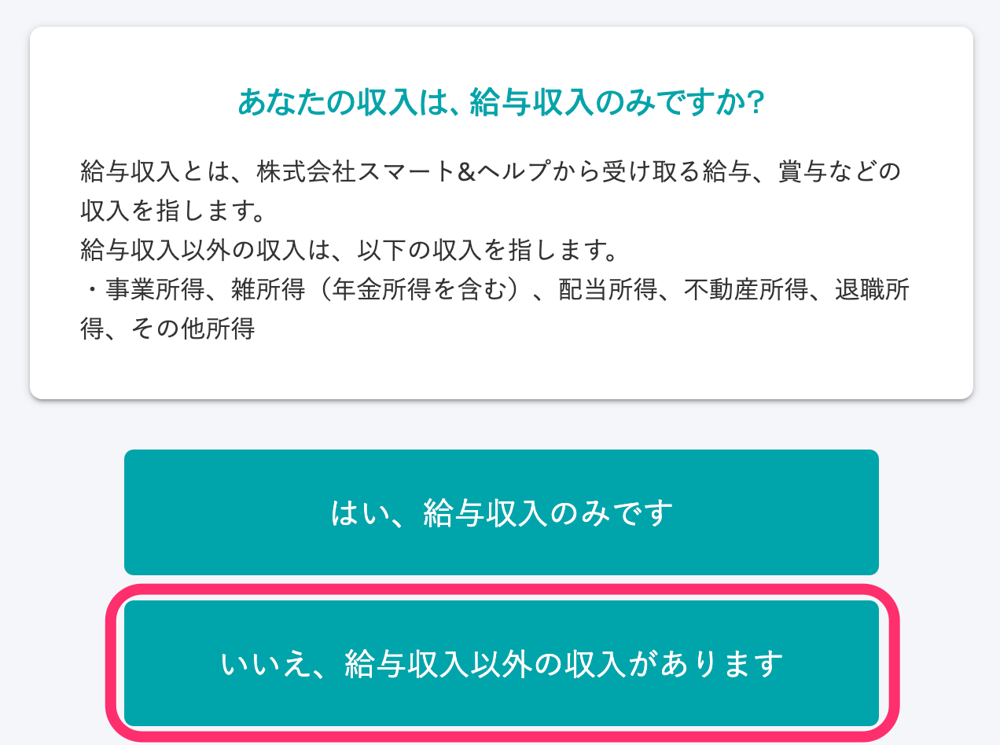

关于记入「工资所得者的基础扣除申告书 兼 工资所得者的配偶扣除等申告书 兼 所得金额调整扣除申告书（給与所得者の基礎控除申告書 兼 給与所得者の配偶者控除等申告書 兼 所得金額調整控除申告書）」（下称基础扣除申告书 兼 配偶扣除等申告书 兼 所得金额调整扣除申告书）的 **本年度总所得金额的估算额**，若非所得金额调整扣除对象，则根据问卷调查的选项，记入统一的收入金额。

本页面将对总所得金额估算额的显示标准及其背景、不适用该标准的情形进行介绍。

另外，也可以在文件中反映正确的金额，而非统一金额。

详细步骤请查看“输入实际金额的方法”。

:::tips
在年末调整功能上线前，将由专业的外部税理士事先实施评估。
并且，自2018年启用该标准后，创建的文件从未收到来自税务署的问题反馈。
:::

# 标准

若非所得金额调整扣除对象，“基础扣除申告书 兼 配偶扣除等申告书 兼 所得金额调整扣除申告书”分类Ⅰ的分类判定将根据问卷调查的选项，记入统一的金额。

“您本年度总所得金额的估算额计算”栏记入的只是“估算额”。
估算额仅作为计算配偶扣除额时用于分类判定的金额，因此在SmartHR的年末调整功能中显示统一的金额。

# 标准介绍

## 前提

申告配偶扣除时，需从员工的收入额计算出“所得额”。

配偶扣除额（或特别扣除额）将根据由员工所得额和配偶所得额计算出的分类值确定。

所得额将根据工资收入额（扣除所得税、社会保险费等前，即所谓的税前金额）通过复杂的运算得出。

## 问题点

若要计算所得额，只需输入工资收入额（年收入），SmartHR便可自动计算，但问题在于 **计算所需的年收入并不容易得出**。

年收入包含加班费、绩效、奖金等。

虽然申告书只需记入估算额，但在回答年末调整问卷调查时，往往难以准确掌握今年的估算额。

在过去SmartHR实施的调查中，大多数人表示“**在年末调整时期还不清楚自己的年收入（估算额）”**。

若不申告从年收入计算出的所得额，则无法确定配偶扣除额（或特别扣除额），因此SmartHR对于员工本人的年收入额采取了输入统一金额的形式。

# 具体案例

## 若在确认今年年收入预计额的问题中选择“A”

哪怕实际的收入金额为850万日元以下，记入“本年度总所得金额的估算额计算”栏的收入金额也将统一显示为850万日元（所得金额为655万日元）。

收入金额在选择B时显示为1,095万日元，选择C时为1,145万日元，选择D时为1,195万日元。

选择E时，则不属于配偶扣除（配偶特别扣除）的对象。

## 若无配偶或今年本人的总所得在500万日元以下

在问卷调查中作出以下回答时，记入“本年度总所得金额的估算额计算”栏的收入金额将统一显示为677万7,778日元（所得金额为500万日元）。

■确认今年的年收入预计额：选择“A”

■确认有无配偶：选择“无”

■确认过去有无配偶：选择任一选项

■确认有无事实婚姻：选择“无”

■确认今年本人的总所得是否在500万日元以下：选择“是”

:::tips
仅在确认今年本人的总所得是否在500万日元以下的问题中选择“是”，还无法判定单亲扣除或寡妇扣除。
在后面的问题中还将确认有无抚养家属信息，然后根据是否登记有抚养家属信息来判定单亲扣除或寡妇扣除。
关于在年末调整的文件中显示寡妇/单亲的条件，详情请查看以下帮助页面。
[在年末调整的文件中显示寡妇/单亲的条件是什么？](https://knowledge.smarthr.jp/hc/ja/articles/360039191593)
:::

# 不适用此标准的情形

若符合下列情形，总所得金额的估算额将不为统一金额。

## 属于所得金额调整扣除的对象

若属于所得金额调整扣除的对象，工资所得中就必须记入减去所得金额调整扣除后的数额。

因此需要使用以下公式求出金额，而非记入统一金额。

- **工资所得（所得金额调整扣除后）= 工资收入额 - 工资所得扣除额 - 所得金额调整扣除额**

所得金额调整扣除额由以下公式求出。

- **所得金额调整扣除额=（工资收入额 - 850万日元）×10%
    **※工资收入额高于1,000万日元时一律按1,000万日元计算。

:::alert
所得金额调整扣除分为“（儿童等）”和“（年金等）”2种，而在年末调整中可获得扣除的只有“所得金额调整扣除（儿童等）”。
属于（年金等）的情形，请参考以下帮助页面，指导员工自行进行确定申告。
:::
:::related
[需要员工自行进行确定申告时](https://knowledge.smarthr.jp/hc/ja/articles/360055839553)
:::

### 例：在问卷调查中回答工资收入额为“900万日元”时

■问卷调查的“工资收入额”输入画面

■在问卷调查的输入内容确认画面中显示“今年的收入情况”

工资所得额（所得金额调整扣除后）由以下公式求出。

- 工资收入900万日元 - 工资所得扣除195万日元 = (a)工资所得705万日元
- （工资收入900万日元 - 850万日元）× 0.1 = (b)所得金额调整扣除额5万日元
- (a)工资所得额705万日元 - (b)所得金额调整扣除额5万日元 = 工资所得（所得金额调整扣除后）700万日元

■显示创建的“基础扣除申告书 兼 配偶扣除等申告书 兼 所得金额调整扣除申告书”

# 输入实际金额的方法

## 1\. 在下图的问题中点击“否，有工资收入以外的收入”

点击“否，有工资收入以外的收入”后，将显示问题“请输入您的收入明细”。

## 2\. 输入收入明细

除工资收入外，“事业所得”“杂项所得”“股息所得”“不动产所得”“离职所得”“其他所得”均可输入实际金额。

:::tips
若希望员工在“您本年度总所得金额的估算额计算”栏中输入实际金额，建议在问卷调查的提示中设置【请务必选择“否”】这样的信息。
此外还有通过管理员通知功能和填写年末调整申请时的邮件模板来进行指导的方法。
:::
:::related
[编辑问卷调查画面的提示](https://knowledge.smarthr.jp/hc/ja/articles/360034870854)
[在员工的年末调整画面设置管理员通知](https://knowledge.smarthr.jp/hc/ja/articles/360053347974)
[申请年末调整](https://knowledge.smarthr.jp/hc/ja/articles/360035370313)（填写“准备：编辑邮件模板”）
:::
