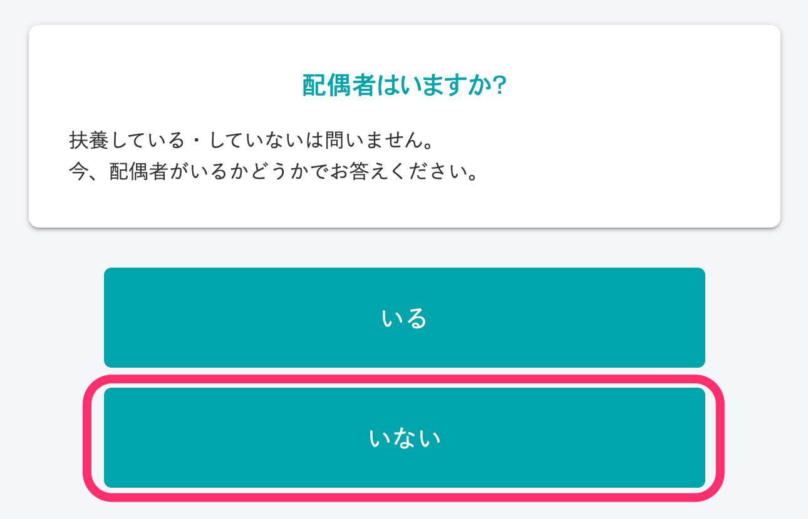
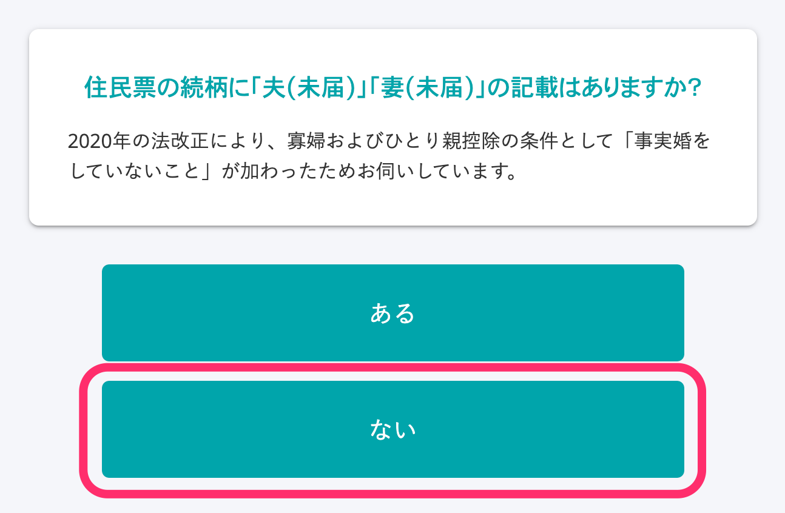
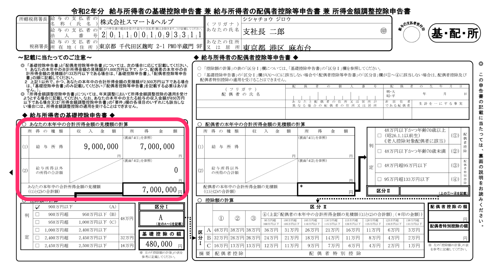

關於「薪資所得者的基本扣除申報書 兼 薪資所得者的配偶扣除等申報書 兼 所得金額調整扣除申報書（給与所得者の基礎控除申告書 兼 給与所得者の配偶者控除等申告書 兼 所得金額調整控除申告書）」（以下、基礎控除申告書 兼 配偶者控除等申告書 兼 所得金額調整控除申告書）（以下簡稱「基本扣除申報書 兼 配偶扣除等申報書 兼 所得金額調整扣除申報書」）記載之 **本年度合計所得金額的估計金額** ，若不屬於所得金額調整扣除對象時，將依據問卷選項記載統一收入金額。

本頁面將說明合計所得金額的估計金額顯示格式與其目的，以及不適用格式的範例。

此外，有時也可能反映正確金額，而非顯示統一金額。

詳細步驟請參閱「實際金額填寫方法」。

:::tips
年末調整功能上線時，皆已事先經由外部專業稅理士審核。
此外，本系統自2018年起即採用同一套格式，製作文件從未遭稅務署糾正。
:::

# 格式

若不屬於所得金額調整扣除對象時，「基本扣除申報書 兼 配偶扣除等申報書 兼 所得金額調整扣除申報書」在分類I的判定分類方式將依據問卷選項記載統一金額。

「計算您的本年度合計所得金額預估金額」欄僅用於記載「估計金額」。

估計金額僅視為計算配偶扣除額時用於判定分類的金額，且在SmartHR的年末調整功能中將顯示統一金額。

# 格式之目的

## 前提

員工若申報配偶扣除，需根據薪資收入金額計算「所得金額」。

根據以員工所得金額與配偶所得金額計算出的分類值，將決定配偶扣除額（或特別扣除額）。

薪資收入金額（即扣除所得稅、社會保險費等費用前的應領金額）經複雜計算後，將得出所得金額。

## 課題

若要計算所得金額，只要填寫薪資收入金額（年收），即可透過SmartHR自動計算，但會遇到**填寫作為計算基準的年收非常困難** 的課題。

年收包含加班津貼、獎勵金和獎金等。

雖然只要將估計金額填寫至申報書即可，但在回答年末調整問卷時，幾乎大多數人都無法掌握今年的正確估計金額。

過去SmartHR所實施的調查結果中，許多人回答「**在年末調整時期當下，不知道自己的年收（估計金額）」** 。

由於必須申報根據年收計算出的所得金額，才能決定配偶扣除額（或特別扣除額），因此在SmartHR中，員工本人的年收金額一向都是填寫統一金額。

# 具體範例

## 如果您在確認今年的年收預估金額問題中選擇「A」

即使原本的收入金額為850萬日圓以下，「計算本年度合計所得金額估計金額」所記載的收入金額將會統一顯示為850萬日圓（所得金額為655萬日圓）。

收入金額若選擇「B」，將會顯示1,095萬日圓；若選擇「C」，將會顯示1,145萬日圓；若選擇「D」，將會顯示1,195萬日圓。

若選擇「E」，則不屬於配偶扣除（配偶特別扣除）對象。

## 如果您符合無配偶／今年本人合計所得為500萬日圓以下

問卷中的回答如下時，「計算本年度合計所得金額估計金額」所記載的收入金額將會統一顯示為677萬7,778日圓（所得金額為500萬日圓）。

■確認今年的年收預估金額：選擇「A」

■確認有無配偶：選擇「無」

■確認過去是否曾有過配偶：任選

■確認有無非正式婚姻：選擇「無」

■確認今年本人合計所得是否為500萬日圓以下：選擇「符合」

:::tips
光只是在確認今年本人合計所得是否為500萬日圓以下的問題中，選擇「符合」，並不會判定為符合單親家長扣除或寡婦扣除。
在接下來的問題中將會確認有無扶養家屬資訊，以及是否已登記扶養家屬資訊，藉此判定是否符合單親家長扣除或寡婦扣除。
關於在年末調整文件中顯示為寡婦／單親家長的條件，詳情請參閱下列幫助頁面。
[在年末調整文件中顯示為寡婦／單親家長的條件是？](https://knowledge.smarthr.jp/hc/ja/articles/360039191593)
:::

# 不適用格式的範例

符合下列情況時，合計所得金額的估計金額不會顯示統一金額。

## 如果您屬於所得金額調整扣除的對象

如果您屬於所得金額調整扣除對象，薪資所得必須記載扣掉所得金額調整扣除後的金額。

因此將會記載使用下列計算公式求出的金額，而非統一金額。

- **薪資所得（所得金額調整扣除後）= 薪資收入金額 - 薪資所得扣除額 - 所得金額調整扣除額**

使用下列計算公式求出所得金額調整扣除額。

- **所得金額調整扣除額 =（薪資收入金額 - 850萬日圓） × 10%**
    ※薪資收入金額為1,000萬日圓以上時，統一以1,000萬日圓計算。

:::alert
所得金額調整扣除分成「（子女等）」與「（年金等）」2種，其中僅有「所得金額調整扣除（子女等）」可在年末調整中獲得扣除。
若符合（年金等），請指導員工參考下列幫助頁面，自行完成確定申報。
:::
:::related
[若員工需自行完成確定申報](https://knowledge.smarthr.jp/hc/ja/articles/360055839553)
:::

### 例：如果您在問卷中的薪資收入金額回答「900萬日圓」

■問卷的「薪資收入金額」填寫頁面

■在問卷的填寫內容確認頁面中所顯示的「今年的收入情況」

使用下列計算公式求出薪資所得金額（所得金額調整扣除後）。

- 薪資收入900萬日圓 - 薪資所得扣除195萬日圓 = (a)薪資所得705萬日圓
- （薪資收入900萬日圓 - 850萬日圓）× 0.1 = (b)所得金額調整扣除額5萬日圓
- (a)薪資所得金額705萬日圓 - (b)所得金額調整扣除額5萬日圓 = 薪資所得（所得金額調整扣除後）700萬日圓

■顯示製作完成的「基本扣除申報書 兼 配偶扣除等申報書 兼 所得金額調整扣除申報書」

# 實際金額填寫方法

## 1\. 在下圖問題中點選「否，有薪資收入以外的收入」

點選「否，有薪資收入以外的收入」後，將會顯示「請填寫您的收入細目」問題。

## 2\. 填寫收入細目

除了薪資收入以外，「事業所得」、「雜項所得」、「分紅所得」、「不動產所得」、「離職所得」及「其他所得」可填寫實際金額。

:::tips
如您希望作答者在「計算您的本年度合計所得金額估計金額」欄填寫實際金額，建議設定問卷提示訊息：【請務必選擇「否」】。
另外，也可利用來自管理者的通知功能，或記載於請求年末調整時的電子郵件範本中，藉此指導作答者。
:::
:::related
[編輯問卷頁面的提示](https://knowledge.smarthr.jp/hc/ja/articles/360034870854)
[於員工年末調整頁面設定來自管理者的通知](https://knowledge.smarthr.jp/hc/ja/articles/360053347974)
[請求年末調整](https://knowledge.smarthr.jp/hc/ja/articles/360035370313)（記載於「準備：編輯電子郵件範本」）
:::
