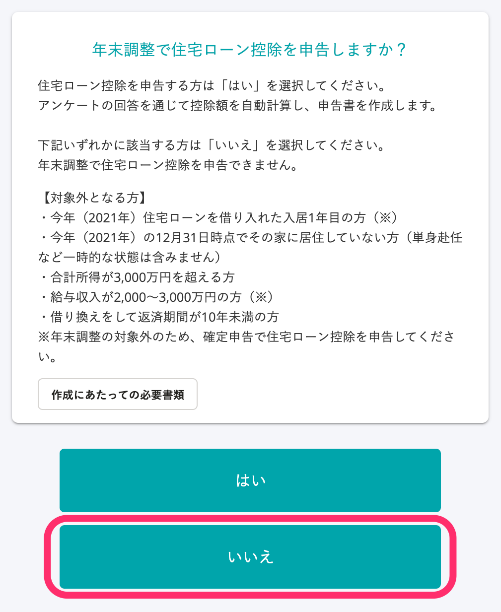
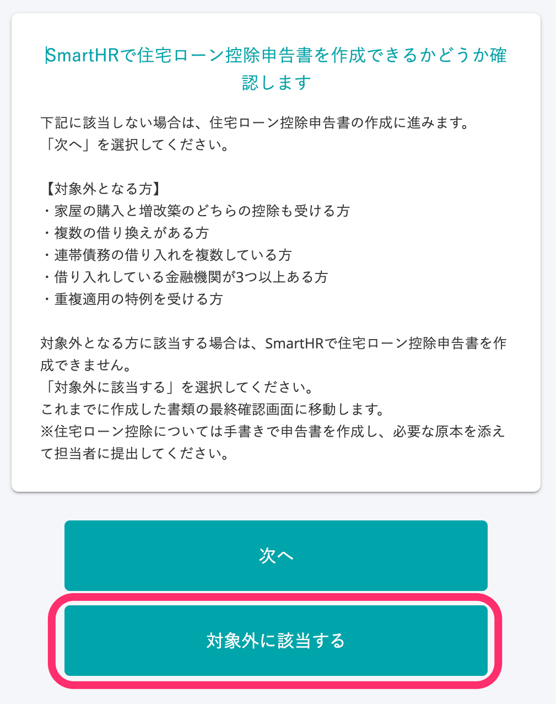
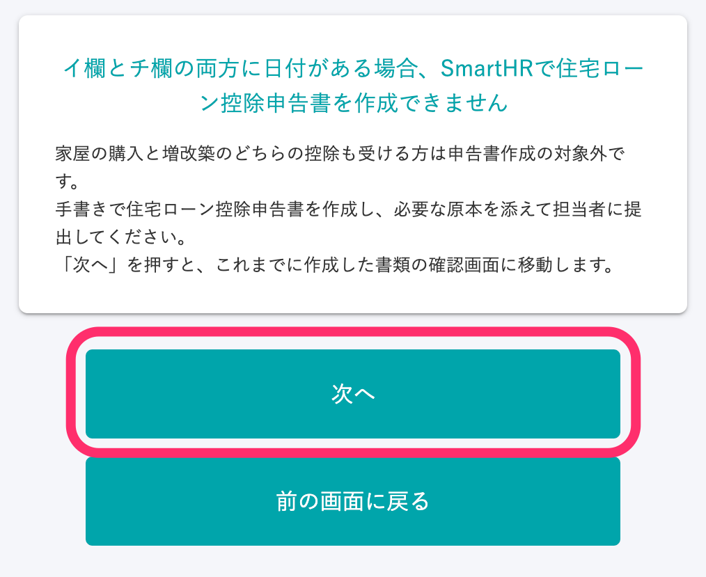

:::alert
当ページで案内しているSmartHRの年末調整機能の内容は、2021年（令和3年）版のものです。
2022年（令和4年）版の年末調整機能の公開時期は秋頃を予定しています。
なお、画面や文言、一部機能は変更になる可能性があります。
公開時期が決まり次第、[アップデート情報](https://smarthr.jp/update)でお知らせします。
:::

SmartHRの年末調整機能で、住宅ローン控除申告書の作成対象外となる条件を説明します。

当ページでは、作成対象外となった従業員が「アンケートでどのように回答して対象外となるのか」の具体例も紹介しています。

:::tips
対象外となる条件に該当する従業員には、手書きで申告書を作成のうえ、原本を提出するよう案内してください。
:::

# 対象外となる条件

以下いずれかの条件に一つでも該当する場合は、住宅ローン控除申告書の作成対象外です。

## 年末調整で住宅ローン控除を申告できない方

- 今年（2021年）住宅ローンを借り入れた入居1年目の方（※）
- 今年（2021年）の12月31日時点でその家に居住していない方（単身赴任など一時的な状態は含みません）
- 合計所得が3,000万円を超える方
- 給与収入が2,000〜3,000万円の方（※）
- 借り換えをして返済期間が10年未満の方

※年末調整の対象外のため、確定申告で住宅ローン控除を申告してください。

## SmartHRで住宅ローン控除申告書を作成できない方

- 家屋の購入と増改築のどちらの控除も受ける方（イ欄とチ欄の両方に日付がある方）
- 重複適用（の特例）を受ける方
- 旧様式の書類をお持ちで、住宅ローン控除申告書の「⑭欄」に取り消し線がある方
- 住宅ローン控除申告書の各項目が2段に分かれて金額が記載されている、または、書類が2枚に分かれている方
- 複数の借り換えがある方
- 複数の借り入れがあり、その中に連帯債務の借り入れが含まれる方
- 借り入れしている金融機関が3つ以上ある方
- 新様式の書類をお持ちで、住宅ローン控除証明書の「家屋に関する連帯債務割合（ニ欄）」と「土地に関する連帯債務割合（ト欄）」に記載されている割合が異なる方

:::tips
SmartHRの年末調整機能では、申告書の上半分に記載の書類名をもとに、それぞれの様式を「旧様式」「新様式」と区別して表記しています。
書類名が「給与所得者の（特定増改築等）住宅借入金等特別控除申告書」：旧様式
書類名が「給与所得者の（特定増改築等）住宅借入金等特別控除申告書 兼（特定増改築等）住宅借入金等特別控除計算明細書」：新様式※
※2020年から新たに採用された書類の様式を指し、SmartHRでは従来の様式と比較して「新様式」と表記しています。
:::

# アンケートの回答により申告書作成対象外となる3つのパターン

年末調整のアンケート回答をもとに、住宅ローン控除申告書の作成対象外かどうかをシステムで判定しています。

「住宅ローンはあるのに申告書が作成されない」従業員がいる場合には、以下3つの設問のアンケート回答履歴をご確認ください。

従業員のアンケート回答履歴を確認する方法は、以下のヘルプページをご覧ください。

:::related
[年末調整のアンケート回答履歴を確認する](https://knowledge.smarthr.jp/hc/ja/articles/360053297094)
:::

## 1\. 年末調整で住宅ローン控除を申告するかを確認する設問で［いいえ］と回答

 **［いいえ］** を選択した場合、申告書の作成対象外と判定します。

## 2\. SmartHRで住宅ローン控除申告書の作成対象かを確認する設問で［対象外に該当する］と回答

 **［対象外に該当する］** を選択した場合、住宅ローン控除申告書の作成対象外と判定します。

## 3\. イ欄とチ欄の両方に日付があるかを確認する設問で［次へ］と回答

 **［次へ］** を選択した場合、申告書作成の対象外と判断します。

