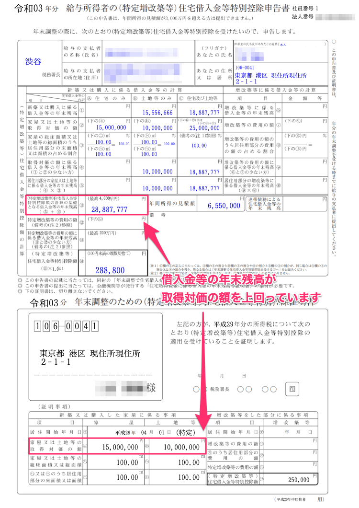
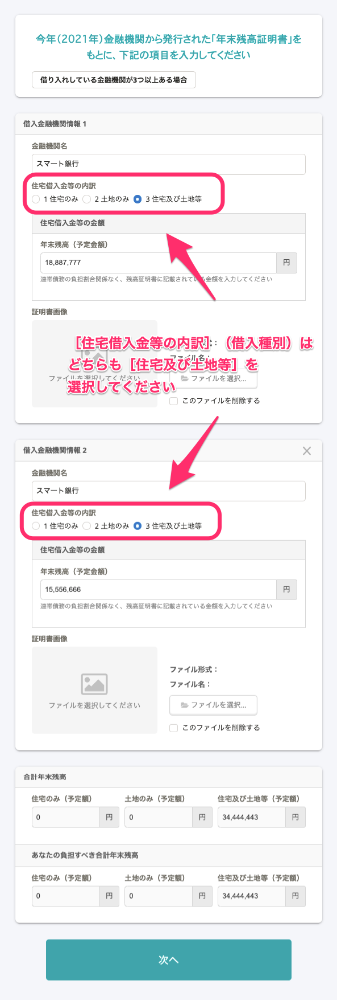
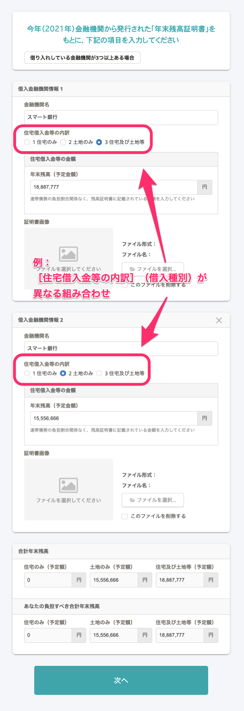
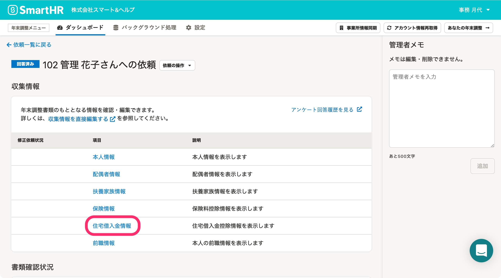
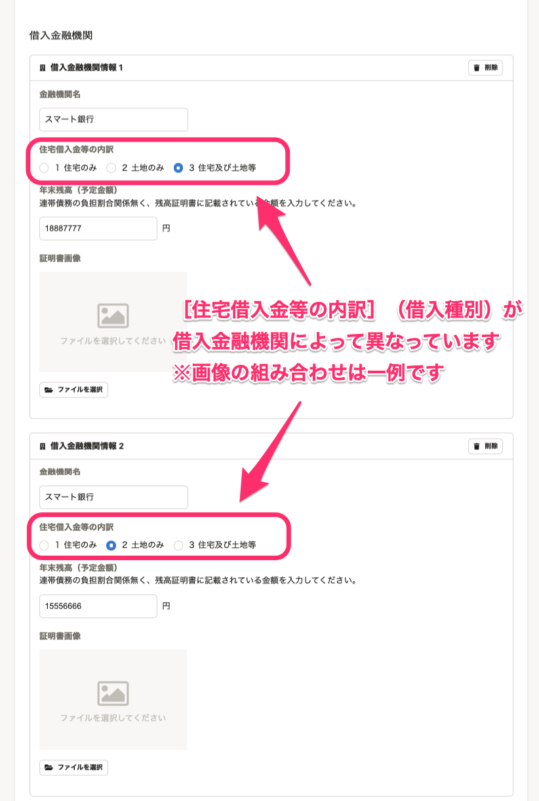
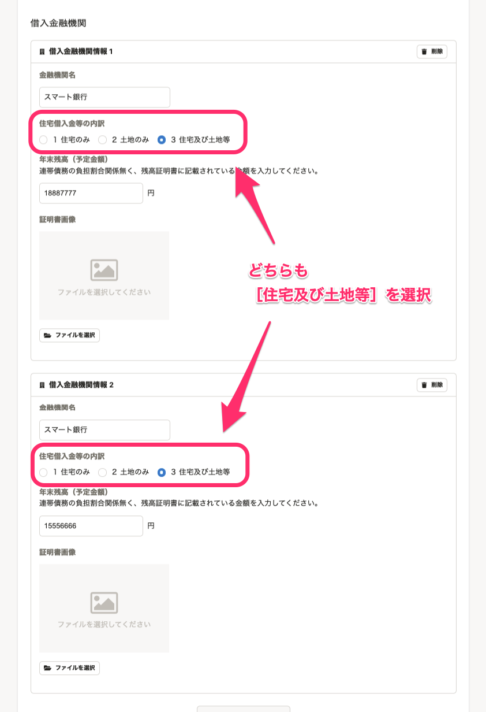
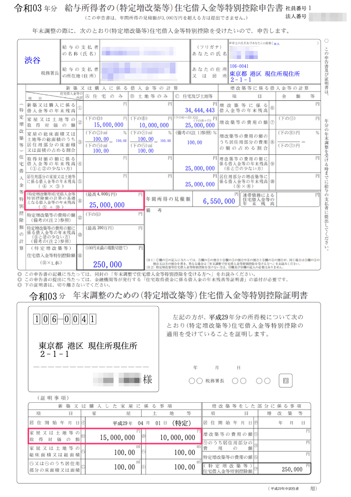

:::alert
当ページで案内しているSmartHRの年末調整機能の内容は、2021年（令和3年）版のものです。
2022年（令和4年）版の年末調整機能の公開時期は秋頃を予定しています。
なお、画面や文言、一部機能は変更になる可能性があります。
公開時期が決まり次第、[アップデート情報](https://smarthr.jp/update)でお知らせします。
:::

SmartHRで住宅ローン控除申告書を作成するにあたり、「2つの金融機関から、借入種別の異なる借り入れがある」場合、一部条件下で**借入金等の年末残高が取得対価の額を上回って申告書に記載される**ケースが発生します。

借入金等の年末残高が取得対価の額を超えることは正しい状態ではないため、「対処法」に記載の内容に沿って操作し、正しい金額を反映してください。

従業員向け、担当者（管理者）向け、それぞれの対処法を説明します。

# 借入金等の年末残高が取得対価の額を上回るケースの発生条件

以下の条件をどちらも満たす場合に、借入金等の年末残高が取得対価の額を上回って申告書に記載されるケースが発生します。

1.  残高証明書が2つあり、借入種別が「住宅及び土地等」と、「住宅のみ」もしくは「土地のみ」の組み合わせである場合
2.  借入残高の合計が、取得対価の額（住宅と土地）の合計を上回っている場合

**例：上記の条件をどちらも満たす場合の申告書**

# 対処法

:::tips
以下では「住宅借入金等の内訳」を「住宅及び土地等」に変更する方法を対処法として記載していますが、本来の申告書の記載と異なる内容でも問題がないことを国税局に確認済みです。
年末残高に「土地のみ（もしく住宅のみ）」と「住宅及び土地等」が混在するケースには明確な記載ルールがないため、国税局に問い合わせし、住宅借入金等特別控除を正しく計算するために「住宅及び土地等」に合算して記載していることが説明できれば問題ないことを確認しています。
:::

## 従業員向け

年末調整のアンケート画面で「年末残高証明書」の内容を入力する場合、 **［住宅借入金等の内訳］** （借入種別）は「住宅及び土地等」を選択してください。

**誤った金額が申告書に反映される例：［住宅借入金等の内訳］（借入種別）が異なる組み合わせ**

## 担当者向け

住宅ローン控除申告書のチェック時、計算の基礎となる「借入残高（申告書の⑪）」が取得対価の額を上回っている申告書を見つけた場合は、収集情報を以下の通り修正してください。

### 1\. 対象従業員の依頼詳細画面で［収集情報］>［住宅借入金情報］をクリック

対象従業員の依頼詳細画面を開き、 **［収集情報］** 欄にある **［住宅借入金情報］** をクリックすると、収集情報の編集画面が表示されます。

### 2.［借入金融機関］>［住宅借入金等の内訳］で［住宅及び土地等］を選択

 **［借入金融機関］** 欄に登録されている2つの金融機関の **［住宅借入金等の内訳］** を確認すると、現在は **［住宅借入金等の内訳］** が異なっています。

どちらも **［住宅及び土地等］** を選択してください。

### 3.［保存］をクリック

 **［保存］** をクリックすると、変更内容を保存します。

収集情報を修正後、作成された書類を確認すると、借入金等の年末残高が取得対価の額と一致しています。

