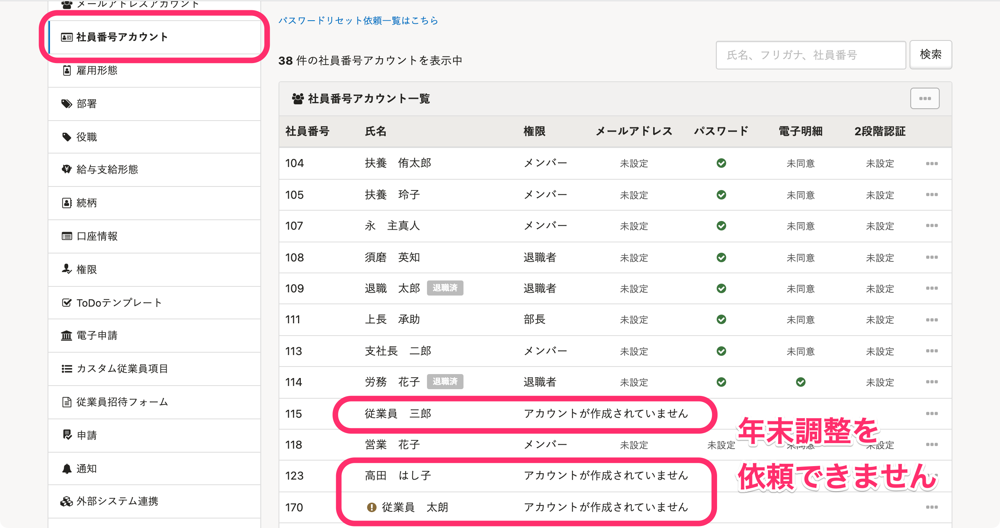

:::alert
当ページで案内しているSmartHRの年末調整機能の内容は、2021年（令和3年）版のものです。
2022年（令和4年）版の年末調整機能の公開時期は秋頃を予定しています。
なお、画面や文言、一部機能は変更になる可能性があります。
公開時期が決まり次第、[アップデート情報](https://smarthr.jp/update)でお知らせします。
:::

従業員に年末調整の依頼をするには、従業員情報やアカウントの整備が必要です。

事前に以下のポイントを確認してください。

:::alert
SmartHRに登録されたマイナンバーを年末調整で作成した書類へ取り込む際、従業員の社員番号で紐付けます。
そのため、年末調整開始後（依頼グループの作成後）は、年末調整終了まで従業員の社員番号を変更しないようお願いします。
:::

# 1\. 必要な従業員情報が揃っているか確認する

従業員に年末調整の依頼をするには、社員番号や住所などの情報が揃っている必要があります。

また、雇用形態や在籍状況にも条件があります。

必要な情報が不足している従業員や、退職済みの従業員には入力依頼はできません。

## 必要な従業員情報と条件

- 社員番号
- 姓名
- 姓名のヨミガナ
- 生年月日
- 性別
- 住所
- 在籍状況が「在職中」「休職中」
    ※ **［退職年月日］** に過去の日付が入力されている場合は依頼対象として取り込まれません
- 雇用形態が「派遣社員」「業務委託」以外
    ※雇用形態が「未設定（空欄）」の場合は依頼対象として取り込みます

:::alert
### 最新の従業員情報をSmartHRに登録してください
下記の場合、年末調整の開始前に、会社で把握している最新の従業員情報をSmartHRに反映してください。
- 今年からSmartHRの利用を開始する場合
- 通常は別システムで従業員情報を管理していて、SmartHRの利用は年末調整のみの場合
### ［退職済みの従業員］は年末調整の依頼対象外です
SmartHRの従業員リストの［ **退職済みの従業員］** に表示されている従業員は、年末調整の依頼対象外です。
なお、退職日が2021/3/31以前の場合は、在籍状況を手動で［ **退職済］** に変更する必要がありますので注意してください。
詳しくは下記のヘルプページをご覧ください。
[Q. 従業員リストの「退職済みの従業員」に表示される条件は？](https://knowledge.smarthr.jp/hc/ja/articles/360026106294)
:::

# 2\. SmartHRにログインできるアカウントが設定されているか確認する

 **［共通設定］>［メールアドレスアカウント］** または **［社員番号アカウント］** に名前がある従業員が、依頼の対象です。
アカウントが設定されていない従業員がいる場合は、従業員を招待してください。

:::related
[従業員をSmartHRに招待する](https://knowledge.smarthr.jp/hc/ja/articles/360026264133)
[社員番号アカウントを作成する](https://knowledge.smarthr.jp/hc/ja/articles/360026263373)
:::
:::tips
社員番号アカウント一覧で「アカウントが作成されていません」と表示がある場合は、アカウントの作成が必要です。

:::

# 次の工程に進む

引き続き年末調整の設定を進める場合は、以下のヘルプページをご覧ください。

:::related
[年末調整の対象となる従業員を確認する](https://knowledge.smarthr.jp/hc/ja/articles/360035370493)
:::
