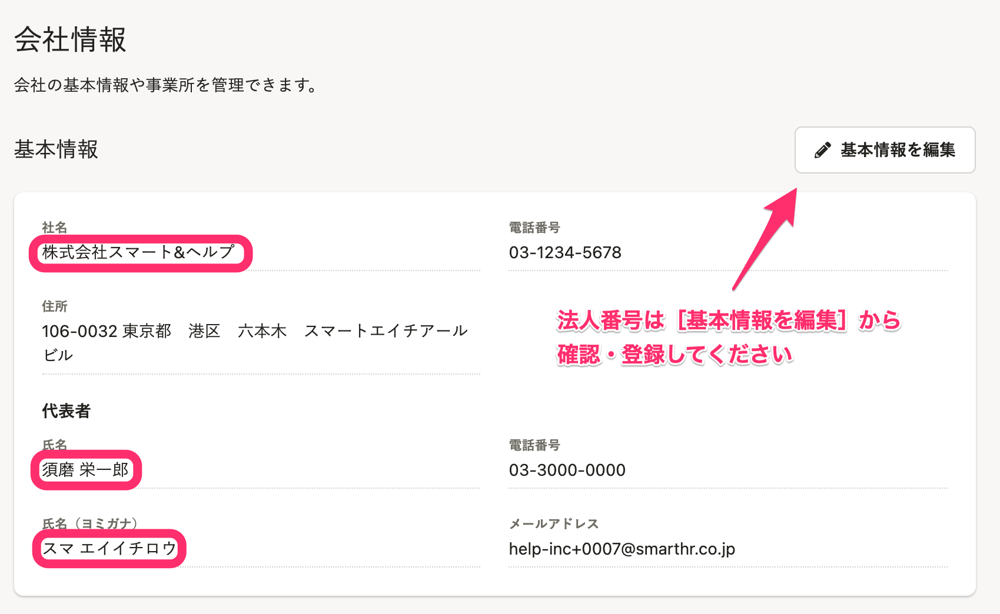
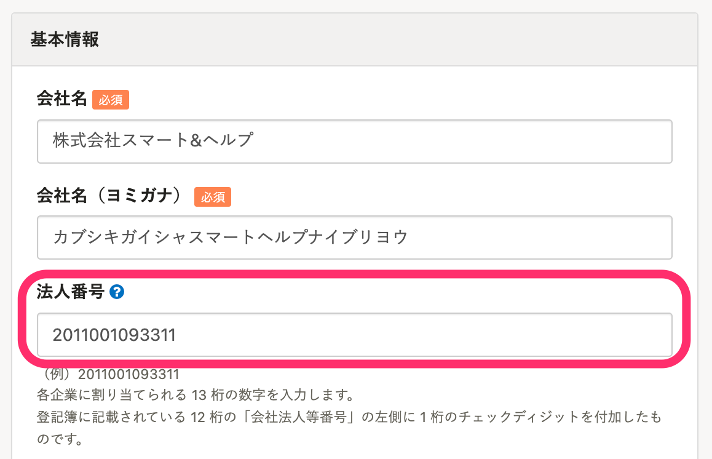
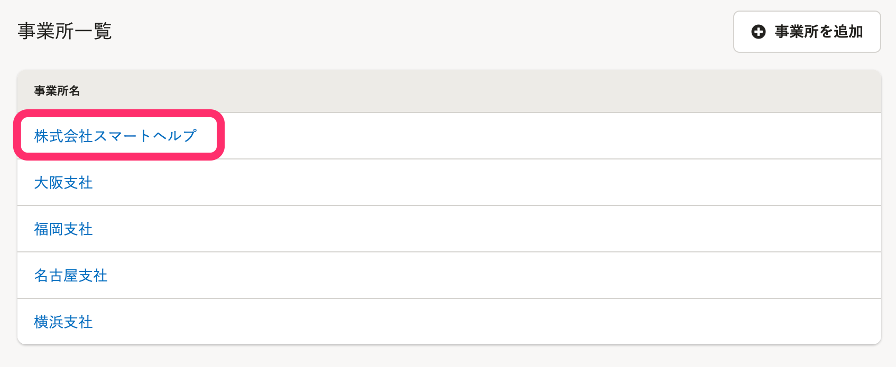
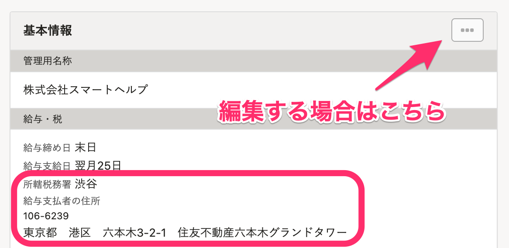

:::alert
当ページで案内しているSmartHRの年末調整機能の内容は、2021年（令和3年）版のものです。
2022年（令和4年）版の年末調整機能の公開時期は秋頃を予定しています。
なお、画面や文言、一部機能は変更になる可能性があります。
公開時期が決まり次第、[アップデート情報](https://smarthr.jp/update)でお知らせします。
:::

給与所得者の扶養控除等（異動）控除申告書など、年末調整で作成される書類の事業所情報は、年末調整の依頼グループ作成時にSmartHRに登録されている会社情報・事業所情報が反映されます。

年末調整開始前に、正しい情報が登録されているか、ご確認ください。

:::alert
依頼グループ作成後に会社情報・事業所情報を変更した場合は、下記のページを参考に情報の同期をお願いします。
[年末調整作成後に事業所情報や従業員情報を変更した場合は？](https://knowledge.smarthr.jp/hc/ja/articles/360035370173)
:::

# 会社情報が同期される項目

以下の項目は  **［共通設定］>［会社情報］>［基本情報］** に登録されている情報が反映されます。

- 社名
- 代表者の氏名
- 代表者の氏名（ヨミガナ）
- 法人番号

法人番号は **［基本情報を編集］** から確認・登録してください。

# 事業所情報が同期される項目

以下の項目は **［共通設定］>［会社情報］>［事業所一覧］** に登録されている情報が反映されます。

- 所轄税務署
- 給与支払者の住所

事業所情報は **［事業所名］** をクリックすると確認できます。

事業所情報を編集する場合は、 **［事業所名］** をクリックし、 **［…］メニュー >［編集］** をクリックします。

