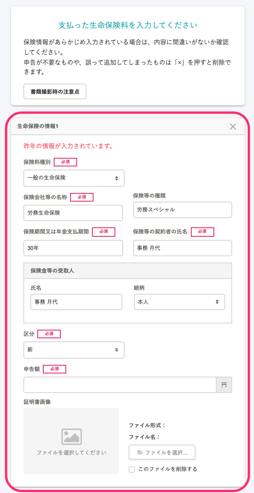
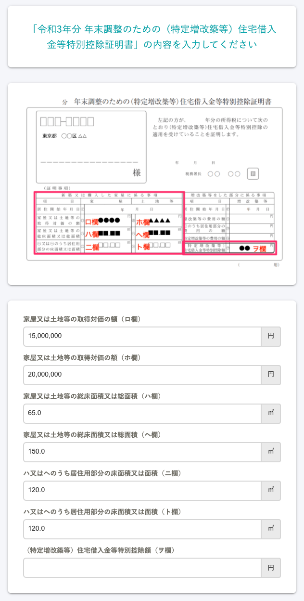
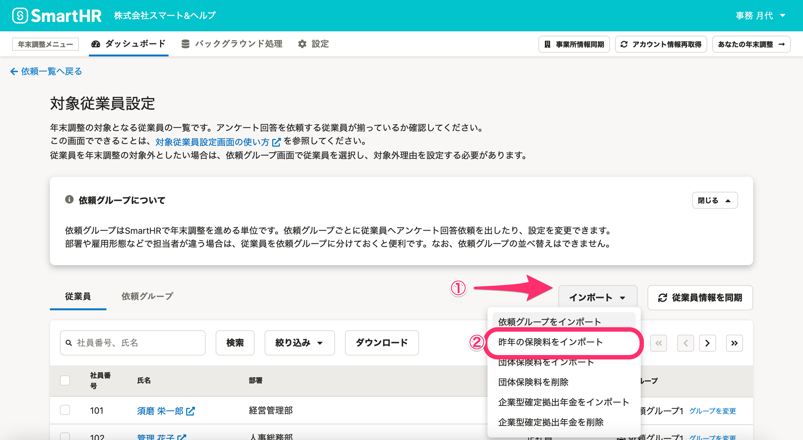
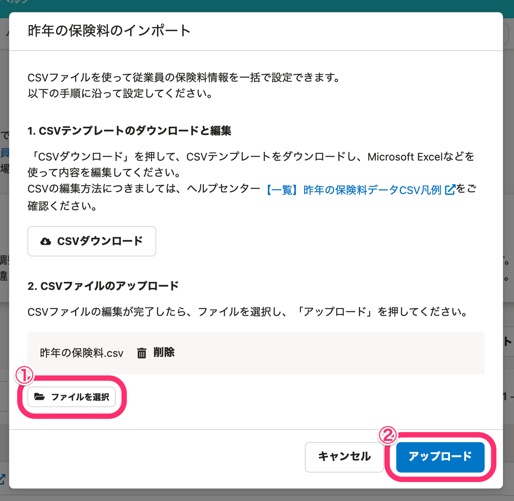
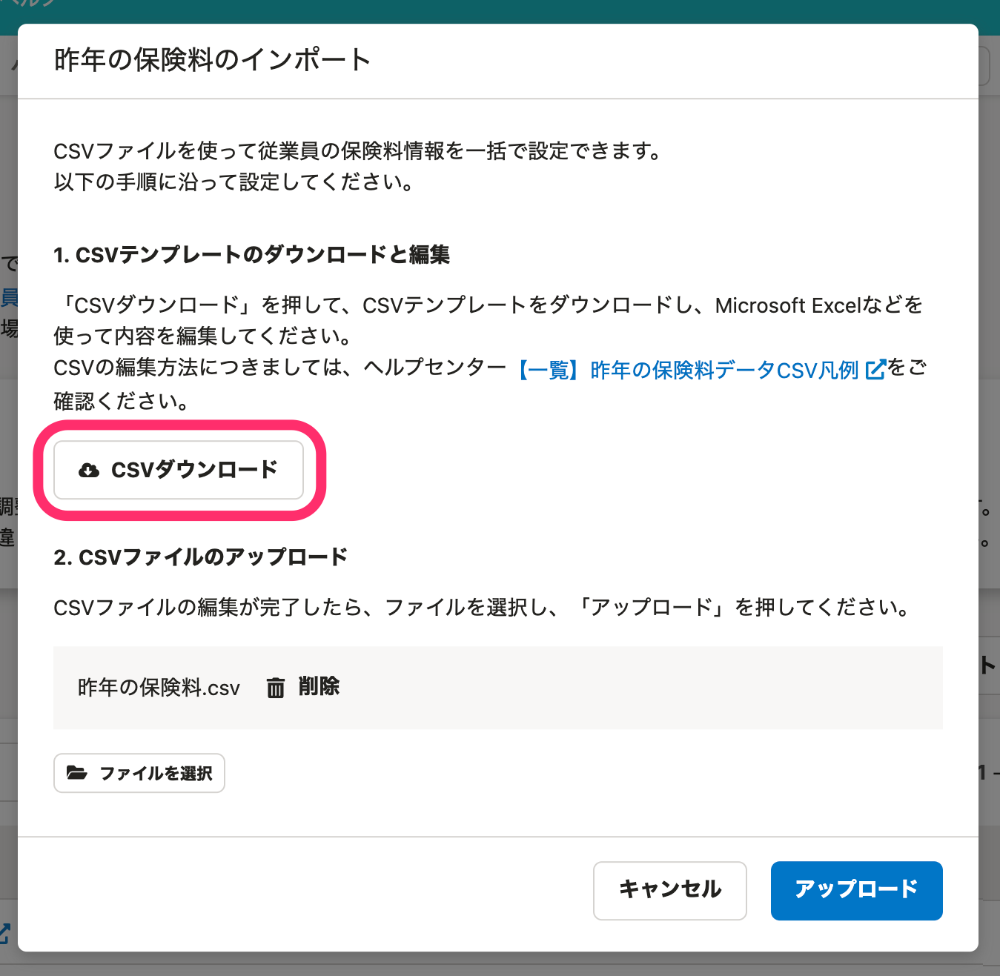

:::alert
当ページで案内しているSmartHRの年末調整機能の内容は、2021年（令和3年）版のものです。
2022年（令和4年）版の年末調整機能の公開時期は秋頃を予定しています。
なお、画面や文言、一部機能は変更になる可能性があります。
公開時期が決まり次第、[アップデート情報](https://smarthr.jp/update)でお知らせします。
:::

「給与所得者の保険料控除等申告書」に記載する保険会社・種類や、「住宅借入金等特別控除申告書（住宅ローン控除申告書）」に記載する家屋や土地の面積などの情報は、前年とあまり変わらないことがあります。

SmartHRの年末調整機能では、従業員の入力の手間を軽減するため、前年にSmartHRの年末調整で申請した保険や住宅借入金控除の申告にかかわる情報がある場合は、前年の情報を引き継いで表示します。

一般の生命保険・介護医療保険・個人年金保険・地震保険、社会保険、住宅借入金控除の申告情報に対応しています。

# 昨年SmartHRで年末調整を行なった場合

:::tips
**従業員の画面に、前年の保険等の情報および住宅借入金控除の申告情報が表示される条件は以下の通りです。**
- 前年の年末調整の依頼ステータスが「確定※」されていること
    ※担当者が、従業員の提出した内容に対して「確定する」を操作をしていること
- 社員番号に変更がないこと
- 上記を満たした状態で、年末調整機能の［はじめる］を押して依頼グループを作成していること
すでに依頼グループを作成している場合は、依頼一覧から従業員を削除し、条件を満たしているかを確認したうえで再度［従業員情報の同期］すると、昨年の情報を表示できます。
[年末調整の依頼一覧から従業員を削除する](https://knowledge.smarthr.jp/hc/ja/articles/360035370413)
:::

## 保険料の入力画面

年末調整のアンケート画面では、事前に **［保険料種別］［保険会社等の名称］** などが入力されています。

:::alert
保険料の申告額は入力されていません。今年の書類をもとに入力してください。
:::

## 住宅借入金控除の申告情報入力画面

年末調整のアンケート画面では、事前に住宅借入金控除の申告データが入力されています。

:::alert
年末残高、住宅借入金等控除額は入力されていません。今年の書類をもとに入力してください。
昨年、居住面積の記載がない住宅ローン控除申告書をもとにSmartHRで年末調整をした場合は、入力した内容が引き継がれません。お手数ですが、改めて情報を入力してください。
:::

# SmartHR以外で年末調整を行なった場合

昨年の保険料は、SmartHRのCSVファイルのテンプレートに情報を入力して一括インポートすると、従業員画面に情報を表示できます。

:::alert
昨年の保険料の一括インポートは、年末調整開始時に設定します。
インポートの対象は年末調整が「未依頼」の従業員です。
年末調整を依頼後の従業員に昨年の保険料のデータをインポートしたい場合は、その従業員の依頼を「未依頼」にして、インポートしなおしてください。
:::
:::related
[年末調整の依頼を「未依頼」に戻す](https://knowledge.smarthr.jp/hc/ja/articles/360034870774)
:::

## 昨年の保険料のインポートに関する注意事項

### 任意継続の健康保険料など「国民年金・国民年金基金以外の社会保険料」は専用の入力項目がありません。

CSVファイルの **［社会保険料控除:社会保険の種類］** 欄に **「国民健康保険料・介護保険料等の情報」** と入力して、SmartHR上で保険料情報などを入力してください。

### 各項目に何も情報が入力されていないCSVファイルをインポートすると、登録されている団体保険以外の保険情報を上書き（削除）します。

ヘッダーと社員番号のみ入力があり、他の項目は空の状態のCSVファイルをインポートすると、登録されている保険情報があった場合、団体保険以外の情報を上書き（削除）します。

その他、インポートにあたっての注意事項および、保険料データの詳しい仕様は下記のページをご覧ください。

:::related
[【一覧】昨年の保険料データCSV凡例](https://knowledge.smarthr.jp/hc/ja/articles/360035370113)
:::

## 昨年の保険料のインポート手順

### 1\. 対象従業員設定画面の［インポート▼］>［昨年の保険料をインポート］をクリック

 **［インポート▼］** をクリックすると表示されるメニューから **［昨年の保険料をインポート］** をクリックすると、 **［昨年の保険料のインポート］** というダイアログが表示されます。

### 2\. ファイルを選択し、［アップロード］をクリック

 **［ファイルを選択］** をクリックし、対象のファイルを選択して［ **アップロード］** をクリックすると、インポートを開始します。

サンプルファイルは、インポート画面の［ **CSVダウンロード］** をクリックするとダウンロードできます。

