:::alert
当ページで案内しているSmartHRの年末調整機能の内容は、2021年（令和3年）版のものです。
2022年（令和4年）版の年末調整機能の公開時期は秋頃を予定しています。
なお、画面や文言、一部機能は変更になる可能性があります。
公開時期が決まり次第、[アップデート情報](https://smarthr.jp/update)でお知らせします。
:::

LINC形式のDATファイル、もしくは損保標準形式のDATファイル、あるいはSmartHR形式のCSVファイルをお持ちの場合は、団体保険情報の一括インポートが可能です。

インポートにあたっては、当ページの最下部に記載の注意事項をご確認ください。

:::tips
事前にインポートの可否を確認できます。詳しくは下記のヘルプページをご覧ください。
[団体生保ファイルのインポートの可否を確認する](https://knowledge.smarthr.jp/hc/ja/articles/360035370353)
:::

# インポート手順

:::alert
団体保険の一括インポートは、年末調整開始時に実施してください。
インポートの対象は年末調整が「未依頼」の従業員です。
年末調整を依頼後の従業員に団体保険のデータをインポートしたい場合は、その従業員の依頼を「未依頼」にして、インポートしなおしてください。
なお、団体保険のデータのインポートは、複数回に分けて追加が可能です。
:::
:::related
[年末調整の依頼を「未依頼」に戻す](https://knowledge.smarthr.jp/hc/ja/articles/360034870774)
:::

## 1\. 年末調整ダッシュボード画面で［はじめる］をクリック

年末調整ダッシュボード画面で **［はじめる］** をクリックすると、 **［対象候補となる従業員と依頼グループを確認しましょう］** というメッセージが表示されている画面に移動します。

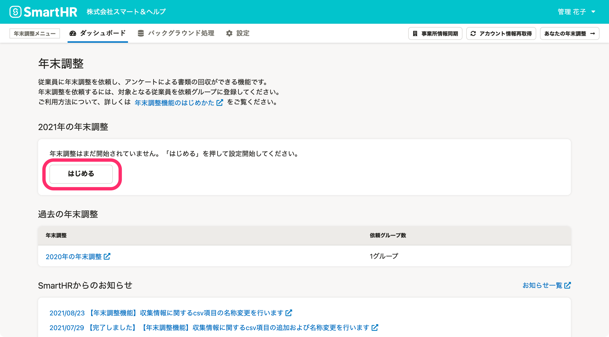

:::tips
年末調整の依頼グループの設定が完了していない場合は、 **［はじめる］** ボタンの表示が **［設定を続ける］** の表示に変わります。 
:::

## 2.［インポート▼］のメニューから［団体保険料をインポート］をクリック

 **［インポート▼］>［団体保険料をインポート］** をクリックすると、団体保険料のインポート形式の選択ダイアログが表示されます。

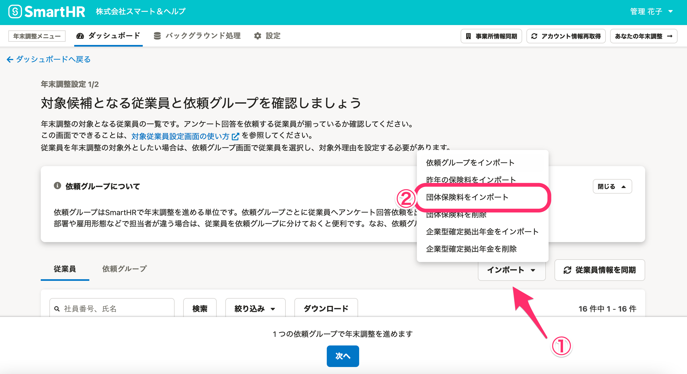

:::tips
年末調整の初期設定完了後も、団体保険料のインポートは可能です。
 **［対象従業員設定］** をクリックして表示される対象従業員設定画面から操作してください。
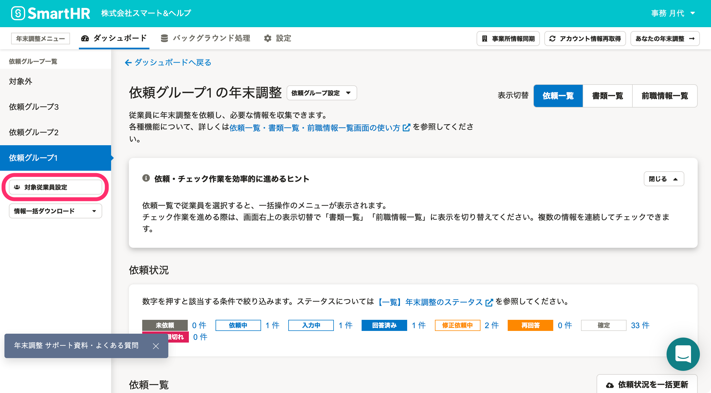
:::

## 3\. ファイルのインポート形式を選択し、［次へ］をクリック

インポートする団体保険データファイルの **［インポート形式］** を選択し、 **［次へ］** をクリックすると、ファイルの選択画面が表示されます。

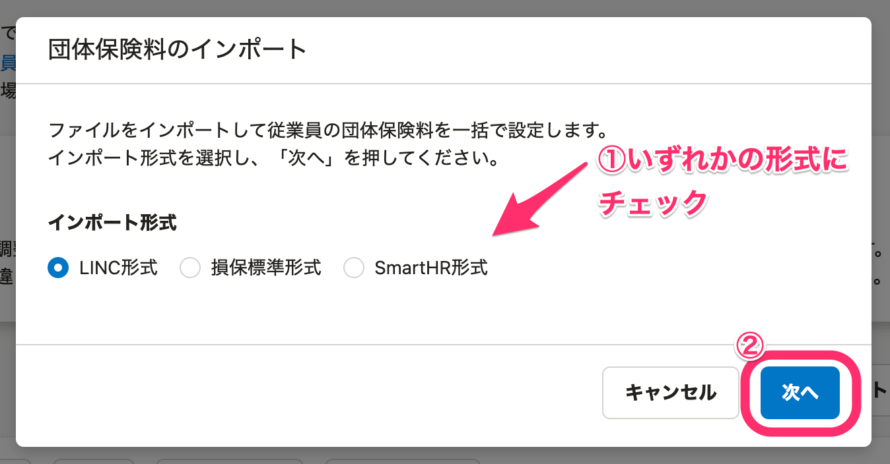

以下、LINC形式のDATファイルを選択した場合を例に説明します。

※ 損保標準形式のDATファイルやSmartHR形式のCSVファイルを選択した場合でも、手順は同じです。

## 4\. 団体保険データを選択し、［アップロード］をクリック

 **［ファイルを選択］** をクリックして対象の団体保険データを選択し、 **［アップロード］** をクリックすると、バックグラウンド処理が開始します。

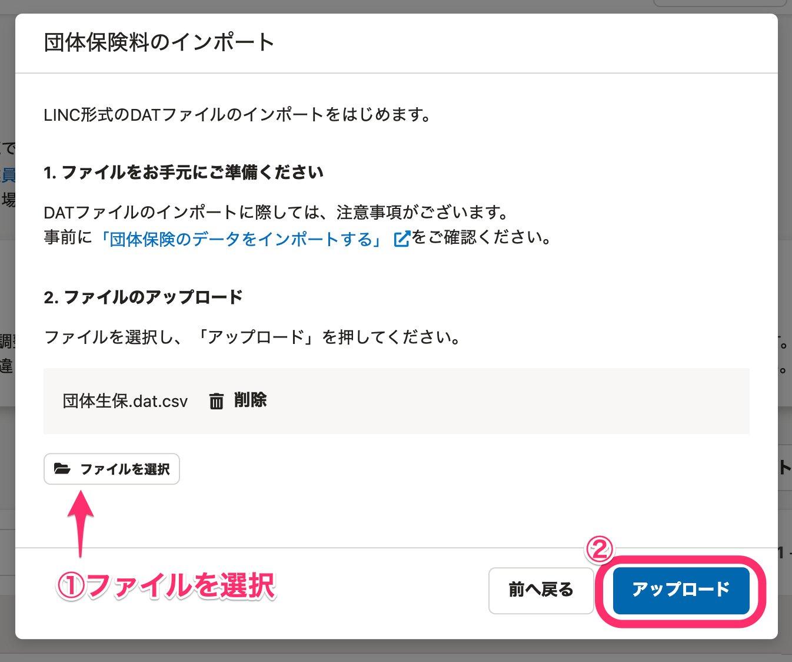

## 5\. バックグラウンド処理の結果を確認する

バックグラウンド処理の結果は、年末調整の **［バックグラウンド処理］** 画面で確認できます。

エラーが出ている場合は、バックグラウンド処理一覧の **［処理名］** をクリックすると、エラーの詳細を確認できます。

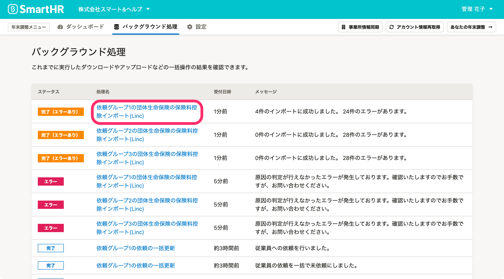

 **［処理結果］** 画面の **［エラー詳細］** 欄か、画面下部の **［ダウンロード］** から一覧CSVファイルをダウンロードする方法でも確認できます。

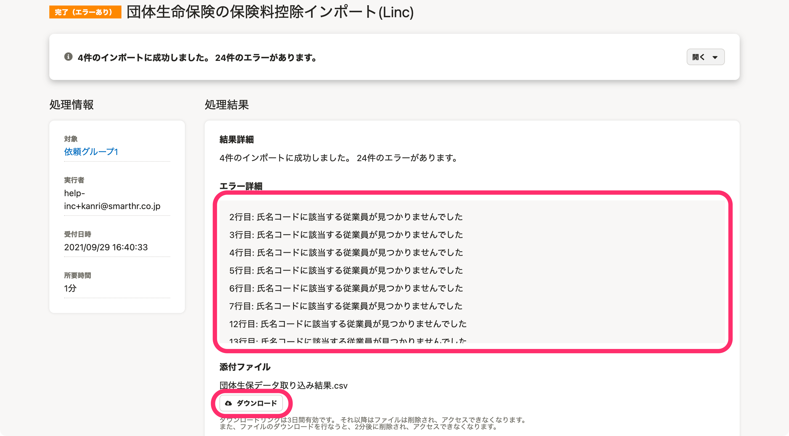

#### 団体保険のインポートでエラーが表示された場合

団体保険DATファイルチェッカーで、保険会社のDATファイルがインポートに対応しているか確認してください。

検証結果を出力したCSVファイルを確認して、出力されていない項目があれば編集してください。

編集後に再度インポートしてください。

詳しくは下記のヘルプページをご覧ください。

[団体保険ファイルのインポートの可否を確認する](https://knowledge.smarthr.jp/hc/ja/articles/360035370353)

:::alert
団体保険DATファイルチェッカーでエラーが出なかったにもかかわらず、「会社コードがLINC形式および損保標準形式で定義されていないコードである」等の理由で正常にインポートされないケースがあります。
DATファイルをインポートする際にエラーが出た場合は、保険会社から受け取ったDATファイルを開くことや編集・加工はせず、受け取ったままの状態で再度インポートを試してください。
なお、エラーが出たDATファイルについて、ファイルを開くことや、編集・加工をしていた場合、SmartHRではサポートができません。
万一、上記を試してもエラーが発生する場合は、CSVファイル形式でインポートする必要があるため、保険会社からCSVファイル形式のデータを取り寄せてください。
:::

# 削除手順

## 1\. 対象従業員設定画面の［インポート▼］>［団体保険料を削除］をクリック

 **［インポート▼］>［団体保険料を削除］** をクリックすると、削除操作の確認ダイアログが表示されます。

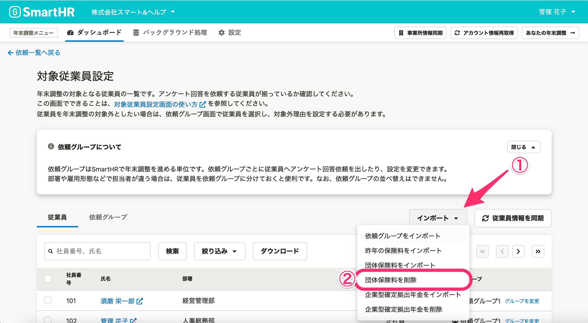

## 2\. ［削除］をクリック

 **［削除］** をクリックするとバックグラウンド処理が開始し、団体保険料データを削除します。

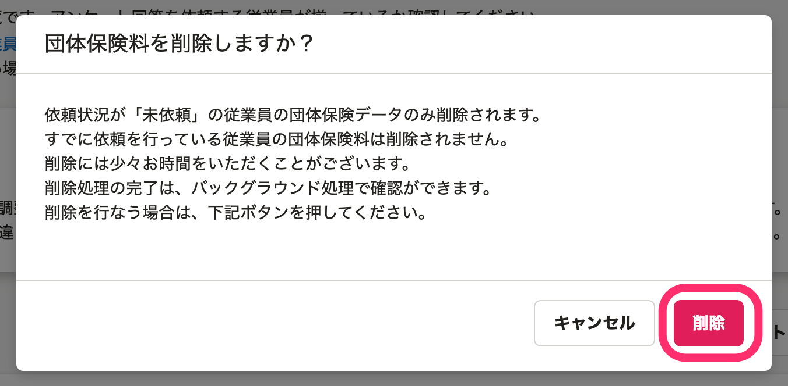

# 団体保険データをインポートした場合の画面表示

## 収集情報画面

インポートした団体保険データの内容が、収集情報画面の **［保険情報］** タブに表示されます。

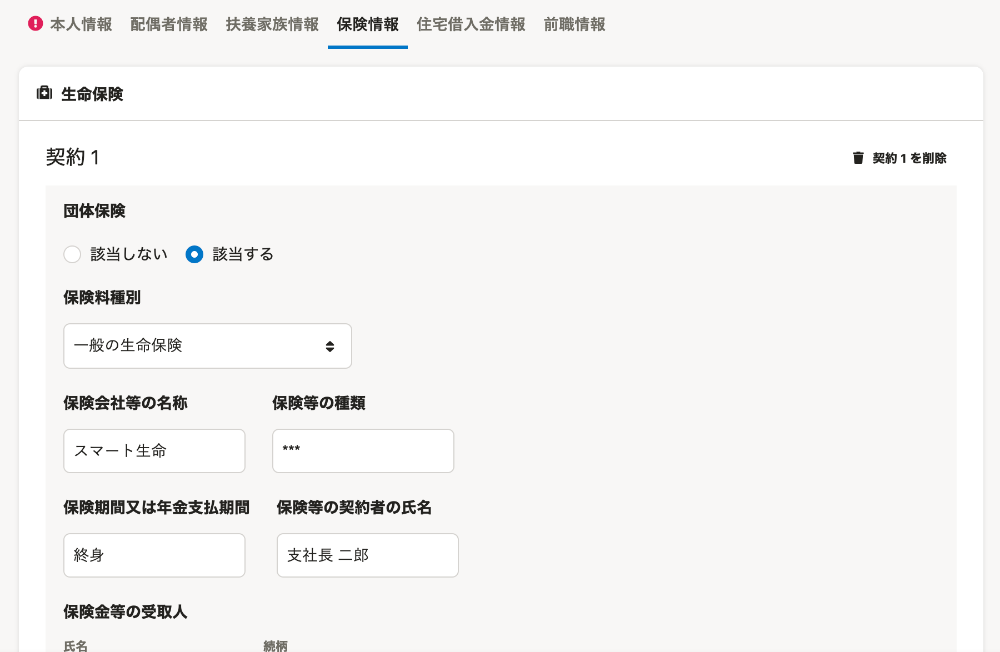

## 年末調整のアンケート画面

従業員が回答する年末調整のアンケート画面では、団体保険は下図のように情報が入力された状態で表示されます。

従業員は団体保険の情報の編集はできません。

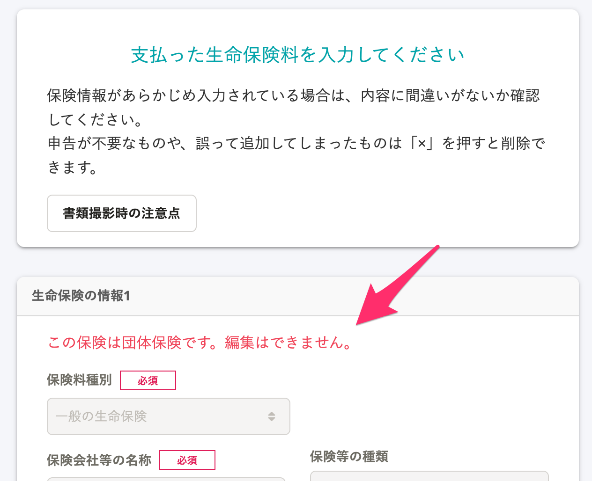

:::tips
CSVファイルでの団体保険インポートでは、一般の生命保険の場合、 **［保険等の種類］［保険金等の受取人（氏名）］［保険金等の受取人（続柄）］** の登録は必須ではありません。
:::

設問「今年（2021年）年末調整で保険料控除を申告しますか？」に「いいえ」と回答した場合でも、団体保険のデータが存在する場合は、団体保険のみ加入しているものとして処理されます。

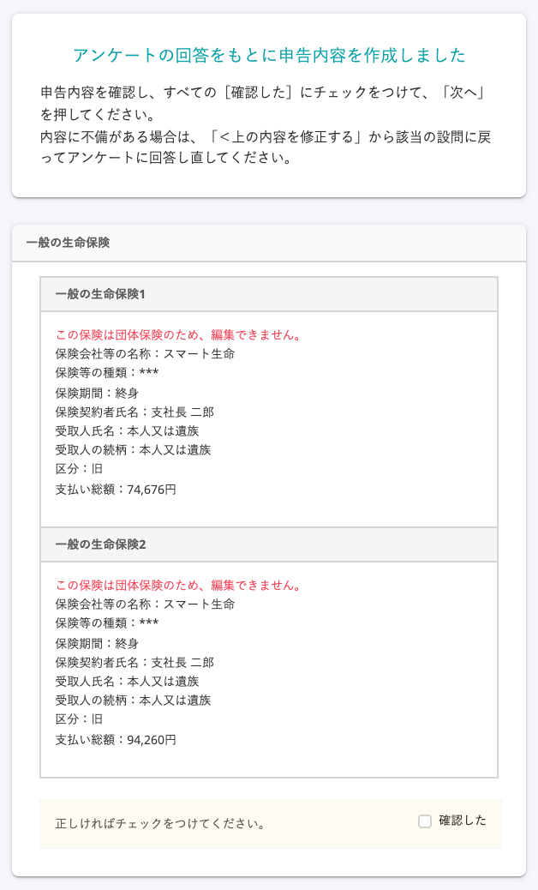

# 注意事項

:::alert
インポートした団体保険情報は上書きできません。
すでに団体保険情報がある状態で団体保険のデータをインポートすると、情報が追加で登録されます。
情報を差し替えたい場合は、団体保険情報を削除してから、再度インポートしてください。
:::

## LINC形式のDATファイルの場合

- 「未依頼」の従業員に対してのみインポートできます。
- LINC形式のDATファイルのうち、以下の条件を満たすファイルがインポートできます。
    - 「業務用レコードのみの100byte」のファイル形式
    - JIS形式
- 「氏名コード」がSmartHRの従業員の社員番号と以下のとおり紐付けができる場合のみ、その従業員の生命保険料控除として登録できます。
    **例：ファイル上の氏名コードが 0000000330**
    - 紐付けができるSmartHR上の社員番号：330、0330、00330 など
    - 紐付けができない社員番号：30、A330 など
- 複数ファイルをお持ちの場合は、ファイルを一つずつ、すべてアップロードしてください。
- 証券番号が同じ契約がファイル内に複数存在する場合、全て別の契約として取り込みます。
    - 同じファイルを2回アップロードした場合、同じ契約が2つインポートされます。
- DATファイルの内容については、送付元の保険会社または生保団体ネットにお問い合わせください。

:::alert
LINC形式のDATファイルをインポートする際、SmartHR上の社員番号を前0詰で登録している場合、0詰の桁数が違う番号が混在している場合は、インポートができません。
**例：従業員Aさんの社員番号が 0330、従業員Bさんの社員番号が 000330**
:::

## 損保標準フォーマットのDATファイルの場合

- 「未依頼」の従業員に対してのみインポートできます。
- 損保標準形式のDATファイルのうち、以下の条件を満たすファイルがインポートできます。
    - 「業務用レコードのみの100byte」のファイル形式
    - JIS形式
- 「氏名コード」がSmartHRの従業員の社員番号と一致している場合のみ、その従業員の生命保険料控除および地震保険料控除として登録できます。
    **例：ファイル上の氏名コードが330**
    ※氏名コードの桁数は12桁で、足りない桁はスペースで埋められています。
    - 紐付けができるSmartHR上の社員番号：330
    - 紐付けができないSmartHR上の社員番号：30、A330 など
- 複数ファイルをお持ちの場合は、ファイルを一つずつ、すべてアップロードしてください。
- 証券番号が同じ契約がファイル内に複数存在する場合、全て別の契約として取り込みます。
    - 同じファイルを2回アップロードした場合、同じ契約が2つインポートされます。
- DATファイルの内容については、送付元の保険会社にお問い合わせください。

## SmartHR形式のCSVファイルの場合

- 「未依頼」の従業員に対してのみインポートできます。
- 団体保険データとしてインポートします。
- 昨年の保険データをインポートする方法は、[年末調整機能で昨年分の保険等の情報を表示する](https://knowledge.smarthr.jp/hc/ja/articles/360035370453)をご覧ください。
- 「○○保険料1」などの数字を増やすことで複数個インポートできます。
- 証券番号が同じ契約がファイル内に複数存在する場合、全て別の契約として取り込みます。
    - 同じファイルを2回アップロードした場合、同じ契約が2つインポートされます。
- 各セルで入力可能な文字列については、[【一覧】団体保険料データCSV凡例](https://knowledge.smarthr.jp/hc/ja/articles/360035370093)をご覧ください。

:::alert
CSVファイルとは、契約に紐づく各項目がカンマ区切りになっているファイルです。
ファイルの拡張子をCSVに変更しただけのものには、対応していません。
:::

### インポート数の上限

- 「一般の生命保険料・介護医療保険料・個人年金保険料」は3種類合計で20個までインポートできます。
- 「地震保険料控除」は10個までインポートできます。

:::alert
**上限以上のCSVファイルをインポートして、エラーが表示された場合の対応方法**
「一般の生命保険料・介護医療保険料・個人年金保険料」に3種類合計で21個以上、「地震保険料控除」に合計11個以上の情報が入ったCSVファイルはインポートしないでください。
該当CSVファイルをインポートすると、バックグラウンド処理は問題なく完了しますが、収集情報画面の［保険情報］にエラーが発生し、操作ができなくなります。
万一、誤って操作してしまった場合は、インポートした団体保険料を削除してから、正しいCSVファイルを使って操作をやり直してください。
:::
