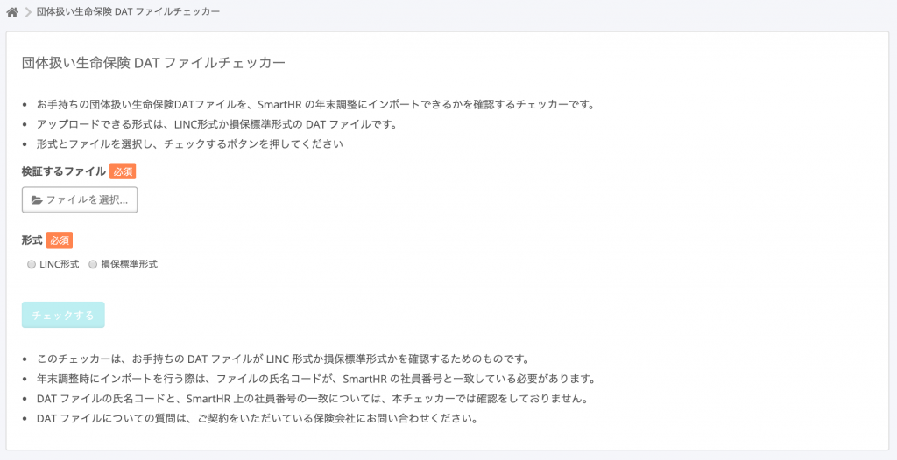
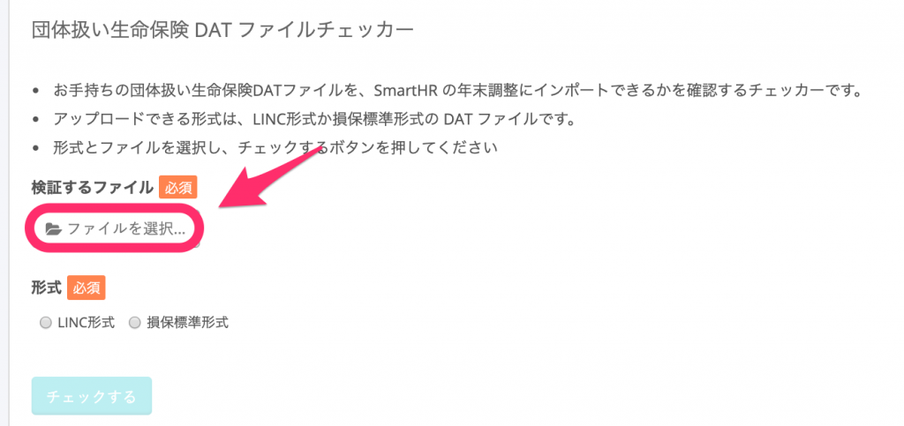
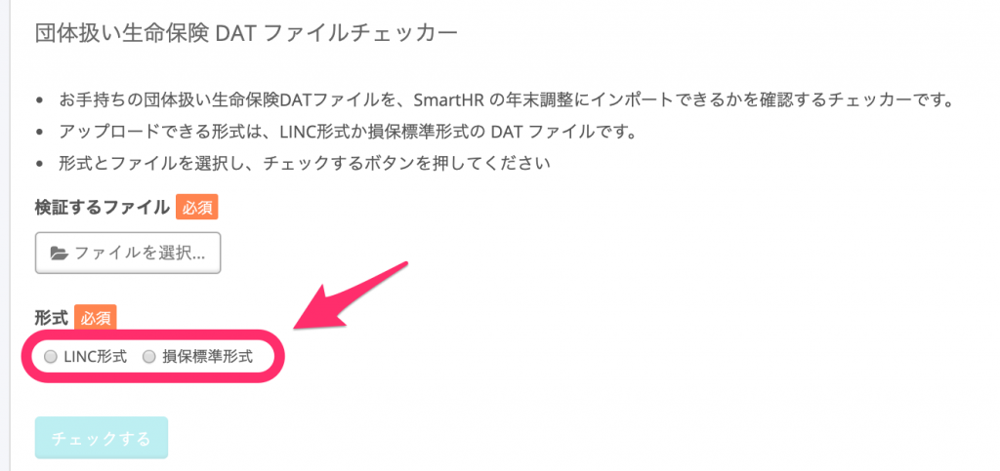
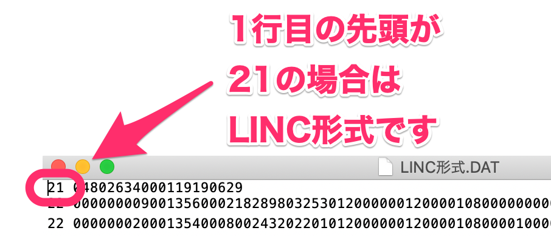
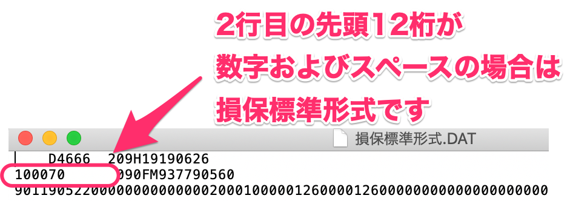
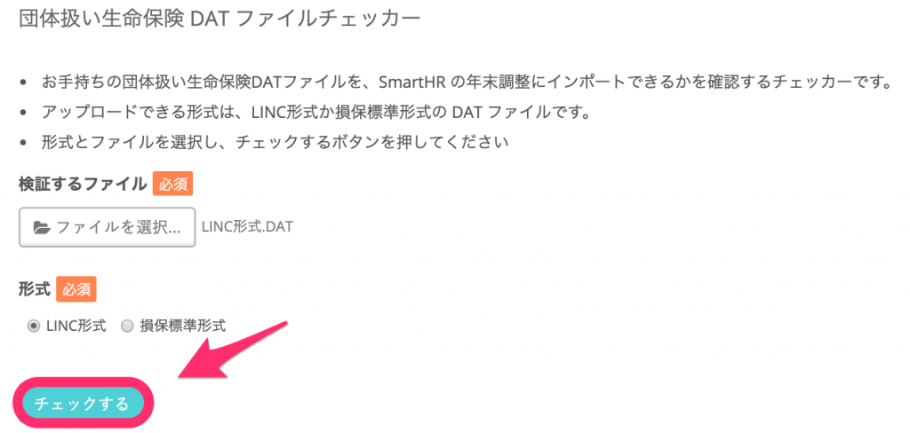
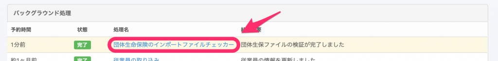
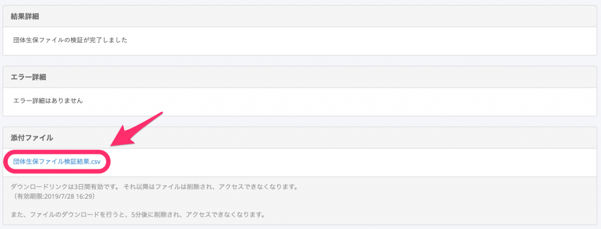
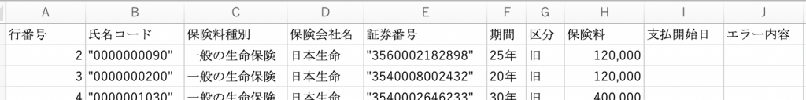
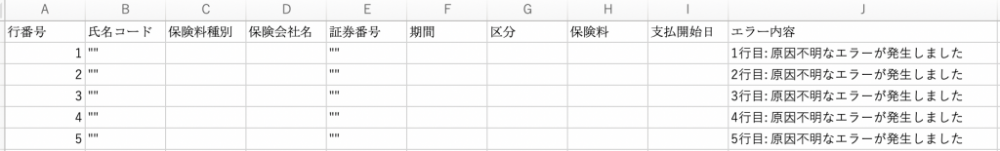

:::alert
当ページで案内しているSmartHRの年末調整機能の内容は、2021年（令和3年）版のものです。
2022年（令和4年）版の年末調整機能の公開時期は秋頃を予定しています。
なお、画面や文言、一部機能は変更になる可能性があります。
公開時期が決まり次第、[アップデート情報](https://smarthr.jp/update)でお知らせします。
:::

SmartHRの年末調整機能は、団体保険DATファイル（LINC形式／損保標準形式）のインポートに対応しています。

インポートをする前に、契約している保険会社のDATファイルがインポートに対応しているか検証してください。

# 検証方法

SmartHRにログインしている状態で下記のリンクをクリックすると、検証ツールを利用できます。

[団体保険DATファイルチェッカー](https://nencho.smarthr.plus/old/group_insurance_file_checker)

## 1\. 検証するファイルを選択する

 **［ファイルを選択］** をクリックして、保険会社から送付されたDATファイルを選択します。

保険会社から送付されたファイルに、**.DAT**という拡張子がついていない場合は、必ず.DATという拡張子にしてください。

拡張子が.DAT以外のファイルは、チェックできません。

## 2\. 形式を選択する

SmartHRが対応しているのは、100バイト、JIS形式のDATファイルです。

 **［LINC形式］** と **［損保標準形式］** のどちらの形式か選択してください。

お手元のDATファイルがどちらの形式かわからない場合は、テキストエディタなどで開いて、最初の部分を見ると判定できます。

1行目の先頭が21の場合は、「LINC形式」です。

2行目の先頭12桁が数字およびスペースの場合は、「損保標準形式」です。

## 3\. 検証結果を確認する

ファイルと形式を選択すると **［チェックする］** ボタンが有効になります。

 **［チェックする］** をクリックすると、バックグラウンド処理が開始され、処理が完了するとメールで通知が届きます。

バックグラウンド処理一覧の、 **［団体生命保険のインポートファイルチェッカー］** という項目名をクリックすると、詳細画面に移動します。

 **［添付ファイル］** 欄に検証結果を出力したCSVファイルがあるので、ファイル名をクリックしてダウンロードし、結果を確認してください。

検証結果ファイルには、DATファイルに記録されている氏名コードや保険料種別などが記載されています。

検証結果が空欄になっていたり、すべての行で「原因不明なエラーが発生しています」と記載されている場合は、ファイル形式を選択する際、誤った形式を選択している可能性があります。

また、特定の項目が原因の場合は、該当の項目に「エラー」と表示されます。

その場合は、念のためもう一方の形式を選択してチェックし、それでも結果が表示されない場合は、チャットサポートにお問い合わせください。

:::tips
このチェッカーは、お手持ちのDATファイルが「LINC形式」か「損保標準形式」かを確認するためのものです。
年末調整時にインポートする際には、ファイルの氏名コードが、SmartHRの社員番号と一致している必要があります。
DATファイルの氏名コードと、SmartHR上の社員番号の一致については、本チェッカーでは確認していません。
DATファイルについての質問は、ご契約をいただいている保険会社にお問い合わせください。
:::
