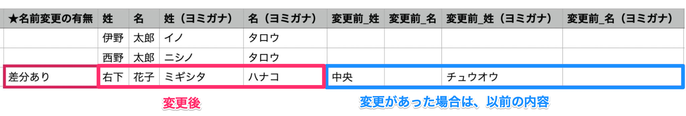

:::alert
当ページで案内しているSmartHRの年末調整機能の内容は、2021年（令和3年）版のものです。
2022年（令和4年）版の年末調整機能の公開時期は秋頃を予定しています。
なお、画面や文言、一部機能は変更になる可能性があります。
公開時期が決まり次第、[アップデート情報](https://smarthr.jp/update)でお知らせします。
:::

差分リストは、SmartHRの従業員情報に登録されている内容と、年末調整で入力された内容に変更（差分）があるかを確認するためのCSVファイルです。

差分を正しく抽出するには、前提として **SmartHRに最新の従業員情報・家族情報が登録されている** 必要があります。

当ページでは、差分リストを活用するために必要な従業員情報・家族情報を案内します。

従業員情報の登録・更新などの操作、仕様については、下記のヘルプページ一覧から必要ページを参照してください。

[従業員情報の操作・仕様についてのヘルプページ一覧](https://knowledge.smarthr.jp/hc/ja/sections/360009191433)

# 注意点

対象従業員設定画面の **［従業員情報を同期］** をクリックする前に、SmartHRの従業員情報・家族情報を整備してください。

下記に該当する場合は、会社で把握している最新の従業員情報をSmartHRに反映してから年末調整機能の利用を開始してください。

- 今年からSmartHRの利用を開始する場合
- 通常は別システムで従業員情報を管理していて、SmartHRの利用は年末調整のみの場合

## 従業員情報を同期したあとに情報を更新した場合

SmartHRで従業員情報を更新し、最新情報を年末調整機能に同期したい場合は、対象従業員設定のページで当該従業員を一度削除し、再度、従業員情報を同期することで、追加時点での情報に更新できます。

詳しくは[年末調整作成後に事業所情報や従業員情報を変更した場合は？](https://knowledge.smarthr.jp/hc/ja/articles/360035370173)をご覧ください。

# 差分を抽出するために必要な従業員情報

## 本人情報

- 姓
- 名
- 姓（ヨミガナ）
- 名（ヨミガナ）
- 生年月日
- 現住所（郵便番号）
- 現住所（都道府県）
- 現住所（市区町村）
- 現住所（丁目・番地）
- 現住所（建物名・部屋番号）
- 現住所（ヨミガナ）
- 現住所の世帯主
- 現住所の世帯主の続柄
- 住民票住所（郵便番号）
- 住民票住所（都道府県）
- 住民票住所（市区町村）
- 住民票住所（丁目・番地）
- 住民票住所（建物名・部屋番号）
- 住民票住所（ヨミガナ）
- 住民票住所の世帯主
- 住民票住所の世帯主の続柄
- 勤労学生フラグ
- 勤労学生：学校名
- 勤労学生：入学年月日
- 障害者区分
- 寡婦・ひとり親
- 寡婦・ひとり親の理由
- 配偶者の有無

## 家族情報

- 続柄
- 性別
- 姓
- 名
- 姓（ヨミガナ）
- 名（ヨミガナ）
- 生年月日
- 同居・別居の別
- 住所（郵便番号）
- 住所（都道府県）
- 住所（市区町村）
- 住所（丁目・番地）
- 住所（建物名・部屋番号）
- 住所（ヨミガナ）
- 障害者区分
- 税法上の被扶養者

:::tips
差分の抽出にあたり、「家族コード」の登録は必須ではありません。
事前に登録しておくと、年末調整の結果をCSVで出力する際、家族ごとに紐づいた家族コードを出力できます。
これにより、年末調整終了後に家族情報が変わった場合でも、SmartHRと他社システムの連携がより便利になります。
:::
